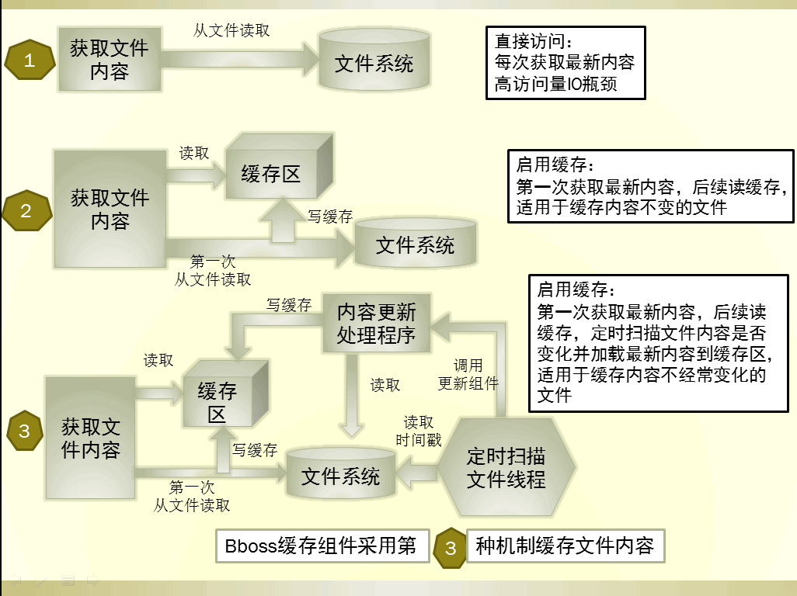

### bboss文件缓存组件FileContentCache介绍

**bboss文件缓存组件FileContentCache作用**

  我们经常需要在程序中频繁地读取文件内容，如果在高并发情况下频繁地访问文件系统会导致频繁的IO操作或者超出linux允许访问的最大文件句柄数；那么通过缓存文件内容可以很好地解决这个问题,同时如果文件内容有变化还需要将最新内容更新到缓存区。

三种不同的获取文件内容的机制示意图：  



方式一 每次都访问物理文件
方式二 第一次读物理文件，以后都从缓存区获取文件内容
方式三 第一次读物理文件，以后都从缓存区获取文件内容，但是后台会开启一个守护进程定时探测所有已经加载的文件是否有变动，有变动则将最新的文件内容加载到缓存区，确保后续读取到的文件内容是最新的内容。
FileContentCache采用方式三对文件内容进行缓存，同时提供了对文件内容进行格式化处理的实用方法。

**bboss文件缓存组件FileContentCache使用**

bboss文件缓存组件FileContentCache使用非常简单，直接看[示例](https://gitee.com/bboss/bboss/tree/master/bboss-util/test/org/frameworkset/util/FileContentCacheTest.java)代码:

Java代码

```java
try {  
            //创建一个文件内容缓存组件并初始化,一般采用单列模式创建，根据需要可以创建多个单列实例。  
            FileContentCache fileContentCache = new FileContentCache();  
            fileContentCache.setRefreshInterval(5000);//设置定时探测扫描文件时间间隔，单位：毫秒，每个组件只会以daemon模式启动一个线程。  
            fileContentCache.start("测试缓存组件");  
              
            //使用组件方法获取文件内容：第一次从缓存读取  
            String content = fileContentCache.getFileContent( "/opt/source/Test.java", "UTF-8",FileContentCache.PLAINEncode);//对内容不做任何处理  
            content = fileContentCache.getFileContent( "/opt/source/Test.java", "UTF-8",FileContentCache.HTMLEncodej);//对html转义存储的文件内容进行还原处理  
            content = fileContentCache.getFileContent( "/opt/source/Test.java", "UTF-8",FileContentCache.HTMLNoBREncode);//对内容进行html转义处理，忽略回车换行处理  
            content = fileContentCache.getFileContent( "/opt/source/Test.java", "UTF-8",FileContentCache.HTMLEncode);//对内容进行html转义处理  
              
            //后续从缓存读取  
            content = fileContentCache.getFileContent( "/opt/source/Test.java", "UTF-8",FileContentCache.PLAINEncode);//对内容不做任何处理  
            content = fileContentCache.getFileContent( "/opt/source/Test.java", "UTF-8",FileContentCache.HTMLEncodej);//对html转义存储的文件内容进行还原处理  
            content = fileContentCache.getFileContent( "/opt/source/Test.java", "UTF-8",FileContentCache.HTMLNoBREncode);//对内容进行html转义处理，忽略回车换行处理  
            content = fileContentCache.getFileContent( "/opt/source/Test.java", "UTF-8",FileContentCache.HTMLEncode);//对内容进行html转义处理  
        } catch (Exception e) {  
            // TODO Auto-generated catch block  
            e.printStackTrace();  
        }  
```

**bboss文件缓存组件FileContentCache包下载**

```xml
<dependency>
    <groupId>com.bbossgroups</groupId>
    <artifactId>bboss-util</artifactId>
    <version>6.2.8</version>
</dependency>
```

源码目录：
https://gitee.com/bboss/bboss/tree/master/bboss-util

**bboss文件缓存组件FileContentCache应用案例**
bboss文件缓存组件FileContentCache在bboss相关的应用中得到很好的应用：

bboss持久层sql配置文件热加载机制、bboss国际化属性配置文件热加载机制、bboss平台模块菜单配置文件热加载机制也是基于文件缓存组件使用的daemon扫描线程组件实现的。

[查看图片附件](https://www.iteye.com/blog/yin-bp-2279246#)

