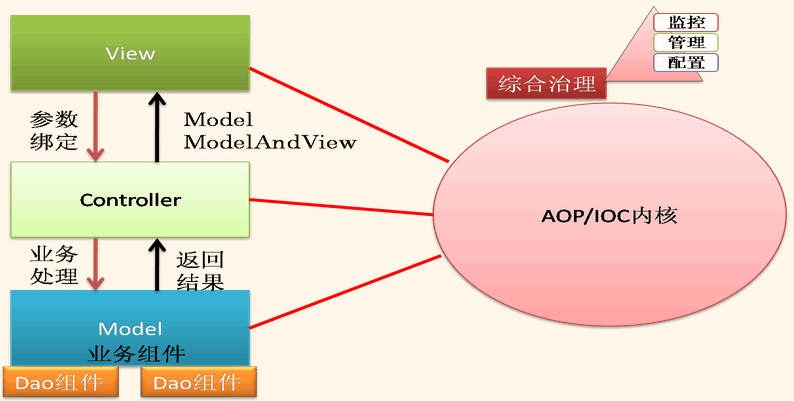
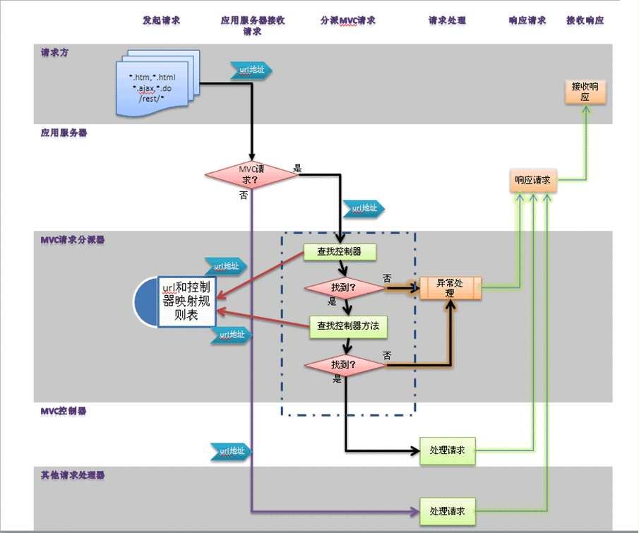

# bboss特色介绍 

​       bboss是一个j2ee开源框架，为企业级应用开发提供一站式解决方案，并能有效地支撑移动应用开发。bboss功能涵盖ioc，mvc，jsp自定义标签库，持久层，全局事务托管，安全认证，SSO，web会话共享，cxfwebservice服务发布和管理，hessian服务发布和管理，高性能elasticsearch orm模块，kafka/redis/mq/mongodb、大数据开发等。另外还提供了符合中国式自由流的bboss activiti工作流引擎。在不断的实践过程中，越来越多的好东西被吸纳到bboss这个大家庭中，使得bboss能够更好地应用于企业应用项目中，能够更好地解决开发过程中碰到的实际问题。  
​     基于bboss，可以快速地开发构建稳定高效可靠、可扩展、安全的企业级应用系统。 
bboss特色如下： 
​    1.[aop/ioc](https://www.iteye.com/category/55606)业务组件管理、依赖注入（属性注入、构造器注入、工厂模式注入）、声明式事务等;可扩展性强，用户可以自行任意为ioc元素增加扩展属性，以便实现自定义的ioc依赖注入功能（其他ioc框架扩展ioc语法，可能需要编写xsd描述文件，bboss的ioc配置语法是松散而严谨的，很容易扩展而且不需要编写xsd文件）    

   2.[persistent framework](https://www.iteye.com/category/55607)，多数据库支持，丰富的api，提供查询行处理器，全局事务管理（可整合托管bboss，ibatis，hibernate，spring等持久层的事务），支持多数据库事务，多种事务编程模式，很好地和业界主流数据源结合（dbcp,c3p0,proxool,weblogic,druid等），支持业界主流的o/r mapping机制，支持xml配置sql风格的api，也支持直接在java程序中直接使用sql的api；提供了持久层[连接池的监控功能](https://www.iteye.com/blog/1147333) 

   3.[mvc/restful](https://www.iteye.com/category/132426)简单高效的mvc框架，很好地支持xml,json,文件上传下载，jsonp，传统/html5文件上传下载，灵活的参数绑定机制，与bboss标签库分页标签无缝对接 
mvc整体逻辑架构 

mvc请求处理流程

   4.[jsp taglib](https://www.iteye.com/category/69334) 分页、树、列表、抽屉式、逻辑标签 
    5.集群[会话共享](https://www.iteye.com/category/327553)，跨容器跨平台，跨站跨应用会话共享及SSO，高效，配置简单,提供实用的会话统计监控和会话集中管理功能（会话查询，会话删除，会话属性数据查看等等） 
    6.[xml-bean serializable](https://www.iteye.com/category/327708),高效，很好地支持各种java数据类型和复杂对象结构，支持引用关系的序列化,提供序列化插件机制，可以根据需要定制对象的序列化行为 

​    7.[安全认证SSO](https://www.iteye.com/category/327711)，ticket令牌管理（令牌生成和校验），支持集群环境令牌管理和校验，提供令牌编程注解和令牌断言jsp标签，采用令牌标签可防止表单重复提交功能    

​    8.[quartz任务](https://www.iteye.com/category/333270)引擎管理 

​    9.bboss redis和mongodb操作组件，为bboss session提供轻量级的redis和mongodb操作组件 
​    10.集成bboss http开发套件，支持多http连接池配置，隔离服务资源 
​    11.集成kafka开发套件，简洁的消费端和生成端封装 
​    12.集成dubbo服务开发套件，基于bboss发布dubbo服务和获取dubbo客户端 
​    13.[hession服务管理及发布](https://www.iteye.com/category/327710)，客户端调用支持     
​    14.[rpc](https://www.iteye.com/category/327706)(http/netty/mina/jms/webservice/rmi/jgroups/restful) 安全高效,可非常方便地将bboss ioc管理的业务组件发布成RPC服务 
​    15.[distribute event framework](https://www.iteye.com/category/65637)，分布式事件广播组件，基于jgroups。    
​    16.[国际化组件](https://www.iteye.com/category/327707)，支持国际化属性文件热加载、缓存、高性能，支持从classpath和web应用目录中加载资源文件，提供国际化标签和国际化编程API    
​    17.[jms ](https://www.iteye.com/blog/630527)开发套件 
  18.[cxf webservice](http://bbossgroups.group.iteye.com/group/wiki/3091-webservice-bboss-aop) 服务发布和客户端代理,更多相关资料地址：[http://yin-bp.iteye.com/category/327709](https://www.iteye.com/category/327709) 

​    19.[bboss 工作流引擎](https://www.iteye.com/category/327712)（基于开源activiti 5.12扩展），遵循bpmn规范，支持中国式自由流，支持任意驳回、驳回后再回到驳回点、撤销、任意跳转，支持抄送到人和部门，支持单实例/多实例切换，支持多实例串并行切换，自动跳过无处理人的节点，可自动跳过相同处理人的节点，能够很好地保持业务事务和工作流事务的一致性。 
​    20.[bboss大数据抽取迁移工具](https://www.iteye.com/category/344010)，this is a db-hdfs tools used to transfer big database datas to hadoop hdfs like sqoop,but bboss bigdata tool is very nice monitor and event drivered model,and high perfermance,support Distributed executor tasks Ability,提供良好的数据抽取监控作业操作界面    
​    21.bboss websocket，bboss websocket服务管理组件     

   22.[bboss elasticsearch](https://www.oschina.net/p/bboss-elastic)，高性能elasticsearch orm框架     
    23.[完备的框架监控机制](https://www.iteye.com/blog/2175018) 

直接可以采用gradle构建工程,**bboss gradle构建方法参考文档：** 

## **采用gradle构建和发布bboss方法介绍** 

**快速搭建基于bboss的项目开发环境，参考文档：** 
[http://yin-bp.iteye.com/blog/1026261](https://www.iteye.com/blog/1026261) 
bboss独立模块目录说明及独立模块gradle构建方法请参考文档：[bboss工程目录结构及功能说明](https://www.iteye.com/blog/2142959) 
发布的最新版本：[bboss 5.0.3.6](https://github.com/bbossgroups/bboss) 

**基于bboss开发项目说明** 
要做简单的demo，请参考文档 
[http://yin-bp.iteye.com/blog/1026261](https://www.iteye.com/blog/1026261) 

正儿八经的做项目，参考文档搭bboss平台开发环境

**普通ui版平台：**[http://yin-bp.iteye.com/blog/2390050](https://www.iteye.com/blog/2390050)

**bootstrap版平台：**[http://yin-bp.iteye.com/blog/2356672](https://www.iteye.com/blog/2356672)

bboss自动代码生成工具使用指南：[http://yin-bp.iteye.com/blog/2256948](https://www.iteye.com/blog/2256948) 

bboss源码托管地址： 

https://github.com/bbossgroups/bboss 

https://git.oschina.net/bboss/bboss
     
如需使用bboss中某个模块，那么这个地方可以找到各模块最小依赖gradle工程，你可以直接在此基础上开启bboss框架开发之旅：[bboss最佳实践案例](https://github.com/bbossgroups/bestpractice) 

**官方博客：** 
[http://yin-bp.iteye.com/](https://www.iteye.com/) 
通过官方博客你可以找到bboss的快速入门教程和所有开发文档资料 
**官方网站：** 
[http://www.bbossgroups.com](http://www.bbossgroups.com/) 
**bboss交流群：** 
21220580 
166471282 
166471103 
154752521 
3625720 
**bboss微信公众号**：bboss 

