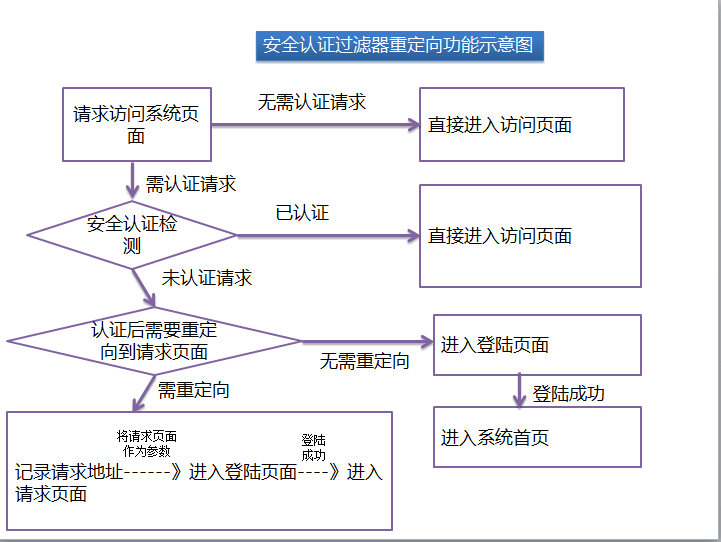

### bboss安全认证过滤器认证后重定向到请求页面功能介绍

本文介绍bboss安全认证过滤器认证后重定向到请求页面功能，切入正题。

  **1.概述**

通常受保护的页面需要认证后才能访问，当我们在浏览器端访问这些页面时，如果没有认证，则需要先认证，认证完毕后需要直接进入这些页面而不是进去系统默认的首页，采用bboss安全认证过滤器可以非常方便地实现这个功能。本文分成三部分介绍这个功能：  

[1]安全认证过滤器重定向功能示意图

[2]开启重定向功能和重定向规则配置 

[3]如何在程序中实现重定向功能 

bboss安全认证过滤器的使用方法请参考文档：

[bboss 安全认证过滤器功能介绍](http://yin-bp.iteye.com/blog/1449900)

**2.安全认证过滤器重定向功能示意图**



示意图直观明了，就不进一步说明了。

**3.开启重定向功能和重定向规则配置**

开启重定向功能和重定向规则可以在web.xml文件中的安全认证过滤中进行配置，只需为其增加两个参数即可：

Xml代码

```xml
<init-param>  
            <param-name>failedback</param-name>  
            <param-value>true</param-value>  
        </init-param>  
        <init-param>  
            <param-name>failedbackurlpattern</param-name>  
            <param-value>/sdesktop/index.page,/sdesktop/indexcommon.page</param-value>  
        </init-param> 
```

参数说明：

failedback---是否开启重定向请求机制，true 开启 false关闭

failedbackurlpattern----配置重定向规则，failedback为true时，规则才起作用，只有符合failedbackurlpattern中配置的规则的请求页面，才会将请求地址作为参数传递到登陆页面，对应的参数名称为accesscontrol_check_referpath,如果failedbackurlpattern为空，则所有的需要认证的请求页面都会作为参数传递到登陆页面。

如下是添加了failedback和failedbackurlpattern两个参数的过滤器配置：

Xml代码

```xml
<filter>  
    <filter-name>securityFilter</filter-name>  
    <filter-class>com.frameworkset.platform.security.SYSAuthenticateFilter</filter-class>  
    <init-param>  
      <param-name>patternsExclude</param-name>  
      <param-value>  
            /sysmanager/logoutredirect.jsp,  
            /login.jsp,  
            /login_en.jsp,  
            /logout.jsp,  
            /webseal/websealloginfail.jsp,  
            /webseal/message.jsp,  
            /test/testmmssso.jsp,  
            /test/testssowithtoken.jsp,  
            /sso/login.jsp,  
            /sso/sso.page,  
            /sso/ssowithtoken.page,  
            /sdesktop/cookieLocale.page,  
            /yzm.jsp,  
           /sysmanager/password/modifyExpiredUserPWD.jsp,  
          /passward/modifyExpiredPassword.page,  
          /passward/generateImageCode.page,  
          /common/jsp/tokenfail.jsp,  
          /smbp/login.page  
           </param-value>  
    </init-param>  
    <init-param>  
      <param-name>redirecturl</param-name>  
      <param-value>/sysmanager/logoutredirect.jsp</param-value>  
    </init-param>  
    <init-param>  
      <param-name>preventDispatchLoop</param-name>  
      <param-value>false</param-value>  
    </init-param>   
      
        <init-param>  
            <param-name>enablePermissionCheck</param-name>  
            <param-value>true</param-value>  
        </init-param>  
           
          
        <init-param>  
            <param-name>authorfailedurl</param-name>  
            <param-value>/common/jsp/authorfail.jsp</param-value>  
        </init-param>  
        <init-param>  
            <param-name>failedback</param-name>  
            <param-value>true</param-value>  
        </init-param>  
        <init-param>  
            <param-name>failedbackurlpattern</param-name>  
            <param-value>/sdesktop/index.page,/sdesktop/indexcommon.page</param-value>  
        </init-param>  
           
  </filter>  
  
   
  <filter-mapping>  
    <filter-name>securityFilter</filter-name>  
    <url-pattern>*.jsp</url-pattern>  
  </filter-mapping>  
  <filter-mapping>  
    <filter-name>securityFilter</filter-name>  
    <url-pattern>*.page</url-pattern>  
  </filter-mapping>  
  <filter-mapping>  
    <filter-name>securityFilter</filter-name>  
    <url-pattern>*.frame</url-pattern>  
  </filter-mapping>  
    
   <filter-mapping>  
    <filter-name>securityFilter</filter-name>  
    <url-pattern>/druid/*</url-pattern>  
  </filter-mapping>  
```

**4.在程序中实现重定向功能**

在程序中实现重定向功能非常简单，只需要在登陆页面中获取到可能存在的重定向地址参数并作为一个隐藏参数保留在登陆页面上，然后登陆成功后直接重定向到相应的地址即可，以下是伪代码：

获取重定向页面地址

Java代码 

```java
String successRedirect = request.getParameter(org.frameworkset.web.interceptor.AuthenticateFilter.referpath_parametername);  
```

在登陆页表单中记录重定向页面地址

Html代码

```html
<input name="<%=org.frameworkset.web.interceptor.AuthenticateFilter.referpath_parametername %>" type="hidden" value="<%=successRedirect%>"/>  
```

登陆成功后重定向到对应页面

Java代码

```java
response.sendRedirect(successRedirect); 
```

