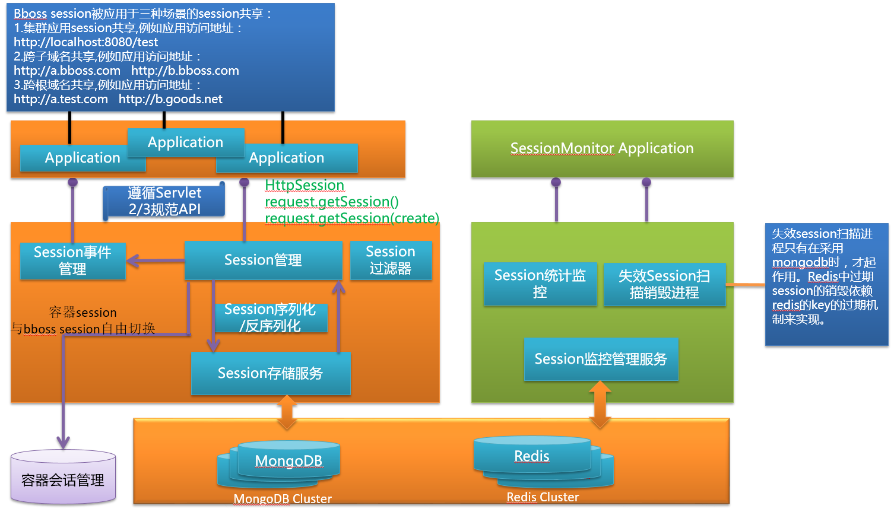
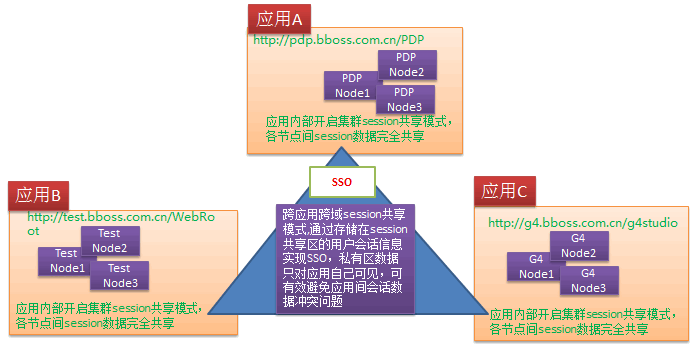
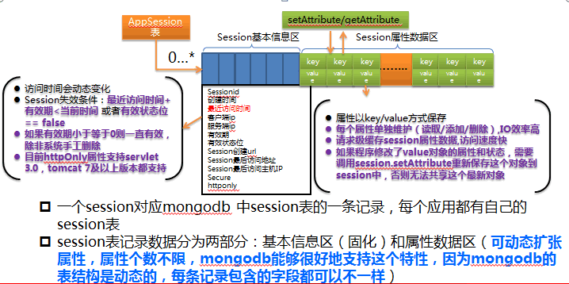
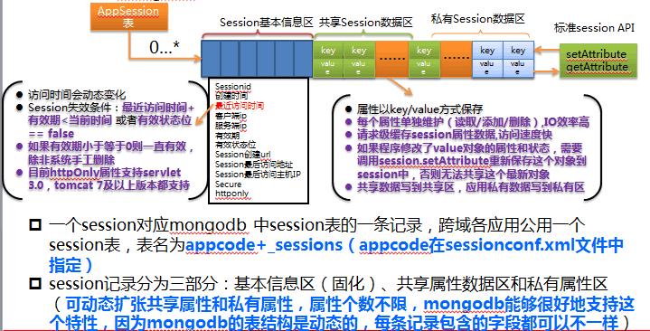

### bboss session共享架构及特点

**bboss会话共享架构**

**bboss session共享特点**

**作    用：**为应用提供统一会话管理功能，避免集群部署场景下负载切换session丢失问题；
跨域跨应用共享会话并实现SSO功能；解决了会话共享五大技术难题：session数据序列 化问题，session sticking问题，跨域跨应用session共享问题，跨容器 (tomcat,jetty,weblogic)共享session问题，sso单点登入单点登出一致性问题。

**存    储：**采用redis和mongodb存储会话数据，采用增量模式修改会话属性，简单高效

**序列化：**采用bboss序列化机制以xml格式序列化会话数据，可读性好，易于监控，提供序列化 插件，扩展性强

**规    范：**遵循servlet 2/3规范，可无缝与现有应用系统集成， 无需或者少量修改 应用代码。Session监听器需遵循bboss会话共享规范，需将原来容器 session监听器迁移到bboss会话共享实现。如修改session中对象数据， 必须调用session.setAttribute方法将对象数据更新到mongodb中，以便将 更新后的数据共享给其他应用。

**兼容性：**跨容器，兼容业界主流的应用服务器（tomcat,weblogic,webspere,jetty），支持容器 会话管理和bboss会话管理两种机制，可根据实际需要自由切换应用会话管理机制。

**约    束：**无约束，无需session sticking，客户端请求可以平均分派给各集群节点，支持 lvs,haproxy，ngix 4,7层负载。

**安全性：**客户端基于cookie机制存储sessionid，通过设置cookie httponly属性阻止XSS窃 取sessionid，通过设置secure属性并结合https阻止传输过程中sessionid被窃取

**监    管：**session信息统计查询, 应用在线用户数统计查询，应用会话管理功能（包括删除会话、 查看会话属性数据）；session统计查询可以[自定义查询会话属性条件](http://yin-bp.iteye.com/blog/2265855)。

  **高    阶**

提供两种会话共享模式 

**模式一** 集群间会话共享模式，实现同一个应用集群各节点之间的会话共享 ，通过这种模式可以避免因故障导致访问请求切换服务器时session丢失问题，同时也可以让用户请求无差别地平均分派到各个服务器上，达到真正的负载均衡。

**模式二** 跨域跨应用模式，实现同一域名或者同一根域（不同的子域名）下不同应用之间的会话共享 ，实现他们之间的单点登录功能（SSO）
第一种模式相对简单；第二种模式在配置方面比模式一稍微复杂一些，通过模式二可以灵活定义哪些会话数据需要在应用之间进行共享，哪些数据作为应用私有会话数据不对其他应用共享（这个在实际情况下很有用），默认情况下共享应用间的所有会话数据。  

  实际的应用环境中，模式一和模式二经常组合一起使用，每个应用本身采用集群部署模式（开启集群间会话共享模式），同时利用跨域跨应用模式实现不同应用间的单点登录功能（前提是这些应用必须使用同一个域名或者都拥有相同的根域名）。

两种会话共享模式一起使用示意图(前提:应用必须使用同一个域名或者都拥有相同的根域名，根域名不同的话可以使用bboss统一令牌系统实现跨根域系统之间的SSO)

  

**bboss会话对象mongodb存储结构**
**单应用集群节点之间共享会话存储结构**

**跨域不同应用之间共享会话存储结构**

  更多bboss会话共享介绍请访问：

http://yin-bp.iteye.com/category/327553  