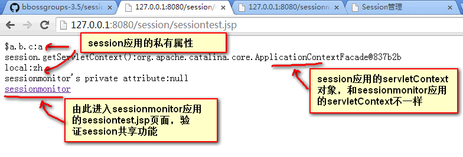
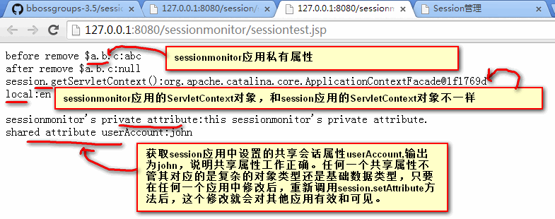
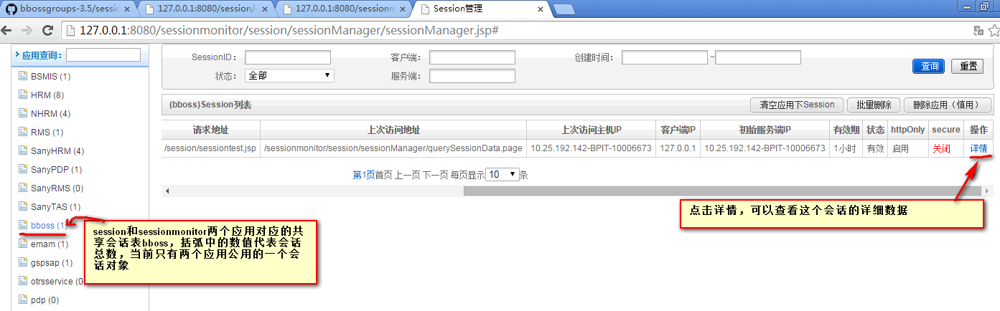
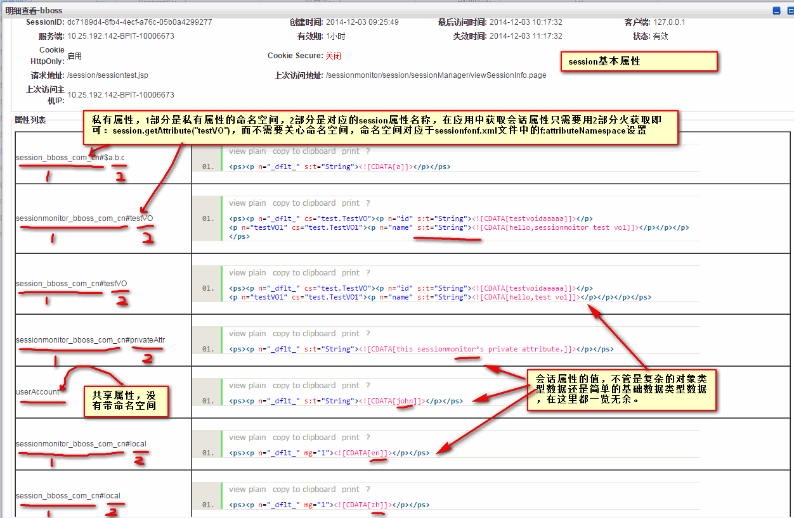

### bboss会话共享demo使用指南

  为了方便应用系统集成bboss会话共享功能，准备了两个会话共享demo工程，本文介绍他们的使用和部署方法：
session工程 ----如果只需要session共享功能，则整合这个工程中的配置文件和jar包即可

sessionmonitor工程----如果需要session共享以及监控功能，则整合这个工程中的配置文件和jar包即可

本文包含以下三部分内容：

一、session工程使用指南

二、sessionmonitor工程使用指南

三、基于session和sessionmonitor实现跨应用会话共享使用指南  

  bboss session集成权威指南
https://my.oschina.net/bboss/blog/758871

会话共享的工程全部采用gradle构建,security构建和demo运行请参考文档：
[bboss session版本构建和demo部署运行介绍](http://yin-bp.iteye.com/blog/2313137)

源码下载：

git clone -b master --depth 1 https://github.com/bbossgroups/sessiondemo.git

本文只介绍具体的配置和使用。  

**一、session工程使用指南**
session工程包含session功能验证sessiontest.jsp文件，会话共享需要的所有配置文件和最小依赖jar包,
工程的结构说明：

/session/resources/org/frameworkset/soa/serialconf.xml --序列化插件配置文件，类别名配置

/session/resources/mongodb.xml   --mongodb配置文件

/session/resources/sessionconf.xml --session配置文件

/session/session.xml    --session工程web部署文件

/session/WebRoot/sessiontest.jsp  --session功能验证文件

/session/WebRoot/WEB-INF/web.xml   --配置session共享拦截过滤器

/session/WebRoot/WEB-INF/lib      --会话共享最小依赖jar文件存放目录

  2.参考以下文档配置/resources/mongodb.xml中的mongodb连接

http://yin-bp.iteye.com/blog/2064662

参考其中的章节【6.mongodb客户端配置 】

3.部署和发布war版本

进入命令行模式

切换到session对应的目录，执行指令：

gradle war

对应的session-5.0.1.war(5.0.1为版本号，以实际为准)包在session\build\libs目录下可以找到。

sessiontest.jsp文件内容请阅读：
https://github.com/bbossgroups/security/blob/master/session/WebRoot/sessiontest.jsp  

**二、sessionmonitor工程使用指南**

sessionmonitor工程包含session功能验证jsp页面和会话共享监控功能，

工程的结构说明：

/sessionmonitor/resources/org/frameworkset/soa/serialconf.xml --序列化插件配置文件，类别名配置

/sessionmonitor/resources/mongodb.xml   --mongodb配置文件

/sessionmonitor/resources/sessionconf.xml --session配置文件

/sessionmonitor/sessionmonitor.xml    --sessionmonitor工程web部署文件

/sessionmonitor/WebRoot/sessiontest.jsp  --session功能验证文件

/sessionmonitor/WebRoot/WEB-INF/web.xml   --配置session共享拦截过滤器

/sessionmonitor/WebRoot/WEB-INF/lib      --会话共享及监控最小依赖jar文件存放目录

/sessionmonitor/WebRoot/session/sessionManager/sessionManager.jsp          --session监控jsp页面入口地址

/sessionmonitor/WebRoot/session/sessionManager/sessionList.jsp  --session监控session 列表页面

/sessionmonitor/WebRoot/session/sessionManager/viewSessionInfo.jsp  --sesion详细信息查看页面

/sessionmonitor/src  --监控源码程序

  2.参考以下文档配置/resources/mongodb.xml中的mongodb连接

http://yin-bp.iteye.com/blog/2064662

参考其中的章节【6.mongodb客户端配置 】

3.3.部署和发布war版本

进入命令行模式

切换到sessionmonitor目录，执行指令：

gradle war

对应的sessionmonitor-5.0.1.war(5.0.1为版本号，以实际为准)包在sessionmonitor\build\libs目录下可以找到。  

**三、基于session和sessionmonitor实现跨应用会话共享使用指南**

前两部分介绍了session和sessionmonitor两个工程的使用和部署方法，我们验证了开启bboss会话机制后，session的操作方法和方式以及展示了session的监控功能，本节介绍基于session和sessionmonitor如何实现跨应用会话共享。

首先我们已经在两个工程（session和sessionmonitor）中准备好了跨站共享会话的配置文件：[/session/resources/sessionconf.crossapp.xml](https://github.com/bbossgroups/security/blob/master/session/resources/sessionconf.crossapp.xml)

  [url=https://github.com/bbossgroups/security/blob/master/sessionmonitor/resources/sessionconf.crossapp.xml[/url]

接下来我们需要将：  

文件/session/resources/sessionconf.crossapp.xml内容拷贝到/session/resources/sessionconf.xml文件中替换原来的内容

文件/sessionmonitor/resources/sessionconf.crossapp.xml内容拷贝到/sessionmonitor/resources/sessionconf.xml

这样我们的即可在session和sessionmonitor两个应用间共享会话了。这里稍微说明一下跨应用共享会话相关的几个配置：

**appcode**被指定为bboss，两个应用的的会话将被统一存入会话表bboss_sessions，appcode可以自己定义，这里是bboss。

**f:domain**被统一指定为127.0.0.1,曾尝试使用localhost但是不能正确工作，所以改为127.0.0.1，可以根据实际情况改为域名或者实际的ip，如果各应用的子域名不同，则指定为同根域名即可，例如有两个应用的域名分别为：

app1.sina.com.cn

app2.sina.com.cn

那么f:domain可指定为sina.com.cn

f:shareSessionAttrs**被指定为userAccount，也就是说在两个应用会话间只共享属性userAccount，这里可以根据实际情况修改，如果有多个共享属性请用逗号分隔即可，没有出现在这个清单中的属性都是应用私有的会话数据。

**在sessionconf.xml中配置了两个需要共享session的应用**：

/session/resources/sessionconf.xml中相关内容为：

Xml代码

```xml
<property class="org.frameworkset.security.session.domain.App"  
                        f:path="/session"   
                                              f:currentApp="true"  
                        f:attributeNamespace="session_bboss_com_cn"    
                        init-method="init"  
                    />                         
                <property class="org.frameworkset.security.session.domain.App"                                 
                        f:path="/sessionmonitor"      
                                              f:currentApp="false"  
                        f:attributeNamespace="sessionmonitor_bboss_com_cn"  
                        init-method="init"  
                    />  
```

/sessionmonitor/resources/sessionconf.xml中相关内容为：

Xml代码

```xml
<property class="org.frameworkset.security.session.domain.App"  
                        f:path="/session"   
                                              f:currentApp="false"  
                        f:attributeNamespace="session_bboss_com_cn"    
                        init-method="init"  
                    />                         
                <property class="org.frameworkset.security.session.domain.App"                                 
                        f:path="/sessionmonitor"      
                                              f:currentApp="true"  
                        f:attributeNamespace="sessionmonitor_bboss_com_cn"  
                        init-method="init"  
                    />  
```

其实我们对比两个sessionconf.xml配置文件，发现他们中唯一不同的两个地方之一就是f:currentApp的值，在相应的sessionconf.xml文件中都将对应本应用的那个f:currentApp设置为true，另外一个不同点就是下面的attributeNamespace配置。

**f:attributeNamespace** 设置应用私有会话属性存储命名空间，

在/session/resources/sessionconf.xml中被设置为session_bboss_com_cn

在/sessionmonitor/resources/sessionconf.xml中被设置为sessionmonitor_bboss_com_cn

**说明一下跨应用会话共享需要用到两个jsp页面**：

/session/WebRoot/sessiontest.jsp

/sessionmonitor/WebRoot/sessiontest.jsp

在这两个页面中展示了几个私有属性（$a.b.c，local，testVO）的操作和共享属性（userAccount）的操作。

**具体的操作演示**

在sessionmonitor应用多设置了一个私有属性privateAttr，然后在session应用中获取这个sessionmonitor的私有属性privateAttr，发现是获取不到这个值的；我们在sessionmonitor设置了$a.b.c属性后立马删除，而session中保留$a.b.c属性，可以在监控界面查看session还有这个属性而sessionmonitor中已经没有了；我们在session工程中设置共享属性userAccount的值为john，然后可以在sessionmonitor中能够正确地获取到共享属性userAccount的值并输出到页面上。

配置完毕后，切换到命令行，分别在session和sessionmonitor两个目录下执行：

gradle war

然后将两个文件

session\build\libs\session-5.0.1.war

sessionmonitor\build\libs\sessionmonitor-5.0.1.war

拷贝到tomcat/webapps目录下，然后启动tomcat看效果。

实际效果**

tomcat启动后，首先在浏览中打开以下地址：

http://127.0.0.1:8080/session/

可以看到运行效果：



接下来点击页面中最下方的sessionmonitor上的链接，会打开第二个应用sessiontest.jsp页面，可以看到运行的实际效果：



上面两个页面都打开后，可以在一个新窗口中输入以下地址，进入监控页面查看两个应用间共享的会话数据情况，可以发现两个应用公用了一个会话对象：
http://127.0.0.1:8080/sessionmonitor/session/sessionManager/sessionManager.page



再点击会话记录后面的详情按钮，可以查看这个会话数据的详细情况，私有数据和共享数据全部都可以在监控中看到：



  **session id cookiename命名约定请参考文档中的章节【10.session id cookiename命名约定】**
http://yin-bp.iteye.com/blog/2064662

到此，三个部分介绍完毕。  