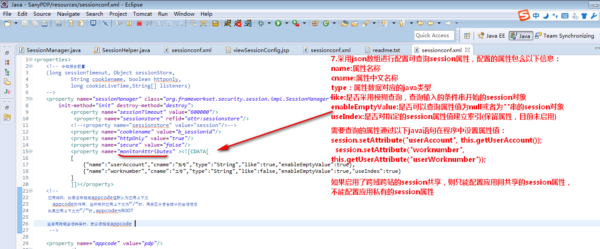
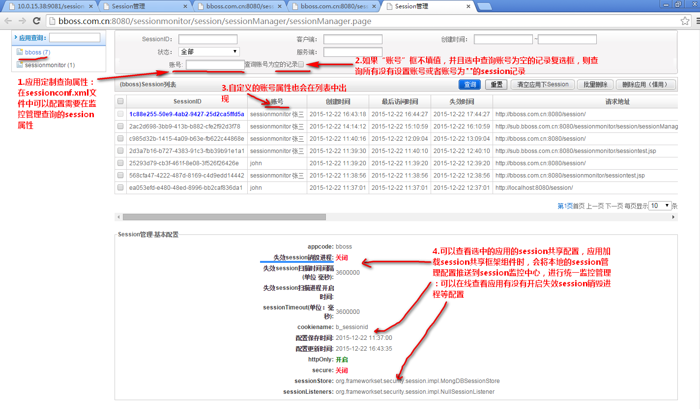
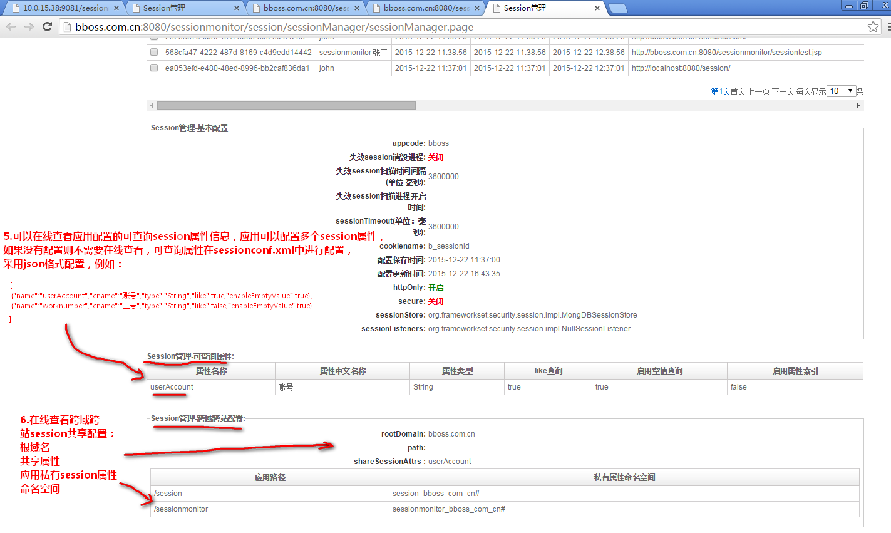

### bboss session会话属性数据查询功能配置使用方法

  session管理在线试用地址：
[http://session.bbossgroups.com](http://session.bbossgroups.com/)

http://sessionmonitor.bbossgroups.com/session/sessionManager/sessionManager.page

 bboss会话共享提供了非常实用的应用session共享和session监控管理功能，本文介绍两个内容：

1.如何配置并使用会话属性数据查询功能

2.如何在线查看应用session共享相关配置

下面具体介绍  

####   **1.应用定制查询属性：**

采用json数组进行配置可查询session属性，配置的属性包含以下信息：

name:属性名称

cname:属性中文名称

type：属性数据对应的java类型

like:是否采用模糊查询，查询输入的条件串开始的session对象

enableEmptyValue:是否可以查询属性值为null或者为""串的session对象

useIndex:是否对指定的session属性值建立索引(保留属性，目前未启用)

查询属性配置示意图：  



如果启用了跨域跨站的session共享，则只能配置应用间共享的session属性，不能配置应用私有的session属性。
需要查询的属性通过以下java语句在程序中设置属性值：

Java代码

```java
session.setAttribute("userAccount", this.getUserAccount());  
        session.setAttribute("worknumber", this.getUserAttribute("userWorknumber"));  
```

  登陆session监控选择应用，可以根据配置的session属性查询session数据：

http://sessionmonitor.bbossgroups.com/session/sessionManager/sessionManager.page

属性查询示意图
  



如果“账号”框不填值，并且选中查询账号为空的记录复选框，则查询所有没有设置账号或者账号为""的session记录，自定义的账号属性会在列表中出现。

####   **2.应用session共享配置查看**

2.1 可以查看选中的应用的session共享配置，应用加载session共享框架组件时，会将本地的session管理配置推送到session监控中心，进行统一监控管理：可以在线查看应用有没有开启失效session销毁进程等配置  

2.2 可以在线查看应用配置的可查询session属性信息，应用可以配置多个session属性，
如果没有配置则不需要在线查看，可查询属性在sessionconf.xml中进行配置，采用json格式配置，

例如：Java代码

```java
[  
                {"name":"userAccount","cname":"账号","type":"String","like":true,"enableEmptyValue":true},                  
                {"name":"worknumber","cname":"工号","type":"String","like":false,"enableEmptyValue":true}]  
```

2.3 在线查看跨域跨站session共享配置：

根域名共享属性应用私有session属性命名空间

配置在查看示意图



