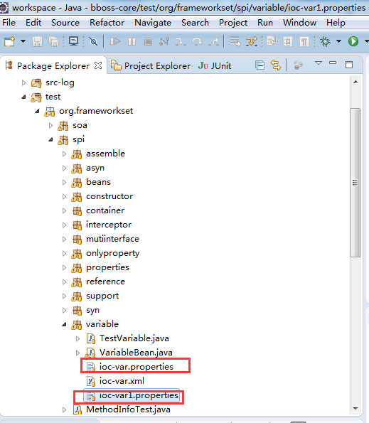

# bboss ioc配置文件中使用外部属性文件介绍

与spring ioc一样，在bboss ioc中也可以非常方便地引用外部属性文件(5.0.1及后续版本)，本文介绍使用方法。

## 1. 在工程中引入bboss ioc

maven坐标：
Xml代码 

```xml
<dependency>  
    <groupId>com.bbossgroups</groupId>  
    <artifactId>bboss-core</artifactId>  
    <version>6.2.7</version>  
</dependency>  
```

  **gradle坐标：**

compile group: 'com.bbossgroups', name: 'bboss-core', version: '6.2.7'


下载本文演示gradle工程：[下载](http://dl.iteye.com/topics/download/091574dc-54aa-3979-aadb-254bb86bff37)

参考文档将gradle工程导入eclipse：[bboss gradle工程导入eclipse介绍](http://yin-bp.iteye.com/blog/2313145)

## **2. 定义和导入外部属性文件**

属性文件必须包含在classpath环境中

例如：  



config可以通过定义file多个属性文件,后面的属性配置文件，可以引用先前的属性，反之不成立
文件定义好后需要在ioc配置文件的最开始通过config元素导入，如果有多个配置文件，可以在ioc根文件中导入属性文件（可以同时导入多个）：

**注：**每个config设置的文件无法相互引用，最终各个config中对应的所有属性被合并为一个容器属性配置注册器供外部或者组件引用

```xml
<properties>  
    <config file="org/frameworkset/spi/variable/ioc-var.properties,org/frameworkset/spi/variable/ioc-var1.properties"/>  
    
    <property name="test.beans"  
        f:varValue="aaa${varValue}aaa"   
        f:intValue="2"  
        long="1" int="1" boolean="true" string="${varValue1}string" object="object"  
        class="org.frameworkset.spi.variable.VariableBean">  
        <construction>  
            <property ><![CDATA[${varValue1}ccc]]></property>  
            <property value="ddd${varValue2}"/>  
        </construction>  
        <property name="varValue1" ><![CDATA[${varValue1}ccc]]></property>  
        <property name="varValue2" value="ddd${varValue2:99}"/>  
    </property>  
      
       
</properties>  
```

通过file:前缀指定物理路径，默认是classpath目录下的路径
属性文件内容：

```java
varValue1=hello varValue1!  
varValue2=hello varValue2!  
```

## 3. 使用外部属性文件

导入后就可以在注入的属性、扩展属性中引用属性文件中定义的变量：

引用变量语法：${xxxxx}

指定默认值语法：${varValue2:99}

在依赖注入的属性值中引用外部属性完整的示例


```xml
<properties>  
    <config file="org/frameworkset/spi/variable/ioc-var.properties"/>  
    <config file="org/frameworkset/spi/variable/ioc-var1.properties"/>  
    <property name="test.beans"  
        f:varValue="aaa${varValue}aaa"   
        f:intValue="2"  
        long="1" int="1" boolean="true" string="${varValue1}string" object="object"  
        class="org.frameworkset.spi.variable.VariableBean">  
        <construction>  
            <property ><![CDATA[${varValue1}ccc]]></property>  
            <property value="ddd${varValue2}"/>  
        </construction>  
        <property name="varValue1" ><![CDATA[${varValue1}ccc]]></property>  
        <property name="varValue2" value="ddd${varValue2:99}"/>  
    </property>  
      
       
</properties>  

```

获取使用了外部属性文件的组件实例：
Java代码 

```java
@Test  
    public void test()  
    {  
        BaseApplicationContext context = DefaultApplicationContext.getApplicationContext("org/frameworkset/spi/variable/ioc-var.xml");//定义一个ioc容器  
        VariableBean variableBean = context.getTBeanObject("test.beans", VariableBean.class);//获取组件实例  
        System.out.println(variableBean.getExteral("string"));//获取组件中配置的扩展属性string  
    }  
```

VariableBean类源码：
Java代码 

```java
package org.frameworkset.spi.variable;  
  
import org.frameworkset.spi.BeanInfoAware;  
  
public class VariableBean extends BeanInfoAware{  
    private String varValue;  
    private String varValue1;  
    private String varValue2;  
    private int intValue;  
    public VariableBean(String varValue1,String varValue2)  
    {  
        System.out.println("varValue1:"+varValue1);  
        System.out.println("varValue2:"+varValue2);  
    }  
      
    public String getExteral(String attr)  
    {  
        return super.beaninfo.getStringExtendAttribute(attr);  
    }  
  
}  
```

## 4. 通过ioc容器直接获取外部属性api方法实例

Java代码 

```java
BaseApplicationContext context = DefaultApplicationContext.getApplicationContext("org/frameworkset/spi/variable/parent-var.xml");  
        System.out.println(context.getExternalProperty("varValue"));  
        System.out.println(context.getExternalProperty("varValue1"));  
        System.out.println(context.getExternalProperty("varValue2"));  
```

## **5. 直接加载配置文件并获取属性值方法**

Java代码 

```java
PropertiesContainer propertiesContainer = new PropertiesContainer();  
        propertiesContainer.addConfigPropertiesFile("application.properties");  
        String dbName  = propertiesContainer.getProperty("db.name");  
        String dbUser  = propertiesContainer.getProperty("db.user");  
        String dbPassword  = propertiesContainer.getProperty("db.password");  
        String dbDriver  = propertiesContainer.getProperty("db.driver");  
        String dbUrl  = propertiesContainer.getProperty("db.url");  
  
  
        String validateSQL  = propertiesContainer.getProperty("db.validateSQL");  
  
  
        String _jdbcFetchSize = propertiesContainer.getProperty("db.jdbcFetchSize");  
        Integer jdbcFetchSize = null;  
        if(_jdbcFetchSize != null && !_jdbcFetchSize.equals(""))  
            jdbcFetchSize  = Integer.parseInt(_jdbcFetchSize);  

```

## 6. 使用外部属性加载拦截器

通过使用外部属性加载拦截器，可以对加载后的属性在使用之前进行预处理，比如对加密的属性值进行解密处理，下面举例说明

### 6.1属性加载拦截器组件接口

```java
org.frameworkset.spi.assemble.PropertiesInterceptor
```

包含以下接口方法

```java
/**
 * 对加载的属性值进行拦截处理，用处理后的值替换原来的值，常用于对加密数据的解密处理
 * @param propertyContext 包含property和value两个属性
 *   property 属性名称 如果value是复杂对象，property可能为空  
 *   value  属性值
    property为空时，只需要处理value即可,并且复杂对象处理后的值必须设置回复杂对象
 *   会忽略返回值
 * @return 返回处理加工后的新值
 */
public Object convert(PropertyContext propertyContext);
```

### 6.2 定义一个属性加载拦截器

一般根据属性名称进行不同的加工处理，对于不需要处理的属性直接返回其值即可。

```java
package org.frameworkset.spi.assemble;

import org.frameworkset.spi.assemble.PropertiesInterceptor;
import org.frameworkset.spi.assemble.PropertyContext;
import org.slf4j.Logger;
import org.slf4j.LoggerFactory;


public class VisualopsPropertiesInterceptor implements PropertiesInterceptor {
   private static Logger logger = LoggerFactory.getLogger(VisualopsPropertiesInterceptor.class);
   //解密组件，根据实际情况调整 
   private PasswordEncrypt passwordEncrypt = new PasswordEncrypt();
	@Override
	public Object convert(PropertyContext propertyContext) {
		String key = String.valueOf(propertyContext.getProperty());
		if(key.endsWith("db.password")){
			try {
				return passwordEncrypt.decryptDBPassword(String.valueOf(propertyContext.getValue()));
			}
			catch (Exception e){
				logger.error(propertyContext.toString(),e);
			}
		}
		else if(key.endsWith("redis.auth")){
			try {
				return passwordEncrypt.decryptDBPassword(String.valueOf(propertyContext.getValue()));
			}
			catch (Exception e){
				logger.error(propertyContext.toString(),e);
			}
		}
		else if(key.endsWith("elasticPassword")){
			try {
				return passwordEncrypt.decryptDBPassword(String.valueOf(propertyContext.getValue()));
			}
			catch (Exception e){
				logger.error(propertyContext.toString(),e);
			}
		}
		else if(key.endsWith("http.authPassword")){
			try {
				return passwordEncrypt.decryptDBPassword(String.valueOf(propertyContext.getValue()));
			}
			catch (Exception e){
				logger.error(propertyContext.toString(),e);
			}
		}
		return propertyContext.getValue();
	}
}
```

### 6.3 外部属性加载拦截器配置

外部属性加载拦截器VisualopsPropertiesInterceptor定义好后，需要在对应的属性配置文件中进行配置才会生效，一个配置文件只能配置一个有效的外部属性加载拦截器,以属性名称propertiesInterceptor进行配置，因此propertiesInterceptor属性不能作为其他属性使用。例如在application.properties文件中进行配置

```properties
redis.auth = r7OVqnbv5PE
http.authPassword = r7OVqnbv5PE
elasticPassword = r7OVqnbv5PE
propertiesInterceptor=org.frameworkset.spi.assemble.VisualopsPropertiesInterceptor
```

这样VisualopsPropertiesInterceptor将会对application.properties中的所有属性调用public Object convert(PropertyContext propertyContext)方法进行处理，并用户方法返回值替代原来的属性值，从而实现对象属性值的加工处理。

如果是在spring boot项目中，对于的属性名称为：

```properties
spring.elasticsearch.bboss.propertiesInterceptor
```

spring boot配置样例：

```properties
spring.elasticsearch.bboss.propertiesInterceptor=org.frameworkset.spi.assemble.VisualopsPropertiesInterceptor
```

在Apollo配置中心中，亦可以通过propertiesInterceptor或者spring.elasticsearch.bboss.propertiesInterceptor来指定外部属性加载拦截器。


## 7. 在外部属性配置文件中使用变量

可以在属性配置文件中使用变量，变量解析规则：检索其他对应属性->jvm属性->系统环境变量

配置示例如下：

```properties
mainclass=#[mainclassevn:org.frameworkset.elasticsearch.imp.DB2CSVFile]
```

配置检索mainclass功能,例如：

默认使用org.frameworkset.elasticsearch.imp.DB2CSVFile作为作业主程序，如果设置了环境变量mainclassevn，则使用mainclassevn作为作业主程序，否则并将原始值返回


##   8. 外部属性有效范围

1. 根容器配置文件中导入的外部属性文件中的属性值对根文件中导入（managerimport）子文件可见
2. 子文件中导入的外部属性文件中的属性只对本身及其下级子文件可见，以此类推
3. mvc容器对应的根文件是bboss-mvc.xml文件，在其中引入的外部属性配置文件对所有其他mvc配置文件可见，其他mvc配置文件导入的外部属性文件只对本身及其下级子文件可见

## 9.外部属性配置文件中导入公共配置文件

可以通过include.files直接在配置文件中引入其他配置文件：适用于公共配置管理和维护

```properties
include.files=xxx.properties,dd.properties,cc.properties
```

## 10.与apollo的集成

与apollo配置中心集成，需要额外导入以下maven坐标：

```xml
 <dependency>
            <groupId>com.bbossgroups.plugins</groupId>
            <artifactId>bboss-plugin-apollo</artifactId>
            <version>6.3.5</version>
        </dependency>
```

在resources/META-INF/app.properties中配置apollo注册中心地址和应用id：

```properties
app.id=db-elasticsearch-xxljob
apollo.meta=http://10.103.11.7:8080
```

直接通过PropertiesContainer加载apollo配置：

```java
  /**
    * 从Apollo加载属性配置，后加入的属性配置命名空间，可以引用先前加入的属性，反之不成立
    * @param namespace
    */
public void addConfigPropertiesFromApollo(String namespace)
/**
     * 从Apollo加载属性配置，后加入的属性配置命名空间，可以引用先前加入的属性，反之不成立
     * @param namespace
     * @param configChangeListener
     */
	public void addConfigPropertiesFromApollo(String namespace,String configChangeListener)
PropertiesContainer propertiesContainer = new PropertiesContainer();  
propertiesContainer.addConfigPropertiesFromApollo("application");  
propertiesContainer.addConfigPropertiesFromApollo("application","org.frameworkset.apollo.PropertiesContainerChangeListener");  //指定属性监听器
属性监听器需要实现接口：PropertiesChangeListener，例如
/**
 * <p>Description: </p>
 * <p></p>
 * <p>Copyright (c) 2020</p>
 * @date 2020/8/1 9:37
 * @author biaoping.yin
 * @version 1.0
 */
public class PropertiesContainerChangeListener extends PropertiesChangeListener {
	@Override
	public void onChange(ConfigChangeEvent changeEvent) {
		if(propertiesContainer != null){
			try {
				ResetTag.setLocal();
				propertiesContainer.reset();
			}
			finally {
				ResetTag.clean();
			}
		}
	}
}    

```

在ioc配置文件中配置apollo

```xml
<properties>
    <!--
        优先从bboss es属性配置文件加载扩展属性，其次从spring boot 配置文件application.properties加载属性
        必须配置elasticsearch.rest.hostNames这一个属性，其他属性可选


    -->
    <!-- <config file="conf/elasticsearch.properties,application.properties,config/application.properties"/>-->
    <config apolloNamespace="application"  changeReload="false"/>
 </properties>
```

通过changeReload属性设置是否监听属性变化，如果有变化实时加载变化后的属性

