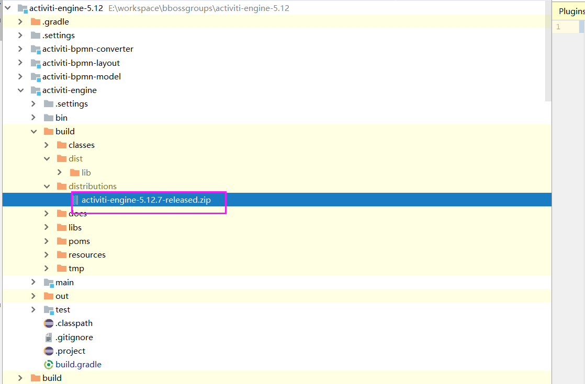

### 开源工作流引擎activiti与bboss整合使用方法浅析

本文介绍开源工作流引擎activiti与bboss ioc框架整合方法，涉及内容如下：

a).activiti采用bboss ioc来配置和初始化流程引擎

b).在activiti流程中使用bboss ioc容器托管的组件

c).bboss 托管activiti引擎流程处理事务

下面介绍前两部分，事务部分请参考文章[《bboss持久层事务管理组件托管第三方持久层框架（mybatis等）事务功能介绍 》](http://yin-bp.iteye.com/blog/1487101)。

**1 activiti-bboss源码工程下载及构建方法**

**1.1 环境准备**

安装好jdk 1.6,gradle 4或以上版本，并配置好jdk和gradle的环境变量

安装好mysql数据库（自行安装），并启动

在mysql中建立一个activiti的数据库

准备好[eclipse](http://www.eclipse.org/downloads/)或者idea

**1.2 下载activiti与bboss结合的源码工程**

基于activiti-5.12和最新的[bboss](https://github.com/bbossgroups/bboss)

https://github.com/yin-bp/activiti-engine-5.12

  **1.3 下载后解压并构建**

执行解压目录下的run.bat文件构建activiti流程引擎的jar包，生成的jar存放在每个子模块下面的build目录下：  



构建完毕后，除了将上面打包生成的zip包中的jar文件集成到项目来集成activiti，还可以通过maven坐标将activiti导入自己的项目：

Xml代码

```xml
<dependency>  
  <groupId>com.bbossgroups.activiti</groupId>  
  <artifactId>activiti-engine</artifactId>  
  <version>5.12.12</version>  
</dependency>  
```

**2 在源码工程中运行流程测试用例**

解压目录是一个eclipse工程，将其导入eclipse中

**2.1 修改activiti-engine\src\test\resources\poolman.xml中的数据库地址为mysql数据库地址，并设置账户：**

Xml代码

```xml
......  
<dbname>mysql</dbname>  
<driver>com.mysql.jdbc.Driver</driver>  
  
     <url>jdbc:mysql://localhost:3306/activiti</url>   
  
    <username>root</username>  
    <password>123456</password>  
............  
```

**2.2 修改activiti-engine/src/test/resources/activiti.cfg.xml文件内容为activiti配置bboss数据源mysql（是刚才在poolman.xml文件中配置的dbname为mysql的数据源的名称，该名称可以根据自己需要进行命名，没有特殊约定）：**

Xml代码

```xml
....  
<property name="dataSource" factory-class="com.frameworkset.common.poolman.util.SQLManager" factory-method="getTXDatasourceByDBName">  
        <construction>  
            <property value="mysql" />  
        </construction>  
    </property>  
.....  
```

为activiti配置bboss ioc容器对象，以便在测试用例中引用bboss ioc管理的组件来获取和设置流程环节处理人：

Xml代码

```xml
<property name="beanFactory" factory-class="org.frameworkset.spi.DefaultApplicationContext"   
              factory-method="getApplicationContext">  
              <construction>  
              <property value="beans.xml"/>  
              </construction>  
    </property>  
```

被activiti使用的bboss ioc容器可以是独立的ioc容器，例如如上配置就是一个加载beans.xml的类型为DefaultApplicationContext的独立ioc容器（本文以独立ioc容器为例）；也可以是bboss mvc对应的ioc容器，这样web应用中的流程就可以使用mvc ioc容器中配置的各种业务组件，mvc容器配置示例如下：

Xml代码

```xml
<property name="beanFactory"   
              factory-class="org.frameworkset.web.servlet.support.WebApplicationContextUtils"   
              factory-method="getWebApplicationContext"/>  
```

下面是一个完整的activiti.cfg.xml文件：

Xml代码 

```xml
<?xml version="1.0" encoding="UTF-8"?>  
<properties>  
  <property name="processEngineConfiguration" class="org.activiti.engine.impl.cfg.StandaloneProcessEngineConfiguration">  
     <property name="dataSource" factory-class="com.frameworkset.common.poolman.util.SQLManager" factory-method="getTXDatasourceByDBName">  
        <construction>  
            <property value="mysql" />  
        </construction>  
    </property>  
    <!-- Database configurations -->  
    <property name="databaseSchemaUpdate" value="true" />      
    <!-- job executor configurations -->  
    <property name="jobExecutorActivate" value="false" />      
    <!-- mail server configurations -->  
    <property name="mailServerPort" value="5025" />      
    <property name="history" value="full" />  
  </property>  
  <property name="beanFactory" factory-class="org.frameworkset.spi.DefaultApplicationContext"   
              factory-method="getApplicationContext">  
              <construction>  
              <property value="beans.xml"/>  
              </construction>  
    </property>  
</properties>  
```

加载activiti.cfg.xml并启动Activiti：

Java代码 

```java
TransactionManager tm = new TransactionManager();  
        try  
        {  
            tm.begin();  
            processEngine = ProcessEngineConfiguration  
                    .createProcessEngineConfigurationFromResource(xmlPath)  
                    .buildProcessEngine();  
            tm.commit();  
        }  
        catch(Exception e)  
        {  
            throw new RuntimeException(e);  
        }  
        finally  
        {  
            tm.releasenolog();  
        }  
```

说明：之所以将初始化activiti流程引擎的逻辑包含在一个bboss 的事务上下文之中，是因为activiti使用的是mybatis 3.0.6版本存在一个缺陷，这个缺陷表现为：先通过sqlsession开启一个事务，然后直接通过sqlsession的getconnection方法获取一个DB链接来执行多次数据库的增删改操作，如果全部执行成功，调用sqlsession的commit方法提交事务，如果执行成功一部分操作后出现异常，再调用sqlsession的rollback回滚事务，这样问题就出来了，mybatis会直接把connection返回给链接池，并不会提交或者回滚之前的db操作（因为这些操作没有调用sqlsession的相关方法来执行，而是直接通过connection完成的），connection并没有被物理关闭而只是返回到池中，这样就导致了之前修改和删除的数据被锁定了，导致后续针对这些锁定的记录的修改操作全部被阻塞造成不可预估的后果。

activiti在启动时会从mybatis的sqlsession中直接获取一个connection来执行创建和更新流程的库表结构并往属性表中插入或者更新流程的版本信息，如果在执行的过程中出现了问题的话，会导致数据库死锁，但是我们采用bboss的事务管理框架来托管mybatis的事务后就能够正常解决这个问题。

**2.3 beans.xml 配置和管理bboss ioc组件**

我们在activiti-engine/src/test/resources/beans.xml文件中配置了一个组件：

Xml代码

```xml
<properties>  
<property name="taskAssigneeAssignment" class="org.frameworkset.activiti.test.AssigneeAssignment"/>  
  
</properties>  
```

org.frameworkset.activiti.test.AssigneeAssignment组件是一个activiti task listener ，同时有个getHandlerMan方法用来获取任务处理人，代码如下：

Java代码

```java
package org.frameworkset.activiti.test;  
  
import org.activiti.engine.delegate.DelegateTask;  
import org.activiti.engine.delegate.TaskListener;  
  
  
/** 
 * @author biaoping.yin 
 */  
public class AssigneeAssignment implements TaskListener {  
  
  public void notify(DelegateTask delegateTask) {  
    delegateTask.setAssignee("kermit");//设置任务处理人  
  }  
    
  public String getHandlerMan()  
  {  
      return "kermit";  
  }  
    
}  
```

**3 在activiti的流程定义文件中引用bboss ioc中的组件**

**3.1 组件作为任务监听器使用**

流程定义文件activiti-engine/src/test/resources/org/activiti/examples/bpmn/tasklistener/CustomTaskAssignmentTest.testAssigneeAssignment.bpmn20.xml

相关内容：

Xml代码 

```xml
<activiti:taskListener event="create" delegateExpression="${taskAssigneeAssignment}" />  
```

流程定义文件完整内容如下：

Xml代码

```xml
<?xml version="1.0" encoding="UTF-8"?>  
<definitions id="taskListenerExample"   
  xmlns="http://www.omg.org/spec/BPMN/20100524/MODEL"  
  xmlns:activiti="http://activiti.org/bpmn"  
    targetNamespace="Examples">  
      
    <process id="setAssigneeInListener" name="Custom task assignment Example">  
      
        <startEvent id="theStart" />  
          
        <sequenceFlow id="flow1" sourceRef="theStart" targetRef="task1" />  
  
        <userTask id="task1" name="Schedule meeting" >  
          <documentation>  
            Schedule a meeting with management.  
          </documentation>  
          <extensionElements>  
            <!--<activiti:taskListener event="create" class="org.activiti.examples.bpmn.tasklistener.AssigneeAssignment" />  -->  
            <activiti:taskListener event="create" delegateExpression="${taskAssigneeAssignment}" />  
          </extensionElements>  
        </userTask>  
          
        <sequenceFlow id="flow2" sourceRef="task1" targetRef="theEnd" />  
          
        <endEvent id="theEnd" />  
          
    </process>  
  
</definitions>  
```

流程执行示例

测试用例：

activiti-engine/src/test/java/org/activiti/examples/bpmn/tasklistener/CustomTaskAssignmentTest.java

测试方法：

Java代码

```java
 public void testAssigneeAssignment() {  
//启动流程  
    runtimeService.startProcessInstanceByKey("setAssigneeInListener");  
//通过任务监听器组件taskAssigneeAssignment以下方法指定了流程环节处理人为kermit，所以kermit会有一个待办任务  
//public void notify(DelegateTask delegateTask) {  
//    delegateTask.setAssignee("kermit");//设置任务处理人  
//  }  
  
      
assertNotNull(taskService.createTaskQuery().taskAssignee("kermit").singleResult());  
    assertEquals(0, taskService.createTaskQuery().taskAssignee("fozzie").count());  
    assertEquals(0, taskService.createTaskQuery().taskAssignee("gonzo").count());  
  }  
```

**3.2 直接调用组件方法获取任务处理人**

流程定义文件activiti-engine/src/test/resources/org/activiti/examples/bpmn/usertask/taskassignee/TaskAssigneeTest.testTaskAssignee.bpmn20.xml

相关内容：

Xml代码

```xml
<formalExpression>${taskAssigneeAssignment.getHandlerMan()}</formalExpression>  
```

完整流程定义文件：

Xml代码

```xml
<?xml version="1.0" encoding="UTF-8"?>  
<definitions id="taskAssigneeExample"   
  xmlns="http://www.omg.org/spec/BPMN/20100524/MODEL"  
  xmlns:activiti="http://activiti.org/bpmn"  
  targetNamespace="Examples">  
    
  <process id="taskAssigneeExampleProcess" name="Schedule meeting reminder">  
    
    <startEvent id="theStart" />  
      
    <sequenceFlow id="flow1" sourceRef="theStart" targetRef="theTask" />  
  
    <userTask id="theTask" name="Schedule meeting" >  
      <documentation>  
        Schedule an engineering meeting for next week with the new hire.  
      </documentation>  
      <humanPerformer>  
        <resourceAssignmentExpression>  
<!--           <formalExpression>kermit</formalExpression> -->  
 <formalExpression>${taskAssigneeAssignment.getHandlerMan()}</formalExpression>  
        </resourceAssignmentExpression>  
      </humanPerformer>  
    </userTask>  
      
    <sequenceFlow id="flow2" sourceRef="theTask" targetRef="theEnd" />  
      
    <endEvent id="theEnd" />  
      
  </process>  
  
</definitions>  
```

流程执行：

测试用例activiti-engine/src/test/java/org/activiti/examples/bpmn/usertask/taskassignee/TaskAssigneeTest.java

测试方法：

Java代码

```java
public void testTaskAssignee() throws Throwable{      
     
   // Start process instance  
TransactionManager tm = new TransactionManager();  
try {  
    tm.begin();//start bboss transaction  
    ProcessInstance processInstance = runtimeService.startProcessInstanceByKey("taskAssigneeExampleProcess");  
      
    // Get task list  
/流程中通过${taskAssigneeAssignment.getHandlerMan()}表达式调用组件方法指定了kermit为任务处理人  
    List<Task> tasks = taskService  
      .createTaskQuery()  
      .taskAssignee("kermit")  
      .list();  
    assertEquals(1, tasks.size());  
    Task myTask = tasks.get(0);  
    assertEquals("Schedule meeting", myTask.getName());  
    assertEquals("Schedule an engineering meeting for next week with the new hire.", myTask.getDescription());  
  
    // Complete task. Process is now finished  
    taskService.complete(myTask.getId());  
    // assert if the process instance completed  
    assertProcessEnded(processInstance.getId());  
           //do some bussiness   
           startmeeting();  
    tm.commit();//commit bboss transaction  
  
} catch (Throwable e) {  
    throw e;  
}  
       finally  
       {  
           tm.release();  
       }    
  
 }  
```

测试方法中我们将业务处理和流程的处理包含在bboss的事务上下文件，如果工作流中包含了监听器的执行，那么监听器中的业务处理也会受事务的控制。

**4.activiti-bboss eclipse demo工程**

为了更好地方便大家使用activiti-bboss的整合版本，特意整理了一个demo工程，工程下载地址：

http://www.bbossgroups.com/file/download.htm?fileName=activiti-bboss-example.zip

工程里面已经根据上文方法做好相关配置

activiti.cfg.xml

beans.xml

poolman.xml

下载解压后将其导入eclipse，修改poolman.xml中的数据库连接地址和账号即可运行demo工程中的测试用例：

/activiti-bboss-example/src/org/frameworkset/activiti/test/SimpleActivitTest.java

用例方法为：

Java代码

```java
@Test  
    public void runBare() throws Throwable {  
  
        initializeProcessEngine();// 初始化流程引擎，默认加载activiti.cfg.xml文件  
  
        initializeServices();// 初始化流程相关服务  
  
        initusers();// 初始化测试用户  
  
        String deploymentId = null;  
  
        try {  
  
            deploymentId = annotationDeploymentSetUp(processEngine);// 部署测试流程  
  
            testAssigneeAssignment();// 执行测试用例  
            testTaskAssignee();// 执行测试用例  
  
        } catch (AssertionFailedError e) {  
  
            throw e;  
  
        } catch (Throwable e) {  
  
            throw e;  
  
        } finally {  
            annotationDeploymentTearDown(processEngine, deploymentId);// 卸载流程  
            deleteusers();//清除用户信息  
            assertAndEnsureCleanDb();// 重置activiti数据库表  
            ClockUtil.reset();  
        }  
    }  
```

和本文相关的两个流程的测试方法：

testAssigneeAssignment();// 执行测试用例

testTaskAssignee();// 执行测试用例

**bboss开发交流**
21220580

**bboss微信公众号**  

