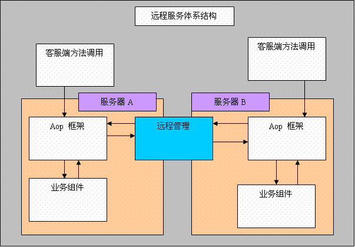

### bboss aop 远程服务介绍-体系结构

bboss 项目下载地址：

https://sourceforge.net/project/showfiles.php?group_id=238653

通过Bboss aop 1.0.6 新提供的远程服务调用功能，你可以实现：

1. 点对点的远程服务调用（与ejb和rmi的功能一样，但是要简单得多）

   2.多点远程服务调用（在集群环境中使用）

#### 体系结构

远程服务调用功能依赖于Bboss aop提供的以下组件来实现：

1.远程管理组件

2.Aop组件管理组件

整个远程服务管理的体系结构如下：

#### 远程服务调用过程 

1. 客服端调用注册在aop框架中的业务组件的方法，给定特定的业务组件的serviceid

2. aop框架根据serviceid，判断调用的是远程方法还是本地方法

3. 如果serviceid 的值为 （all）/service或者（ip:port[;ip:port]）/service模式则为远程方法调用，反之为service时则为本地业务方法调用。

4. aop框架识别的是本地服务调用时，会将调用请求直接转交给本地业务组件

5. aop框架识别的是远程服务调用时，会将调用请求直接转交给远程服务管理组件

6. 集远程服务管理组件接收到远程方法调用时，会将该请求递交给请求目标服务器中部署的aop框架中的业务组件，来完成请求的处理。

7. 处理完毕后将处理结果返回给客服端。 

Bboss aop框架后续还会增加远程服务调用路由功能。

 