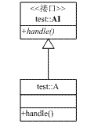

### 使用BaseSPIManager获取组件实例和直接创建组件实例的区别

bboss 项目下载地址：

https://sourceforge.net/project/showfiles.php?group_id=238653

只有通过BaseSPIManager提供的两个方法获取接口实例，然后在接口实例上调用事务方法，声明的事务管理才会生效，否则无效。举例说明如下：

假如接口AI和接口实现类A，接口中定义了方法handle，并且将该方法声明为事务方法，

在配置文件中做以下的配置：

< manager id="test.A" singlable="true" >

< provider type="DB" default="true"

​           class="test.A" />

< transactions >

< method name="handle" txtype="REQUIRED_TRANSACTION" />

</ transactions >

</ manager >

声明组件的管理id为test.A,我们通过以下两种方式获取接口实例：

方法1 直接创建对象实例a,在实例a上调用handle方法

AI a = new A();

a.handle();

采用这种方式时，为handle方法声明的事务不会生效。

方法2 通过BaseSPIManager提供的接口获取接口实例

AI a = (AI)BaseSPIManager.getProvider("test.A");

a.handle();

采用这种方式，为handle方法声明的事务才会生效。

业务组件必须由两部分组成：组件接口，组件接口的实现类；这是因为通过BaseSPIManager的两个方法所获取到的对象必需是一个接口对象，这里不能直接将返回值直接转换为具体的实现类型，以下的用法是正确的：

AI a = (AI)BaseSPIManager.getProvider("test.A");

以下的用法是不正确的，但是编译时不会报错，运行时会报类型转换错误，这是因为方法返回的是一个实现接口AI的代理对象，而不是一个A类型的对象了：

A a = (A)BaseSPIManager.getProvider("test.A");