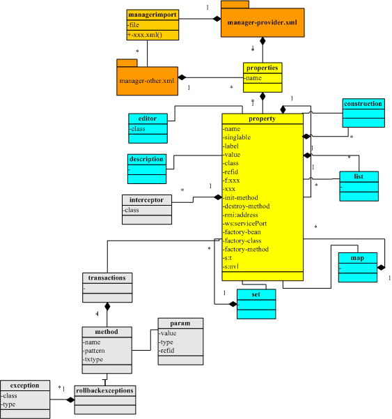

### bboss aop/ioc组件配置语法诠释

​        这篇文章全面介绍bboss ioc 配置语法，希望对正在使用bboss或者即将使用bboss或者想了解bboss的朋友有所帮助；希望有助于大家了解和认识bboss，如果有不妥请大家批评指正。同时bboss ioc也是构建bboss家族其他部分（mvc，persistent，xml-bean序列化，rpc等）的基石，因此对了解和认识其他部分也有所帮助。
​         bboss aop/ioc采用xml文件管理组件，通过一套简洁的xml语法来配置和管理组件、描述对象数据结构。组件配置语法非常简洁，而且易于扩展，对于扩展信息可以非常方便地通过容器的api进行获取，包含以下xml元素：

property

managerimport

interceptor

list

map

set

array

propes --等同于java.util.Properties类型

editor

transactions

method

construction

元素之间的关系图如下：  



下面详细介绍每个xml元素的作用和使用方法：

**1.property**
property是bboss aop/ioc框架的最主要元素，用来配置和管理组件、全局属性参数、配置webservice服务、rmi服务、mvc控制器,property元素的属性可以任意扩展，同时还可以指定自定义的ioc依赖注入插件。property可以内置map,list,set,array四种容器类型的元素，用来定义各种容器对象。

property元素的固定属性有：

name, n,二者等价

label,

value,v,二者等价

class,cs, 二者等价

refid,

singlable,

enablerpc，

init-method, destroy-method,

factory-bean, factory-class, factory-method,

iocplugin

istpl

multiparser

trim

property元素分别以以下前缀开头的属性是有特定含义的属性：

f:, path:, ws:,s:,rmi:,hessian:

除此以外的属性都是扩展属性。

property的属性集详细含义及使用方法如下。  

**属性名称：name**

属性含义：组件的名称或者全局属性的名称，如果是mvc控制器则可用来指示控制器对应url地址映射模式，在对应的ioc容器中保持全局唯一性


**属性名称：singlable**

属性含义：指定对应的组件是单例模式还是多例模式|true代表组件是单例的，false代表组件是多实例的，默认值为true|


**属性名称：value**

属性含义：如果对应的是一个全局参数，用来指定参数的值

使用示例：

**普通属性配置示例**

**<property name="connection.bind.port" value="1099" /**>，获取该属性的方法：

String cluster_str = context.getProperty("connection.bind.port");

**持久层sql语句配置示例**

bboss 持久层框架采用这个配置语法来管理sql语句，简单而方便：

Xml代码

```xml
<property name="dynamicsqltemplate"><![CDATA[select *  from LISTBEAN  where 1=1  
                    #if($fieldName && !$fieldName.equals("")) and FIELDNAME = #[fieldName] #end  ]]>  
</property>  
```

下面就是获取并执行这个sql的代码：

Java代码

```java
SQLParams params = new SQLParams();  
         params.addSQLParam("fieldName", "阿斯顿飞", SQLParams.STRING);  
         List<ListBean> result = executor.queryListBean(ListBean.class, "dynamicsqltemplate", params);  
```

bboss 框架中支持一系列的配置方法可以获取基础数据类型参数(int,String,long,double,float,boolean等)、容器类型参数（list，map，set，array），还可以通过property元素的内置元素editor来指定属性编辑器对值进行自定义的转换

**属性名称：trim**

属性含义：控制是否截取字符串值两边的空格和换行符，在使用<![CDATA[ ]]>语法的场景下面使用,true 截取（默认值）,false不截取

使用示例：

Xml代码

```xml
<property name="dynamicsqltemplate" trim="false"><![CDATA[select *  from LISTBEAN  where 1=1  
                    #if($fieldName && !$fieldName.equals("")) and FIELDNAME = #[fieldName] #end  ]]>  
</property>  
```

**属性名称：class**

属性含义：指定组件实现类的名称

使用示例：

**<property name="rpc.server_object" singlable="true" class="org.frameworkset.spi.remote.DefaultRemoteHandler"/**>

BaseApplicationContext context = DefaultApplicationContext.getApplicationContext("org/frameworkset/spi/beans/testapplicationcontext.xml");

RestfulServiceConvertor convertor = context.getTBeanObject("rpc.restful.convertor",RestfulServiceConvertor.class);|

**属性名称：refid**

属性含义：用来指定引用组件的名称，引用的组件名称前面要添加attr:前缀，例如：**<property name="request_handler" refid="attr:rpc.request_handler" /**>这个组件是对组件rpc.request_handler的引用。另外引用的可能是一个全局参数，取决于rpc.request_handler对应的定义，同时支持组件之间内部属性的引用，详情请参考文章《[bboss aop/ioc依赖注入功能介绍](http://yin-bp.iteye.com/blog/1403142)》


**属性名称：init-method**

属性含义：指定组件实例化完毕后立刻执行的初始化方法名称

使用实例：
**<property name="rpc.server_object" singlable="true" class="org.frameworkset.spi.remote.DefaultRemoteHandler" init-method="doinit"/**>


**属性名称：destroy-method**

属性含义：指定ioc容器销毁组件实例前要执行的方法名称，用来释放对象资源，该属性只对单例模式的组件起作用

使用实例:

**<property name="rpc.server_object" singlable="true" class="org.frameworkset.spi.remote.DefaultRemoteHandler" destroy-method="dodestroy"/**>


**属性名称：iocplugin**

属性含义：当扩展bboss ioc语法实现自定义的ioc依赖注入功能时，用来指定ioc依赖注入插件实现类，这个插件实现类必须实现接口：

org.frameworkset.spi.assemble.plugin.IocPlugin<T,R>

Java代码

```java
public interface IocPlugin<T,R> {  
    /** 
     * 返回扩展ioc机制生成的对象实例 
     * @param object 输入的ioc元素对象,类型范围为：Pro,ProMap,ProList,ProArray,ProSet 
     * @param callcontext ioc依赖注入上下文，用来提供对循环依赖注入支持的 
     * @return 
     */  
    public R ioc(T object, CallContext callcontext);  
  
}  
```

使用实例:

<property name="excelMapping" 

iocplugin="org.frameworkset.spi.assemble.plugin.ExcelIOCPlugin">

......

<,/property >

具体扩展方法请参考文档：
[扩展bboss ioc语法实现自定义的ioc依赖注入功能](http://yin-bp.iteye.com/blog/2177838)

**属性名称：enablerpc**

enablerpc布尔类型，true和false，理论上bboss ioc容器中配置的组件都可以作为远程服务调用，但是必须通过enablerpc属性开启为远程服务，对应的业务组件才能作为远程服务发布，

enablerpc="true" 开启

enablerpc="false" 禁用

更多bboss rpc介绍，请参考文档：http://yin-bp.iteye.com/blog/1222760

**属性名称：f:xxx**

属性含义：指定ioc注入属性的值或者要注入的其他组件的id(name)，xxx代表组件的属性名称，f:前缀用来指示ioc容器这是一个属性注入属性

使用示例：

<property name="rpc.server_object" f:basefieldname="0"

f:cptobj="attr:otherobjname" class="org.frameworkset.spi.remote.DefaultRemoteHandler" destroy-

method="dodestroy"/>

对应的值前面如果带了attr:前缀则表示该属性引用了ioc容器中的其他组件，不带则表示直接将对应的值注入到对象中。

**属性名称：istpl和multiparser**

这两个属性被应用于bboss 持久层sql语句配置，都为boolean类型

属性说明：istpl 标识sql语句中是否有velocity模板引擎语法，如果有则必须设置为true，默认为true，没有则可以指定为false，避免持久层去分析sql语句提升性能。

multiparser：如果sql语句为velocity模板，multiparser指示在批处理时是否需要每条记录都需要分析sql语句，如果不需要则可以将multiparser设置为false，提升性能,示例如下：

Xml代码

```xml
<property name="queryAllRoles" istpl="true" multiparser="false">  
        <![CDATA[ 
            select role_id,owner_id from TD_SM_ROLE where 1=1                
                #if($roleName && !$roleName.equals(""))  
                    and ROLE_NAME like #[roleName] 
                #end 
        ]]>  
    </property>  
```

**属性名称：rmi:address**

属性含义：用来指定rmi服务的注册表名称，前提是property指定的组件是一个rmi服务，这样在应用启动的时候rmi服务加载程序将自动注册这些程序。

使用示例：

<property name="rmi_service_test"

rmi:address="rmi_service_test"

class="org.frameworkset.spi.remote.rmi.RMIServiceTest"/>

客户端查找该服务的代码：

RMIServiceTestInf test = (RMIServiceTestInf)org.frameworkset.spi.remote.rmi.RMIUtil.lookupService("//172.16.25.108:1099/rmi_service_test");


**属性名称：hessian:xxx**

bboss ioc为hessian组件定义了一组扩展属性，说明如下：

**hessian:api** 服务接口,可选

**hessian:servicePort** 指定服务标识

**hessian:serializable** xml|bin 序列化类型,默认为bin,可选

**hessian:debug** default false used by serializable="bin".,可选

**hessian:sendCollectionType** used by serializable="bin". default true Set whether to send the Java collection type for each serialized collection.,可选

**hessian:serializerFactory** used by serializable="bin".default com.caucho.hessian.io.SerializerFactory,可选

使用示例：

<property name="myservicesss" hessian:servicePort="myservice" 

class="org.frameworkset.web.ws.TokenServiceImpl"/>

客户端：

HessianProxyFactory factory = new HessianProxyFactory();

String url = "http://192.168.1.101:8080"+request.getContextPath()+"/hessian?service=myservice";

TokenService tokenService = (TokenService) factory.create(TokenService.class, url);

String token = tokenService.genAuthTempToken(appid, secret, account);

//token = tokenService.genDualToken(appid, secret, account);

更多hessian插件使用，请参考文档：[bboss 发布和使用hessian服务方法介绍](http://yin-bp.iteye.com/blog/1814978)

**属性名称：ws:servicePort**

属性含义：指定webservice服务组件端口地址，前提是配置的组件必需是一个webservice服务

使用示例：

<property name="myservicesss" ws:servicePort="myservice" 

class="org.frameworkset.web.ws.MyserviceImpl"/>

客户端查找：

org.apache.cxf.jaxws.JaxWsProxyFactoryBean factory = new org.apache.cxf.jaxws.JaxWsProxyFactoryBean();

factory.setAddress("http://localhost:8080/bboss-mvc/cxfservices/myservicesss");

factory.setServiceClass(org.frameworkset.web.ws.WSService.class);

org.frameworkset.web.ws.WSService wsservice =  (WSService)factory.create();


**属性名称：path:xxx**

属性含义：带path:前缀的属性用来指定mvc控制器跳转路径

使用示例：

<property name = "/tagdemo/*.page"

​    path:testmap="/tagdemo/testmap.jsp"

​    class="org.frameworkset.web.tagdemo.Map2ndConverTagController" />


**属性名称：s:t**

属性含义：s:t属性和value属性配合使用，s:t用来指定value属性值的实际数据类型

使用示例：

<property name = "test"

​    s:t="int"

​    value="10" />


**属性名称：s:nvl**

属性含义：s:nvl属性和s:t属性配合使用，取值范围为true和false，默认为false，s:nvl="true"时表示参数值为null，s:t用来指定这个空值的实际数据类型

使用示例：

<property name = "test"

​    s:t="int"

​    s:nvl="true" />

**属性组：factory-bean，factory-class，factory-method**

属性含义：factory-bean，factory-class，factory-method三个属性对应于bboss ioc框架的组件工厂模式，及以工程模式创建property元素对应的组件实例。factory-bean，factory-class分别和factory-method配合来生成组件的实例，factory-bean属性指定factory-method方法对应ioc容器中的另一个组件实例；factory-class属性指定了factory-method方法所属的类名称，同时factory-method对应的方法时该类的静态方法；如果factory-method带有参数可以利用construction元素类指定工厂方法参数，construction元素按顺序包含了一组property元素，对应于工厂方法的每一个参数值。

使用示例：factory-class和factory-method配合

Xml代码 

```xml
<property name="clientservice" factory-class="org.frameworkset.spi.ClientProxyContext" factory-method="getWebMVCClientBean">  
        <construction>  
            <property name="servicaddress" value="(http::localhost:8080/bboss-mvc/http.rpc)/client.proxy.demo?user=admin&password=123456"/>         
            <property name="serviceclass" value="org.frameworkset.spi.remote.clientproxy.ClientInf"/>       
        </construction>  
    </property>
```

factory-bean和factory-method配合:

Xml代码

```xml
<property name="clientservice" factory-bean="factorybean" factory-method="getWebMVCClientBean">  
        <construction>  
            <property name="servicaddress" value="(http::localhost:8080/bboss-mvc/http.rpc)/client.proxy.demo?user=admin&password=123456"/>         
            <property name="serviceclass" value="org.frameworkset.spi.remote.clientproxy.ClientInf"/>       
        </construction>  
    </property>  
<!--对应的工厂bean-->  
<property name="factorybean" value="org.frameworkset.spi.ClientProxyContext"/>  
```

获取实例方法：

Java代码

```java
//定义容器对象  
        DefaultApplicationContext context = DefaultApplicationContext.getApplicationContext("org/frameworkset/spi/remote/clientproxy/consumer.xml");  
        //获取客户端组件实例  
        ClientInf client = context.getTBeanObject("clientservice", ClientInf.class);
```

**属性名称：xxx**

属性含义：除了上述的一系列属性外的其他属性都被认为是扩展属性

使用示例：

**通过ioc容器对象api获取扩展属性值的例子**

<property name="cluster_str" value="cluster_str" testattrint="1" 

testattrstring="duoduo" testattrboolean="true"/>

获取扩展属性方法：

BaseApplicationContext context = DefaultApplicationContext.getApplicationContext("org/frameworkset/spi/properties/properties.xml");
boolean cluster_enable = context.getProperty("cluster_enable");//获取参数值

 boolean testattrboolean = context.getBooleanExtendAttribute("cluster_enable", "testattrboolean");//获取参数cluster_enable的扩展属性testattrboolean的值

 String testattrstring = context.getStringExtendAttribute("cluster_enable", "testattrstring");

​    int testattrint = context.getIntExtendAttribute("cluster_enable", "testattrint");

**组件初始化方法中获取扩展属性值**

这个案例要求对应的组件继承抽象类org.frameworkset.spi.BeanInfoAware，并且实现初始化接口org.frameworkset.spi.InitializingBean或者在property元素上制定init-method属性，这样ioc容器在加载完组件时将组件的元配置对象注入到组件实例中，这样组件就可以在afterPropertiesSet方法或者init-method属性指定的方法中访问组件的所有配置信息（包括扩展属性）。以下就是样例配置和样例程序

Xml代码

```xml
<property name="test.beaninfoawary"      class="org.frameworkset.spi.beans.BeanInfoAwareTest"/>   
```

Java代码

```java
public class BeanInfoAwareTest extends org.frameworkset.spi.BeanInfoAware implements InitializingBean {  
    public void afterPropertiesSet() throws Exception {  
        String extrattr = super.beaninfo.getStringExtendAttribute("extrattr");//获取扩展属性值  
        String extrattr_default = super.beaninfo.getStringExtendAttribute("extrattr","defaultvalue");//获取扩展属性值，如果没有指定则返回后面的默认值  
    }  
}  
```

Java代码 

```java
BaseApplicationContext context = DefaultApplicationContext.getApplicationContext("org/frameworkset/spi/beans/manager-beans.xml");  
        BeanInfoAwareTest convertor = context.getTBeanObject("test.beaninfoawary",BeanInfoAwareTest.class);  
        //从组件实例中获取组件配置元数据对象  
        Pro beaninfo = convertor.getBeaninfo();  
```

**2.managerimport**

managerimport元素用来指定外部组件配置文件，可以按系统模块规划组件管理文件，然后可以通过managerimport元素来在主文件中装载这些子模块文件，属性和使用说明如下。

**属性名称：file**

属性含义：指定子模块xml文件的路径

使用示例：

可以在file属性值前面添加以下两个前缀：

classpath::  --从classpath查找对应的文件，默认值

web::   ---从web应用查找对应的文件

<managerimport file=

"org/frameworkset/spi/manager-rpc-service.xml" />

<managerimport file=

"classpath::org/frameworkset/spi/manager-rpc-service.xml" />

<managerimport file=

"web::org/frameworkset/spi/manager-rpc-service.xml" />

**3.interceptor**

interceptor元素用来指定组件方法拦截器，拦截器可以内嵌在property元素中，拦截器类必须实现接口：

com.frameworkset.proxy.Interceptor

interceptor元素的属性和使用方法如下。

**属性名称：class**

属性含义：指定拦截器类

使用实例：

<property name="serviceName" 

class="org.frameworkset.spi.interceptor.A" singlable="true">

<interceptor class=

"org.frameworkset.spi.interceptor.Insterceptor"/>

</

property>

**4.list**

list元素用来配置组件列表或者全局参数数据，必须内嵌在property元素中使用，list的属性集及详细的使用方法如下。

**属性名称：componentType**

属性含义：用来指定list中对象的类型，取值范围

 bean-将列表转换为对象列表，list中的每个组件都是通过property配置，每个数据的类型也由property的具体配置来决定，如果用户需要自己明确指定对象类型可以通过property元素的s:t属性来指定对象类型为具体的基础数据类型，s:t一般配合value属性来使用。

String-将列表转换为字符串列表返回

使用示例：

**<property name="testlist" **>

<**list componentType="bean">**

<**property class="org.frameworkset.soa.xblink.Test1"/>**

<**property class="org.frameworkset.soa.xblink.Test1"/>**

<**property s:t="String" value="stringvluae"/>**

<**property s:t="int" value="1000"/>**

<**/list>**

<**/property>**

获取testlist的方法：

List data = (List)context.getBeanObject("testlist");

**5.map**

map元素用来配置Map对象及map中的所有数据，必须内嵌在property元素中使用，map元素的属性集及详细的使用方法如下。

**属性名称：componentType**

属性含义：用来指定Map中对象的类型，取值范围

​       bean-map中的对象值为各种对象类型，Map中的每个组件都是通过property配置，name对应key，对象值作为值存入Map对象，每个对象的类型由property的具体配置来决定，如果用户需要自己明确指定对象类型可以通过property元素的s:t属性来指定对象类型为具体的基础数据类型，s:t一般配合value属性来使用。

String-将列表转换为字符串列表返回

使用示例：

<**property name="testmap" >**

<**property name="a" class="org.frameworkset.soa.xblink.Test1"/>**

<**property name="b" class="org.frameworkset.soa.xblink.Test1"/>**

<**property name="c" s:t="String" value="stringvluae"/>**

<**property name="d" s:t="int" value="1000"/>**

<**/map>**

<**/property>**

获取testmap的方法：

Map data = (Map)context.getBeanObject("testmap");

**6.set**

set元素类似list元素，不同的是set中的每个值都要实现compare接口，这里就不详细说明了。

**7.array**

array元素用来配置数组对象及数组中的所有数据，必须内嵌在property元素中使用，array元素的属性集及详细的使用方法如下。

**属性名称：componentType**

属性含义：用来指定数组中每个数组元素的类型，取值范围为具体的数据类型名称。数组中每个对象的值由property来具体配置。

使用示例：

Xml代码

```xml
<property name="testarraybasic" >  
            <array componentType="org.frameworkset.soa.xblink.Test1">  
                <property class="org.frameworkset.soa.xblink.Test1"/>  
                <property class="org.frameworkset.soa.xblink.Test1"/>  
                <property class="org.frameworkset.soa.xblink.Test1"/>  
                <property class="org.frameworkset.soa.xblink.Test1"/>  
            </array>  
        </property>  
```

或者

Xml代码

```xml
<property name="testarraybasic" >  
            <array componentType="int">  
                <property value="1"/>  
                <property value="2"/>  
            </array>  
        </property>  
```

获取testarraybasic的方法：

Test1[] data = (Test1[])context.getBeanObject("testarraybasic");

或者

int[] data = (int[])context.getBeanObject("testarraybasic");

**8.propes**

propes对应于java.util.Properties类型

ioc配置

Xml代码

```xml
 <property name="connection.propes">  
        <!-- 
http://activemq.apache.org/maven/activemq-core/xsddoc/http___activemq.org_config_1.0/element/connectionFactory.html 
-->  
        <propes>  
  
            <property name="topicPrefetch" value="32766">  
                <description> <![CDATA[ topicPrefetch ]]></description>  
            </property>  
            <property name="useConnectionPool" value="是否使用链接池">  
                <description> <![CDATA[ true使用，false不使用 ]]></description>  
            </property>  
        </propes>  
    </property>  
```

代码中获取propes:

Java代码

```java
DefaultApplicationContext context =  
DefaultApplicationContext.getApplicationContext("org/frameworkset/spi/properties/properties.xml");    
        ProProperties properties = context.getProProperties("connection.propes");  
          java.util.Properties propes =  
context.getTBeanObject("connection.propes", Properties.class);  
          System.out.println(propes);  
        System.out.println(properties );  
```

**8.editor**

editor元素内置在property元素中使用用来对property对应的值进行自定义转换，editor元素的属性集及详细的使用方法如下。

**属性名称：class**

属性含义：用来指定editor的类名称，这个类必须实现接口

com.frameworkset.util.EditorInf使用示例：

Xml代码

```xml
<property name="sex" value="0">  
            <editor class="org.frameworkset.spi.properties.injectbean.ProEditor"/>  
        </property>  
```

org.frameworkset.spi.properties.injectbean.ProEditor类的实现如下：

Java代码

```java
public class ProEditor implements EditorInf<String>  
{  
  
    /* (non-Javadoc) 
     * @see com.frameworkset.util.EditorInf#getValue(java.lang.Object) 
     */  
    public String getValueFromObject(Object fromValue)  
    {            
        if(fromValue == null)  
            return "未知";  
        if(fromValue.equals("0"))  
            return "男";  
        else if(fromValue.equals("1"))  
            return "女";  
        else   
            return "未知";  
    }  
      
    /* (non-Javadoc) 
     * @see com.frameworkset.util.EditorInf#getValue(String) 
     */  
    public String getValueFromString(String fromValue)  
    {     
        if(fromValue == null)  
            return "未知";  
        if(fromValue.equals("0"))  
            return "男";  
        else if(fromValue.equals("1"))  
            return "女";  
        else   
            return "未知";  
    }  
}  
```

**9.transactions,method，rollbackexceptions，param，exception**

transactions,method，rollbackexceptions，param，exception这组元素用来实现bboss 框架中的声明式事务管理功能，method元素用来指定需要做声明式事务方法信息，

rollbackexceptions和exception两个元素用来指定事务回滚异常，param用来指定方法签名参数信息，这些元素的属性及详细使用方法如下。

**method元素属性：**

**name**-明确指定方法名称，name和pattern元素任选一

pattern-方法名称的正则表达式匹配模式，如果在配置了多个方法模式，匹配的顺序根据配置位置的来定，先执行靠前的方法模式匹配，如果匹配上了则说明相应的方法是一个事务方法，不再执行后续的匹配操作，否则执行匹配操作。如果匹配上特定的方法名称，那么这个方法就是需要进行事务控制的方法，例如：模式testInt.*匹配接口中以testInt开头的任何方法。通过pattern指定方法名称匹配模式后，method元素内置的参数信息将被忽略。

**txtype**-需要控制的事务类型，取值范围：

NEW_TRANSACTION，

REQUIRED_TRANSACTION（默认值），

MAYBE_TRANSACTION，

NO_TRANSACTION

RW_TRANSACTION

**exception元素：**

exception元素定义使事务回滚的异常,如果没有明确声明需要回滚事务的异常，那么当有异常发生时，事务管理框架将自动回滚当前事务。系统级别的异常（例如java.lang.NullPointException）都会导致事务回滚

exception元素属性如下：

**class**-异常的完整类路径**type**

**type**-是否检测类型异常的子类控制标识，取值范围

IMPLEMENTS只检测异常类本身，忽略异常类的子类；

INSTANCEOF检查异常类本身及其所有子类

声明式事务相关元素使用示例：  声明式事务相关元素使用示例：

Xml代码

```xml
<property name="inject.tx.injectbean"   
        class="org.frameworkset.spi.service.TestTXService">  
<transactions>      
<method name="testTXInvokeWithParam" txtype="REQUIRED_TRANSACTION">  
   <param type="java.lang.String"/>     
</method>   
            <method name="testTXInvoke" txtype="REQUIRED_TRANSACTION"/>                       <method name="testTXWithSpecialExceptions">  
                <rollbackexceptions>  
                    <exception class="org.frameworkset.spi.transaction.RollbackInstanceofException"   
                    type="INSTANCEOF"/>  
                    <exception class="org.frameworkset.spi.transaction.Exception1"   
                    type="IMPLEMENTS"/>  
                </rollbackexceptions>  
                <param type="java.lang.String"/>  
            </method>           
            <!-- 通过模式方法进行声明式事务控制  
                pattern【testPatternTX[1-9.]*】表示以testPatternTX开头的所有方法          
                 -->   
            <method pattern="testPatternTX[1-9.]*"/>  
</transactions>  
</property>       
```

**11.construction**

construction元素主要有三个作用：

作用一 实现组件构造函数注入功能

作用二 指定工厂模式中工厂方法参数值

作用三 指定quartz任务引擎中定时执行方法的参数信息。

construction没有元素属性，我们针对上述三个作用举三个使用示例：

示例一 实现组件构造函数注入功能

Xml代码 

```xml
<property name="inject.tx.injectbean"   
        class="org.frameworkset.spi.properties.injectbean.InjectService">  
        <construction>  
            <property name="test_int"   
                      value="0" class="int"/>  
            <property name="test_inject"   
                      class="org.frameworkset.spi.properties.injectbean.Inject"/>  
              
            <property name="refattr"   
                      refid="attr:test_refattr" class="int"/>  
            <property name="refservice"   
                      refid="attr:test_refservice"/>         
            <property name="refservice_direct"   
                      refid="service:test_serivce"/>    
        </construction>  
</property>  
```

示例二 指定工厂模式中工厂方法参数值

Xml代码

```xml
<property name="clientservice" factory-class="org.frameworkset.spi.ClientProxyContext" factory-method="getWebMVCClientBean">  
        <construction>  
            <property name="servicaddress" value="(http::localhost:8080/bboss-mvc/http.rpc)/client.proxy.demo?user=admin&password=123456"/>         
            <property name="serviceclass" value="org.frameworkset.spi.remote.clientproxy.ClientInf"/>       
        </construction>  
    </property>  
```

示例三 指定quartz任务引擎中定时执行方法的参数信息

Xml代码

```xml
<!--    
                    class方式指定 任务程序，method方法对应要执行的方法，通过  
                    construction指定方法的参数值，多个参数按照参数的顺序指定  
                    多个property属性即可。  
                     -->  
                    <property name="beanclassmethodjob" jobid="beanclassmethodjob"                         
                        bean-class="org.frameworkset.task.ClassMethodJob"  
                        method="action"   
                        cronb_time="2 * * * * ?" used="true"  
                        shouldRecover="false">  
                        <construction>  
                            <property name="hello" value="hello" />  
                        </construction>  
                    </property>  
```

bboss ioc的xml配置语法说明到此为止，后续如果有变更或者扩展会及时更新本文。