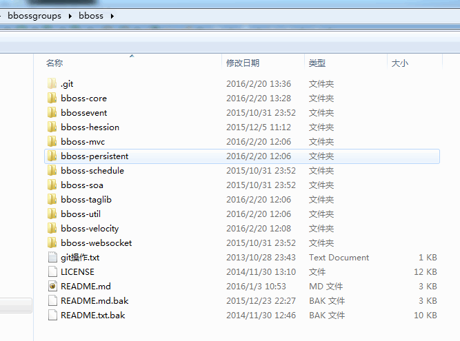

### bboss 4.10.7及更低版本ant构建方法

本文适用bboss 4.10.7及更低版本，4.10.8及后续版本构建请参考文档：[采用gradle构建和发布bboss方法介绍](http://yin-bp.iteye.com/blog/2295166)

**基于bboss开发项目说明**

要做简单的demo，请参考文档
http://yin-bp.iteye.com/blog/1026261

正儿八经的做项目，参考文档搭bboss平台开发环境：
http://yin-bp.iteye.com/blog/2230399

bboss自动代码生成工具使用指南：
http://yin-bp.iteye.com/blog/2256948
    
如需使用bboss中某个模块，那么这个地方可以找到各模块最小依赖eclipse工程，你可以直接在此基础上开启bboss框架开发之旅：
[bboss最佳实践案例](https://github.com/bbossgroups/bestpractice)

**本文适用于bboss 4.10.6及后续版本**

bboss 版本ant构建方法介绍  

**一、bboss各个模块目前采用ant进行构建，构建步骤如下：**

1.安装好jdk（1.7都可以）,并将jdk设置到环境变量中

2.建立根目录，例如：d:/bbossgroups

3.在执行后续所有步骤之前，必须先下载buildtool项目：[buildtool-master.zip](https://codeload.github.com/bbossgroups/buildtool/zip/master)

将下载的压缩包buildtool-master.zip包含的antbuildall和apache-ant-1.7.1拷贝解压到目录：
d:/bbossgroups/buildtool

解压后，d:/bbossgroups/buildtool目录内容如下：

  buildtool中包含了所有bbossgroups中项目的ant构建指令和ant运行环境。

4.构建

我们可以一次性构建所有bbossgroups中的模块，亦可以单独构建每一个模块，下面分别介绍  

 **4.1 一次性全部构建所有bbossgroups中的模块**

需要下载bbossgroups中的以下项目：

[bboss](https://github.com/bbossgroups/bboss/archive/master.zip)

[bigdatas](https://github.com/bbossgroups/bigdatas/archive/master.zip)

[security](https://github.com/bbossgroups/security/archive/master.zip)

[bboss-rpc](https://github.com/bbossgroups/bboss-rpc/archive/master.zip)

[bboss-plugins](https://github.com/bbossgroups/bboss-plugins/archive/master.zip)

[bboss-gencode](https://github.com/bbossgroups/bboss-gencode/archive/master.zip)

[bboss-bestpractice](https://github.com/bbossgroups/bestpractice/archive/master.zip)

[bboss-genproject](https://github.com/bbossgroups/genproject/archive/master.zip)

[bboss-bboss-site](https://github.com/bbossgroups/bboss-site/archive/master.zip)

下载完毕后分别解压，并按照以下目录结构存储：  

然后执行指令：d:/bbossgroups/buildtool/antbuildall/build-all-jdk7.bat

执行完毕后，所有构建出来jar包被放置在d:/bbossgroups/distrib目录下，检查里面的内容包含以下包，说明构建成功：

bboss-core.jar

bboss-security.jar

bboss-security-web.jar

bboss-rpc.jar

bboss-event.jar

bboss-jodconverter-core.jar

bboss-mvc.jar

bboss-soa.jar

bboss-schedule.jar

bboss-velocity.jar

bboss-wordpdf.jar

bboss-hessian.jar

ditchnet-tabs-taglib.jar

frameworkset.jar

frameworkset-pool.jar

frameworkset-util.jar

jgroups.jar

构建完毕后会同步更新其他模块下引用的包为最新版本。关于这些文件的详细说明请参考文章《[bboss框架发布的jar包和依赖jar包概览](http://yin-bp.iteye.com/blog/1143994)》

**4.2 单独构建每一个模块**

单独构建某个模块，只需要参考4.1中章节中列出的下载地址，下载对应的模块并解压到d:/bbossgroups/目录下即可，独立模块构建说明如下。  

**4.2.1 bboss核心模块构建**

bboss核心模块最新版本下载地址：[bboss](https://github.com/bbossgroups/bboss/archive/master.zip)

将源码包解压到目录：d:/bbossgroups/bboss

bboss目录内容如下：  

此时可以按以下顺序执行buildtool/antbuildall目录下与核心模块相关的指令，单独构建每个子模块：

build-bboss-velocity.bat

build-bboss-util.bat

build-bboss-soa.bat

build-bboss-core-only.bat

build-bboss-persistent-jdk7.bat

build-bboss-mvc-only-noresources.bat

build-bboss-taglib.bat

build-bboss-event-only.bat

build-bboss-hessian.bat

build-bboss-schedule.bat

发布的jar包含在每个子工程目录的distrib目录中，例如：

d:\bbossgroups\bboss\bboss-core\distrib

构建完毕后会同步更新其他模块下引用的包为最新版本。

  **4.2.2 bboss会话共享模块构建**

bboss会话共享模块最新版本下载地址：[security](https://github.com/bbossgroups/security/archive/master.zip)

将源码包解压到目录：d:/bbossgroups/security

security目录内容如下：
  

此时可以按以下顺序执行buildtool/antbuildall目录下与会话共享模块相关的指令，单独构建每个子模块：

build-bboss-security.bat

build-bboss-security-web.bat

发布的jar包含在每个子工程目录的distrib目录中，例如：

d:\bbossgroups\security\bboss-security\distrib

构建完毕后会同步更新其他模块下引用的包为最新版本。

  **4.2.3 bboss bigdatas大数据抽取工具构建**

bboss bigdatas大数据抽取工具最新版本下载地址：[bigdatas](https://github.com/bbossgroups/bigdatas/archive/master.zip)

将源码包解压到目录：d:/bbossgroups/bigdatas

bigdatas目录内容如下：

    

此时可以按以下顺序执行buildtool/antbuildall目录下与大数据抽取工具构建指令：

build-bboss-bigdata.bat

发布的jar包含在每个子工程目录的distrib目录中，例如：

d:\bbossgroups\bigdatas\bigdata\distrib

构建完毕后会同步更新其他模块下引用的包为最新版本。  

**4.2.4 bboss rpc模块构建**

bboss rpc模块最新版本下载地址：[bboss-rpc](https://github.com/bbossgroups/bboss-rpc/archive/master.zip)

将源码包解压到目录：d:/bbossgroups/bboss-rpc

bboss-rpc目录内容如下：  

此时可以执行buildtool/antbuildall目录下与RPC模块构建指令：

build-bboss-rpc-only.bat

发布的jar包含在每个子工程目录的distrib目录中，例如：

d:\bbossgroups\bboss-rpc\distrib

构建完毕后会同步更新其他模块下引用的包为最新版本。  

**4.2.5 bboss plugins模块构建**

bboss plugins模块最新版本下载地址：[bboss-plugins](https://github.com/bbossgroups/bboss-plugins/archive/master.zip)

将源码包解压到目录：d:/bbossgroups/bboss-plugins

bboss-plugins目录内容如下：
  

此时可以按以下顺序执行buildtool/antbuildall目录下与word插件模块相关的指令，单独构建每个子模块：

build-bboss-jodconverter-core.bat

build-bboss-wordpdf.bat

发布的jar包含在每个子工程目录的distrib目录中，例如：

d:\bbossgroups\bboss-plugins\bboss-jodconverter-core\distrib

构建完毕后会同步更新其他模块下引用的包为最新版本。 

**4.2.6 bboss site（bboss官方网站）构建**

bboss site模块最新版本下载地址：[bboss-site](https://github.com/bbossgroups/bboss-site/archive/master.zip)

将源码包解压到目录：d:/bbossgroups/bboss-site

bboss-site目录内容如下：    

此时可以执行buildtool/antbuildall目录下与bboss官方网站构建指令：

build-bboss-site.bat

发布的jar和war包含在工程目录的distrib目录中，例如：

d:\bbossgroups\bboss-site\distrib

**4.2.7 bboss gencode自动代码生成工具构建**

bboss gencode模块最新版本下载地址：[bboss-gencode](https://github.com/bbossgroups/bboss-gencode/archive/master.zip)

将源码包解压到目录：d:/bbossgroups/bboss-gencode

bboss-gencode目录内容如下：    

此时可以执行d:/bbossgroups/bboss-gencode目录下与自动代码生成工具构建指令：

build.bat

发布的jar和war包含在工程目录的distrib目录中，例如：

d:\bbossgroups\bboss-gencode\distrib  

**4.2.8 bboss genproject（bboss平台开发环境搭建工具）构建**

bboss genproject模块最新版本下载地址：[genproject](https://github.com/bbossgroups/genproject/archive/master.zip)

将源码包解压到目录：d:/bbossgroups/genproject

genproject目录内容如下：  

此时可以执行d:/bbossgroups/genproject目录下与生成平台开发工程工具构建指令：

build.bat

发布的jar和war包含在工程目录的distrib目录中，例如：

d:\bbossgroups\genproject\distrib

bboss独立模块（子模块）目录功能说明及单独ant构建（不更新依赖工程引用包）方法请参考文档：[bboss工程目录结构及功能说明](http://yin-bp.iteye.com/blog/2142959)

**二、平台bboss框架版本升级指南**

两种升级方法：

**一种从github上下载最新发布版本升级**

最新版本下载地址：https://github.com/bbossgroups/bboss/releases，直接下载其中的bboss-vX.XX.X.zip压缩包并解压，然后安装以下步骤升级  

1.拷贝lib目录下jar文件到应用的WebRoot/WEB-INF/lib目录替换原来的文件

2.如果是平台项目则将【tld for bboss平台】目录下的pager-taglib.tld文件拷贝到应用的WebRoot/WEB-INF/下，替换原来的文件

3.如果是非平台项目则将【tld for bboss】目录下的pager-taglib.tld文件拷贝到应用的WebRoot/WEB-INF/下，替换原来的文件

**一种方法是将构建生成的下述jar包拷贝到平台的WebRoot/WEB-INF/lib目录下替换原来的jar包**：

bboss-core.jar

bboss-security.jar

bboss-security-web.jar

bboss-rpc.jar

bboss-event.jar

bboss-jodconverter-core.jar

bboss-mvc.jar

bboss-soa.jar

bboss-schedule.jar

bboss-velocity.jar

bboss-wordpdf.jar

bboss-hessian.jar

ditchnet-tabs-taglib.jar

frameworkset.jar

frameworkset-pool.jar

frameworkset-util.jar

jgroups.jar