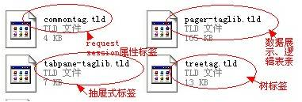
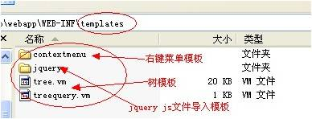

### bbossgroups框架发布的jar包和依赖jar包概览

bbossgroups框架发布的jar包和依赖jar包概览

jar包构建请参考文章《[bboss 版本构建（ant）方法介绍](http://yin-bp.iteye.com/blog/1462842)》

当总的bbossgroups构建指令或者每个子工程的构建bat指令执行成功后，每个子工程目录下都会有个distrib目录，其中包含了每个子模块的jar包和依赖的包资源。

本文介绍bbossgroups框架发布生成的jar清单及依赖的第三方jar包和相关资源。  

1.ioc框架生成的jar包及最小依赖的第三方jar

bboss-core.jar

依赖的第三方jar包

cglib-2.2.jar

frameworkset-util.jar

log4j-1.2.14.jar

bboss-soa.jar  

2.MVC框架生成jar包及依赖的第三方jar包

bboss-mvc.jar

依赖的第三方jar包

frameworkset-pool.jar

bboss-velocity.jar

log4j-1.2.14.jar

jstl-1.2.jar

jakarta-oro-2.0.8.jar

jackson-all-1.6.2.jar

frameworkset-util.jar

frameworkset-pool.jar

frameworkset.jar

ecs-1.4.2.jar

cglib-nodep-2.2.jar

bboss-core.jar

asm-3.1.jar

3.持久层框架jar包及依赖的第三方jar包

frameworkset-pool.jar

依赖的第三方jar包

bboss-core.jar

commons-collections-3.2.1.jar

commons-lang-2.4.jar

frameworkset-util.jar

jakarta-oro-2.0.8.jar

java-uuid-generator-3.1.2.jar    

4.标签库框架jar包及依赖的第三方jar包

frameworkset.jar

ditchnet-tabs-taglib.jar

第三方包参看工程bestpractice\mvc下的工程依赖jar包

5.工具框架jar包

frameworkset-util.jar  

6.对象序列化jar包

bboss-soa.jar

7.标签库需要用到的js文件

/include/pager.js

/include/jquery-1.4.2.min.js

/include/jquery-easyui.js

修复了jquery ajax提交时中文乱码问题

jsp采用gbk编码时，url后带中文参数时会出现乱码问题

Post方法中指定了中文参数时，如果不编码在ie浏览器重会出现乱码问题

经过修改/include/jquery-1.4.2.min.js文件修复了上述问题

8.标签定义文件-tld  

9.标签库对应的模板vm文件

github模板所在的路径：/bboss-tablib/webapp/WEB-INF/classes/templates，需要放到

