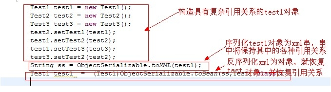
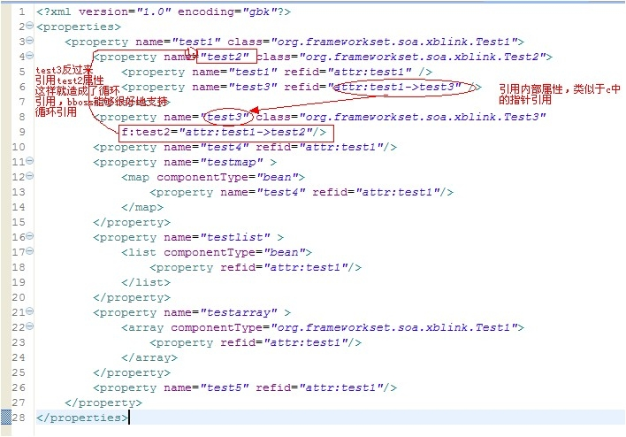

### bboss 序列化机制重大改进-支持复杂对象及对象之间关系序列化和恢复功能

bboss 序列化机制重大改进-支持复杂对象及对象之间关系序列化和恢复功能，支持对象循环引用/自引用关系的序列化和反序列化，在此发文介绍一下这个功能。

首先看一下如何构造一组复杂对象：

Java代码

```java
Test1 test1 = new Test1();  
        Test2 test2 = new Test2();  
        Test3 test3 = new Test3();  
        test2.setTest1(test1);  
        test1.setTest2(test2);  
        test1.setTest3(test3);  
        test3.setTest2(test2);  
```

然后再看看序列化和反序列化操作：

Java代码

```java
String ss = ObjectSerializable.toXML(test1);  
        Test1 test1_ =  (Test1)ObjectSerializable.toBean(ss,Test1.class);  
```

我们看一张图解说明：



我们再看看序列化所产生的报文格式（实际上对应的报文全部采用压缩格式，xml元素名称和属性全部采用缩写格式，以减少数据报文大小），这里采用明文是为了便于阅读，而且给出的是一个更加复杂的对象结构：



现在bboss 的序列化机制已经能够想java的serializable和xtream一样支持各种复杂数据对象了，恢复时，除了能够恢复数据，还能够恢复对象之间的引用关系。

序列化能够支持这个功能，完全依赖于bboss aop框架对对象循环引用依赖注入功能的支持，并且支持配置文件中各种内部对象之间的相互引用，就像c中的指针一样，这个功能也是bbossgroups 3.5中的新特性。  

最新代码已经提交到[github](https://github.com/bbossgroups/bbossgroups-3.5)，哈哈。

也可到以下下载地址：[bbossgroups-3.5](http://www.bbossgroups.com/file/download.htm?fileName=bbossgroups-3.5.zip)

序列化测试用例：[TestSerializable](https://github.com/bbossgroups/bbossgroups-3.5/blob/master/bboss-soa/test/org/frameworkset/soa/xblink/TestSerializable.java)  