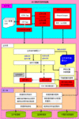

### 开发体系结构-基于bboss 框架开发BS系统的体系结构

bboss项目下载列表 在sourceforge访问地址为：

https://sourceforge.net/projects/bboss/files/

开发体系结构-基于bboss 框架开发BS系统的体系结构：见下图

说明：红色部分表示需要用户自己实现的组件
      绿色部分表示需要用户维护的文件
      其他颜色的组件属于BS平台范畴和系统环境范畴，不需要开发人员实现

