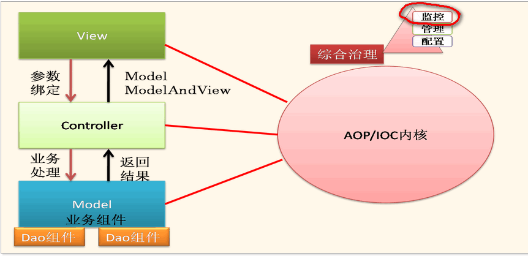
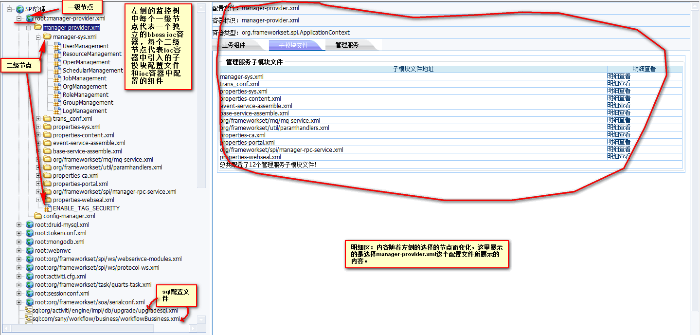
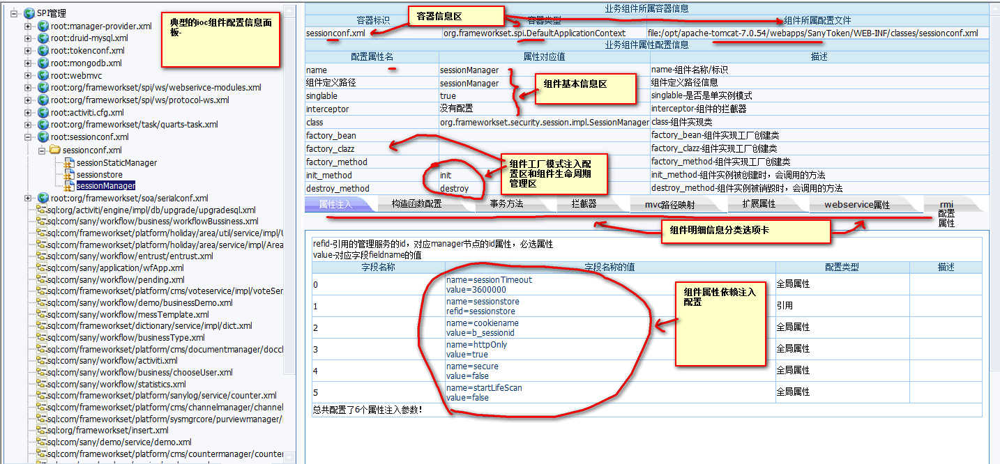
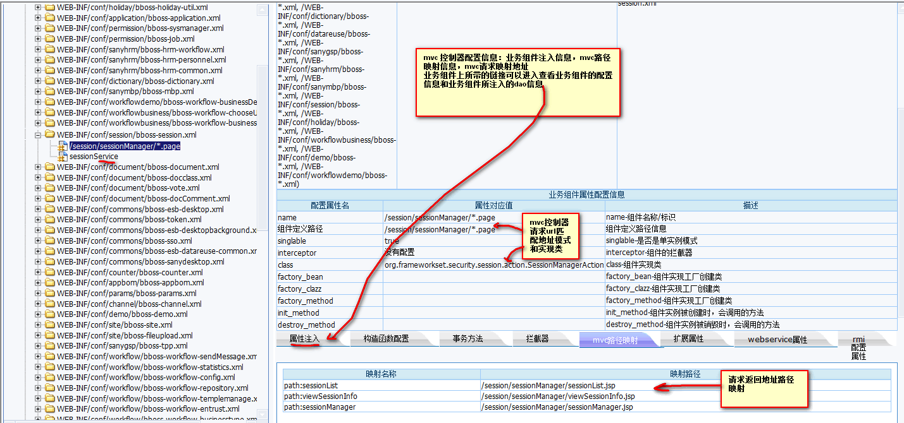
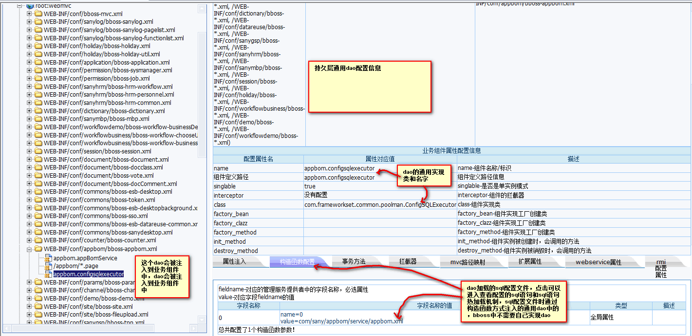
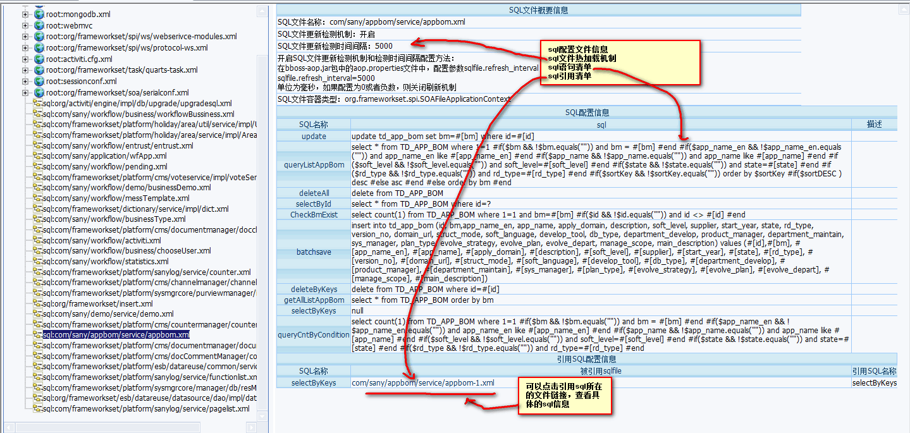
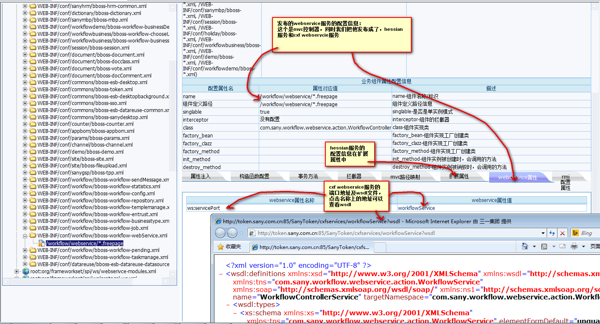
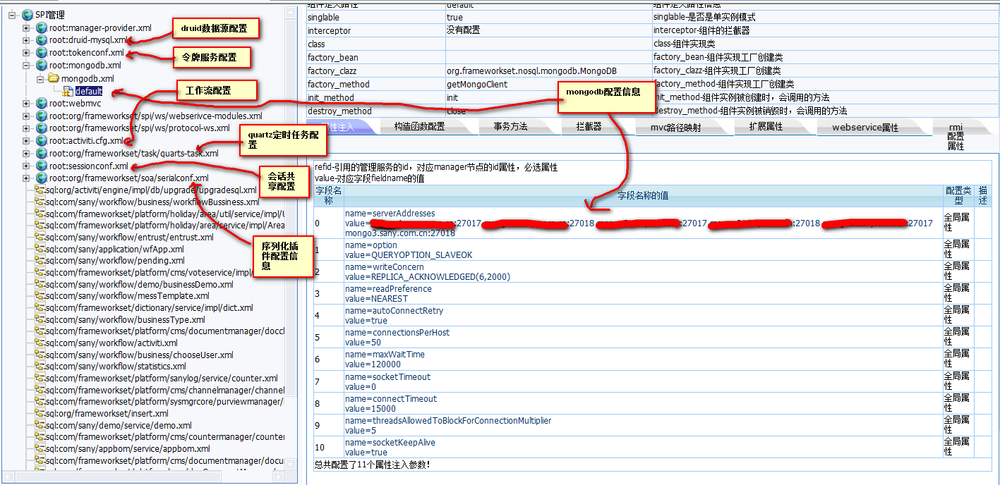

### bboss框架配置监控介绍

监控效果实例：

http://www.bbossgroups.com/monitor/monitor_console.jsp

  ioc配置组件监控和sql配置文件监控效果实例：

http://www.bbossgroups.com/monitor/spiFrame.jsp

如果是你部署的应用访问分别地址为：

http://ip:port/contextpath/monitor/monitor_console.jsp

http://ip:port/contextpath/monitor/monitor/spiFrame.jsp

将其中的ip，port，contextpath替换为你自己的具体值即可。

bboss框架包含很多功能模块，这些模块都是基于统一的内核bboss-core模块开发的，bboss-core中包含了bboss ioc和序列化的核心功能模块。bboss ioc组件采用xml语法进行配置管理，为了便于开发人员查看和管理这些xml配置文件以及方便开发人员分析和解决由配置文件错误导致的一系列问题，为bboss提供了一个简单而有用的监控功能模块：框架配置信息监控模块。以下是bboss配置管理监控模块示意图：  

通过bboss监控功能，可在线查看以下内容：

- 组件xml配置文件信息：包含的组件列表，引入的子模块配置文件清单列表（bboss支持模块化配置管理）

- ioc组件配置信息：组件的基本信息，组件隶属的ioc容器类型信息，组件隶属的xml配置文件路径信息，组件单实例信息，组件工厂配置信息，组件ioc依赖注入属性列表，构造函数注入参数列表，组件声明式事务配置信息，组件拦截器配置信息，组件扩展属性配置信息

- mvc控制器配置信息

- mvc路径映射配置信息

- cxf webservice服务配置信息

- hessian服务配置信息

- rmi服务配置信息

- mongodb服务器配置信息

- activiti工作流引擎配置信息

- quartz任务引擎配置信息

- session共享配置信息

- bboss序列化插件配置信息

- 令牌服务配置信息

- 第三方数据源配置信息（druid,c3p0,proxool等）

- 持久层sql语句配置文件及配置sql信息，持久层sql文件热加载机制信息，引用其他文件中sql配置信息

    以上内容是目前监控模块可以监控的所有内容，基本上涵盖了bboss所有子模块的配置监控，应用系统基于bboss ioc开发的各种功能的相关配置自然也可以在监控模块中看到。

  接下来，我们看看实际监控效果图：

  监控主界面  

组件配置信息查看界面

mvc控制器配置信息监控界面

通用dao配置信息监控界面

sql文件配置信息监控界面

cxf webservice服务，hessian服务监控界面

mongodb、工作流、quartz任务、session会话共享、令牌服务、druid数据源、序列化插件等模块配置信息监控界面

  bboss ioc监控功能的入口页面地址jsp代码：

https://github.com/bbossgroups/bbossgroups-3.5/blob/master/bestpractice/demoproject/WebRoot/monitor/spiFrame.jsp

另外，为了便于查看bboss持久层内置的apache dbcp连接池的使用情况，bboss还提供了连接池的监控功能，请访问文档获取相关内容：

[持久层连接池的监控功能](http://yin-bp.iteye.com/blog/1147333)  