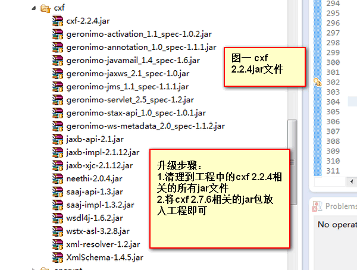
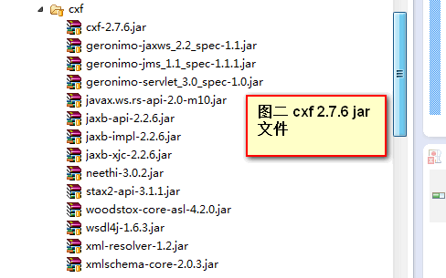
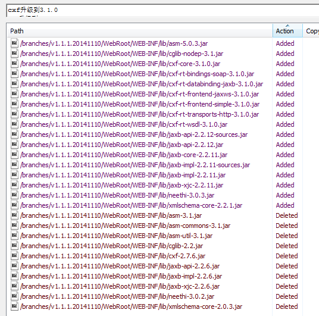

### bboss支持最新的apache cxf v3.1.0

bboss升级cxf到最新的apache cxf 3.1.0版本，本文介绍应用和平台升级cxf引擎的方法。

1.用户首先要升级到bboss框架的最新版本，版本下载和构建方法请参考文档[《bboss项目下载地址》](http://yin-bp.iteye.com/blog/1080824)[《bboss ant构建方法》](http://yin-bp.iteye.com/blog/1462842)

和服务相关的主要包bboss-rpc.jar

2.cxf2.2.4升级到cxf 2.7.6方法

2.1 按照图一所示找出项目的web-inf/lib下与cxf 2.2.4相关的jar文件

  找出这些文件并删除。

2.2 根据图二所示清单将cxf 2.7.6相关的jar文件放入到项目的web-inf/lib目录即可

  

图二中包含的geronimo-servlet_3.0_spec-1.0.jar包是不需要的，不能放入web-inf/lib目录，这些包可以在以下目录找到：
https://github.com/bbossgroups/bestpractice/tree/master/bboss-clientproxy/lib/cxf

 这样升级就算完成了，bboss中的cxf服务发布和客户端测试用例执行全部通过

3.cxf 2.7.6升级到cxf 3.1.0的方法

根据图示添加和删除文件： 

这些新加的包可以在以下目录找到：
https://github.com/bbossgroups/bestpractice/tree/master/bboss-clientproxy/lib/cxf