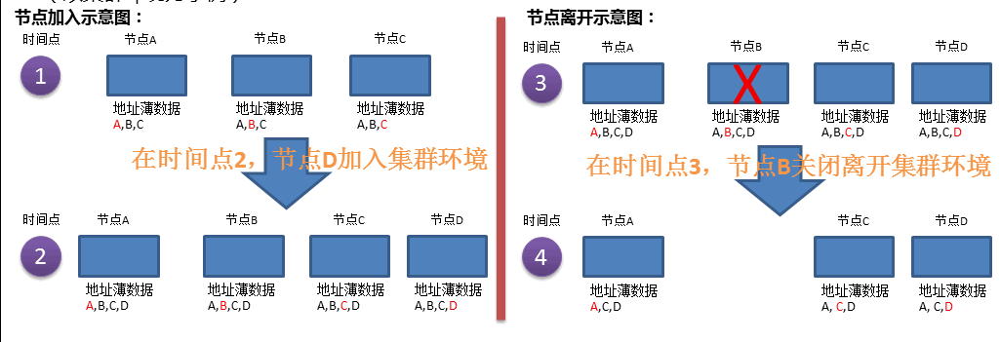

### bboss分布式事件处理框架特性

**1.Bboss分布式事件框架应用场景**

Bboss分布式事件框架可以被应用于集群成员节点之间发送和接收事件，也可以应用于非集群环境应用之间发送和接收事件。

**2.Bboss分布式事件框架特点**

每个事件应用节点在本地都保持和维护了一个远程事件目标地址薄（应用节点Node地址薄），地址薄保持了有效成员地址清单，是动态更新的。基于Jgroups多播协议，当新节点加入集群时，新节点会保持一个包含自己的最新地址薄，同时它的地址也会自动添加到其他节点的地址薄中；当节点关闭或者因为网络原因脱离当前网络时，它的地址将从其他节点的地址薄中剔除。成员自动发现、自动更新,bboss分布式事件框架无形中契合了cluster members管理的机制。因此可以在应用层面，以一种非常简洁高效的方式实现cluster member之间的消息广播和接收处理，譬如实现缓存的同步一致刷新，实现系统数据状态的同步更新等等。地址薄动态管理示意图（以集群环境为示例）：

