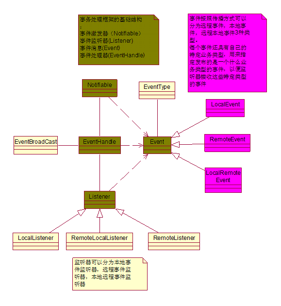
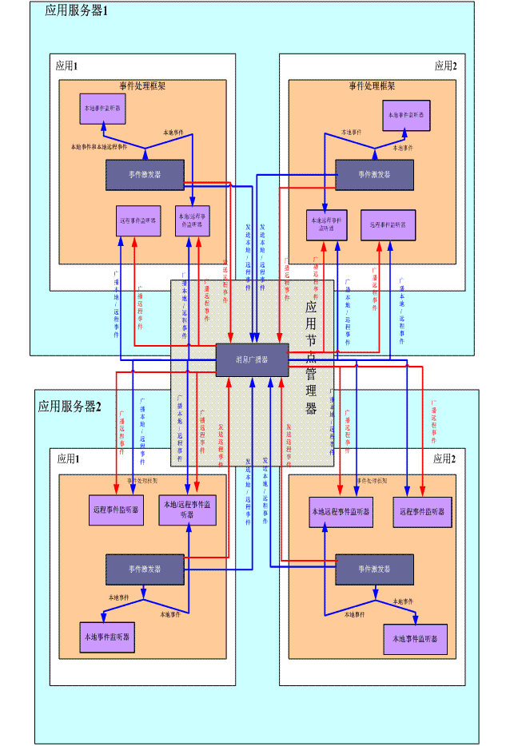

### 事件处理框架

#### 10.1概述

事件处理框架为系统中事件的管理提供了一个简单而灵活的框架，提供本地事件和远程事件的处理功能。

事件处理框架的主要组件和描述见如下的uml图：

- ​         事件激发器是指产生各种类型事件的组件

- ​        事件消息是指包含事件源信息、事件类型、事件广播类型信息的组件

- ​        事件类型是指每个事件消息特定的消息类型比如安全数据变化事件，字典数据变化事件，指定了特定事件类型的事件消息能被所有监听该类型事件的监听器接收并处理。

- ​         事件监听器是指监听并且对监听到的各种事件消息进行处理的组件，根据监听的是本地还是远程事件消息，事件监听器可以分为本地事件监听器（只监听本地和在本地产生的本地远程事件）、本地远程事件监听器（监听本地和通过消息广播器发送的本地远程事件，远程消息）、远程事件监听器（只监听远程事件消息和本地远程消息）；事件监听器在注册时，可以注册感兴趣的事件类型，如果注册了就只监听相应类型的事件，否则监听所有类型的事件。

- ​       事件处理器负责管理已经注册的各种类型的监听器，负责分发事件激发器激发的所有事件消息，如果是远程事件则在远程应用节点之间广播所有的远程事件。

- ​         事件消息广播器负责将远程事件和本地远程事件在集群/多实例应用中的所有应用中传播。

- ​         事件的远程广播通过jgroup控件来实现。

#### 10.2事件传播原理

通过事件处理框架，我们可以在单个应用中传播事件，也可以在多个应用（这些应用可以部署在同一台服务器，也可以部署在多台物理服务器中）中传播事件。远程事件通过应用节点管理器来进行管理和传播。

应用节点管理器能够使多个独立的应用之间有效地通讯，也能使处于集群中的多个应用间进行可高的通讯，详细的介绍请参考集群框架介绍一节。

#### 10.3 事件处理的流程

1. 将事件监听器注册到的事件处理器的监听器队列中

注册时可以指定监听的事件类型列表以及是监听本地事件还是远程事件。注册成功后监听器就开始监听由事件激发器发布的事件消息了。

2. 事件激发器构造不同类型的事件消息，指定事件消息的传播类型（事件消息的传播类型为本地事件、本地远程事件、远程事件），然后将构造好的事件消息发送给事件处理器，再由事件处理器将事件消息分发给相应的事件监听器和事件消息广播器。

3. 事件处理器分发新接收到的事件消息。本地事件只传递给本地事件监听器和本地远程事件传播器，不会通过消息广播器在多个应用节点间传播；本地远程事件除了传递给本地事件监听器外，还会通过消息广播器传递给多个应用节点上的本地远程事件监听器和远程监听器（也包括本地应用节点的远程本地事件监听器）；远程事件通过事件消息广播器传递给远程事件监听器和本地远程事件监听器。

4. 事件监听器监听到与注册事件类型一致的事件消息时，对消息进行相应的处理。这样一个完整的事件处理过程就结束了。

#### 10.4消息传播类型和消息监听器之间的接收关系表

|                    | 本地消息           | 本地远程消息                                                 | 远程消息                                                     |
| ------------------ | ------------------ | ------------------------------------------------------------ | ------------------------------------------------------------ |
| 本地消息监听器     | 接收，只会接收一次 | 接收（只会接收1次）                                          | 不接收                                                       |
| 本地远程消息监听器 | 接收，只会接收一次 | 从消息广播器接收（如果消息广播器不存在，则直接将远程消息发给本地的本地远程消息接收器），只会接收一次 | 从消息广播器接收（如果消息广播器不存在，则直接将远程消息发给本地的本地远程消息接收器） |
| 远程消息监听器     | 不接收             | 从消息广播器接收（如果消息广播器不存在，则直接将远程消息发给本地的本地远程消息接收器），只会接收一次 | 从消息广播器接收接收（如果消息广播器不存在，则直接将远程消息发给本地的远程消息接收器），只会接收一次 |

