# bboss平台部门管理员配置指南

- bboss平台部门管理员配置指南

## **第一部分 为部门分配管理员以及为部门管理员设置权限**

**1.超级管理员登录系统**

admin/123456

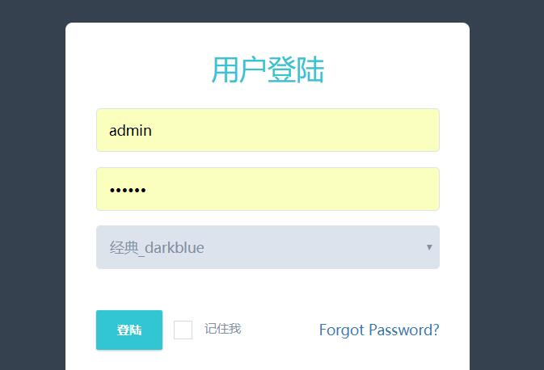

  **2.进入组织管理界面，进入部门列表**

选择部门，进行管理员设置  

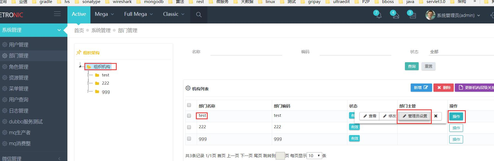

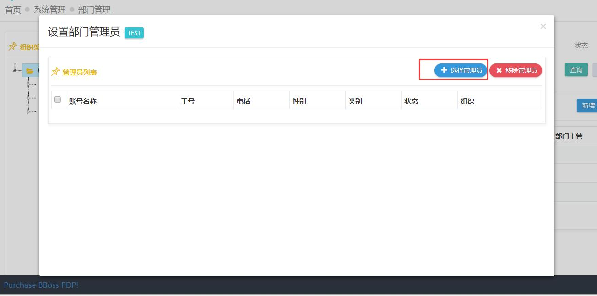

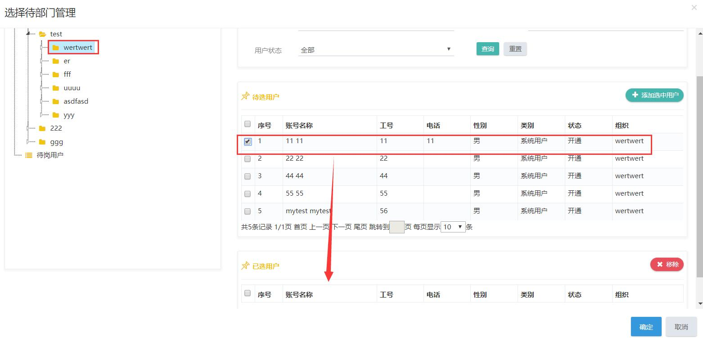

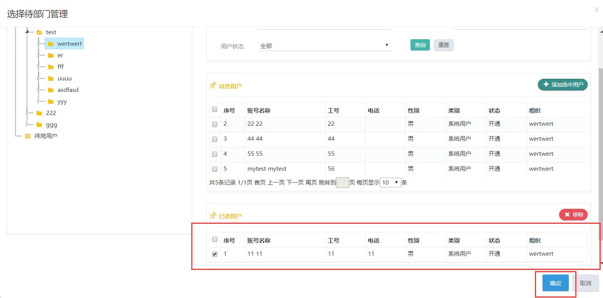

.jpg)

**3.设置部门管理员权限**
进入角色管理为部门管理员模板角色orgmanagerroletemplate设置管理权限

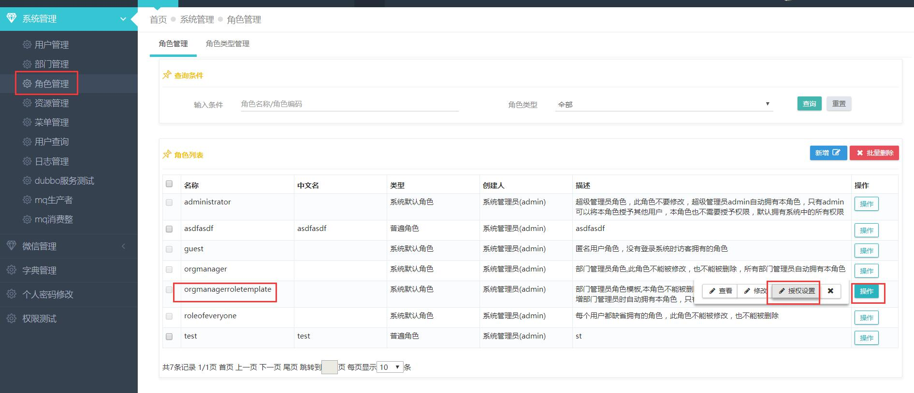

授予用户管理、部门管理菜单权限

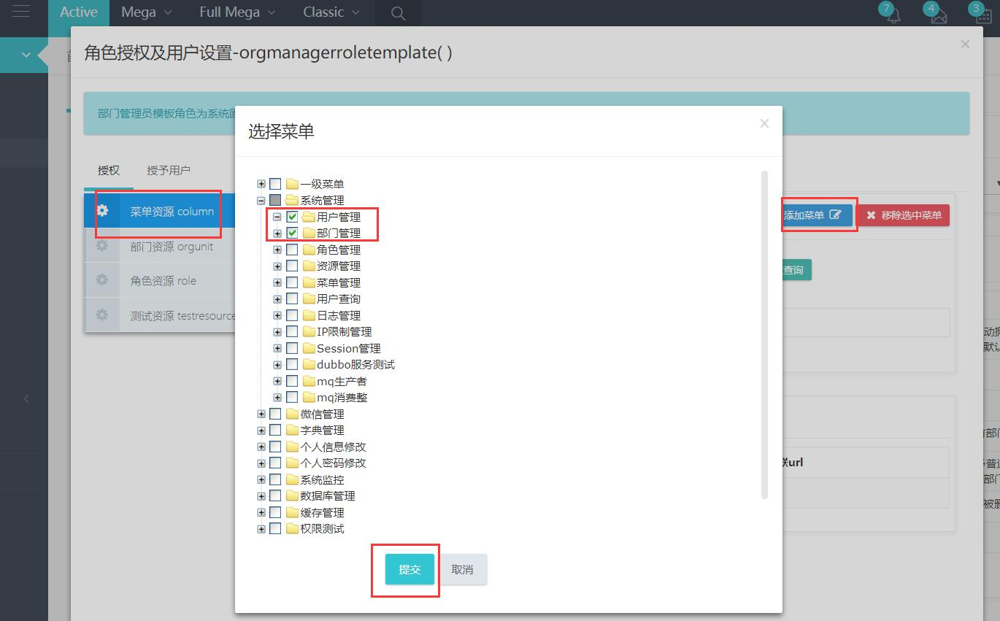

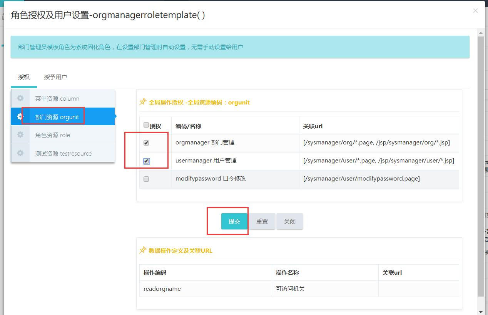

授予用户管理和部门管理、角色授予权限

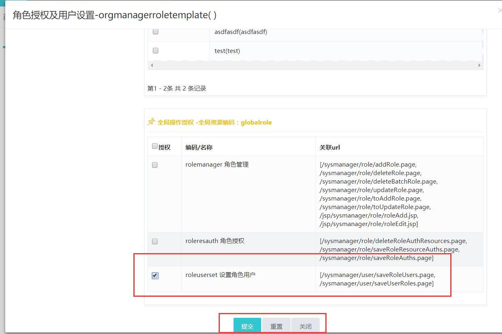

选择部门管理员可以授予的角色

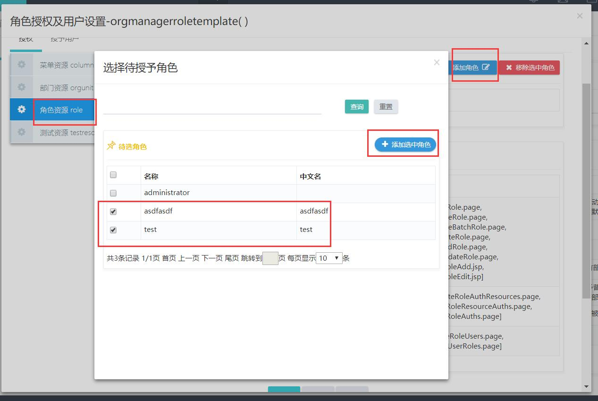

##   **第二部分 部门管理管理用户，为其管理的用户设置角色**

**1 以部门管理员11登录系统**  

**2.新增用户**

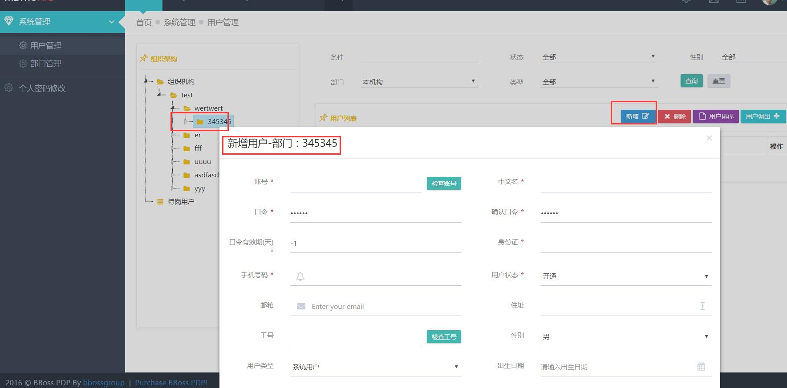

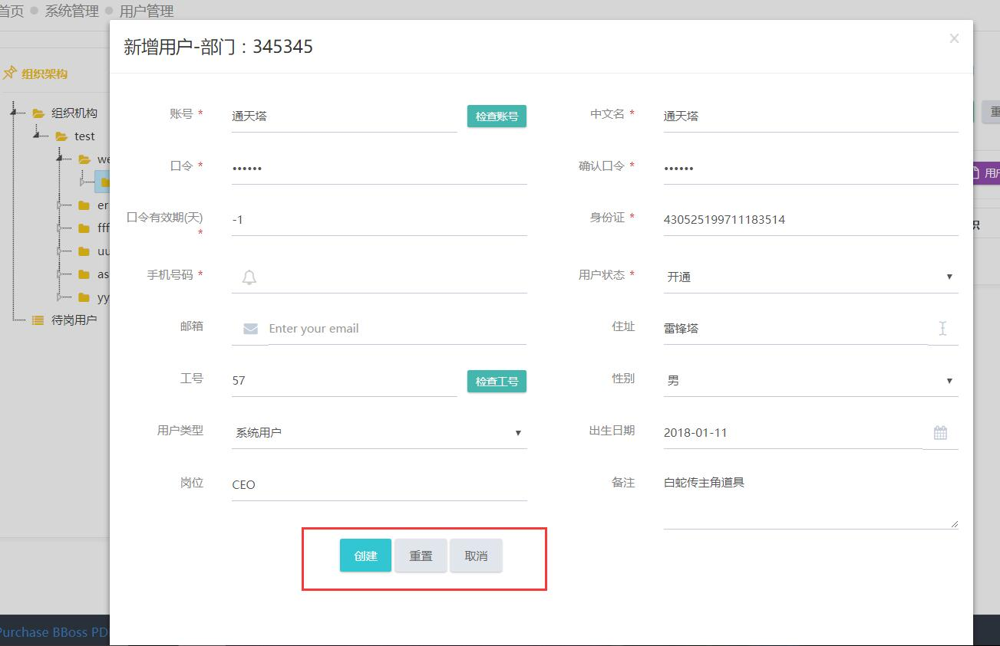

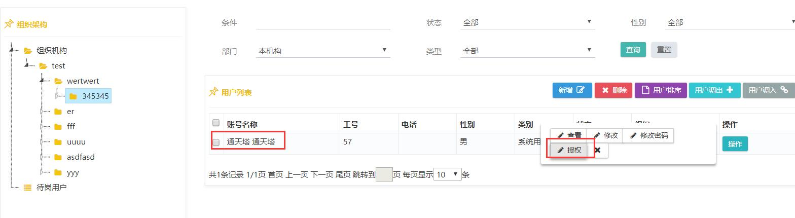

**3.为用户设置角色**

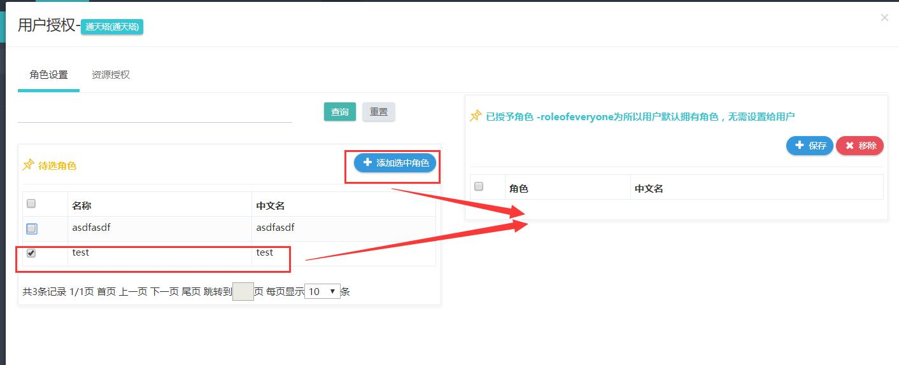

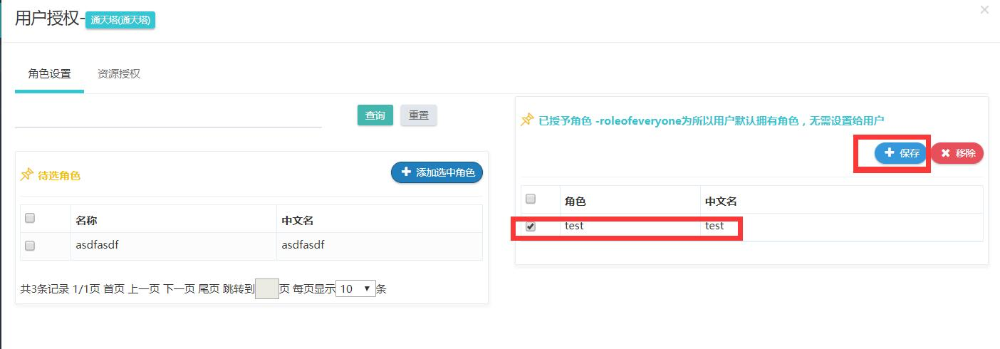

  **相关资料**
[bboss新版开发平台开发环境搭建和代码生成工具使用视频教程](http://yin-bp.iteye.com/blog/2356672)

[bboss快速开发平台介绍](https://my.oschina.net/bboss/blog/1557434)

[bboss自动代码生成工具使用指南](http://yin-bp.iteye.com/blog/2256948)

bboss平台开发交流群：154752521
微信公众号：bbossgroups  

