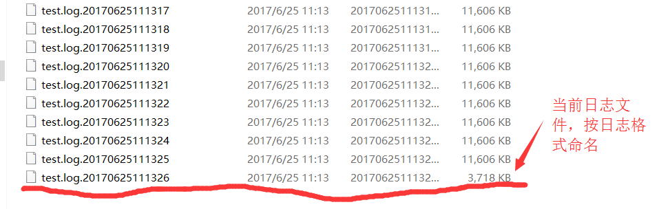

### bboss log4j滚动日志文件扩展插件使用介绍

bboss扩展了log4j滚动切割文件插件org.apache.log4j.NormalRollingFileAppender，NormalRollingFileAppender可以实现按照日期时间格式向前命名滚动的日志文件和当前的日志文件（默认官方滚动插件不支持按日期格式命名当前文件）,同时也可以按照整数索引方式向前命名滚动的日志文件和当前的日志文件（默认官方滚动插件不支持按日期格式命名当前文件），在滚动日志文件的同时，不会重命名已经产生的日志名称（默认插件会重命名）。通过不重命名已有文件和生成新的带日期或者整数索引的日志文件，可以很好地解决logstash、filebeat、flume等日志数据采集工具在日志文件滚动切割的时候，漏掉正在切割文件中的日志数据，因为有可能数据还没采集完，文件已经被重命名了。

在工程中NormalRollingFileAppender引入插件
maven坐标

Xml代码

```xml
<dependency>  
    <groupId>com.bbossgroups.plugins</groupId>  
    <artifactId>bboss-plugin-log4j</artifactId>  
    <version>6.2.3</version>  
</dependency>
```

gradle坐标
Java代码

```java
compile 'com.bbossgroups.plugins:bboss-plugin-log4j:6.2.3'  
```

在log4j.xml文件中配置扩展插件NormalRollingFileAppender
Xml代码 

```xml
<appender name="invoke_log4j" class="org.apache.log4j.NormalRollingFileAppender">  
        <param name="useDatePattern" value="true" />  
        <param name="file" value="test.log" />  
        <param name="append" value="true" />  
        <param name="maxFileSize" value="10MB" />  
        <param name="MaxBackupIndex" value="10"/>  
        <param name="BufferedIO" value="false" />  
        <param name="BufferSize" value="8192" />  
        <layout class="org.apache.log4j.PatternLayout">  
            <param name="ConversionPattern" value="[%d{dd/MM/yy HH:mm:ss:sss z}] %t %5p %c{2}: %m%n" />  
        </layout>  
    </appender>  
  
    <logger name="org.gradle.Invoke" additivity="false">  
        <level value = "info" />  
        <appender-ref ref = "invoke_log4j" />  
    </logger>  
```

注意事项：

useDatePattern参数必须配置在file参数前面，true 日志文件名称采用日期格式 false 采用整数索引格式（默认值）

BufferedIO是否采用缓冲机制，true 采用 false 不采用。

java程序中记录日志：
Java代码

```java
package org.gradle;  
  
import org.junit.Test;  
import org.slf4j.Logger;  
import org.slf4j.LoggerFactory;  
  
public class Invoke {  
/*  private static final Logger servicelog = LoggerFactory.getLogger("servicelog"); 
    private static final Logger weblog = LoggerFactory.getLogger("weblog");*/  
      
    private static final Logger log_invoke = LoggerFactory.getLogger(Invoke.class);  
//  private static final Logger log_httpclientutils = LoggerFactory.getLogger(HttpClientUtils.class);  
  
//    
    @Test  
    public  void log() {  
        long interval = 5l;  
        while(true) {  
          
            log_invoke.info("日志信息");  
          
            if(interval > 0) {  
                try {  
                    Thread.currentThread().sleep(interval);  
                } catch (InterruptedException e) {  
                    e.printStackTrace();  
                }  
            }  
  
        }  
    }     
}  
```

生成的日志文件截图



