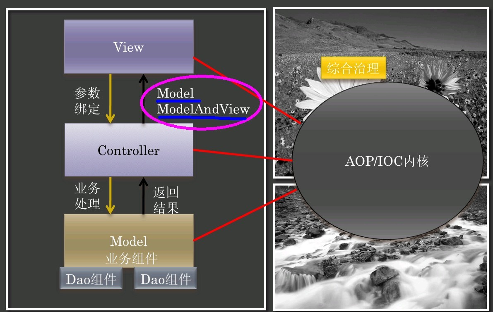

### bboss mvc中ModelMap和ModelAndView的使用方法

bboss mvc中ModelMap和ModelAndView两个对象类似于spring mvc中的ModelMap和ModelAndView对象，本文着重介绍bboss mvc中ModelMap和ModelAndView两个对象的作用和使用方法。这两个对象在bboss mvc架构中所处的位置如下：



**首先介绍ModelMap和ModelAndView的作用**

**ModelMap**

ModelMap对象主要用于传递控制方法处理数据到结果页面，也就是说我们把结果页面上需要的数据放到ModelMap对象中即可，他的作用类似于request对象的setAttribute方法的作用，用来在一个请求过程中传递处理的数据。通过以下方法向页面传递参数：

addAttribute(String key,Object value);

在页面上可以通过el变量方式$key或者bboss的一系列[数据展示标签](http://yin-bp.iteye.com/blog/1136924)获取并展示modelmap中的数据。

modelmap本身不能设置页面跳转的url地址别名或者物理跳转地址，那么我们可以通过控制器方法的返回值来设置跳转url地址别名或者物理跳转地址。

**ModelAndView**

ModelAndView对象有两个作用：

作用一 设置转向地址,如下所示（这也是ModelAndView和ModelMap的主要区别）

ModelAndView view = new ModelAndView("path:ok");

作用二 用于传递控制方法处理结果数据到结果页面，也就是说我们把需要在结果页面上需要的数据放到ModelAndView对象中即可，他的作用类似于request对象的setAttribute方法的作用，用来在一个请求过程中传递处理的数据。通过以下方法向页面传递参数：

addObject(String key,Object value);

在页面上可以通过el变量方式$key或者bboss的一系列[数据展示标签](http://yin-bp.iteye.com/blog/1137674)获取并展示ModelAndView中的数据。  

**作用介绍完了后，接下来介绍使用方法**

**ModelMap**

ModelMap的实例是由bboss mvc框架自动创建并作为控制器方法参数传入，用户无需自己创建。

Java代码

```java
public String xxxxmethod(String someparam,ModelMap model)  
{  
     //省略方法处理逻辑若干  
      //将数据放置到ModelMap对象model中,第二个参数可以是任何java类型  
      model.addAttribute("key",someparam);  
     ......  
     //返回跳转地址  
      return "path:handleok";  
}  
```

**ModelAndView**

ModelAndView的实例是由用户手动创建的，这也是和ModelMap的一个区别。

Java代码

```java
public ModelAndView xxxxmethod(String someparam)  
{  
     //省略方法处理逻辑若干  
      //构建ModelAndView实例，并设置跳转地址  
      ModelAndView view = new ModelAndView("path:handleok");  
      //将数据放置到ModelAndView对象view中,第二个参数可以是任何java类型  
      view.addObject("key",someparam);  
     ......  
     //返回ModelAndView对象view  
      return view;  
}  
```

到此bboss mvc中ModelMap和ModelAndView两个对象的作用和使用方法介绍完毕。