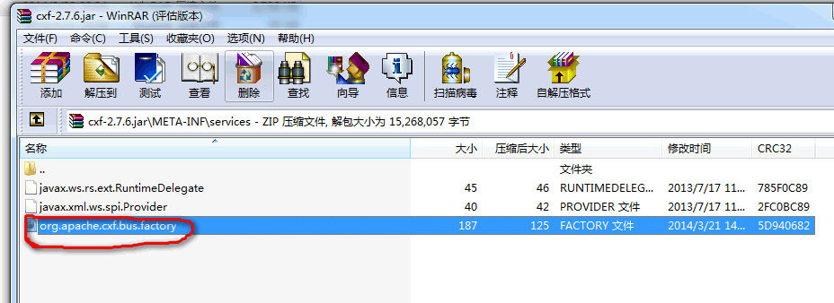

### bboss发布apache cxf 2.7.6服务和定义客户端服务实例可能产生冲突解决办法

bboss发布apache cxf 2.7.6服务和定义客户端服务实例放到一起可能会产生冲突并导致服务发布失败，本文介绍这个冲突的解决办法。

首先介绍一下冲突现象，假设在bboss mvc的xml配置文件中定义一个控制器，并为这个控制器注入通过org.apache.cxf.jaxws.JaxWsProxyFactoryBean创建的一个服务客户端实例：

Xml代码

```xml
<properties>  
   <property name="/salary/*.page" class="org.frameworkset.hrm.SalaryControler"   
      f:salaryService="attr:salaryServiceClient"/>   
   <property name="salaryServiceClient" factory-class="org.apache.cxf.jaxws.JaxWsProxyFactoryBean"   
     factory-method="create" f:serviceClass="org.frameworkset.web.ws.SalaryService"  
     f:address="http://localhost:8080/bboss-mvc/cxfservices/salaryServicePort"/>   
</properties>   
```

同时通过以下配置在bboss mvc中发布一个cxf webservice服务：

Xml代码

```xml
<property name="rpc.webservice.RPCCall"  
  singlable="true"  
  ws:servicePort="RPCCallServicePort"  
class="org.frameworkset.spi.remote.webservice.RPCCall"/>   
```

由于bboss mvc在发布webservice服务之前会先加载所有的mvc 控制器，这样就会先通过org.apache.cxf.jaxws.JaxWsProxyFactoryBean创建salaryServiceClient客户端实例，同时也会调用org.apache.cxf.BusFactory实现类创建cxf的服务总线org.apache.cxf.Bus的实例，cxf 2.7.6 jar包默认配置了Spring提供的BusFactory子类，bboss中并没有引入Spring的BusFactory子类，肯定创建不起来，所以会导致服务客户端salaryServiceClient创建失败，由于BusFactory只会创建一次，所以即使后续bboss在发布cxf服务强制指定了cxf默认提供的类org.apache.cxf.bus.CXFBusFactory，也无法将服务正确地发布到cxf引擎中。

为了解决上述问题，只需要修改cxf-2.7.6.jar包中META-INF\services目录中的文件

org.apache.cxf.bus.factory内容为：

Java代码

```java
org.apache.cxf.bus.CXFBusFactory  
```



即可（org.apache.cxf.bus.CXFBusFactory是cxf默认提供的org.apache.cxf.BusFactory实现类）。同时，对bboss发布cxfwebservice服务机制进行改进，在加载所有mvc控制器之前先发布cxf webservice服务。这样上述的冲突就得到彻底解决。

参考文档：
[bbossgroups webservice引擎使用方法](http://bbossgroups.group.iteye.com/group/wiki/3091-webservice-bboss-aop)