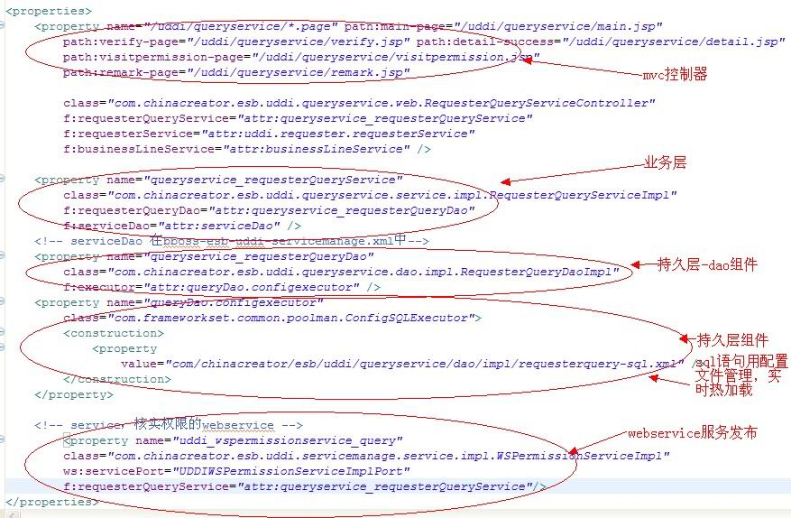

### bbossgroups 开发系列文章之一 最佳实践

  **一、概述**

所谓最佳实践，就是将采用bbossgroups框架体系开发业务系统的一个最佳的实现方式介绍给大家，本最佳实践包含以下内容：  



本文基本功能点如下：

1.bboss mvc框架基础配置

2.bboss mvc控制器配置文件

3.数据库访问组件及sql语句配置文件

4.dao组件管理及注入数据库访问组件

5.业务组件管理及注入dao组件

6.业务开发前台和后台衔接的粘合剂-mvc控制器，注入业务组件

7.附带介绍一下jsp页面的内容

8.bboss mvc请求分派器及url映射配置

9.bboss mvc参数编码过滤器配置

下面详细介绍各个部分。  

**1.bboss mvc框架基础配置**

bboss mvc框架基础配置，主要介绍bboss-mvc.xml文件的配置内容，bboss-mvc.xml是bboss mvc框架的系统配置文件，一般开发人员无需关心。详细介绍请参考博客文章：

《bboss mvc基础配置介绍》http://yin-bp.iteye.com/blog/1139608  

**2.bboss mvc控制器配置文件**

本节介绍mvc框架的一个典型的控制器配置文件的内容：

Xml代码

```xml
<properties>  
    <property name="/uddi/requester/*.page"  
        path:main="/uddi/requester/main.jsp"  
        path:add-requester="/uddi/requester/addRequester.jsp"  
        path:edit-requester="/uddi/requester/editRequester.jsp"  
        path:query-requester="/uddi/requester/RequesterListInfo.jsp"  
        class="com.chinacreator.esb.uddi.requester.web.RequesterController"  
        f:fuzzySearch="true" f:requesterService="attr:uddi.requester.requesterService"  
        f:businessLineService="attr:businessLineService"/>  
      
    <property name="uddi.requester.requesterService"  
        class="com.chinacreator.esb.uddi.requester.service.impl.RequesterServiceImpl" f:requesterDao="attr:uddi.requester.requesterDao"/>  
      
    <property name="uddi.requester.requesterDao"  
        class="com.chinacreator.esb.uddi.requester.dao.impl.RequesterDaoImpl" f:executor="attr:uddi.requester.Configexecutor"/>  
      
    <property name="uddi.requester.Configexecutor"  
        class="com.frameworkset.common.poolman.ConfigSQLExecutor">  
        <construction>  
            <property value="com/chinacreator/esb/uddi/requester/dao/impl/sqlfile.xml"/>  
        </construction>  
    </property>  
</properties>  
```

从文件内容可以看出控制器配置文件中包含四大部分内容：

1.控制器配置（url映射规则，跳转路径配置，依赖的业务组件配置）

2.业务组件配置（组件及组件依赖的dao组件的配置）

3.dao组件的配置（dao组件及持久层操作对象配置）

4、持久层组件配置（持久层组件及组件引用的sql文件路径配置）

这四部分内容基本上郎阔了当今企业信息系统开发的各个方面，表示层，控制层，业务层，持久层。从这里也可以看出bbossgroups为企业j2ee项目架构提供了完整的解决方案，它通过aop/ioc、mvc将各个层面很好地编织起来，下面的章节会逐个介绍每部分，我们从持久层开始介绍。  

**3.数据库访问组件及sql语句配置文件**

数据库访问组件及注入dao组件，下面的配置声明了一个com.frameworkset.common.poolman.ConfigSQLExecutor组件名字叫uddi.requester.Configexecutor:

Xml代码

```xml
<property name="uddi.requester.Configexecutor"    
    class="com.frameworkset.common.poolman.ConfigSQLExecutor">    
    <construction>    
        <property value="com/chinacreator/esb/uddi/requester/dao/impl/sqlfile.xml"/>    
    </construction>    
</property>   
```

dao组件通过名称uddi.requester.Configexecutor来注入和引用该组件。这个持久组件配置了一个sql文件：

com/chinacreator/esb/uddi/requester/dao/impl/sqlfile.xml

非常明显我们将sql语句配置在了一个xml文件中，我们来看看这个文件的内容，其实配置文件中我们用key和value的方式管理sql语句，我们在dao中通过key来引用每个sql语句。在开发环境可以将这个sql文件配置为热加载，即修改后不用重启应用服务器就生效，sqlfile.xml文件内容如下：

Xml代码

```xml
<?xml version="1.0" encoding="UTF-8"?>  
  
<properties>  
    <property name="getRequesterDaoListInfo">  
        <![CDATA[ 
            select r.*, o.ORG_NAME as service_requester_org_name from TD_ESB_REQUESTER r left join TD_SM_ORGANIZATION o  
             on r.SERVICE_REQUESTER_ORG = o.ORG_ID 
             where 1=1 
            #if($service_requester_code && !$service_requester_code.equals("")) 
             and SERVICE_REQUESTER_CODE = #[service_requester_code] 
            #end 
            #if($service_requester_account && !$service_requester_account.equals("")) 
             and SERVICE_REQUESTER_ACCOUNT like #[service_requester_account] 
            #end 
            #if($service_requester_name && !$service_requester_name.equals("")) 
             and SERVICE_REQUESTER_NAME like #[service_requester_name] 
            #end 
            #if($service_requester_org && !$service_requester_org.equals("")) 
             and SERVICE_REQUESTER_ORG = #[service_requester_org] 
            #end 
             
            order by create_time desc 
        ]]>  
    </property>  
    <property name="delete">  
        <![CDATA[ 
            delete from TD_ESB_REQUESTER where SERVICE_REQUESTER_ID = ? 
        ]]>  
    </property>  
    <property name="findObjectById">  
        <![CDATA[ 
            select r.*, o.ORG_NAME as service_requester_org_name from TD_ESB_REQUESTER r left join TD_SM_ORGANIZATION o  
             on r.SERVICE_REQUESTER_ORG = o.ORG_ID where SERVICE_REQUESTER_ID = ? 
        ]]>  
    </property>  
    <property name="insert">  
        <![CDATA[ 
            insert into TD_ESB_REQUESTER(ADDRESS ,BUSINESS_LINE_CODE ,CONTACT ,CREATE_TIME ,CREATOR ,EMAIL ,MODIFIER ,MODIFY_TIME ,PHONE ,SERVICE_REQUESTER_ACCOUNT ,SERVICE_REQUESTER_DESP ,SERVICE_REQUESTER_ID ,SERVICE_REQUESTER_NAME ,SERVICE_REQUESTER_ORG ,SERVICE_REQUESTER_PASSWORD ,USED_FLAG) values(#[address] ,#[business_line_code] ,#[contact] ,#[create_time] ,#[creator] ,#[email] ,#[modifier] ,#[modify_time] ,#[phone] ,#[service_requester_account] ,#[service_requester_desp] ,#[service_requester_id] ,#[service_requester_name] ,#[service_requester_org] ,#[service_requester_password] ,#[used_flag]) 
        ]]>  
    </property>  
    <property name="update">  
        <![CDATA[ 
            update TD_ESB_REQUESTER set ADDRESS=#[address] ,BUSINESS_LINE_CODE=#[business_line_code] ,CONTACT=#[contact] ,EMAIL=#[email] ,MODIFIER=#[modifier] ,MODIFY_TIME=#[modify_time] ,PHONE=#[phone] ,SERVICE_REQUESTER_ACCOUNT=#[service_requester_account] ,SERVICE_REQUESTER_DESP=#[service_requester_desp] ,SERVICE_REQUESTER_ID=#[service_requester_id] ,SERVICE_REQUESTER_NAME=#[service_requester_name] ,SERVICE_REQUESTER_ORG=#[service_requester_org] ,SERVICE_REQUESTER_PASSWORD=#[service_requester_password] where SERVICE_REQUESTER_ID = #[service_requester_id] 
        ]]>  
    </property>  
    <property name="updateFlag">  
        <![CDATA[ 
            update TD_ESB_REQUESTER set USED_FLAG = #[used_flag], Modifier = #[modifier], Modify_time = #[modify_time]  
            where SERVICE_REQUESTER_ID = #[service_requester_id] 
        ]]>  
    </property>     
      
</properties>  
```

另外文件中的sql语句包含了模板sql（带#[service_requester_id]形态变量的sql语句）、动态sql（带逻辑判断的sql，#if(）#end），预编译sql（带?号占位符的sql），最终持久层全部采用预编译方式执行这些sql语句。

需要说明的是，bbossgroups 3.x 中sql文件的刷新机制配置在bboss-aop.jar的aop.properties文件中，为<0时，将屏蔽刷新功能：
sqlfile.refresh_interval=5000  

**4.dao组件管理及注入数据库访问组件**

dao组件管理及注入数据库访问组件 本节内容介绍dao组件的配置和代码，以及其如何通过注入方式引用上节中配置的持久层组件

uddi.requester.Configexecutor

首先看配置：

Xml代码

```xml
<property name="uddi.requester.requesterDao"  
        class="com.chinacreator.esb.uddi.requester.dao.impl.RequesterDaoImpl" f:executor="attr:uddi.requester.Configexecutor"/>  
```

配置非常简单，指定了dao组件的名字uddi.requester.requesterDao（我们将通过这个名称将dao组件注入到业务组件中），实现类com.chinacreator.esb.uddi.requester.dao.impl.RequesterDaoImpl以及指定了属性executor的值attr:uddi.requester.Configexecutor，这是一个引用，引用uddi.requester.Configexecutor对应的数据库组件。

然后我们看看dao组件的实现类，从中我们可以看出dao中的方法是怎样通过ConfigSQLExecutor来操作访问数据库的：

Java代码

```java
package com.chinacreator.esb.uddi.requester.dao.impl;  
  
  
  
import java.util.UUID;  
  
import com.chinacreator.esb.datareuse.util.Constants;  
import com.chinacreator.esb.uddi.requester.dao.RequesterDao;  
import com.chinacreator.esb.uddi.requester.entity.Requester;  
import com.frameworkset.common.poolman.ConfigSQLExecutor;  
import com.frameworkset.util.ListInfo;  
  
public class RequesterDaoImpl implements RequesterDao {  
      
    private static String dbName = Constants.DATAREUSE_DBNAME;  
      
    private ConfigSQLExecutor executor;  
      
  
    public ConfigSQLExecutor getExecutor() {  
        return executor;  
    }  
  
    public void setExecutor(ConfigSQLExecutor executor) {  
        this.executor = executor;  
    }  
  
    public ListInfo getRequesterDaoListInfo(String sortKey, boolean desc,  
            long offset, int pagesize, Requester queryCondObj) throws Exception {  
        // TODO Auto-generated method stub  
        return executor.queryListInfoBeanWithDBName(Requester.class,   
                dbName, "getRequesterDaoListInfo", offset, pagesize, queryCondObj);  
    }  
  
    public void delete(String id) throws Exception {  
        // TODO Auto-generated method stub  
        String delId = (String)id;  
        executor.deleteByKeysWithDBName(dbName, "delete", delId);  
  
    }  
  
    public Requester findObjectById(String id) throws Exception {  
        // TODO Auto-generated method stub  
        String findId = (String)id;  
        Requester requester = executor.queryObjectWithDBName(Requester.class, dbName, "findObjectById", findId);  
        return requester;  
    }  
  
    public void insert(Requester obj) throws Exception {  
        // TODO Auto-generated method stub  
        if(obj.getService_requester_id()== null||obj.getService_requester_id().equals("")){  
            obj.setService_requester_id(UUID.randomUUID().toString());}  
        executor.insertBean(dbName, "insert", obj);  
    }  
  
    public void update(Requester obj) throws Exception {  
        // TODO Auto-generated method stub  
        executor.updateBean(dbName, "update", obj);  
    }  
      
    public void updateFlag(Requester obj) throws Exception {  
        // TODO Auto-generated method stub  
        executor.updateBean(dbName, "updateFlag", obj);  
    }  
  
}  
```

其中我们可以看到dao在利用executor执行数据库增删改查操作时，每个操作的参数分为3部分，一部分时dbName，指定操作针对poolman.xml文件中配置的数据源datasource的名称dbname的值，第二部分就是我们在sql文件中配置的sql语句对应的名称，第三部分就是相应操作需要的业务参数。其实还有可选的一部分就是分页参数，例如：

return executor.queryListInfoBeanWithDBName(Requester.class,dbName, "getRequesterDaoListInfo", offset, pagesize, queryCondObj);
中的offset,pagesize两个分别代表了分页查询的记录起始位置和每页最多返回的记录数。

补充一下dbname的在数据源配置文件poolman.xml文件（该文件一般部署于classes目录下）中是怎么配置的：

Xml代码 

```xml
<?xml version="1.0" encoding="gb2312"?>  
  
<poolman>  
  
    
  
<datasource>  
  
    <dbname>bspf</dbname>  
    <loadmetadata>false</loadmetadata>  
    <jndiName>jdbc/mysql-ds</jndiName>  
    <driver>oracle.jdbc.driver.OracleDriver</driver>  
      
     <url>jdbc:oracle:thin:@172.16.25.219:1521/orcl</url>        
    <username>esb</username>  
    <password>esb</password>  
  
   .........  
  
  </datasource>  
    
  <datasource external="true">  
    <dbname>datareuse</dbname>  
    <externaljndiName>jdbc/mysql-ds</externaljndiName>  
    <showsql>true</showsql>  
  </datasource>  
    
</poolman>  
```

更加详细的配置请参考文章《[bbossgroups持久层框架数据源配置文件实例](http://yin-bp.iteye.com/blog/1112892)》

**5.业务组件管理及注入dao组件**

业务组件管理及注入dao组件，本节讲解业务组件配置部分的内容：

Xml代码

```xml
<property name="uddi.requester.requesterService"  
        class="com.chinacreator.esb.uddi.requester.service.impl.RequesterServiceImpl" f:requesterDao="attr:uddi.requester.requesterDao"/  
```

业务组件配置和dao组件配置差不多，首先是业务组件的名字uddi.requester.requesterService（该名称用来作为控制器引用业务组件的名称），组件的实现类com.chinacreator.esb.uddi.requester.service.impl.RequesterServiceImpl，该业务组件引用的dao组件requesterDao，attr:uddi.requester.requesterDao，这里引用的就是上节中介绍的dao组件，我们可以看看业务组件是怎么通过dao来完成具体的业务操作的：

Java代码 

```java
package com.chinacreator.esb.uddi.requester.service.impl;  
  
import com.chinacreator.esb.uddi.requester.dao.RequesterDao;  
import com.chinacreator.esb.uddi.requester.entity.Requester;  
import com.chinacreator.esb.uddi.requester.service.RequesterService;  
import com.frameworkset.util.ListInfo;  
  
public class RequesterServiceImpl implements RequesterService {  
      
    private RequesterDao requesterDao;    
      
      
    public RequesterDao getRequesterDao() {  
        return requesterDao;  
    }  
  
    public void setRequesterDao(RequesterDao requesterDao) {  
        this.requesterDao = requesterDao;  
    }  
      
  
    public void insertRequester(Requester obj) throws Exception {  
        // TODO Auto-generated method stub  
        requesterDao.insert(obj);  
    }  
  
    public void updateRequester(Requester obj) throws Exception {  
        // TODO Auto-generated method stub  
        requesterDao.update(obj);  
    }  
      
    public void updateRequesterFlag(Requester obj) throws Exception {  
        // TODO Auto-generated method stub  
        requesterDao.updateFlag(obj);  
    }  
  
    public void deleteRequester(String id) throws Exception {  
        // TODO Auto-generated method stub  
        requesterDao.delete(id);  
    }  
  
    public Requester findRequesterById(String id) throws Exception {  
        // TODO Auto-generated method stub  
        return requesterDao.findObjectById(id);  
    }  
  
    public ListInfo getRequseterListInfo(String sortKey, boolean desc,  
            long offset, int pagesize, Requester req) throws Exception {  
        // TODO Auto-generated method stub  
        return requesterDao.getRequesterDaoListInfo(sortKey, desc, offset, pagesize, req);  
    }  
  
}  
```

业务组件的内容再简单不过，这里无需多说，我们直接看下节mvc如何使用业务组件来完成前端请求处理，并调整到结果处理页面的。

**6.业务开发前台和后台衔接的粘合剂-mvc控制器，注入业务组件**

业务开发前台和后台衔接的粘合剂-mvc控制器 ，介绍控制器是如何承前启后地完成一个完整的业务处理请求的。

首先我们来看看mvc控制的的配置部分：

Xml代码

```xml
<property name="/uddi/requester/*.page"  
    path:main="/uddi/requester/main.jsp"  
    path:add-requester="/uddi/requester/addRequester.jsp"  
    path:edit-requester="/uddi/requester/editRequester.jsp"  
    path:query-requester="/uddi/requester/RequesterListInfo.jsp"  
    class="com.chinacreator.esb.uddi.requester.web.RequesterController"  
    f:fuzzySearch="true" f:requesterService="attr:uddi.requester.requesterService"  
    f:businessLineService="attr:businessLineService"/>  
```

这个配置非常简洁（bbossgroups aop框架配置简洁的优良特质得以充分体现），也非常直观，配置可以大致分为以下部分：

1.控制url映射规则/uddi/requester/.page，这个规则可以让前端请求精确匹配到具体的控制器，代表将控制器实现类中的所有业务方法开放接收前台提交请求。

2.控制方法跳转地址配置

Xml代码

```xml
path:main="/uddi/requester/main.jsp"  
        path:add-requester="/uddi/requester/addRequester.jsp"  
        path:edit-requester="/uddi/requester/editRequester.jsp"  
        path:query-requester="/uddi/requester/RequesterListInfo.jsp"  
```

我们把控制器节点上的path:前缀的属性当成是跳转页面地址配置，而把f:开头的属性作为控制组件的属性注入参数来处理

3.控制器类配置class="com.chinacreator.esb.uddi.requester.web.RequesterController"

4.需要注入到控制器的业务组件和其他属性配置：

Xml代码

```xml
f:fuzzySearch="true" f:requesterService="attr:uddi.requester.requesterService"  
        f:businessLineService="attr:businessLineService"  
```

好，我们来具体看看控制器类得代码吧（辛苦了，呵呵），控制器类得实现也很简单：

Java代码

```java
package com.chinacreator.esb.uddi.requester.web;  
  
import java.io.IOException;  
import java.io.UnsupportedEncodingException;  
import java.sql.Timestamp;  
import java.util.Date;  
import java.util.List;  
  
import javax.servlet.http.HttpServletRequest;  
import javax.servlet.http.HttpServletResponse;  
  
import org.codehaus.jackson.map.ObjectMapper;  
import org.frameworkset.util.annotations.PagerParam;  
import org.frameworkset.util.annotations.RequestParam;  
import org.frameworkset.web.servlet.ModelAndView;  
import org.frameworkset.web.servlet.ModelMap;  
  
import com.chinacreator.esb.AjaxResponseBean;  
import com.chinacreator.esb.DropListEntity;  
import com.chinacreator.esb.datareuse.businessline.service.BusinessLineService;  
import com.chinacreator.esb.datareuse.util.Constants;  
import com.chinacreator.esb.tools.StringTool;  
import com.chinacreator.esb.uddi.requester.entity.Requester;  
import com.chinacreator.esb.uddi.requester.service.RequesterService;  
import com.chinacreator.security.AccessControl;  
import com.frameworkset.util.ListInfo;  
  
public class RequesterController {  
      
    private RequesterService requesterService;  
    private BusinessLineService businessLineService;  
      
      
    public BusinessLineService getBusinessLineService() {  
        return businessLineService;  
    }  
  
    public void setBusinessLineService(BusinessLineService businessLineService) {  
        this.businessLineService = businessLineService;  
    }  
  
    public RequesterService getRequesterService() {  
        return requesterService;  
    }  
  
    public void setRequesterService(RequesterService requesterService) {  
        this.requesterService = requesterService;  
    }  
      
    private boolean fuzzySearch;  
      
      
    public boolean isFuzzySearch() {  
        return fuzzySearch;  
    }  
  
    public void setFuzzySearch(boolean fuzzySearch) {  
        this.fuzzySearch = fuzzySearch;  
    }  
  
    /* 
     * 进入主页面 
     */  
      
    public ModelAndView main(){  
        ModelAndView view = new ModelAndView("path:main");  
        return view;  
    }  
      
  
      
    /** 
     * 将字符串转成utf-8编码 
     * @param str 
     * @return 
     * @throws UnsupportedEncodingException 
     */  
    private String encode(String str) throws UnsupportedEncodingException {  
        return java.net.URLEncoder.encode(str, "utf-8");  
    }  
  
    /** 
     * 转成json对象，直接用response的print方法 
     * @param response 
     * @param ajaxResponseBean 
     * @throws IOException 
     */  
    private void write(HttpServletResponse response,  
            AjaxResponseBean ajaxResponseBean) throws IOException {  
        ObjectMapper objectMapper = new ObjectMapper();  
        String responseText = objectMapper.writeValueAsString(ajaxResponseBean);  
        response.getWriter().print(responseText);  
    }  
  
    /** 
     * 取得当前用户的ID 
     * @param request 
     * @param response 
     * @return 
     */  
    private String getUserId(HttpServletRequest request,  
            HttpServletResponse response) {  
        AccessControl accessControl = AccessControl.getInstance();  
        accessControl.checkAccess(request, response);  
        return accessControl.getUserID();  
    }  
      
    /* 
     * 查询请求方数据 
     */  
      
    public ModelAndView queryRequester(Requester requester,  
            @PagerParam(name = PagerParam.SORT)String sortKey,  
            @PagerParam(name = PagerParam.DESC)boolean desc,  
            @PagerParam(name = PagerParam.OFFSET)long offset,  
            @PagerParam(name = PagerParam.PAGE_SIZE)int pagesize,  
            ModelMap model){  
      
        String srAccount = requester.getService_requester_account();  
        String srName = requester.getService_requester_name();  
  
          
        if (isFuzzySearch()){  
            requester.setService_requester_account(StringTool.buildFuzzySearchString(srAccount, false));  
            requester.setService_requester_name(StringTool.buildFuzzySearchString(srName, false));  
        }     
        ListInfo listinfo = null;  
        try {  
            listinfo = requesterService.getRequseterListInfo(sortKey, desc, offset, pagesize, requester);  
            listinfo.setMaxPageItems(pagesize);  
        } catch (Exception e) {  
            // TODO Auto-generated catch block  
            e.printStackTrace();  
        }  
        ModelAndView view = new ModelAndView("path:query-requester", "listinfo", listinfo);  
        return view;  
          
    }  
      
    /* 
     * 进入新增请求方页面 
     */  
      
    public ModelAndView addRequester(Requester requster, ModelMap model)  throws Exception {  
          
        addBusinessLineDropList(model);  
        ModelAndView view = new ModelAndView("path:add-requester");  
        return view;  
    }  
      
      
      
    public void createRequester(Requester requester,  
            @RequestParam(name = "service_requester_id") String service_requester_id,  
            ModelMap model, HttpServletRequest request,  
            HttpServletResponse response) throws Exception {  
        AjaxResponseBean ajaxResponseBean = new AjaxResponseBean();  
        String userId = this.getUserId(request, response);  
  
          
        try {             
            Date date = new Date();  
            Timestamp timestamp = new Timestamp(date.getTime());  
            requester.setCreator(userId);  
            requester.setCreate_time(timestamp);  
            requester.setModifier(userId);  
            requester.setModify_time(timestamp);  
            //账号创建后默认为启用  
            requester.setUsed_flag(Constants.UsedBoolean.TRUE.getValue());  
            requesterService.insertRequester(requester);  
  
            ajaxResponseBean.setStatus("success");  
            ajaxResponseBean.setData(requester.getService_requester_id());        
        } catch (Exception e) {  
            e.printStackTrace();  
            ajaxResponseBean.setStatus("error");  
            if (e.getMessage() != null && e.getMessage().indexOf("unique") > 0) {  
                ajaxResponseBean.setData(encode("账号已存在！"));  
            } else {  
                throw e;  
            }  
        }  
  
        write(response, ajaxResponseBean);  
    }  
      
      
    /* 
     * 进入修改请求方页面 
     */  
      
    public ModelAndView editRequester(@RequestParam(name = "service_requester_id")String service_requester_id,  
            ModelMap model) throws Exception{         
        addBusinessLineDropList(model);  
          
        Requester obj = requesterService.findRequesterById(service_requester_id);  
          
        ModelAndView view = new ModelAndView("path:edit-requester", "obj", obj);  
        view.addObject("close", model.get("close"));  
        return view;  
    }  
      
    private void addBusinessLineDropList(ModelMap model) throws Exception{  
        List<DropListEntity> businessLines = businessLineService.getBusinessLineDropList();  
        model.addAttribute("businessLines", businessLines);  
    }  
      
  
    public void updateRequester(Requester requester,  
            @RequestParam(name = "service_requester_id") String service_requester_id,  
            ModelMap model, HttpServletRequest request,  
            HttpServletResponse response) throws Exception {          
        String userId = this.getUserId(request, response);  
        AjaxResponseBean ajaxResponseBean = new AjaxResponseBean();  
        try {  
            Date date = new Date();  
            Timestamp timestamp = new Timestamp(date.getTime());  
            requester.setModifier(userId);  
            requester.setModify_time(timestamp);  
            requesterService.updateRequester(requester);          
              
            ajaxResponseBean.setStatus("success");        
        } catch (Exception e) {  
            e.printStackTrace();              
            throw e;              
        }  
  
        write(response, ajaxResponseBean);    
    }  
      
      
    public void updateRequesterFlag(Requester requester,  
            HttpServletRequest request, HttpServletResponse response) throws Exception {  
        String userId = this.getUserId(request, response);  
        AjaxResponseBean ajaxResponseBean = new AjaxResponseBean();  
        try {  
            Date date = new Date();  
            Timestamp timestamp = new Timestamp(date.getTime());  
            requester.setModifier(userId);  
            requester.setModify_time(timestamp);  
            requesterService.updateRequesterFlag(requester);      
              
            ajaxResponseBean.setStatus("success");  
        } catch (Exception e) {  
            e.printStackTrace();              
            throw e;              
        }  
  
        write(response, ajaxResponseBean);        
    }  
      
      
    /* 
     * 启用请求方 
     */  
    public void startRequester(Requester requester,  
            HttpServletRequest request, HttpServletResponse response) throws Exception {  
        requester.setUsed_flag(Constants.UsedBoolean.TRUE.getValue());  
        updateRequesterFlag(requester, request, response);  
    }  
      
    /* 
     * 停用请求方 
     */  
    public void stopRequester(Requester requester,  
            HttpServletRequest request, HttpServletResponse response) throws Exception {  
        requester.setUsed_flag(Constants.UsedBoolean.FALSE.getValue());  
        updateRequesterFlag(requester, request, response);  
    }  
      
  
  
    public void deleteRequester(  
            @RequestParam(name = "service_requester_id") String service_requester_id,  
            HttpServletResponse response) throws Exception {  
        AjaxResponseBean ajaxResponseBean = new AjaxResponseBean();  
        try {  
            requesterService.deleteRequester(service_requester_id);  
            ajaxResponseBean.setStatus("success");  
        } catch (Exception e) {  
            e.printStackTrace();  
            ajaxResponseBean.setStatus("error");  
            if (e.getMessage() != null && e.getMessage().indexOf("constraint") > 0) {  
                ajaxResponseBean.setData(encode("存在关联数据，不能删除！"));  
            } else {  
                throw e;  
            }  
        }  
  
        write(response, ajaxResponseBean);  
    }  
      
}  
```

**7.附带介绍一下jsp页面的内容**

附带介绍一下jsp页面的内容 ，通过这个页面内容我们可以看出视图层是如何提交请求到控制器的，以及控制器处理完请求后怎么把处理结果反馈给视图层的。

jsp页面代码片段，其它部分全部省略掉，js提交请求到控制 器，然后通过回调将响应添加到div的代码片段：

Js代码

```js
$(document).ready(function(){  
queryRequester()；     
}  
function queryRequester(){                    
                $('#queryForm').form('submit', {  
                    "url": "queryRequester.page",  
                    onSubmit:function(){              
                        //显示遮罩                            
                        blockUI();    
                    },  
                    success:function(responseText){   
                        //去掉遮罩    
                        unblockUI();                  
                        $("#RequesterListInfoContainer").html(responseText);                                                                                                          
                    }  
                });   
            }     
```

jsp代码片段：

Html代码

```html
<div>  
        <form id="theForm" method="post">  
              
              
                    <tr>  
                        <td nowrap="nowrap" class="c2">  
                            账号：  
                        </td>  
                        <td width="30%">  
                            <input class="input_default  easyui-validatebox"   
                                name="service_requester_account" type="text" validType="Caracters"  
                                required="true" missingMessage="必填!" />  
                        </td>  
                          
                        <td nowrap="nowrap" class="c2">  
                            密码：  
                        </td>  
                        <td width="30%">  
                            <input class="input_default  easyui-validatebox"   
                                name="service_requester_password" type="password" validType="Caracters"  
                                required="true" missingMessage="必填!" />  
                        </td>  
                    </tr>  
                      
                      
                </tbody>  
  
                <tfoot>  
                    <tr>  
                        <td align="center" colspan="4">  
                            <button type="submit" class="button">  
                                    保存  
                            </button>  
                          
                        </td>  
                    </tr>  
                </tfoot>  
            </table>  
              
        </form>         
  
        <div id="RequesterListInfoContainer">  
        </div>  
```

呵呵，相信熟悉jquery的朋友对上述代码并不陌生。

**8.bboss mvc请求分派器及url映射配置**

本节介绍bboss mvc请求分派器、url映射规则以及mvc配置文件在web.xml文件中的配置方法：

Xml代码

```xml
<servlet>  
        <servlet-name>mvc</servlet-name>  
        <servlet-class>org.frameworkset.web.servlet.DispatchServlet</servlet-class>  
        <init-param>  
            <param-name>contextConfigLocation</param-name>  
            <param-value>/WEB-INF/conf/uddi/bboss-*.xml,/WEB-INF/conf/datareuse/bboss-*.xml,/WEB-INF/conf/commons/bboss-*.xml,/WEB-INF/conf/bboss-*.xml</param-value>  
        </init-param>  
         
    <load-on-startup>0</load-on-startup>  
    </servlet>  
     <servlet-mapping>  
        <servlet-name>mvc</servlet-name>  
        <url-pattern>*.page</url-pattern>  
    </servlet-mapping>  
```

**9.bboss mvc参数编码过滤器配置**

本节是本文的最后一节，介绍bboss mvc参数编码过滤器在web.xml文件中的配置：

Xml代码

```xml
 <filter>  
  <filter-name>CharsetEncoding</filter-name>  
  <filter-class>com.frameworkset.common.filter.CharsetEncodingFilter</filter-class>  
  <init-param>  
    <param-name>RequestEncoding</param-name>  
    <param-value>GBK</param-value>  
  </init-param>  
  <init-param>  
    <param-name>ResponseEncoding</param-name>  
    <param-value>GBK</param-value>  
  </init-param>  
  <init-param>  
    <param-name>mode</param-name>  
    <param-value>0</param-value>  
  </init-param>  
</filter>  
<filter-mapping>  
  <filter-name>CharsetEncoding</filter-name>  
  <url-pattern>*.jsp</url-pattern>  
</filter-mapping>  
<filter-mapping>  
  <filter-name>CharsetEncoding</filter-name>  
  <url-pattern>*.do</url-pattern>  
</filter-mapping>  
<filter-mapping>  
  <filter-name>CharsetEncoding</filter-name>  
  <url-pattern>*.frame</url-pattern>  
</filter-mapping>  
<filter-mapping>  
  <filter-name>CharsetEncoding</filter-name>  
  <url-pattern>*.page</url-pattern>  
</filter-mapping>  
```

