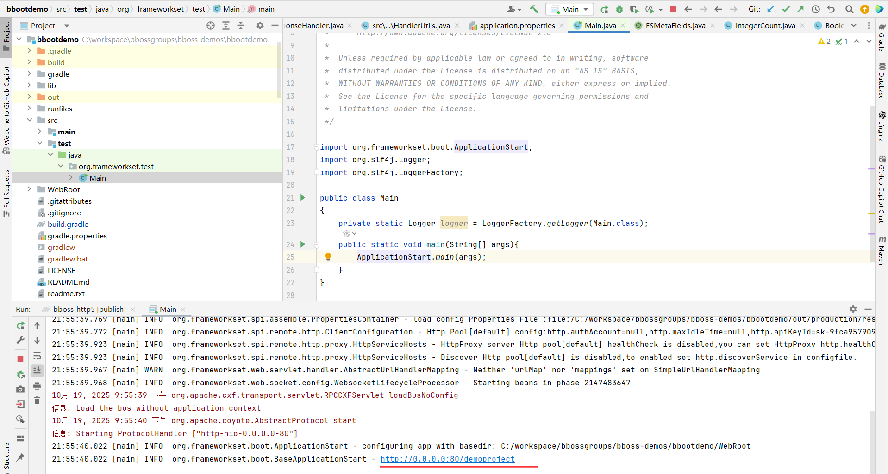

# 基于bboss mvc和bboss ai客户端实现AI智能问答教程
bboss ai java客户端目前支持以下功能：

- 文本对话
- 图像识别
- 图像生成
- 语音识别
- 语音生成
- 视频生成

本文着重介绍基于Deepseek实现AI智能问答功能，其他功能可通过下面的[案例地址](https://gitee.com/bboss/bbootdemo)下载部署到本地体验
在工程中导入以下maven坐标即可
```xml
<dependency>
   <groupId>com.bbossgroups</groupId>
   <artifactId>bboss-ai</artifactId>
   <version>6.5.3</version>
</dependency>
```
如果是gradle工程，导入方法如下：
```groovy
api 'com.bbossgroups:bboss-ai: 6.5.3'
```
## 1. 功能概述

本文件介绍基于bboss MVC框架和LLM模型、视觉模型的实现流式智能问答功能，支持实时流式响应展示，提供良好的用户体验。

本文采用的技术：

- bboss mvc：支持flux/mono 两种restful服务
- bboss httpproxy：基于httpclient5和reactor core实现，支持流式服务调用
- 前端SSE：html5+sse流式交互调用
- 简单的会话记忆功能
- LLM模型
  - Deepseek模型服务：基于Deepseek官方云服务
  - 硅基流动通义千问模型服务
- 视觉模型
  - 阿里百炼通义千问视觉模型
  - 硅基流动通义千问视觉模型

## 2.案例下载

本文案例工程源码地址：基于gradle管理

https://gitee.com/bboss/bbootdemo

将源码下载后，导入idea进行服务开发和调试运行，gradle工程环境搭建参考文档：

https://esdoc.bbossgroups.com/#/bboss-build

## 3. 核心组件

### 3.1 后端Flux控制器

https://gitee.com/bboss/bbootdemo/blob/master/src/main/java/org/frameworkset/web/react/ReactorController.java

```java
public class ReactorController implements InitializingBean
```


主要功能方法：
- `deepseekBackuppressSession(@RequestBody Map<String,Object> questions)`: 背压及带记忆窗口多轮会话Deepseek问答请求服务
- `afterPropertiesSet()`: 初始化Deepseek大模型HTTP连接池配置,基于bboss-http5

### 3.2 后端Mono控制器

https://gitee.com/bboss/bbootdemo/blob/master/src/main/java/org/frameworkset/web/react/MonoController.java

### 3.3 前端页面

实现流式问答交互的前端界面，包含：
- 用户输入框
- 发送/取消按钮
- 实时消息展示区域
- Markdown格式支持

前端清单

[chatpost.html](https://gitee.com/bboss/bbootdemo/blob/master/WebRoot/chatpost.html)  简单文本stream 响应案例

[chatBackuppress.html](https://gitee.com/bboss/bbootdemo/blob/master/WebRoot/chatBackuppress.html) 背压stream案例

[chatBackuppressSession.html](https://gitee.com/bboss/bbootdemo/blob/master/WebRoot/chatBackuppressSession.html)  多轮会话记忆的背压stream案例

[chatpostServerEvent.html](https://gitee.com/bboss/bbootdemo/blob/master/WebRoot/chatpostServerEvent.html)  基于ServerEvent的简单stream案例

[mono.html](https://gitee.com/bboss/bbootdemo/blob/master/WebRoot/mono.html) 基于mono的响应是案例

## 4. 配置说明

### 4.1 模型服务配置  

在配置文件中配置了三个模型服务：deepseek,guiji,qwenvlplus

[application.properties](https://gitee.com/bboss/bbootdemo/blob/master/src/main/resources/application.properties)

```properties
http.poolNames = deepseek,guiji,qwenvlplus
##deepseek http连接池配置

deepseek.http.maxTotal = 200
deepseek.http.defaultMaxPerRoute = 200
 
# ha proxy 集群负载均衡地址配置,多个地址用逗号分隔
deepseek.http.hosts=https://api.deepseek.com
# https服务必须带https://协议头,多个地址用逗号分隔
#http.hosts=https://192.168.137.1:808,https://192.168.137.1:809,https://192.168.137.1:810
#基于apiKeyId认证配置（主要用于各种大模型服务对接认证）
deepseek.http.apiKeyId = sk-0148357efb4c4951a8689ab9d69436ca

##硅基流动 http连接池配置

guiji.http.maxTotal = 200
guiji.http.defaultMaxPerRoute = 200

# ha proxy 集群负载均衡地址配置,多个地址用逗号分隔
guiji.http.hosts=https://api.siliconflow.cn
#基于apiKeyId认证配置（主要用于各种大模型服务对接认证）
guiji.http.apiKeyId = sk-lewchdqpuxkhogbeahjcvkwflbsiloeefcvapznuuqfeqrtj

##qwenvlplus http连接池配置--通义千问视觉模型

qwenvlplus.http.maxTotal = 200
qwenvlplus.http.defaultMaxPerRoute = 200
# ha proxy 集群负载均衡地址配置,多个地址用逗号分隔
qwenvlplus.http.hosts=https://dashscope.aliyuncs.com
#基于apiKeyId认证配置（主要用于各种大模型服务对接认证）
qwenvlplus.http.apiKeyId = sk-c70e31afd98b45f3856692097e1121b7
```

### 4.2 模型apiKey申请

apiKey申请：

Deepseek官方apiKey申请：https://platform.deepseek.com/api_keys

硅基流动apiKey申请：https://cloud.siliconflow.cn/me/account/ak

通义apiKey申请：https://bailian.console.aliyun.com/

在`application.properties`中增加服务Webroot目录（在idea开发调试时需要配置，打包发布运行时需注释掉web.docBase配置）、启动端口以及应用上下文路径配置：

```properties
web.docBase=C:/workspace/bbossgroups/bboss-demos/bbootdemo/WebRoot
web.contextPath=demoproject
web.port=80
```


### 4.3 Mvc服务路由配置 

 [bboss-socket.xml](https://gitee.com/bboss/bbootdemo/blob/master/WebRoot/WEB-INF/conf/bboss-socket.xml)

```xml
<property name="/reactor/*.api" class="org.frameworkset.web.react.ReactorController"/>
<property name="/reactor/mono/*.api" class="org.frameworkset.web.react.MonoController"/>
```

将`/reactor/*.api`路径映射到`ReactorController`控制器。

将/reactor/mono/*.api路径映射到MonoController控制器

## 5. 使用流程

### 5.1 后端处理流程

1. 系统启动时，`ReactorController`通过`afterPropertiesSet()`方法加载配置并启动HTTP连接池
2. 用户从前端发送问题到`/reactor/deepseekBackuppressSession.api`接口
3. 控制器接收问题内容，构造对应模型请求参数，例如：Deepseek API请求参数
4. 如果图片识别请求，则接收图片url或者图片base64编码串，调用视觉模型识别图片内容，以响应模式返回给前端
5. 通过`HttpRequestProxy.streamChatCompletion()`方法发送流式请求到Deepseek API
6. 将响应以流式方式返回给前端
7. 记录历史会话记录
8. 在问题答案之前、之后放置附加信息：例如Rag知识链接、网站资料链接等

### 5.2 前端交互流程

1. 用户在输入框输入问题，点击发送或按回车键
2. 如果是视觉模型，则可选择本地图片和图片URL地址
3. 前端通过Fetch API发送POST请求到后端接口
4. 显示"正在思考中..."提示
5. 接收后端流式响应数据
6. 实时解析并展示Markdown格式的回答内容

## 6. API接口说明

### 6.1 Deepseek问答接口

示例：背压案例接口

- **URL**: `/reactor/deepseekBackuppressSession.api`

- **方法**: POST

- **请求格式**: JSON

- **请求参数**:
  ```json
  {"message":"介绍bboss","reset":true,"selectedModel":"deepseek"}
  ```
  
- **响应格式**: 流式文本数据

其他接口访问源码文件了解

## 7. 核心实现代码案例

### 7.1 后端核心实现

#### Flux Deepseek问答接口

具体实现以实际代码为准--背压案例，更多细节访问源码了解：https://gitee.com/bboss/bbootdemo/blob/master/src/main/java/org/frameworkset/web/react/ReactorController.java

```java
// 使用静态变量存储会话记忆（实际项目中建议使用缓存或数据库）
    static List<Map<String, Object>> sessionMemory = new ArrayList<>();

     /**
     * 背压案例 - 带会话记忆功能（完善版）
     * http://127.0.0.1/demoproject/chatBackuppressSession.html
     * @param questions
     * @return
     */
    public Flux<List<ServerEvent>> deepseekBackuppressSession(@RequestBody Map<String,Object> questions) {

        String selectedModel = (String)questions.get("selectedModel");
        Boolean reset = (Boolean) questions.get("reset");
        if(reset != null && reset){
            sessionMemory.clear();
        }
        String message = (String)questions.get("message");
        Map<String, Object> requestMap = new HashMap<>();
        if(selectedModel.equals("deepseek")) {
            requestMap.put("model", "deepseek-chat");
        }
        else {
            requestMap.put("model", "Qwen/Qwen3-Next-80B-A3B-Instruct");//指定模型
        }
    
        // 构建消息历史列表，包含之前的会话记忆
        List<Map<String, Object>> messages = new ArrayList<>(sessionMemory);
        
        // 添加当前用户消息
        Map<String, Object> userMessage = new HashMap<>();
        userMessage.put("role", "user");
        userMessage.put("content", message);
        messages.add(userMessage);
    
        requestMap.put("messages", messages);
        requestMap.put("stream", true);
        requestMap.put("max_tokens", 2048);
        requestMap.put("temperature", 0.7);
        Flux<ServerEvent> flux = HttpRequestProxy.streamChatCompletionEvent(selectedModel,"/chat/completions",requestMap);
    
        // 用于累积完整的回答
        StringBuilder completeAnswer = new StringBuilder();
    
        return flux.doOnNext(chunk -> {
           
            if(!chunk.isDone()) {
                logger.info(chunk.getData());
            }
            
        })
        .limitRate(5) // 限制请求速率
        .buffer(3) // 每3个元素缓冲一次
        .doOnNext(bufferedEvents -> {
            // 处理模型响应并更新会话记忆
            for(ServerEvent event : bufferedEvents) {
                //答案前后都可以添加链接和标题
                if(event.isFirst() || event.isDone()){
                    event.addExtendData("url","https://www.bbossgroups.com");
                    event.addExtendData("title","bboss官网");
                }
                if(!event.isDone() ) {
                    // 累积回答内容
                    if(event.getData() != null) {
                        completeAnswer.append(event.getData());
                    }
                } else  {
                    
                    if( completeAnswer.length() > 0) {
                        // 当收到完成信号且有累积内容时，将完整回答添加到会话记忆
                        Map<String, Object> assistantMessage = new HashMap<>();
                        assistantMessage.put("role", "assistant");
                        assistantMessage.put("content", completeAnswer.toString());
                        sessionMemory.add(assistantMessage);

                        // 维护记忆窗口大小为20
                        if (sessionMemory.size() > 20) {
                            sessionMemory.remove(0);
                        }
                    }
                    
                    
                }
            }
        });
    }

    /**
     * 带会话记忆功能
     * http://127.0.0.1/demoproject/chatBackuppressSession.html
     * @param questions
     * @return
     */
    public Flux<List<ServerEvent>>  qwenvl(@RequestBody Map<String,Object> questions) throws InterruptedException {
        String selectedModel = (String)questions.get("selectedModel");
        Boolean reset = (Boolean) questions.get("reset");
        if(reset != null && reset){
            sessionMemory.clear();
        }
        String message  = null;
        message = (String)questions.get("message");
        if(SimpleStringUtil.isEmpty( message)){
            message = "介绍图片内容并计算结果";
        }

        String imageBase64  = (String)questions.get("imageBase64");
        String imageUrl = (String)questions.get("imageUrl");
        if(imageUrl != null) {
            imageUrl = imageUrl.trim();
        }
        

        List contents = new ArrayList<>();
        Map contentData = null;
        if(SimpleStringUtil.isNotEmpty(imageUrl)) {
            contentData = new LinkedHashMap();
            contentData.put("type", "image_url");
            String _imageUrl = imageUrl;
            contentData.put("image_url", new HashMap<String, String>() {{

                put("url", _imageUrl);
            }});
            contents.add(contentData);
        }
        if(SimpleStringUtil.isNotEmpty(imageBase64)) {
            contentData = new LinkedHashMap();
            contentData.put("type", "image_url");
            String _imageUrl = imageBase64;
            contentData.put("image_url", new HashMap<String, String>() {{

                put("url", _imageUrl);
            }});
            contents.add(contentData);
        }


        contentData = new LinkedHashMap();
        contentData.put("type", "text");
        contentData.put("text", message);;
        contents.add(contentData);


        Map<String, Object> requestMap = new HashMap<>();
        if(selectedModel.equals("qwenvlplus")) {
            requestMap.put("model", "qwen3-vl-plus");
        }
        else{

            requestMap.put("model", "Qwen/Qwen3-VL-32B-Thinking");
        }

        
        // 构建消息历史列表，包含之前的会话记忆
        List<Map<String, Object>> messages = new ArrayList<>(sessionMemory);
//        List<Map<String, Object>> messages = new ArrayList<>();
        Map<String, Object> userMessage = new HashMap<>();
        userMessage.put("role", "user");
        userMessage.put("content", contents);
        messages.add(userMessage);


        requestMap.put("messages", messages);
        requestMap.put("stream", true);

        // enable_thinking 参数开启思考过程，thinking_budget 参数设置最大推理过程 Token 数
        Map extra_body = new LinkedHashMap();
        extra_body.put("enable_thinking",true);
        extra_body.put("thinking_budget",81920);
        requestMap.put("extra_body",extra_body);

        // 用于累积完整的回答
        StringBuilder completeAnswer = new StringBuilder();
        Flux<List<ServerEvent>> flux = null;
        if(selectedModel.equals("qwenvlplus")){
            flux = HttpRequestProxy.streamChatCompletionEvent("qwenvlplus","/compatible-mode/v1/chat/completions",requestMap).limitRate(5) // 限制请求速率
                .buffer(3);
        }
        else{
            flux = HttpRequestProxy.streamChatCompletionEvent("guiji","/chat/completions",requestMap).limitRate(5) // 限制请求速率
                    .buffer(3);
        }
        flux = flux.doOnNext(bufferedEvents -> {
                    // 处理模型响应并更新会话记忆
                    for(ServerEvent event : bufferedEvents) {
                        //答案前后都可以添加链接和标题
                        if(event.isFirst() || event.isDone()){
                            event.addExtendData("url","https://www.bbossgroups.com");
                            event.addExtendData("title","bboss官网");
                        }
                        if(!event.isDone() ) {
                             
                            // 累积回答内容
                            if(event.getData() != null) {
                                completeAnswer.append(event.getData());
                            }
                        } else  {
                            
                            if( completeAnswer.length() > 0) {
                                // 当收到完成信号且有累积内容时，将完整回答添加到会话记忆
                                Map<String, Object> assistantMessage = new HashMap<>();
                                assistantMessage.put("role", "assistant");
                                assistantMessage.put("content", completeAnswer.toString());
                                sessionMemory.add(assistantMessage);

                                // 维护记忆窗口大小为20
                                if (sessionMemory.size() > 20) {
                                    sessionMemory.remove(0);
                                }
                            }


                        }
                    }
                });
        
        return flux;
    }
```

#### 答案前后嵌入自定义数据

答案前后都可以添加链接和标题
                

```java
if(event.isFirst() || event.isDone()){
                    event.addExtendData("url","https://www.bbossgroups.com");
                    event.addExtendData("title","bboss官网");
                }
```

前端页面嵌入自定义数据：

```javascript
if(line.first && line.extendDatas){
                                                let title = line.extendDatas["title"];
                                                let url = line.extendDatas["url"];
                                                accumulatedContent += `<a href="${url}" target="_blank">${title}</a><br><br>`;
                                                //将链接作为一个超链接追加到答案的末尾
                                                this.updateBotMessage(botMessageElement, accumulatedContent);
                                            }
                                            if (line.data) {
                                                accumulatedContent += line.data;
                                                this.updateBotMessage(botMessageElement, accumulatedContent);
                                            }
                                            if(line.done && line.extendDatas){
                                                let title = line.extendDatas["title"];
                                                let url = line.extendDatas["url"];
                                                //将链接作为一个超链接追加到答案的末尾
                                                this.updateBotMessage(botMessageElement, accumulatedContent +`<br><br><a href="${url}" target="_blank">${title}</a>`);
                                            }
```


#### Deepseek服务数据源初始化

```java
@Override
public void afterPropertiesSet() throws Exception {
    //加载配置文件，启动负载均衡器
    HttpRequestProxy.startHttpPools("application.properties");
}
```

#### Mono后端接口

更多内容，访问源码了解：https://gitee.com/bboss/bbootdemo/blob/master/src/main/java/org/frameworkset/web/react/MonoController.java

```java
public Mono<User> getUser(String id){
    return userService.findUserById(id);
}
```

### 7.3 前端核心实现

#### 背压Flux服务JavaScript客户端类

发送消息和接收答案的实现如下

更多内容访问页面源码了解：https://gitee.com/bboss/bbootdemo/blob/master/WebRoot/chatBackuppressSession.html

```javascript
sendMessage() {
            const message = this.questionInput.value.trim();
            const reset = this.resetCheckbox.checked;
            if (!message || this.isStreaming) return;

            // 显示用户消息
            // this.displayMessage(message, 'user');
            this.displayUserMessage(message);
            this.questionInput.value = '';

            // 显示机器人正在输入指示器
            const indicatorId = this.showTypingIndicator();

            // 修改为POST请求URL
            //Deepseek服务地址
            const deepseekurl = `/demoproject/reactor/deepseekBackuppressSession.api`;
            //千问视觉模型服务地址
            const vlurl = `/demoproject/reactor/qwenvl.api`;
            // 替换原来的 let url = deepseekurl; 这一行
            let url;
            const selectedModel = this.modelSelect.value;
            if (selectedModel === 'deepseek') {
                url = deepseekurl;
            }
            if (selectedModel === 'guiji') {
                url = deepseekurl;
            }
            else if (selectedModel === 'qwenvlplus'  || this.modelSelect.value === 'qwenvl-guiji') {
                url = vlurl;
            }

            // 创建AbortController用于取消请求
            this.abortController = new AbortController();
            this.isStreaming = true;

            // 构建请求体
            const requestBody = {
                message: message,
                reset: reset,
                selectedModel: selectedModel
            };

            // 根据模型类型添加相应的图片参数
            if (selectedModel === 'qwenvlplus'  || this.modelSelect.value === 'qwenvl-guiji') {
                // 如果是URL模式且有输入URL，则使用URL
                if (this.imageUrlInput.value.trim()) {
                    requestBody.imageUrl = this.imageUrlInput.value.trim();
                }
                // 如果是上传图片模式且有上传图片，则使用base64数据
                else if (this.imageBase64Data) {
                    requestBody.imageBase64 = this.imageBase64Data;
                }
            }

            this.clearImage();
            // 使用fetch API进行POST流式请求，包含reset参数
            fetch(url, {
                method: 'POST',
                headers: {
                    'Content-Type': 'application/json'
                },
                // 在sendMessage方法中，修改fetch请求的body部分
                body: JSON.stringify(requestBody),
                signal: this.abortController.signal
            })
                .then(response => {
                    // 移除正在输入指示器
                    this.removeTypingIndicator(indicatorId);

                    if (!response.ok) {
                        throw new Error(`HTTP error! status: ${response.status}`);
                    }

                    // 获取响应流
                    const reader = response.body.getReader();
                    const decoder = new TextDecoder();
                    let botMessageElement = this.createBotMessageElement();
                    let accumulatedContent = '';
                    let lineBuffer = '';

                    // 修改readStream函数实现逐行处理
                    const readStream = () => {
                        reader.read().then(({ done, value }) => {
                            if (done) {
                                // 处理缓冲区中剩余的数据
                                if (lineBuffer.trim()) {
                                    try {
                                        const jsonData = JSON.parse(lineBuffer.trim());
                                        for (let i = 0; i < jsonData.length; i++) {
                                            const line = jsonData[i];
                                            if(line.first && line.extendDatas){
                                                let title = line.extendDatas["title"];
                                                let url = line.extendDatas["url"];
                                                accumulatedContent += `<a href="${url}" target="_blank">${title}</a><br><br>`;
                                                //将链接作为一个超链接追加到答案的末尾
                                                this.updateBotMessage(botMessageElement, accumulatedContent);
                                            }
                                            if (line.data) {
                                                accumulatedContent += line.data;
                                                this.updateBotMessage(botMessageElement, accumulatedContent);
                                            }
                                            if(line.done && line.extendDatas){
                                                let title = line.extendDatas["title"];
                                                let url = line.extendDatas["url"];
                                                //将链接作为一个超链接追加到答案的末尾
                                                this.updateBotMessage(botMessageElement, accumulatedContent +`<br><br><a href="${url}" target="_blank">${title}</a>`);
                                            }
                                        }
                                    } catch (e) {
                                        // 如果不是JSON格式，作为普通文本处理
                                        accumulatedContent += lineBuffer;
                                        this.updateBotMessage(botMessageElement, accumulatedContent);
                                    }
                                }
                                this.isStreaming = false;
                                // 发送完成后，如果reset被选中，则取消选中
                                if (reset) {
                                    this.resetCheckbox.checked = false;
                                }
                                return;
                            }

                            // 解码当前chunk
                            const chunk = decoder.decode(value, { stream: true });

                            // 将新数据添加到行缓冲区
                            if(lineBuffer) {
                                lineBuffer += chunk;
                            }
                            else{
                                lineBuffer = chunk;
                            }

                            // 按行分割数据
                            const lines = lineBuffer.split('\n');

                            // 保留最后一行（可能是不完整的）在缓冲区中
                            lineBuffer = lines.pop() || '';

                            // 处理完整的行
                            lines.forEach(line => {
                                if (line.trim()) {
                                    try {
                                        const jsonData = JSON.parse(line.trim());
                                        for (let i = 0; i < jsonData.length; i++) {
                                            const lineData = jsonData[i];
                                            if(lineData.first && lineData.extendDatas){
                                                let title = lineData.extendDatas["title"];
                                                let url = lineData.extendDatas["url"];
                                                accumulatedContent += `<a href="${url}" target="_blank">${title}</a><br><br>`;
                                                //将链接作为一个超链接追加到答案的开头
                                                this.updateBotMessage(botMessageElement, accumulatedContent);
                                            }
                                            if (lineData.data) {
                                                accumulatedContent += lineData.data;
                                                this.updateBotMessage(botMessageElement, accumulatedContent);
                                            }
                                            if(lineData.done && lineData.extendDatas){
                                                let title = lineData.extendDatas["title"];
                                                let url = lineData.extendDatas["url"];
                                                //将链接作为一个超链接追加到答案的末尾
                                                this.updateBotMessage(botMessageElement, accumulatedContent +`<br><br><a href="${url}" target="_blank">${title}</a>`);
                                            }
                                        }
                                    } catch (e) {
                                        // 如果不是JSON格式，作为普通文本处理
                                        accumulatedContent += line;
                                        this.updateBotMessage(botMessageElement, accumulatedContent);
                                    }
                                }
                            });

                            // 继续读取
                            readStream();
                        }).catch(error => {
                            if (error.name !== 'AbortError') {
                                console.error('Stream reading error:', error);
                                this.displayErrorMessage('接收数据时出错');
                            }
                            this.isStreaming = false;
                        });
                    };

                    readStream();
                })
                .catch(error => {
                    this.removeTypingIndicator(indicatorId);
                    this.isStreaming = false;

                    if (error.name === 'AbortError') {
                        this.displayErrorMessage('请求已取消');
                    } else {
                        console.error('Fetch error:', error);
                        this.displayErrorMessage('发送请求时出错: ' + error.message);
                    }
                });
        }
```

#### Mono服务Javascript客户端类

直接访问页面了解：https://gitee.com/bboss/bbootdemo/blob/master/WebRoot/mono.html

## 8. 技术特点

1. **流式响应**: 使用Reactor `Flux`和Mono实现流式数据传输，支持实时展示回答内容
2. **Markdown支持**: 前端集成`marked.js`库，支持Markdown格式内容渲染
3. **中断控制**: 支持用户主动取消正在进行的问答请求
4. **连接池管理**: 后端使用HTTP连接池管理与Deepseek API的连接
5. **错误处理**: 完善的异常处理和用户提示机制

## 9. 部署与运行

部署运行步骤：

1. 配置`application.properties`中的Deepseek API密钥
2. 确保网络可以访问`https://api.deepseek.com`
3. 启动应用后访问`http://localhost/demoproject/chatBackuppressSession.html`
4. 在输入框中输入问题，即可与Deepseek模型进行问答交互

### 9.1 开发调试

在idea中启动服务：直接运行或者Debug test目录下的org.frameworkset.test.Main类即可



启动Main类后，打开浏览器输入地址，体验问答功能：

http://127.0.0.1/demoproject/chatBackuppressSession.html


### 9.2 打包发布

运行源码工程目录下的指令：

windows环境：release.bat

linux环境：release.sh


发布成功后，将在bbootdemo\build\distributions目录下生成部署包：bbootdemo.zip

上传服务器后，解压并运行指令启动服务：restart或者startup


## 10.参考资料

[多智能体协同：轻松搞定智能体工具调用](https://esdoc.bbossgroups.com/#/jobflow-deepseek-fuctioncall?id=多智能体协同：轻松搞定智能体工具调用)