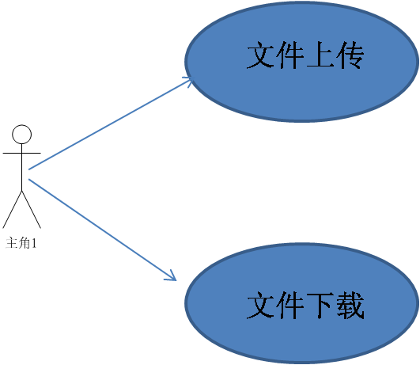
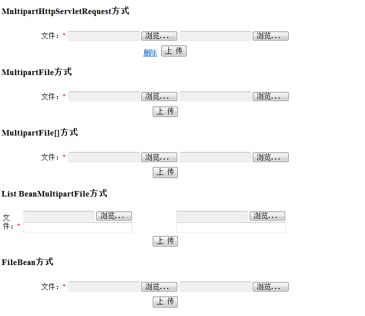
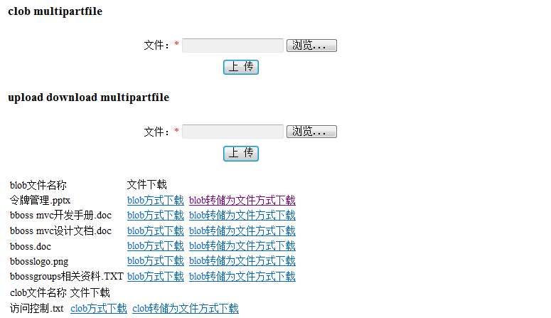

### bboss mvc文件上传下载实战演练

本文以一个实际的demo工程来介绍，如何通过bbossgroups来实现以下功能：

1.通过MVC实现文件上传，通过持久层框架将文件存入数据库

2.使用持久层框架从数据库中获取文件实现下载功能（blob下载和转储为File下载两种方式）

3.本文涉及框架模块：mvc，persistent，taglib，aop/ioc



本文展示如何从MultipartHttpServletRequest中获取上传的附件，  后续将撰文介绍直接绑定MultipartFile对象或者数组到控制其方法参数或者po对象属性的案例。

本文采用derby数据库。建库的脚本为：

Xml代码

```xml
CREATE TABLE FILETABLE ( FILENAME VARCHAR(100), FILECONTENT BLOB(2147483647),  
 FILEID VARCHAR(100), FILESIZE BIGINT )  
```

  一、实战

1.下载的最新的bboss eclipse工程
[bboss](https://github.com/bbossgroups/bbossgroups-3.5/archive/master.zip)

2.解压后将eclipse工程bestpractice\bbossupload导入eclipse

3.修改/bbossupload/src/poolman.xml中derby数据库文件路径：

<**url>**jdbc: derby: D:/d/workspace/bbossgroups-3.6.0/bestpractice/bbossupload/database/cimdb<**/url>**

其中的D:/d/workspace/bbossgroups-3.6.0/bestpractice/bbossupload/database/cimdb需要修改为你的工程所在的实际路径  

4.准备好tomcat 6和jdk 6或以上

5.在tomcat 6的conf\Catalina\localhost下增加upload.xml文件，内容为(路径需要调整为实际路径)：

<**?xml version='1.0' encoding='utf-8'?>**

<**Context docBase="D:\workspace\bbossgroups-3.5\bestpractice\bbossupload\WebRoot" path="/upload" debug="0" reloadable="false">**

<**/Context>**

用户可以根据自己的情况设置docBase属性的值

6.启动tomcat，输入以下地址即可访问bboss mvc的附件上传下载实例了：

http://localhost:8080/upload/upload/main.page

效果如下：





二、代码赏析

1.在bboss-mvc.xml中增加以下文件上传插件配置：

Xml代码

```xml
<property name="multipartResolver"   f:encoding="UTF-8"  
         class="org.frameworkset.web.multipart.commons.CommonsMultipartResolver">     
```

在bboss-mvc.xml中增加下载插件配置-FileMessageConvertor

Xml代码

```xml
<property name="httpMessageConverters">  
        <list>  
            <property class="org.frameworkset.http.converter.json.MappingJacksonHttpMessageConverter"/>  
            <property class="org.frameworkset.http.converter.StringHttpMessageConverter"/>  
            <property class="org.frameworkset.http.converter.FileMessageConvertor"/>  
        </list>          
    </property>   
```

2.文件上传下载控制器装配文件

Xml代码

```xml
<?xml version="1.0" encoding='UTF-8'?>  
<properties>  
    <property name="/upload/*.page"                
        path:main="/upload.jsp"  
        path:ok="redirect:main.page"  
        class="org.frameworkset.upload.controller.UploadController"  
        f:uploadService="attr:uploadService"  
        />         
    <property name="uploadService"  
        class="org.frameworkset.upload.service.UploadService"   
        f:uploadDao="attr:uploadDao"/>  
    <property name="uploadDao"  
        class="org.frameworkset.upload.dao.impl.UpLoadDaoImpl" />  
    <!--  
    如果启用配置文件方式，则打开以下注释，注释上述uploadDao即可 
     -->  
    <!--   
    <property name="uploadDao"  
        class="org.frameworkset.upload.dao.impl.ConfigSQLUploadDaoImpl"   
        f:executor="attr:uploadDao.configexecutor"/>   
    <property name="uploadDao.configexecutor" class="com.frameworkset.common.poolman.ConfigSQLExecutor">  
        <construction>  
            <property value="org/frameworkset/upload/dao/impl/uploadsql.xml"/>  
        </construction>  
     </property>   
      -->  
</properties>  
```

3.控制器实现类代码-UploadController

Java代码

```java
package org.frameworkset.upload.controller;  
  
import java.io.File;  
import java.io.IOException;  
import java.util.Iterator;  
import java.util.List;  
  
import javax.servlet.http.HttpServletRequest;  
import javax.servlet.http.HttpServletResponse;  
  
import org.frameworkset.upload.service.FileBean;  
import org.frameworkset.upload.service.UploadService;  
import org.frameworkset.util.annotations.RequestParam;  
import org.frameworkset.util.annotations.ResponseBody;  
import org.frameworkset.web.multipart.MultipartFile;  
import org.frameworkset.web.multipart.MultipartHttpServletRequest;  
import org.frameworkset.web.servlet.ModelMap;  
  
/** 
 * CREATE TABLE FILETABLE ( FILENAME VARCHAR(100), FILECONTENT BLOB(2147483647), 
 * FILEID VARCHAR(100), FILESIZE BIGINT ) 
 *  
 * <p> 
 * XMLRequestController.java 
 * </p> 
 * <p> 
 * Description: 
 * </p> 
 * <p> 
 * bboss workgroup 
 * </p> 
 * <p> 
 * Copyright (c) 2009 
 * </p> 
 *  
 * @Date 2011-6-22 
 * @author biaoping.yin 
 * @version 1.0 
 */  
public class UploadController  
{  
  
    private UploadService   uploadService;  
  
    public String main(ModelMap model) throws Exception  
    {  
  
        try  
        {  
            model.addAttribute("files", uploadService.queryfiles());  
            model.addAttribute("clobfiles", uploadService.queryclobfiles());  
        }  
        catch (Exception e)  
        {  
            throw e;  
        }  
        return "path:main";  
    }  
  
    /** 
     * @param request 
     * @param model 
     * @param idNum 
     * @param type 
     * @param des 
     * @param byid 
     * @return 
     */  
    public String uploadFile(MultipartHttpServletRequest request)  
    {  
        Iterator<String> fileNames = request.getFileNames();  
        // 根据服务器的文件保存地址和原文件名创建目录文件全路径         
        try  
        {  
            while (fileNames.hasNext())  
            {  
                String name = fileNames.next();  
                MultipartFile[] files = request.getFiles(name);                
//              file.transferTo(dest)  
                for(MultipartFile file:files)  
                {  
                    String filename = file.getOriginalFilename();  
                    if (filename != null && filename.trim().length() > 0)  
                    {  
                        uploadService.uploadFile(file.getInputStream(), file  
                                .getSize(), filename);  
                    }  
                }  
            }             
        }  
        catch (Exception ex)  
        {  
            ex.printStackTrace();  
        }  
        return "path:ok";  
    }  
      
      
    /** 
     *  
     * @param upload1 参数名称要和<input type="file" id="upload1" name="upload1" style="width: 200px"/> 
     *        中的name属性保持一致，这样就能够自动进行绑定和映射 
     * @return 
     */  
//  public String uploadFileWithMultipartFile(@RequestParam(name="upload1")  MultipartFile file)  
    public String uploadFileWithMultipartFile(MultipartFile upload1)  
    {  
  
          
        // 根据服务器的文件保存地址和原文件名创建目录文件全路径  
          
        try  
        {  
            String filename = upload1.getOriginalFilename();  
            if (filename != null && filename.trim().length() > 0)  
            {  
                uploadService.uploadFile(upload1.getInputStream(), upload1  
                        .getSize(), filename);  
  
            }             
              
        }  
        catch (Exception ex)  
        {  
            ex.printStackTrace();  
        }  
        return "path:ok";  
    }  
      
    public String uploadFileClobWithMultipartFile(MultipartFile upload1)  
    {  
        try  
        {  
            uploadService.uploadClobFile(upload1);            
              
        }  
        catch (Exception ex)  
        {  
            ex.printStackTrace();  
        }  
        return "path:ok";  
    }  
      
//  public @ResponseBody File uploaddownFileWithMultipartFile( MultipartFile file) throws IllegalStateException, IOException  
    /** 
     *  
     * @param upload1 参数名称要和<input type="file" id="upload1" name="upload1" style="width: 200px"/> 
     *        中的name属性保持一致 
     * @return 
     * @throws IllegalStateException 
     * @throws IOException 
     */  
    public @ResponseBody File uploaddownFileWithMultipartFile( MultipartFile upload1) throws IllegalStateException, IOException  
    {  
  
        File f = new File("d:/" + upload1.getOriginalFilename());  
        upload1.transferTo(f);  
        return f;  
        // 根据服务器的文件保存地址和原文件名创建目录文件全路径  
          
//      try  
//      {  
//          String filename = file.getOriginalFilename();  
//          if (filename != null && filename.trim().length() > 0)  
//          {  
//              uploadService.uploadFile(file.getInputStream(), file  
//                      .getSize(), filename);  
//  
//          }             
//            
//      }  
//      catch (Exception ex)  
//      {  
//          ex.printStackTrace();  
//      }  
//      return "path:ok";  
    }  
      
    /** 
     * @param request 
     * @param model 
     * @param idNum 
     * @param type 
     * @param des 
     * @param byid 
     * @return 
     */  
    public String uploadFileWithListBean(List<FileBean> files)  
    {             
          
        return "path:ok";  
    }  
      
    /** 
     *  
     * @param upload1 参数名称要和<input type="file" id="upload1" name="upload1" style="width: 200px"/> 
     *        中的name属性保持一致,否则就需要@RequestParam来建立映射关系 
     * @return 
     */  
//  public String uploadFileWithMultipartFiles(@RequestParam(name="upload1")  MultipartFile[] files)  
    public String uploadFileWithMultipartFiles(MultipartFile[] upload1)  
    {         
        try  
        {   
              
            for(MultipartFile file:upload1)  
            {  
                String filename = file.getOriginalFilename();  
//              file.transferTo(new File("d:/"+ filename));  
                  
                if (filename != null && filename.trim().length() > 0)  
                {  
                    uploadService.uploadFile(file.getInputStream(), file  
                            .getSize(), filename);  
      
                }  
            }             
        }  
        catch (Exception ex)  
        {  
            ex.printStackTrace();  
        }  
        return "path:ok";  
    }  
      
    /** 
     *  
     * @param upload1 参数名称要和<input type="file" id="upload1" name="upload1" style="width: 200px"/> 
     *        中的name属性保持一致,否则就需要@RequestParam来建立映射关系 
     * @return 
     */  
//  public @ResponseBody(charset="UTF-8") String uploadFileWithMultipartFilesJson(@RequestParam(name="upload1")  MultipartFile[] upload1)  
    public @ResponseBody(charset="UTF-8") String uploadFileWithMultipartFilesJson(MultipartFile[] upload1)  
    {         
        try  
        {   
  
            for(MultipartFile file:upload1)  
            {  
                String filename = file.getOriginalFilename();  
//              file.transferTo(new File("d:/"+ filename));  
                  
                if (filename != null && filename.trim().length() > 0)  
                {  
                    uploadService.uploadFile(file.getInputStream(), file  
                            .getSize(), filename);  
      
                }  
            }             
        }  
        catch (Exception ex)  
        {  
            ex.printStackTrace();  
        }  
        return "你好";  
    }  
      
    /** 
     * @param request 
     * @param model 
     * @param idNum 
     * @param type 
     * @param des 
     * @param byid 
     * @return 
     */  
    public String uploadFileWithFileBean(FileBean file)  
    {     
        try  
        {  
              
            //对FileBean对象中的附件进行处理。。。。  
              
        }  
        catch (Exception ex)  
        {  
            ex.printStackTrace();  
        }  
        return "path:ok";  
    }  
  
    public String deletefiles() throws Exception  
    {  
  
        uploadService.deletefiles();  
        return "path:ok";  
    }  
  
    public String queryfiles() throws Exception  
    {  
  
          
        return "path:ok";  
    }  
  
    /** 
     * 直接将blob对应的文件内容以相应的文件名响应到客户端，需要提供request和response对象 
     * 这个方法比较特殊，因为derby数据库的blob字段必须在statement有效范围内才能使用，所以采用了空行处理器，来进行处理 
     * 查询数据库的操作也只好放在控制器中处理 
     * @param fileid 参数名称要和request请求中的参数名称保持一致,否则就需要@RequestParam来建立映射关系 
     * @param request 
     * @param response 
     * @throws Exception 
     */  
//  public void downloadFileFromBlob(  
//          @RequestParam(name = "fileid") String fileid,  
//           HttpServletRequest request, HttpServletResponse response)  
//          throws Exception  
    public void downloadFileFromBlob(  
            String fileid,  
             HttpServletRequest request, HttpServletResponse response)  
            throws Exception  
    {  
        uploadService.downloadFileFromBlob(fileid, request, response);  
  
    }  
      
    /** 
     * 直接将blob对应的文件内容以相应的文件名响应到客户端，需要提供request和response对象 
     * 这个方法比较特殊，因为derby数据库的blob字段必须在statement有效范围内才能使用，所以采用了空行处理器，来进行处理 
     * 查询数据库的操作也只好放在控制器中处理 
     * @param fileid 用来验证指定@RequestParam注解的参数，但是RequestParam并没明显地指定参数的名称，则将会用方法参数的名称 
     * 作为参数名称 
     * @param request 
     * @param response 
     * @throws Exception 
     */  
//  public void downloadFileFromClob(  
//          @RequestParam(name = "fileid") String fileid,  
//           HttpServletRequest request, HttpServletResponse response)  
//          throws Exception  
    public void downloadFileFromClob(  
            @RequestParam String fileid,  
             HttpServletRequest request, HttpServletResponse response)  
            throws Exception  
    {  
  
        uploadService.downloadFileFromClob(fileid, request, response);  
  
    }  
  
    /** 
     * 将数据库中存储的文件内容转储到应用服务器文件目录中，然后将转储的文件下载，无需提供response和request对象 
     *  
     * @param fileid 
     * @return 
     * @throws Exception 
     */  
    public @ResponseBody File downloadFileFromFile(String fileid)  
            throws Exception  
    {  
  
        return uploadService.getDownloadFile(fileid);  
    }  
    public @ResponseBody File downloadFileFromClobFile(String fileid)  
    throws Exception  
    {  
      
        return uploadService.getDownloadClobFile(fileid);  
    }  
      
  
    /** 
     * bbossgroups 3.5版本对aop框架的属性注入功能做了改进，注入的属性无需再定义get/set方法 
     */  
//  public UploadService getUploadService()  
//  {  
//  
//      return uploadService;  
//  }  
//  
//  public void setUploadService(UploadService uploadService)  
//  {  
//  
//      this.uploadService = uploadService;  
//  }  
  
}  
```

4.业务组件-UploadService

Java代码

```java
 package org.frameworkset.upload.service;  
  
import java.io.File;  
import java.io.InputStream;  
import java.util.HashMap;  
import java.util.List;  
  
import javax.servlet.http.HttpServletRequest;  
import javax.servlet.http.HttpServletResponse;  
  
import org.frameworkset.upload.dao.UpLoadDao;  
import org.frameworkset.web.multipart.MultipartFile;  
  
  
/** 
 * <p>UploadService.java</p> 
 * <p> Description: </p> 
 * <p> bboss workgroup </p> 
 * <p> Copyright (c) 2009 </p> 
 *  
 * @Date 2011-6-17 
 * @author biaoping.yin 
 * @version 1.0 
 */  
public class UploadService  
{  
    private UpLoadDao uploadDao;  
    public UpLoadDao getUploadDao() {  
        return uploadDao;  
    }  
    public void setUploadDao(UpLoadDao uploadDao) {  
        this.uploadDao = uploadDao;  
    }  
    public void deletefiles() throws Exception  
    {  
  
        uploadDao.deletefiles();  
          
    }  
    public List<HashMap> queryfiles() throws Exception  
    {  
  
        // TODO Auto-generated method stub  
        return uploadDao.queryfiles();  
    }  
    public void uploadFile(InputStream inputStream, long size, String filename) throws Exception  
    {  
  
        uploadDao.uploadFile(inputStream, size, filename);  
          
    }  
      
      
      
    public void uploadClobFile(MultipartFile file) throws Exception  
    {  
  
        uploadDao.uploadClobFile(file);  
          
    }  
      
    public File getDownloadFile(String fileid) throws Exception  
    {  
        return uploadDao.getDownloadFile(fileid);  
    }  
      
    public void downloadFileFromBlob(String fileid,  HttpServletRequest request,  
            HttpServletResponse response) throws Exception  
    {  
        uploadDao.downloadFileFromBlob(fileid, request, response);  
    }  
      
    public void downloadFileFromClob(String fileid,  HttpServletRequest request,  
            HttpServletResponse response) throws Exception  
    {  
        uploadDao.downloadFileFromClob(fileid, request, response);  
    }  
    public  List<HashMap> queryclobfiles() throws Exception  
    {  
  
        // TODO Auto-generated method stub  
        return uploadDao.queryclobfiles();  
    }  
    public File getDownloadClobFile(String fileid) throws Exception  
    {  
  
        return uploadDao.getDownloadClobFile(fileid);  
    }  
}  
```

5.dao组件代码-

Java代码 

```java
package org.frameworkset.upload.dao.impl;  
  
import java.io.File;  
import java.io.InputStream;  
import java.util.HashMap;  
import java.util.List;  
import java.util.UUID;  
  
import javax.servlet.http.HttpServletRequest;  
import javax.servlet.http.HttpServletResponse;  
  
import org.frameworkset.upload.dao.UpLoadDao;  
  
import com.frameworkset.common.poolman.Record;  
import com.frameworkset.common.poolman.SQLExecutor;  
import com.frameworkset.common.poolman.SQLParams;  
import com.frameworkset.common.poolman.handle.FieldRowHandler;  
import com.frameworkset.common.poolman.handle.NullRowHandler;  
import com.frameworkset.util.StringUtil;  
  
public class UpLoadDaoImpl implements UpLoadDao {  
    /** 
     * 上传附件 
     * @param inputStream 
     * @param filename 
     * @return 
     * @throws Exception 
     */  
    public boolean uploadFile(InputStream inputStream,long size, String filename) throws Exception {  
        boolean result = true;  
        String sql = "";  
        try {  
            sql = "INSERT INTO filetable (FILENAME,FILECONTENT,fileid,FILESIZE) VALUES(#[filename],#[FILECONTENT],#[FILEID],#[FILESIZE])";  
            SQLParams sqlparams = new SQLParams();  
            sqlparams.addSQLParam("filename", filename, SQLParams.STRING);  
            sqlparams.addSQLParam("FILECONTENT", inputStream, size,SQLParams.BLOBFILE);  
            sqlparams.addSQLParam("FILEID", UUID.randomUUID().toString(),SQLParams.STRING);  
            sqlparams.addSQLParam("FILESIZE", size,SQLParams.LONG);  
            SQLExecutor.insertBean(sql, sqlparams);           
              
        } catch (Exception ex) {  
            ex.printStackTrace();  
            result = false;  
            throw new Exception("上传附件关联临控指令布控信息附件失败：" + ex);  
        } finally {  
            if(inputStream != null){  
                inputStream.close();  
            }  
        }  
        return result;  
    }  
      
    public File getDownloadFile(String fileid) throws Exception  
    {  
        try  
        {  
            return SQLExecutor.queryTField(  
                                            File.class,  
                                            new FieldRowHandler<File>() {  
  
                                                @Override  
                                                public File handleField(  
                                                        Record record)  
                                                        throws Exception  
                                                {  
  
                                                    // 定义文件对象  
                                                    File f = new File("d:/",record.getString("filename"));  
                                                    // 如果文件已经存在则直接返回f  
                                                    if (f.exists())  
                                                        return f;  
                                                    // 将blob中的文件内容存储到文件中  
                                                    record.getFile("filecontent",f);  
                                                    return f;  
                                                }  
                                            },  
                                            "select * from filetable where fileid=?",  
                                            fileid);  
        }  
        catch (Exception e)  
        {  
            throw e;  
        }  
    }  
  
    @Override  
    public void deletefiles() throws Exception  
    {  
  
        SQLExecutor.delete("delete from filetable ");             
    }  
  
    @Override  
    public List<HashMap> queryfiles() throws Exception  
    {  
  
        return SQLExecutor.queryList(HashMap.class, "select FILENAME,fileid,FILESIZE from filetable");  
          
    }  
  
    @Override  
    public void downloadFileFromBlob(String fileid, final HttpServletRequest request,  
            final HttpServletResponse response) throws Exception  
    {  
  
        try  
        {  
            SQLExecutor.queryByNullRowHandler(new NullRowHandler() {  
                @Override  
                public void handleRow(Record record) throws Exception  
                {  
  
                    StringUtil.sendFile(request, response, record  
                            .getString("filename"), record  
                            .getBlob("filecontent"));  
                }  
            }, "select * from filetable where fileid=?", fileid);  
        }  
        catch (Exception e)  
        {  
            throw e;  
        }  
          
    }  
      
      
      
}  
```

6.表单界面代码-

Html代码

```html
<h3>MultipartHttpServletRequest方式</h3>  
        <form name="tableInfoForm" id="tableInfoForm" enctype="multipart/form-data" method="post" action="<%=request.getContextPath() %>/upload/uploadFile.page">   
            <input type="hidden" value="0" name="type"/>  
            <table width="600" border="0" cellspacing="0" cellpadding="0" class="tox5 bgcolor1">  
                <tr>  
                    <td>  
                        <table id="upfileList" align="center">  
                            <tr>  
                                <td height="30">文件：<font style="color:#FF0000">*</font></td>  
                                <td><input type="file" id="upload1" name="upload1" style="width: 200px"/></td>  
                                <td><input type="file" id="upload1" name="upload1" style="width: 200px"/></td>                                  
                            </tr>                                                   
                        </table>  
                        <div align=center>  
                              
                            <a href="<%=request.getContextPath() %>/upload/deletefiles.page" >删除</a>  
                            <input type="submit" class="xbutton1" id="subb" name="subb" value="上 传"/>  
                        </div>  
                    </td>  
                </tr>  
            </table>  
        </form>     
          
        <h3>MultipartFile方式</h3>  
        <form name="tableInfoForm1" id="tableInfoForm1" enctype="multipart/form-data" method="post" action="<%=request.getContextPath() %>/upload/uploadFileWithMultipartFile.page">   
            <input type="hidden" value="0" name="type"/>  
            <table width="600" border="0" cellspacing="0" cellpadding="0" class="tox5 bgcolor1">  
                <tr>  
                    <td>  
                        <table id="upfileList" align="center">  
                            <tr>  
                                <td height="30">文件：<font style="color:#FF0000">*</font></td>  
                                <td><input type="file" id="upload1" name="upload1" style="width: 200px"/></td>  
                                <td><input type="file" id="upload1" name="upload1" style="width: 200px"/></td>                                  
                            </tr>                                                   
                        </table>  
                        <div align=center>  
                              
                              
                            <input type="submit" class="xbutton1" id="subb" name="subb" value="上 传"/>  
                        </div>  
                    </td>  
                </tr>  
            </table>  
        </form>     
          
        <h3>MultipartFile[]方式</h3>  
        <form name="tableInfoForm2" id="tableInfoForm2" enctype="multipart/form-data" method="post"   
        action="<%=request.getContextPath() %>/upload/uploadFileWithMultipartFiles.page">   
            <input type="hidden" value="0" name="type"/>  
            <table width="600" border="0" cellspacing="0" cellpadding="0" class="tox5 bgcolor1">  
                <tr>  
                    <td>  
                        <table id="upfileList" align="center">  
                            <tr>  
                                <td height="30">文件：<font style="color:#FF0000">*</font></td>  
                                <td><input type="file" id="upload1" name="upload1" style="width: 200px"/></td>  
                                <td><input type="file" id="upload1" name="upload1" style="width: 200px"/></td>                                  
                            </tr>                                                   
                        </table>  
                        <div align=center>  
                              
                              
                            <input type="submit" class="xbutton1" id="subb" name="subb" value="上 传"/>  
                        </div>  
                    </td>  
                </tr>  
            </table>  
        </form>     
          
        <h3>List BeanMultipartFile方式</h3>  
        <form name="tableInfoForm21" id="tableInfoForm21" enctype="multipart/form-data" method="post"   
        action="<%=request.getContextPath() %>/upload/uploadFileWithListBean.page">   
            <input type="hidden" value="0" name="type"/>  
            <table width="600" border="0" cellspacing="0" cellpadding="0" class="tox5 bgcolor1">  
                <tr>  
                    <td>  
                        <table id="upfileList" align="center">  
                            <tr>  
                                <td height="30">文件：<font style="color:#FF0000">*</font></td>  
                                <td><input type="file" id="upload1" name="upload1" style="width: 200px"/> <input type="text" name="upload1des" style="width: 200px"/></td>  
                                <td><input type="file" id="upload1" name="upload1" style="width: 200px"/> <input type="text" name="upload1des" style="width: 200px"/></td>    
                                                              
                            </tr>                                                   
                        </table>  
                        <div align=center>  
                              
                              
                            <input type="submit" class="xbutton1" id="subb" name="subb" value="上 传"/>  
                        </div>  
                    </td>  
                </tr>  
            </table>  
        </form>     
          
          
        <h3>FileBean方式</h3>  
        <form name="tableInfoForm3" id="tableInfoForm3" enctype="multipart/form-data" method="post" action="<%=request.getContextPath() %>/upload/uploadFileWithFileBean.page">   
            <input type="hidden" value="0" name="type"/>  
            <table width="600" border="0" cellspacing="0" cellpadding="0" class="tox5 bgcolor1">  
                <tr>  
                    <td>  
                        <table id="upfileList" align="center">  
                            <tr>  
                                <td height="30">文件：<font style="color:#FF0000">*</font></td>  
                                <td><input type="file" id="upload1" name="upload1" style="width: 200px"/></td>  
                                <td><input type="file" id="upload1" name="upload1" style="width: 200px"/></td>                                  
                            </tr>                                                   
                        </table>  
                        <div align=center>  
                              
                              
                            <input type="submit" class="xbutton1" id="subb" name="subb" value="上 传"/>  
                        </div>  
                    </td>  
                </tr>  
            </table>  
        </form>     
          
            <h3>clob multipartfile</h3>  
        <form name="tableInfoForm4" id="tableInfoForm4" enctype="multipart/form-data" method="post" action="<%=request.getContextPath() %>/upload/uploadFileClobWithMultipartFile.page">   
            <input type="hidden" value="0" name="type"/>  
            <table width="600" border="0" cellspacing="0" cellpadding="0" class="tox5 bgcolor1">  
                <tr>  
                    <td>  
                        <table id="upfileList" align="center">  
                            <tr>  
                                <td height="30">文件：<font style="color:#FF0000">*</font></td>  
                                <td><input type="file" id="upload1" name="upload1" style="width: 200px"/></td>  
                                                                  
                            </tr>                                                   
                        </table>  
                        <div align=center>  
                              
                              
                            <input type="submit" class="xbutton1" id="subb" name="subb" value="上 传"/>  
                        </div>  
                    </td>  
                </tr>  
            </table>  
        </form>     
          
            <h3>upload download multipartfile</h3>  
        <form name="tableInfoForm4" id="tableInfoForm5" enctype="multipart/form-data"   
        method="post" action="<%=request.getContextPath() %>/upload/uploaddownFileWithMultipartFile.page">   
            <input type="hidden" value="0" name="type"/>  
            <table width="600" border="0" cellspacing="0" cellpadding="0" class="tox5 bgcolor1">  
                <tr>  
                    <td>  
                        <table id="upfileList" align="center">  
                            <tr>  
                                <td height="30">文件：<font style="color:#FF0000">*</font></td>  
                                <td><input type="file" id="upload1" name="upload1" style="width: 200px"/></td>  
                                                                  
                            </tr>                                                   
                        </table>  
                        <div align=center>  
                              
                              
                            <input type="submit" class="xbutton1" id="subb" name="subb" value="上 传"/>  
                        </div>  
                          
                    </td>  
                </tr>  
            </table>  
        </form>     
        <table>  
        <tr><td>blob文件名称</td><td>文件下载</td></tr>  
        <pg:empty actual="${files}"><tr><td colspan="2">没有文件信息</td></tr></pg:empty>  
        <pg:list requestKey="files">  
            <tr><td><pg:cell colName="FILENAME"/></td>  
            <td><a href="<%=request.getContextPath() %>/upload/downloadFileFromBlob.page?fileid=<pg:cell colName="FILEID"/>">  
            blob方式下载</a>  
            <a href="<%=request.getContextPath() %>/upload/downloadFileFromFile.page?fileid=<pg:cell colName="FILEID"/>">  
            blob转储为文件方式下载</a>  
        </td></tr>  
        </pg:list>  
        </table>  
          
        <table>  
        <tr><td>clob文件名称</td><td>文件下载</td></tr>  
        <pg:empty actual="${clobfiles}"><tr><td colspan="2">没有文件信息</td></tr></pg:empty>  
        <pg:list requestKey="clobfiles">  
            <tr><td><pg:cell colName="FILENAME"/></td>  
            <td><a href="<%=request.getContextPath() %>/upload/downloadFileFromClob.page?fileid=<pg:cell colName="FILEID"/>">  
            clob方式下载</a>  
            <a href="<%=request.getContextPath() %>/upload/downloadFileFromClobFile.page?fileid=<pg:cell colName="FILEID"/>">  
            clob转储为文件方式下载</a>  
        </td></tr>  
        </pg:list>  
        </table>  
```

7.将dao切换为采用配置文件dao-ConfigSQLUploadDaoImpl

Java代码

```java
/** 
 *  Copyright 2008 biaoping.yin 
 * 
 *  Licensed under the Apache License, Version 2.0 (the "License"); 
 *  you may not use this file except in compliance with the License. 
 *  You may obtain a copy of the License at 
 * 
 *      http://www.apache.org/licenses/LICENSE-2.0 
 * 
 *  Unless required by applicable law or agreed to in writing, software 
 *  distributed under the License is distributed on an "AS IS" BASIS, 
 *  WITHOUT WARRANTIES OR CONDITIONS OF ANY KIND, either express or implied. 
 *  See the License for the specific language governing permissions and 
 *  limitations under the License.   
 */  
package org.frameworkset.upload.dao.impl;  
  
import java.io.File;  
import java.io.InputStream;  
import java.util.HashMap;  
import java.util.List;  
import java.util.UUID;  
  
import javax.servlet.http.HttpServletRequest;  
import javax.servlet.http.HttpServletResponse;  
  
import org.frameworkset.upload.dao.UpLoadDao;  
  
import com.frameworkset.common.poolman.ConfigSQLExecutor;  
import com.frameworkset.common.poolman.Record;  
import com.frameworkset.common.poolman.SQLParams;  
import com.frameworkset.common.poolman.handle.FieldRowHandler;  
import com.frameworkset.common.poolman.handle.NullRowHandler;  
import com.frameworkset.util.StringUtil;  
  
  
  
/** 
 * <p>ConfigSQLUploadDaoImpl.java</p> 
 * <p> Description: </p> 
 * <p> bboss workgroup </p> 
 * <p> Copyright (c) 2009 </p> 
 *  
 * @Date 2011-6-17 
 * @author biaoping.yin 
 * @version 1.0 
 */  
public class ConfigSQLUploadDaoImpl implements UpLoadDao  
{  
    private ConfigSQLExecutor executor ;  
    /** 
     * 上传附件 
     * @param inputStream 
     * @param filename 
     * @return 
     * @throws Exception 
     */  
    public boolean uploadFile(InputStream inputStream,long size, String filename) throws Exception {  
        boolean result = true;  
          
        try {  
              
            SQLParams sqlparams = new SQLParams();  
            sqlparams.addSQLParam("filename", filename, SQLParams.STRING);  
            sqlparams.addSQLParam("FILECONTENT", inputStream, size,SQLParams.BLOBFILE);  
            sqlparams.addSQLParam("FILEID", UUID.randomUUID().toString(),SQLParams.STRING);  
            sqlparams.addSQLParam("FILESIZE", size,SQLParams.LONG);  
            executor.insertBean("uploadFile", sqlparams);             
              
        } catch (Exception ex) {  
            ex.printStackTrace();  
            result = false;  
            throw new Exception("上传附件关联临控指令布控信息附件失败：" + ex);  
        } finally {  
            if(inputStream != null){  
                inputStream.close();  
            }  
        }  
        return result;  
    }  
      
    public File getDownloadFile(String fileid) throws Exception  
    {  
        try  
        {  
            return executor.queryTField(  
                                            File.class,  
                                            new FieldRowHandler<File>() {  
  
                                                @Override  
                                                public File handleField(  
                                                        Record record)  
                                                        throws Exception  
                                                {  
  
                                                    // 定义文件对象  
                                                    File f = new File(  
                                                            "d:/",  
                                                            record  
                                                                    .getString("filename"));  
                                                    // 如果文件已经存在则直接返回f  
                                                    if (f.exists())  
                                                        return f;  
                                                    // 将blob中的文件内容存储到文件中  
                                                    record  
                                                            .getFile(  
                                                                        "filecontent",  
                                                                        f);  
                                                    return f;  
                                                }  
                                            },  
                                            "getDownloadFile",  
                                            fileid);  
        }  
        catch (Exception e)  
        {  
            throw e;  
        }  
    }  
  
    @Override  
    public void deletefiles() throws Exception  
    {  
  
        executor.delete("deletefiles");           
    }  
  
    @Override  
    public List<HashMap> queryfiles() throws Exception  
    {  
  
        return executor.queryList(HashMap.class, "queryfiles");  
          
    }  
  
    @Override  
    public void downloadFileFromBlob(String fileid, final HttpServletRequest request,  
            final HttpServletResponse response) throws Exception  
    {  
  
        try  
        {  
            executor.queryByNullRowHandler(new NullRowHandler() {  
                @Override  
                public void handleRow(Record record) throws Exception  
                {  
  
                    StringUtil.sendFile(request, response, record  
                            .getString("filename"), record  
                            .getBlob("filecontent"));  
                }  
            }, "downloadFileFromBlob", fileid);  
        }  
        catch (Exception e)  
        {  
            throw e;  
        }  
          
    }  
  
      
    public ConfigSQLExecutor getExecutor()  
    {  
      
        return executor;  
    }  
  
      
    public void setExecutor(ConfigSQLExecutor executor)  
    {  
      
        this.executor = executor;  
    }  
  
}  
```

sql配置文件内容-

Xml代码

```xml
<?xml version="1.0" encoding='gb2312'?>  
<properties>  
    <property name="deletefiles"><![CDATA[delete from filetable]]>  
    </property>  
    <property name="queryfiles"><![CDATA[select FILENAME,fileid,FILESIZE from filetable]]>  
    </property>  
    <property name="uploadFile"><![CDATA[ 
        INSERT INTO filetable (FILENAME,FILECONTENT,fileid,FILESIZE)  
        VALUES(#[filename],#[FILECONTENT],#[FILEID],#[FILESIZE])]]>  
    </property>  
      
    <property name="getDownloadFile"><![CDATA[ 
        select * from filetable where fileid=? 
    ]]></property>  
      
      
</properties>  
```

代码都很简单，也非常容易理解，这里不做过多的解释。有问题可以留言讨论,也可以加入群组：

21220580

3625720

154752521

官方网站：
http://www.bbossgroups.com/