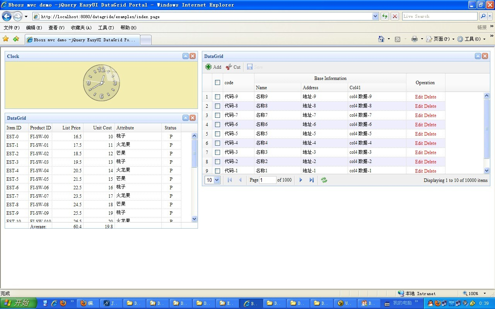

### MVC结合Easyui Portal 实例

本文介绍bbossgroups mvc结合jquery easyui datagrid portal的一个简单案例，分3部分：

第一部分：案例效果

第二部分：实战-下载案例工程和部署案例

第三部分：功能和代码实现介绍

本案例大致功能描述如下：

1.通过bbossgroups 控制器方法返回对象，然后mvc框架将对象转换为json对象返回给jquery easyui datagrid展示

2.jquery easyui datagrid通过指定对应控制器方法的请求url来获取datagrid的数据，然后展示出来

3.同时结合jquery easyui portal插件来做界面集成展示。 

 第一部分 案例效果

介绍之前先看下效果图：    



第二部分 实战部署指南：

1 下载示例工程
http://dl.iteye.com/topics/download/0f97d852-03c3-39af-a8ee-a0108fb3530c

2.将mvc工程导入eclipse，并编译通过

3.准备好tomcat 6和jdk 15或以上

4 在tomcat 6的conf\Catalina\localhost下增加datagride.xml文件，内容为：

Xml代码

```xml
<?xml version='1.0' encoding='utf-8'?>  
<Context docBase="D:\workspace\easyuidatagrid\WebRoot" path="/datagride" debug="0" reloadable="false">  
</Context>  
```

用户可以根据自己的情况设置docBase属性的值

5.启动tomcat，输入以下地址即可访问本实例了，呵呵：

http://localhost:8080/datagride/examples/index.page

应该可以看到上述的效果示意图中的界面了。  

第三部分 功能介绍和代码实现：

3.下面看控制器的实现：

Java代码

```java
package org.frameworkset.mvc;  
  
import java.util.ArrayList;  
import java.util.List;  
  
import org.frameworkset.util.annotations.RequestParam;  
import org.frameworkset.util.annotations.ResponseBody;  
  
  
/** 
 * <p>PortalController.java</p> 
 * <p> Description: </p> 
 * <p> bboss workgroup </p> 
 * <p> Copyright (c) 2009 </p> 
 * @Date 2011-6-19 
 * @author biaoping.yin 
 * @version 1.0 
 */  
public class EasyUIDatagridController  
{  
    private static List<Address> addresses ;  
    static   
    {  
        addresses = new ArrayList<Address>();  
        for(int i = 0; i < 10000; i ++)  
        {  
            Address address = new Address();  
            address.setAddr("地址-" + i);  
            address.setCode("代码-" + i);  
            address.setCol4("col4 数据-" + i);  
            address.setName("名称" + i);  
            addresses.add(address);  
        }  
    }  
    public String index()  
    {  
        return "path:portal";  
    }  
      
    public @ResponseBody(datatype="json") Addresses datagrid_data_pagine(@RequestParam(name="page",defaultvalue="1") int page,@RequestParam(name="rows",defaultvalue="10") int rows)  
    {  
        return pagerList(addresses,(page - 1)*rows,rows);  
          
    }  
    public @ResponseBody(datatype="json") GouWuChe datagrid_data_footer()  
    {  
        GouWuChe container = new GouWuChe();  
        container.setTotal(28);  
        List<Productor> rows = new ArrayList<Productor>();  
        for(int i = 0; i < 28; i ++)  
            rows.add( buildProductor(i));  
        container.setRows(rows);  
        container.setFooter(buildFooterProductor());  
        return container;  
    }  
      
    private Productor buildProductor(int i)  
    {  
        Productor p = new Productor();  
        p.setProductid("FI-SW-0" + i);  
        p.setUnitcost(10.00 + i);  
        p.setStatus("P");  
        p.setListprice(16.50 + i);  
        if(i % 3 == 0)  
            p.setAttr1("桃子");  
        else if(i % 3 == 1)  
            p.setAttr1("火龙果");  
        if(i % 3 == 2)  
            p.setAttr1("芒果");     
        p.setItemid("EST-" + i);  
        return p;  
    }  
      
    private List<Productor> buildFooterProductor()  
    {  
        Productor p = new Productor();  
        p.setProductid("Average:" );  
        p.setUnitcost(19.80);         
        p.setListprice(60.40);  
        List<Productor> footer = new ArrayList<Productor>();  
        footer.add(p);  
        p = new Productor();  
        p.setProductid("Total:" );  
        p.setUnitcost(198.00);  
        p.setListprice(604.00);  
        footer.add(p);  
        return footer;  
    }  
    /** 
     * 对列表进行分页操作,数据源是一个列表 
     * @param datas 列表数据 
     * @param offset 获取数据的起始位置 
     * @param pageItems 获取数据的条数 
     * @return ListInfo 对分页数据和总记录条数的封装类 
     */  
  
    private static Addresses pagerList(List datas,int offset,int pageItems)  
    {  
        if(datas == null)  
            return null;  
        List list = new ArrayList();  
        if(offset >= datas.size())  
        {  
            int temp = datas.size() % pageItems;  
            offset = datas.size() - temp;  
        }  
        for(int i = offset; i < datas.size() && i < offset + pageItems; i ++)  
        {  
            list.add(datas.get(i));  
        }  
        Addresses address = new Addresses();  
        address.setRows(list);  
        address.setTotal(datas.size());  
        return address;  
    }  
}  
```

4.依赖的po对象-GouWuChe 和Productor，GouWuChe对象将被转换为json对象，是根据jquery easyui datagrid要求的结构定义的json对象容器，包含的产品对象Productor是具体的po记录对象。

GouWuChe 对象的结构如下：

Java代码

```java
public class GouWuChe  
{  
    private long total;//总记录数  
    private List<Productor> rows;//要显示的记录  
    private List<Productor> footer;//统计页脚，包含平均价格和总价格  
    //get和set方法，省略掉  
}  
```

Productor对象结构如下,包含产品的所有属性：

Java代码

```java
public class Productor  
{  
    private String productid;  
    private double unitcost;  
    private String status;  
    private double listprice;  
    private String attr1;  
    private String itemid;  
       //get和set方法，省略掉  
}  
```

5.依赖的po对象-Addresses 和Address，Addresses 对象将被转换为json对象，是根据jquery easyui 分页datagrid要求的结构定义的json对象容器，包含的产品对象Address是具体的po记录对象。

Addresses对象结构如下,包含产品的所有属性：

Java代码

```java
public class Addresses  
{  
    private long total;  
    private List<Address> rows;  
 //get和set方法，省略掉  
}  
```

Addresses对象结构如下,包含产品的所有属性：

Java代码

```java
public class Address  
{  
    private String code;  
    private String name;  
    private String addr;  
    private String col4;  
       //get和set方法，省略掉  
}  
```

6.mvc控制器配置：

Java代码

```java
<properties>  
    <property name="/examples/*.page"  
        path:portal="/examples/portal.jsp"  
        class="org.frameworkset.mvc.EasyUIDatagridController">  
    </property>  
</properties>  
```

7.再来看看jquery easyui datagrid页面代码-portal.jsp：

Html代码 

```html
<!DOCTYPE html PUBLIC "-//W3C//DTD HTML 4.01 Transitional//EN" "http://www.w3.org/TR/html4/loose.dtd">  
<html>  
<head>  
<meta http-equiv="Content-Type" content="text/html; charset=UTF-8">  
<title>Bboss mvc demo -jQuery EasyUI DataGrid Portal</title>  
    <link rel="stylesheet" type="text/css" href="../include/themes/default/easyui.css">  
    <link rel="stylesheet" type="text/css" href="../include/themes/icon.css">  
    <link rel="stylesheet" type="text/css" href="../include/jquery-easyui-portal/portal.css">  
    <style type="text/css">  
        .title{  
            font-size:16px;  
            font-weight:bold;  
            padding:20px 10px;  
            background:#eee;  
            overflow:hidden;  
            border-bottom:1px solid #ccc;  
        }  
        .t-list{  
            padding:5px;  
        }  
    </style>  
    <script type="text/javascript" src="../include/jquery-1.4.4.min.js"></script>  
    <script type="text/javascript" src="../include/jquery.easyui.min.js"></script>  
    <script type="text/javascript" src="../include/jquery-easyui-portal/jquery.portal.js"></script>  
    <script>  
        $(function(){  
            $('#pp').portal({  
                border:false,  
                fit:true  
            });  
            //add();  
              
            $('#test').datagrid({  
              
                iconCls:'icon-save',  
                width:600,  
                height:350,  
                fit:true,border:false,  
                nowrap: false,  
                striped: true,  
                url:'datagrid_data_pagine.page',  
                sortName: 'code',  
                sortOrder: 'desc',  
                remoteSort: false,  
                idField:'code',  
                frozenColumns:[[  
                    {field:'ck',checkbox:true},  
                    {title:'code',field:'code',width:80,sortable:true}  
                ]],  
                columns:[[  
                    {title:'Base Information',colspan:3},  
                    {field:'opt',title:'Operation',width:100,align:'center', rowspan:2,  
                        formatter:function(value,rec){  
                            return '<span style="color:red">Edit Delete</span>';  
                        }  
                    }  
                ],[  
                    {field:'name',title:'Name',width:120},  
                    {field:'addr',title:'Address',width:120,rowspan:2,sortable:true,  
                        sorter:function(a,b){  
                            return (a>b?1:-1);  
                        }  
                    },  
                    {field:'col4',title:'Col41',width:150,rowspan:2}  
                ]],  
                pagination:true,  
                rownumbers:true,  
                toolbar:[{  
                    id:'btnadd',  
                    text:'Add',  
                    iconCls:'icon-add',  
                    handler:function(){  
                        $('#btnsave').linkbutton('enable');  
                        alert('add')  
                    }  
                },{  
                    id:'btncut',  
                    text:'Cut',  
                    iconCls:'icon-cut',  
                    handler:function(){  
                        $('#btnsave').linkbutton('enable');  
                        alert('cut')  
                    }  
                },'-',{  
                    id:'btnsave',  
                    text:'Save',  
                    disabled:true,  
                    iconCls:'icon-save',  
                    handler:function(){  
                        $('#btnsave').linkbutton('disable');  
                        alert('save')  
                    }  
                }]  
            });  
            var p = $('#test').datagrid('getPager');  
            if (p){  
                $(p).pagination({  
                    onBeforeRefresh:function(){  
                        alert('before refresh');  
                    }  
                });  
            }  
        });  
          
    }  
    </script>  
</head>  
<body class="easyui-layout">  
      
    <div region="center" border="false">  
        <div id="pp" style="position:relative">  
              
            <div style="width:40%;">  
                <div title="Clock" collapsible="true"   closable="true" style="text-align:center;background:#f3eeaf;height:150px;padding:5px;">  
                    <object classid="clsid:D27CDB6E-AE6D-11cf-96B8-444553540000" codebase="http://download.macromedia.com/pub/shockwave/cabs/flash/swflash.cab#version=6,0,29,0" width="100" height="100">  
                      <param name="movie" value="http://www.respectsoft.com/onlineclock/analog.swf">  
                      <param name=quality value=high>  
                      <param name="wmode" value="transparent">  
                      <embed src="http://www.respectsoft.com/onlineclock/analog.swf" width="100" height="100" quality=high pluginspage="http://www.macromedia.com/shockwave/download/index.cgi?P1_Prod_Version=ShockwaveFlash" type="application/x-shockwave-flash" wmode="transparent"></embed>  
                    </object>  
                </div>  
                <div id="pgrid" title="DataGrid" collapsible="true" closable="true"  style="height:300px;">  
                    <table class="easyui-datagrid" style="width:650px;height:auto"  
                            fit="true" border="false"  
                            singleSelect="true"  
                            idField="itemid" url="datagrid_data_footer.page" showFooter="true">    
                        <thead>  
                            <tr>  
                                <th field="itemid" width="60">Item ID</th>  
                                <th field="productid" width="60">Product ID</th>  
                                <th field="listprice" width="80" align="right">List Price</th>  
                                <th field="unitcost" width="80" align="right">Unit Cost</th>  
                                <th field="attr1" width="120">Attribute</th>  
                                <th field="status" width="50" align="center">Status</th>  
                            </tr>  
                        </thead>  
                    </table>  
                </div>  
            </div>  
            <div style="width:60%;">  
                <div id="pgrid-1" title="DataGrid" collapsible="true" closable="true"  style="height:350px;">  
                    <table id="test"> </table>  
                </div>  
            </div>  
              
        </div>  
    </div>  
</body>  
</html>  
```

所有的内容就介绍完了。