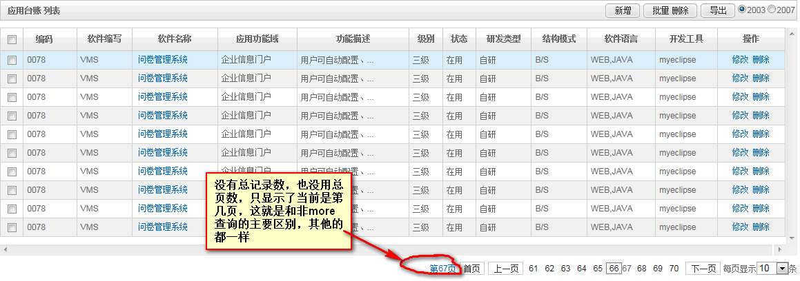
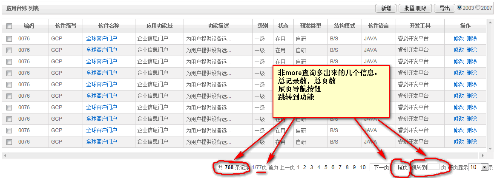

### bboss持久层More分页查询API使用介绍

为了更好地提高数据库分页查询的效率，bboss持久层在ConfigSQLExecutor和SQLExecutor两个组件中分别提供了一组实用的more分页查询接口。本文着重介绍more分页查询api的使用以及more分页查询和分页标签库结合的一些特殊特性。

**1.概述**
到目前为止bboss持久层分别提供了以下三种分页查询API：

**第一种 普通分页查询操API**

这组API自动根据查询sql语句执行总记录数获取和当前页记录集获取两个操作，对应于ConfigSQLExecutor和SQLExecutor中以queryListInfo开头的方法。这组API中返回的ListInfo对象中包含总记录数和当页记录数两个信息，除非没有查询到数据，否则一定有一页数据返回，也就是说当分页起始位置超过总记录数时，就自动返回最后一页数据；当起始位置为0或者小于零时将返回第一页数据。

**第二种 带总记录数或者传入总记录数查询sql语句的API**

这组API根据传入是总记录数还是总记录数查询sql所做的操作不一样：如果传入的是总记录数，那么这组API将只做当前页记录查询操作，不做总记录数查询操作；如果传入的是总记录数查询sql，那么除了要做当前页记录查询操作外，还要通过总记录数查询sql获取总记录数，也就是说对应的API要执行两次db操作，这种情况相对于普通分页查询API，传入的总记录数查询SQL比普通分页查询API中自动生成的总记录数查询sql效率要高很多。这组api同样对应于ConfigSQLExecutor和SQLExecutor中以queryListInfo开头的方法，只是其中多了totalsize或者totalsizesql参数。这组API中返回的ListInfo对象中包含总记录数和当页记录数两个信息，除非没有查询到数据，否则一定有一页数据返回，也就是说当分页起始位置超过总记录数时，就自动返回最后一页数据；当起始位置为0或者小于零时将返回第一页数据。

**第三种 More分页查询API**

More分页查询API也就是本文要介绍的功能，这组API只根据传入的当前页记录起始位置和每页最大记录数获取当前页的数据集，不会做总记录数查询，也就是说只做一次db操作，因此more分页查询的效率最好，但是无法提供总记录数据信息，只要在总记录数不是很重要的情况下就可以使用more分页查询方法。如果对应的起始位置没有查询到数据集将不返回任何数据，如果有数据则返回带当页数据的ListInfo对象，并且listInfo对象中没有总记录数信息，也就是调用listInfo.getTotalSize()方法始终返回0。那么More分页接口返回数据时，我们怎么判断已经到了最后一页或者是没有数据呢，首先如果获取数据起始位置为0，当调用listInfo.getResultSize()方法返回0时表示没有数据；如果获取数据起始位置大于0，当调用listInfo.getResultSize()方法返回值为0或者返回值小于每页需获取记录数时表示已经到达记录的最后一页。

普通分页查询操API和带总记录数或者传入总记录数查询sql语句API的使用方法请参考博文[《bboss持久层分页接口使用示例》](http://yin-bp.iteye.com/blog/1703344)，本文着重介绍more分页查询api的使用以及more分页查询和分页标签库结合的一些特殊特性。

**2.More分页查询api**

下面列出more分页的对应ConfigSQLExecutor组件中所有api：

Java代码 

```java
public ListInfo moreListInfoWithDBNameByRowHandler(RowHandler rowhandler,Class<?> beanType,String dbname, String sqlname, long offset,int pagesize,Object... fields) throws SQLException  
      
public ListInfo moreListInfoWithDBNameByNullRowHandler(NullRowHandler rowhandler,String dbname, String sqlname, long offset,int pagesize,Object... fields) throws SQLException  
  
public ListInfo moreListInfoWithDBName(Class<?> beanType,String dbname, String sqlname, long offset,int pagesize,Object... fields) throws SQLException  
  
public ListInfo moreListInfoByRowHandler(RowHandler rowhandler,Class<?> beanType, String sqlname, long offset,int pagesize,Object... fields) throws SQLException  
  
public ListInfo moreListInfoByNullRowHandler(NullRowHandler rowhandler, String sqlname, long offset,int pagesize,Object... fields) throws SQLException  
  
public ListInfo moreListInfoBeanWithDBNameByRowHandler(RowHandler rowhandler,Class<?> beanType,String dbname, String sqlname, long offset,int pagesize,Object  bean) throws SQLException  
  
public ListInfo moreListInfoBeanWithDBNameByNullRowHandler(NullRowHandler rowhandler,String dbname, String sqlname, long offset,int pagesize,Object bean) throws SQLException  
  
public ListInfo moreListInfoBeanWithDBName(Class<?> beanType,String dbname, String sqlname, long offset,int pagesize,Object bean) throws SQLException  
  
public ListInfo moreListInfoBeanByRowHandler(RowHandler rowhandler,Class<?> beanType, String sqlname, long offset,int pagesize,Object bean) throws SQLException  
  
public ListInfo moreListInfoBeanByNullRowHandler(NullRowHandler rowhandler, String sqlname, long offset,int pagesize,Object bean) throws SQLException  
  
public ListInfo moreListInfoBean(Class<?> beanType, String sqlname, long offset,int pagesize,Object bean) throws SQLException  
  
public ListInfo moreListInfo(Class<?> beanType, String sqlname, long offset,int pagesize,Object... fields) throws SQLException  
```

Class<?> beanType参数对应要返回的记录对应的对象类型，sqlname参数对应ConfigSQLExecutor加载的xml sql配置文件中的sql配置名称，Object... fields对应原生sql的可变长参数数组；,Object bean参数得属性对应承载了sqlname参数对应的sql语句需要的所有参数值和控制变量值，offset对应分页数据起始位置，pagesize参数指定了当页需要获取的记录数。NullRowHandler 和 RowHandler 类型参数对应了用户自定义处理记录的行处理器。

下面列出more分页的对应SQLExecutor组件中所有api：

Java代码

```java
    public ListInfo moreListInfoWithDBNameByRowHandler(RowHandler rowhandler,Class<?> beanType,String dbname, String sql, long offset,int pagesize,Object... fields) throws SQLException  
      
public ListInfo moreListInfoWithDBNameByNullRowHandler(NullRowHandler rowhandler,String dbname, String sql, long offset,int pagesize,Object... fields) throws SQLException  
  
public ListInfo moreListInfoWithDBName(Class<?> beanType,String dbname, String sql, long offset,int pagesize,Object... fields) throws SQLException  
  
public ListInfo moreListInfoByRowHandler(RowHandler rowhandler,Class<?> beanType, String sql, long offset,int pagesize,Object... fields) throws SQLException  
  
public ListInfo moreListInfoByNullRowHandler(NullRowHandler rowhandler, String sql, long offset,int pagesize,Object... fields) throws SQLException  
  
public ListInfo moreListInfoBeanWithDBNameByRowHandler(RowHandler rowhandler,Class<?> beanType,String dbname, String sql, long offset,int pagesize,Object  bean) throws SQLException  
  
public ListInfo moreListInfoBeanWithDBNameByNullRowHandler(NullRowHandler rowhandler,String dbname, String sql, long offset,int pagesize,Object bean) throws SQLException  
  
public ListInfo moreListInfoBeanWithDBName(Class<?> beanType,String dbname, String sql, long offset,int pagesize,Object bean) throws SQLException  
  
public ListInfo moreListInfoBeanByRowHandler(RowHandler rowhandler,Class<?> beanType, String sql, long offset,int pagesize,Object bean) throws SQLException  
  
public ListInfo moreListInfoBeanByNullRowHandler(NullRowHandler rowhandler, String sql, long offset,int pagesize,Object bean) throws SQLException  
  
public ListInfo moreListInfoBean(Class<?> beanType, String sql, long offset,int pagesize,Object bean) throws SQLException  
  
public ListInfo moreListInfo(Class<?> beanType, String sql, long offset,int pagesize,Object... fields) throws SQLException  
```

Class<?> beanType参数对应要返回的记录对应的对象类型，sql参数对应SQLExecutor要执行的sql语句，Object... fields对应原生sql的可变长参数数组；,Object bean参数得属性对应承载了sql参数对应的sql语句需要的所有参数值和控制变量值，offset对应分页数据起始位置，pagesize参数指定了当页需要获取的记录数。NullRowHandler和 RowHandler 类型参数对应了用户自定义处理记录的行处理器。

**3.more查询分页api使用示例**

ConfigSQLExecutor：

Java代码

```java
ListInfo datas=executor.moreListInfoBean(AppBom.class,"queryListAppBom", offset, pagesize, appcondition);  
```

SQLExecutor：

Java代码 

```java
ListInfo datas=SQLExecutor.moreListInfoBean(AppBom.class,"select * from td_app_bom where id=#[id] and name like #[name]", offset, pagesize, appcondition);  
```

  **4.more分页查询与分页标签库结合使用**

more分页查询的使用方法和前面的两种分页查询的方法使用方式是一样的，唯一的区别是返回的ListInfo对象实例datas被调用listInfo的setMore（true）方法标识为more查询返回的listInfo对象了。这个more状态标识将影响分页标签的Index分页导航标签展示行为，同时分页标签中获取到总记录数值为0，但是这个标识不会影响我们分页标签的编程使用方法，通过以下两个图对比就可以看出二者Index导航效果的区别：
more分页查询的效果  



非more分页查询的效果



上面的导航都是通过以下的index标签用法输出的：

**<pg:index tagnumber="10" sizescope="5,10,20,50,100"/>**

为了配合在pager标签上提供的statement属性指定的sql直接从数据库查询分页数据时也能使用more分页查询，我们在pager标签上提供了moreQuery属性，moreQuery为true时将使用more分页查询获取数据，false不使用，默认为false。moreQuery属性的使用方法如下：

Xml代码 

```xml
<pg:pager scope="request"  statement="select * from td_app_bom" dbname="bspf" moreQuery="true"   
   desc="false" isList="false" >  
 <pg:list>  
        <pg:cell colName="struct_mode" maxlength="8" replace="..."/>  
</pg:list>  
<pg:index tagnumber="10" sizescope="5,10,20,50,100"/>  
 </pg:pager>  
```

