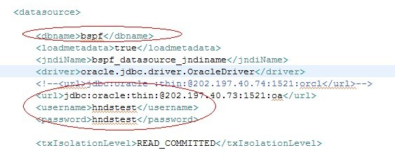
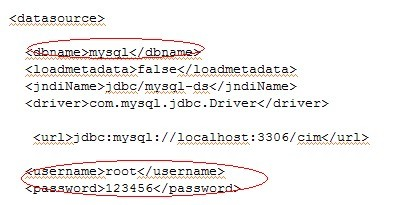
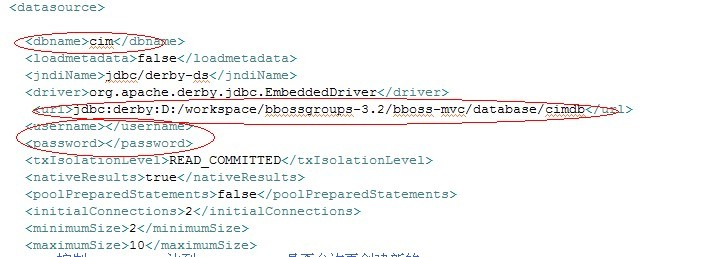

### 关于一个系统应用是否使用多个数据源（连接池）的探讨

**问**：为什么一个应用需要多个数据源

**答**：有些情况下就是有多个数据源的

**问**：如果有这样的系统耦合太大了

**答**：比如一个查询应用，可能从不同数据库服务器的数据库中查询数据，这样就会在[poolman.xml](http://yin-bp.iteye.com/blog/1112892)中配置多个数据源,不能说使用了多个数据源，系统的耦合度就增加了,两者不是一回事。

**问**：如果这样设计就很糟糕

**答**：并不是所有的应用都需要多个数据源，但是有些应用确实有这种情况，实际要求是这样的不能说这种设计就是糟糕的设计。  

**问**：查询系统应该只有select 表的权限，很明显这样应该建一个ｃｄｃ数据库用户　其他用户表的权限只授予select 给ｃｄｃ　用户，不应该将给ｄｂｎａｍｅ　权限　这样的安全有问题

**答**：查询系统的账号有可能有查询权限，也有可能有其他权限，这个东西视情况而定，比如在数据交换系统中，通常不会使用生产系统的数据库用户来做数据交换，通常会另外创建只有查询权限的用户，但是没有绝对的情况。

**问**：如果dbname 连表的owner用户　表的什么权限都有了

**答**：当然我只是那查询做个例子来说明多个数据源的情况

**问**：一般应用连ｄｂｎａｍｅ　不应该　是表的ｏｗｎｅｒ，一般的公司都ｄｂｎａｍｅ　都连表的ｏｗｎｅｒ　实际上安全有很大问题；一个ｄｂｎａｍｅ　难道不就是一个用户吗；虽然 不是oracle 用户，但是ｄｂｎａｍｅ　和ｏｒａｃｌｅ　一般也是一一对应的

**答**：dbname只是bboss持久层框架中的逻辑数据源的名字，不是oracle的用户名称，也就是poolman.xml中配置的<dbname>节点的值，两者完全是两个不同的概念。

是否使用多个数据源，是系统数据库规划问题，规划能使用几个数据库源就能使用，不能就不使用，bboss持久层提供了两套api分别对应于这两种情况。

一个dbname的定义如下，oracle定义：  

这个是mysql的数据源定义：

这个是derby数据源

**问**：有这样情况？

**答**：呵呵，数据源（也就是我们通常意义上的连接池）通常都有一个dbname这个是bboss持久层框架的要求，有的数据源会对应数据库用户，有的数据源不对应数据库用户，比如derby

而且一个应用可能会操作多种数据库，比如mysql，oracle，db2，sqlserver，还有derby，等等，呵呵  

**问**：一个应用可能同时会操作多种数据库

这耦合太大了

**答**：呵呵，那么，bboss持久层api的就提供了两组接口，一组是带dbname的，一组是不带的，如果一个系统中只有一个数据源，那么poolman.xml中就只配置一个数据源，反之就可以配置多个，使用不带dbname的api时，默认对应poolman.xml中的第一个数据源，使用带dbname的api时，那么就在对应的数据源上执行数据库操作。  

在业务系统中可能操作多个数据源的情况是普遍存在的，这个和松耦合高内聚的软件设计思想没有必然联系的，也就是说这个和松耦合高内聚的软件设计思想没有冲突的

另外一种情况，我们在一个系统中有几个大模块，为了能够方便的解耦拆分和缓解一个数据库的大压力，我们反而会引入每个模块一个数据源，每个数据源对应一个独立的数据库服务器，当然前提是每个独立的模块之间的数据库是没有关联的，呵呵

当然，如果系统规模比较大，我们会将这些系统拆分成独立的应用部署，每个应用还是可以只配自己的对应的dbname的数据源即可，这样非常方便拆分和合并应用模块的，呵呵  

**问**：别把系统搞成巨无霸系统了

**答**：那确实，不过一般情况下用不用多数据源和系统规模没有太多关系的。用多个数据源的系统不一定是大系统哦，很多小系统也有多个数据源的哦。

另外再大系统中使用多数据源，可以为访问量较大的模块分配一个独立的数据源，为访问量较小的模块分配其他的数据源，也能够使系统的性能更好。 

bboss的持久层框架api尽可能地满足各种需要，至于系统怎么去使用，可以有架构师去决定，呵呵

bboss持久层相关配置文章：

[持久层动态创建、启动、停止和使用多个数据源的方法](http://yin-bp.iteye.com/blog/1108772)

[bbossgroups实现多数据库事务](http://yin-bp.iteye.com/blog/769026)

[bboss persistent通过jndi引用外部数据源（datasource）方法](http://yin-bp.iteye.com/blog/352924)   

[bbossgroups持久层框架ConfigSQLExecutor组件api实例](http://www.iteye.com/topic/1111694)

[bbossgroups 3.1SQLExecutor组件api使用实例](http://yin-bp.iteye.com/blog/1035991) 

[bbossgroups持久层框架数据源配置文件实例](http://yin-bp.iteye.com/blog/1112892)  