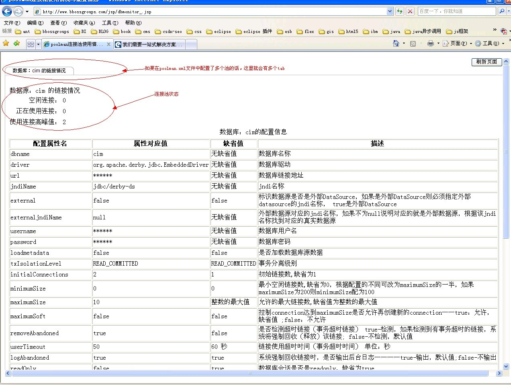
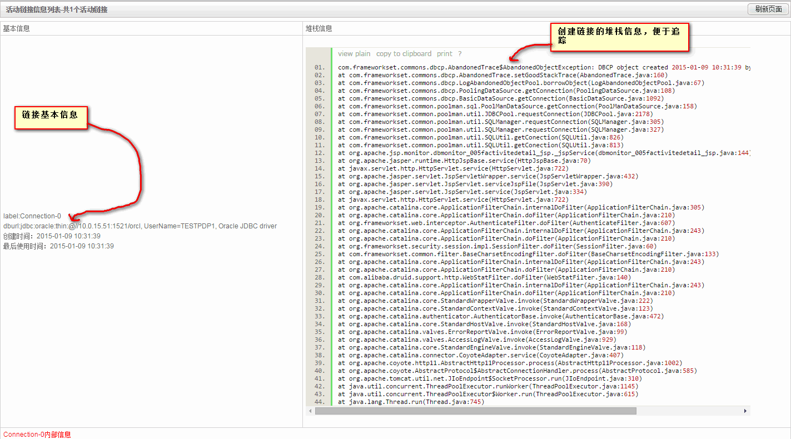
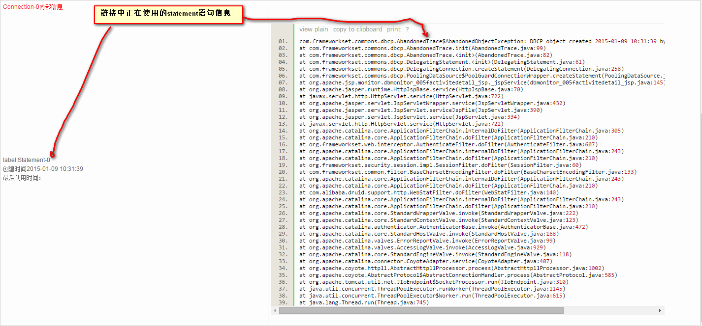

### bbossgroups 持久层监控功能介绍

本文简单地介绍一下bboss框架中的持久层监控功能的使用，先看一下实际的效果：

http://www.bbossgroups.com/monitor/dbmonitor_.jsp



相关的api如下

**1.获取所有的连接池以及遍历获取池的配置信息：**

Java代码

```java
              DBUtil dbUtil = new DBUtil();  
Enumeration enum_ = dbUtil.getAllPoolnames();  
while(enum_.hasMoreElements()){  
    String poolname = (String)enum_.nextElement();  
    JDBCPoolMetaData metadata = DBUtil.getPool(poolname).getJDBCPoolMetadata();}  
```

**2.获取指定池的实时运行数据**

空闲连接：

DBUtil.getNumIdle(poolname)

正在使用连接（活动链接数）：

DBUtil.getNumActive(poolname)

使用连接高峰值：

DBUtil.getMaxNumActive(poolname)  

**3.附带dbmonitor_.jsp源码供大家参考：**

[dbmonitor_.jsp](https://github.com/bbossgroups/bbossgroups-3.5/blob/master/bestpractice/demoproject/WebRoot/monitor/dbmonitor_.jsp)

**4.活动链接信息api**

如果想查看持久层活动链接详细信息可将poolman.xml文件中datasource的logAbandoned设置为true:

<**logAbandoned>**true<**/logAbandoned>**

这是就可以通过以下代码获取活动链接详细信息

[dbmonitor_activitedetail.jsp](https://github.com/bbossgroups/bbossgroups-3.5/blob/master/bestpractice/demoproject/WebRoot/monitor/dbmonitor_activitedetail.jsp)

Java代码

```java
import com.frameworkset.common.poolman.monitor.PoolMonitorServiceImpl   
import com.frameworkset.common.poolman.monitor.AbandonedTraceExt   
PoolMonitorServiceImpl pm = new  PoolMonitorServiceImpl();  
java.util.List<AbandonedTraceExt> traceobjects = pm.getGoodTraceObjects(dbname);  
```

监控链接详细信息效果：



链接中正在使用的statement语句信息效果：



