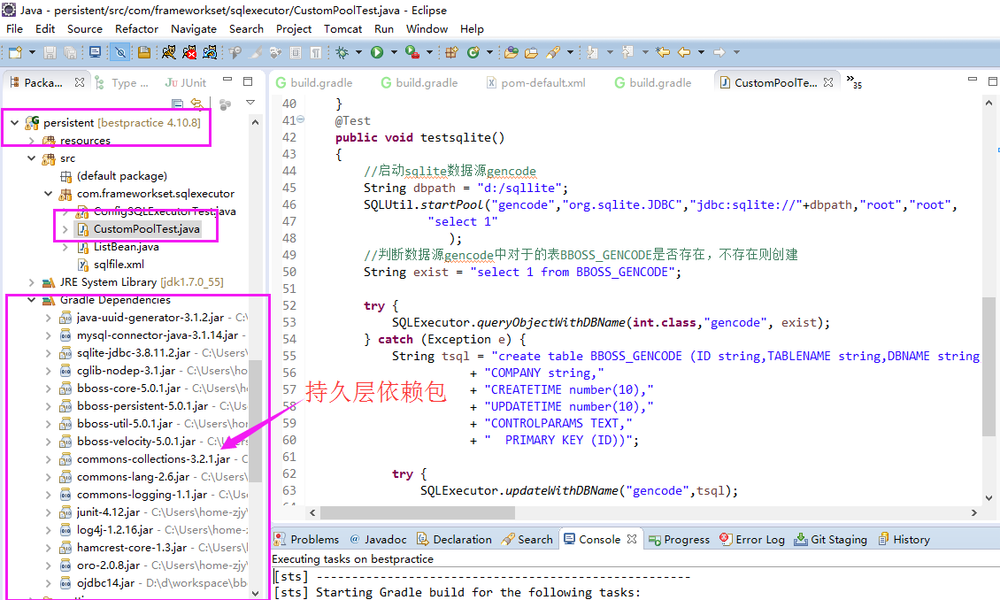

### bboss持久层快速入门教程

bboss持久层快速入门教程，快速搭建bboss持久层的开发环境，并编写一个简单的实例，实例中涉及以下功能点：

1. 动态启动数据源（基于apache dbcp2连接池组件）
2. 做一个简单的增删改查操作例子

持久层环境搭建

 

首先在项目中导入bboss 持久层包： 

**maven坐标** 

dependency 

​    groupId>com.bbossgroups /groupId

​    artifactId>bboss-persistent /artifactId

​    version>6.3.0</version 

/dependency

**gradle坐标** 

compile 'com.bbossgroups:bboss-persistent:6.3.0'

首先搭建持久层demo开发环境，下载bboss最佳实践：

git clone -b master --depth 1 https://github.com/bbossgroups/bestpractice.git

下载完毕后通过gradle插件将bestpractice导入eclipse即可：



启动一个名称叫test的oracle数据源：

Java代码

```java
SQLUtil.startPool("test",//数据源名称  
                "oracle.jdbc.driver.OracleDriver",//oracle驱动  
                "jdbc:oracle:thin:@(description=(address_list=(load_balance=off)(failover=on)"  
                + "(address=(protocol=tcp)(host=192.168.1.226)(port=1521))(address=(protocol=tcp)(host=192.168.1.227)(port=1521)))"  
                + "(connect_data=(service_name=PF1)(failover_mode=(type=select)(method=basic)(RETRIES=180)(DELAY=5))))",//oracle rac链接串  
                "mdm","123456",//数据库账号和口令  
                 "select 1 from dual" //数据库连接校验sql  
                );//初始化数据源  
```

数据源启动后，接下来就可以在test数据源上执行相关的操作：

Java代码

```java
List<String> data = SQLExecutor.queryListWithDBName(String.class,"test","select MODULE_ID from TB_MODULE_INFO where MODULE_URL like ?","%/CrmAccount/%");  
        int aid  =SQLExecutor.queryObjectWithDBName(int.class, "test","select max(to_number(AUTH_ID)) from TB_MODULE_AUTH");  
        aid ++;  
        for(String mid:data)  
        {  
            SQLExecutor.insertWithDBName("test", "insert into TB_MODULE_AUTH(AUTH_ID,ADMIN_ID,MODULE_ID) values(?,'23',?)", aid+"",mid);  
            aid = aid+1;  
        }  
           
        SQLExecutor.insertWithDBName("test", "insert into TB_MODULE_AUTH(AUTH_ID,ADMIN_ID,MODULE_ID) values(?,'23',?)", aid+"","11");  
```

再看一个基于sqlite的数据库的判断表不存在并建表的示例：

Java代码

```java
//启动sqlite数据源gencode  
        SQLUtil.startPool("gencode","org.sqlite.JDBC","jdbc:sqlite://"+dbpath,"root","root",  
                 "select 1"                
                    );  
        //判断数据源gencode中对于的表BBOSS_GENCODE是否存在，不存在则创建  
        String exist = "select 1 from BBOSS_GENCODE";  
           
        try {  
            SQLExecutor.queryObjectWithDBName(int.class,"gencode", exist);  
        } catch (Exception e) {  
            String tsql = "create table BBOSS_GENCODE (ID string,TABLENAME string,DBNAME string,FIELDINFOS TEXT,AUTHOR string,"  
                       + "COMPANY string,"  
                       + "CREATETIME number(10),"  
                       + "UPDATETIME number(10),"  
                       + "CONTROLPARAMS TEXT,"  
                       + "  PRIMARY KEY (ID))";  
                
            try {  
                SQLExecutor.updateWithDBName("gencode",tsql);  
                    
            } catch (SQLException e1) {  
                    
                e1.printStackTrace();  
            }  
        }  
```

完整的测试用例请看工程中的CustomPoolTest.java文件。

持久层更多使用方法参考文档：

[http://yin-bp.iteye.com/blog/2181720](https://www.iteye.com/blog/2181720)