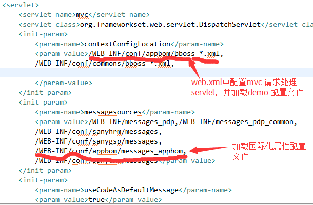

### bboss平台demo开发详解

bboss,开发平台,demo详解
本文介绍基于bboss开发平台做一个简单的demo模块-应用台账管理的代码目录结构和相关配置

**1.demo java源程序**


**2.demo jsp文件**


**3.demo组件配置文件和国际化属性文件**


**4.web.xml mvc拦截器配置装载demo组件配置文件和国际化属性文件**



**5.平台菜单配置文件将demo配置成一个菜单**


**6.在控制器、业务组件等java程序中获取登录用户会话对象和用户信息**


**Java代码**

```java
AccessControl control = AccessControl.getAccessControl();  
        String userid = control.getUserID();//获取当前用户id  
        String userAccount = control.getUserAccount();//获取当前用户账号  
        String orgid = control.getChargeOrgId();//获取当前用户所属机构id，如果有  
        Organization org = control.getChargeOrg();//获取当前用户所属机构对象，如果有  
        String systemid = control.getCurrentSystemID();//获取当前登录的子系统标识 
```

  平台登录权限相关的介绍可以通过以下文档了解：
http://yin-bp.iteye.com/blog/2113250

**7.demo运行效果**  


