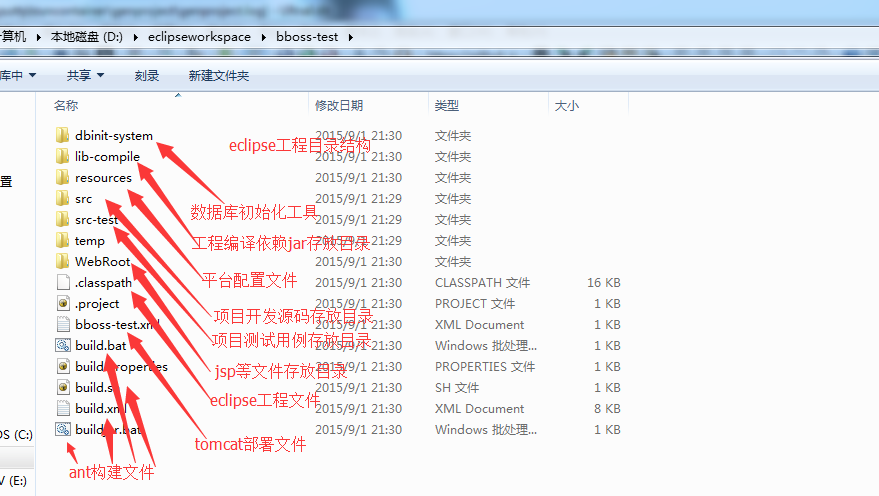
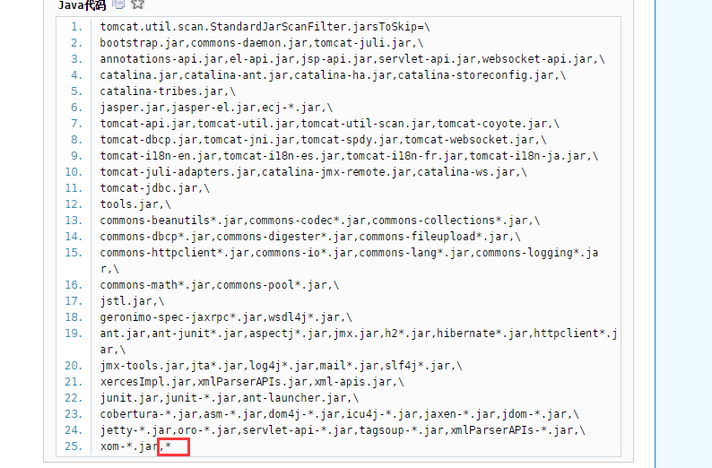
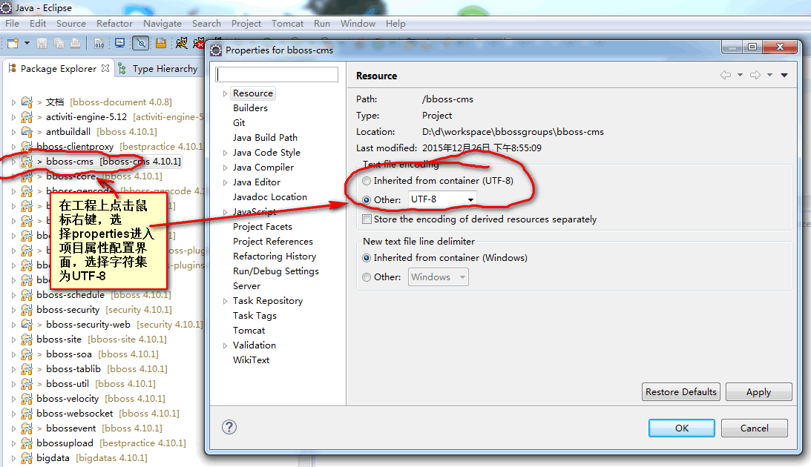
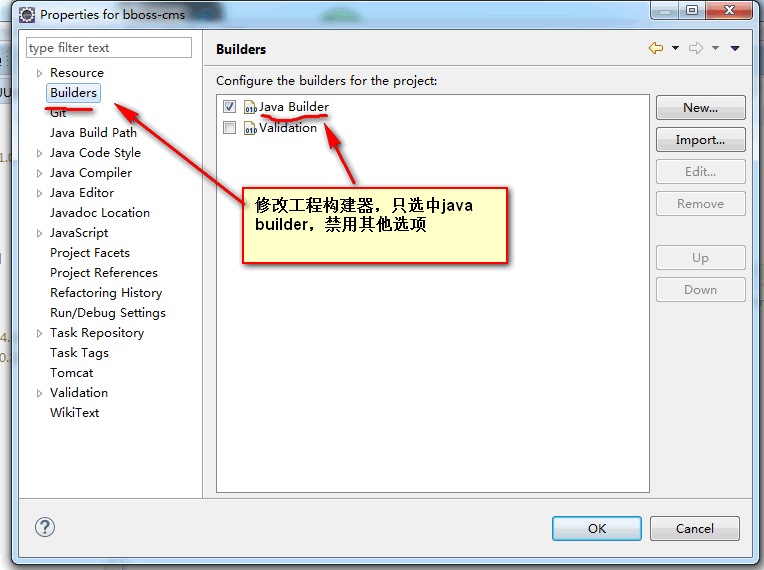
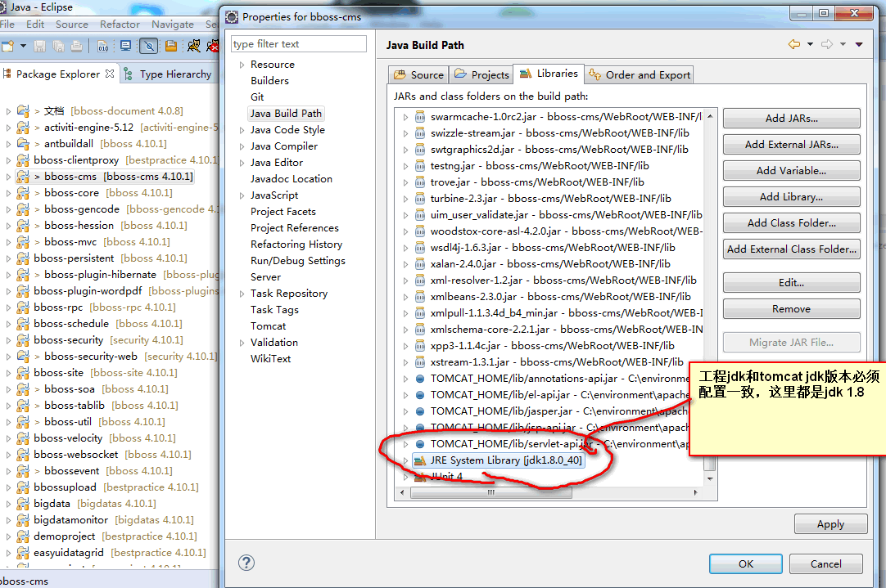
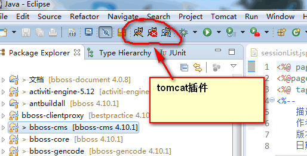
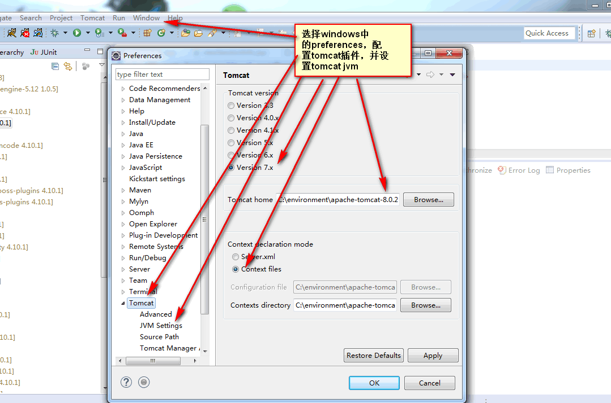
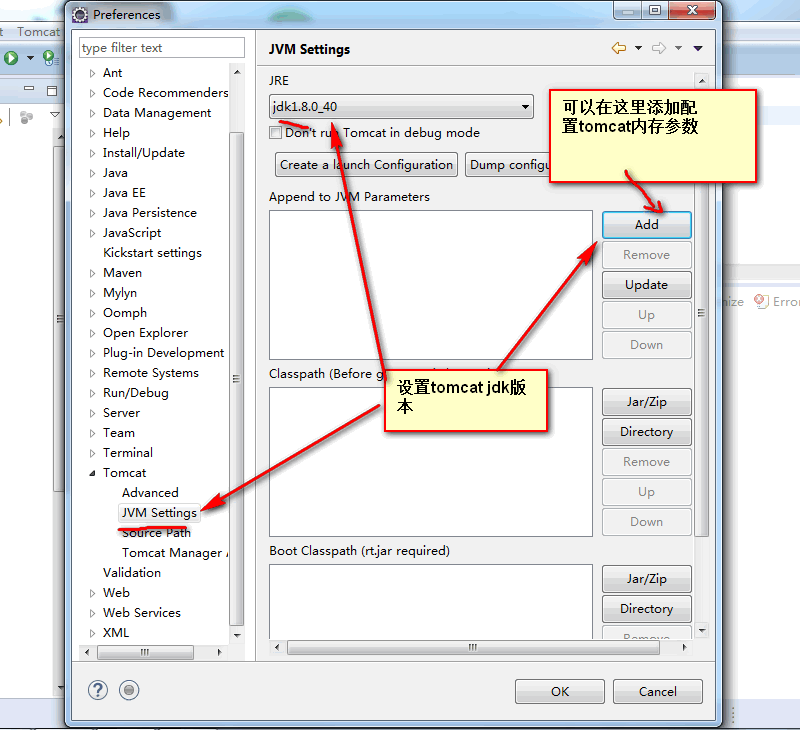
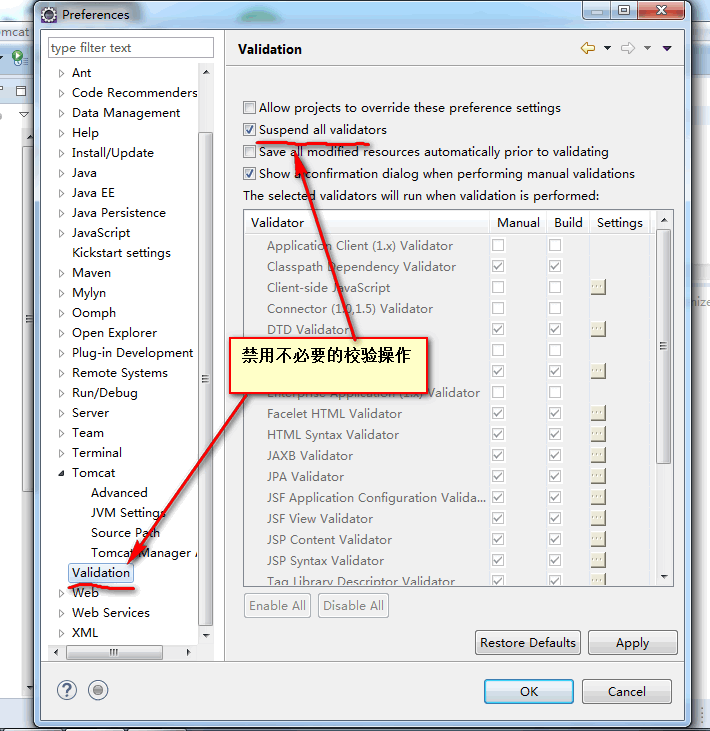

### 基于bboss开发平台eclipse开发工程生成工具介绍

  **一、工具简介**

bboss开发平台发布出两个资源包：

war部署包： [bboss.war](http://www.bbossgroups.com/tool/download.htm?fileName=bboss.war)

数据库初始化工具包： [dbinit-system.zip](http://www.bbossgroups.com/tool/download.htm?fileName=dbinit-system.zip)

本文介绍采用bboss开发平台eclipse开发工程生成工具基于上述两个资源包来生成一个全新的基于bboss开发平台的eclipse工程，工具包含以下四个部分功能：

1.生成eclipse开发工程

2.初始化化平台数据库

3.生成工程ant构建、版本发布部署脚本

4.生成tomcat的部署文件  

  **二、工具下载**

首先我们要下载生成工具：
**1.下载源码构建生成工具**

github下载地址：[下载](https://codeload.github.com/bbossgroups/genproject/zip/master)

svn下载地址：

https://github.com/bbossgroups/genproject

源码下载完毕后，执行ant构建生成工具，参考文档[bboss 版本ant构建方法及版本升级指南](http://yin-bp.iteye.com/blog/1462842)中的:
【3.在执行后续所有步骤之前，必须先下载buildtool项目：buildtool-master.zip 】小节
和【4.2.8 bboss genproject（bboss平台开发环境搭建工具）构建 】小节进行构建。
构建执行完毕后，工具将会被发布到以下目录中：
genproject/distrib/run  

**2.直接从官网下载发布包：下载**

**三.工具配置**

接下来就可以修改工具配置文件,我们根据配置文件中的配置来生成一个暂新的eclipse开发工程。

如果是下载了发布包，则只需要解压genproject.zip包，修改根目录下的config.properties文件即可。

如果是源码构建，则修改genproject/distrib/run目录下的配置文件：config.properties

config.properties内容如下：

Java代码

```java
#工具主程序  
mainclass= org.frameworkset.platform.genproject.GenProject  
  
#指定数据库压缩包的存放目录地址  
#db_init_tool=D:/d/workspace/bboss-cms/distrib/dbinit-system.zip  
#指定平台war包的存放目录地址  
#war=D:/d/workspace/bboss-cms/distrib/WebRoot.war  
  
#get lastest version of public development platform from hudson server.  
#db_init_tool=http://10.0.15.39:8888/hudson/job/v1.2.1.20150518/lastSuccessfulBuild/artifact/distrib/dbinit-system.zip  
#war=http://10.0.15.39:8888/hudson/job/v1.2.1.20150518/lastSuccessfulBuild/artifact/distrib/bboss.war  
  
#get lastest version of public development platform from bboss website.  
db_init_tool=http://www.bbossgroups.com/tool/download.htm?fileName=dbinit-system.zip  
war=http://www.bbossgroups.com/tool/download.htm?fileName=bboss.war  
  
#if db_init_tool and war not setted,this tool will use dbinit-system.zip and bboss.war which be putted in directory arches.  
  
#生成的eclipse工程存放目录,可以根据实际情况修改  
eclipseworkspace=D:/eclipseworkspace  
#eclipse工程名称,可以根据实际情况修改  
projectname=bboss-test  
#生成工程时先清除之前的文件,可以根据实际情况修改  
clearproject=true  
  
  
#标识是否需要执行数据库初始化操作,可以根据实际情况修改  
initdb=true  
  
#数据库连接池配置信息,可以根据实际情况修改,也可以使用mysql  
#oracle  
driverClassName=oracle.jdbc.driver.OracleDriver  
url=jdbc:oracle:thin:@//localhost:1521/orcl  
username=BBOSSTEST   
password=BBOSSTEST  
validationQuery=select 1 from dual  
  
#mysql  
#driverClassName=com.mysql.jdbc.Driver  
#url=jdbc:mysql://10.0.15.134:3306/bbosstest  
#username=root  
#password=123456  
#validationQuery=select 1  
```

配置文件中只需要修改数据库连接池配置信息配置信息、生成的eclipse工程存放目录、eclipse工程名称、指定平台war包的存放目录地址、指定数据库压缩包的存放目录地址4个部分的内容即可。

  oracle配置：
\#oracle
driverClassName=oracle.jdbc.driver.OracleDriver
url=jdbc:oracle:thin:@//localhost:1521/orcl
username=BBOSSTEST
password=BBOSSTEST
validationQuery=select 1 from dual

mysql配置：mysql数据库引擎必须采用Innodb引擎，数据库字符编码必须采用UTF-8
\#mysql
driverClassName=com.mysql.jdbc.Driver
url=jdbc:mysql://10.0.15.134:3306/bbosstest
username=root
password=123456
validationQuery=select 1  

根据需要注释或者放开对应的数据库配置。

如果出现mysql客户端中文乱码问题，可以在url中指定utf-8字符编码，例如：jdbc:mysql://localhost:3306/itwork?useUnicode=true&characterEncoding=utf-8**

在数据源的配置文件中，需要对&进行特殊处理用cdata转义即可：
property name="url"![CDATA[jdbc:mysql://localhost:3306/spiderweb?useUnicode=true&characterEncoding=utf-8]]>/property

  **四、运行工具生成开发工程**

修改完毕后保存，接下来执行genproject/distrib/run/setup.bat指令或者genproject/setup.bat即可,将会：

1.生成eclipse开发工程，导入eclipse或者myeclipse即可开始基于bboss业务系统的开发之旅

2.初始化化平台数据库连接池配置

3.初始化平台数据库（initdb设置为true时）

4.生成工程ant构建、版本发布部署脚本，执行构建指令将会发布出新项目的jar包和war包

5.生成tomcat的部署文件，可以将其拷贝到tomcat/conf/Catalina/localhost目录下，直接部署刚生成的web应用，访问地址为：
http://localhost:8080/projectname  

**其中projectname对应为config.properties文件中的projectname属性，打开的登陆页面输入账号admin，口令123456即可访问新建的项目了。**
**最终生成的eclipse工程目录结构图（假设工程名称为:bboss-test）:**



我们直接将生成的工程导入eclipse，编译通过后，将tomcat部署文件bboss-test.xml拷贝到tomcat/conf/Catalina/localhost目录下，然后启动tomcat，在浏览器中输入：

使用账户admin，口令123456即可访问bboss-test这个项目了。

如果在tomcat启动过程中出现以下异常：

Java代码 

```java
SEVERE: ContainerBase.addChild: start:  
  
Caused by: java.lang.IllegalStateException: Unable to complete the scan for annotations for web application [/bboss-test] due to a StackOverflowError. Possible root causes include a too low setting for -Xss and illegal cyclic inheritance dependencies. The class hierarchy being processed was [org.jax  
en.util.AncestorAxisIterator->org.jaxen.util.AncestorOrSelfAxisIterator->org.jaxen.util.AncestorAxisIterator]       

```

那么可以修改tomcat配置文件apache-tomcat-xxxx\conf\catalina.properties,在配置项
tomcat.util.scan.StandardJarScanFilter.jarsToSkip
（某些版本可能是tomcat.util.scan.DefaultJarScanner.jarsToSkip）
的后面加一个*即可，如下所示：



  **五、注意事项**

工具在执行过程中会可能会下载平台war包和数据库初始化zip包：
如果config.properties中没有指定db_init_tool和war这两个属性，则直接从genproject/arches目录下查找平台的两个资源包（我们可以手动到bboss官网下载这两个资源包并放入genproject/arches目录：[dbinit-system.zip](http://www.bbossgroups.com/tool/download.htm?fileName=dbinit-system.zip)，[bboss.war](http://www.bbossgroups.com/tool/download.htm?fileName=bboss.war)，这样就可以把配置文件中的db_init_tool和war这两个属性注释掉）
如果db_init_tool和war两个属性指定为本地目录的其他地址，（我们可以手动到bboss官网下载这两个资源包并放入特定的目录下：[dbinit-system.zip](http://www.bbossgroups.com/tool/download.htm?fileName=dbinit-system.zip)，[bboss.war](http://www.bbossgroups.com/tool/download.htm?fileName=bboss.war)，这样就可以把配置文件中的db_init_tool和war这两个属性配置对应的目录即可  

如果db_init_tool和war两个属性配置为官网地址或者hudson持续集成服务器地址，则在执行过程中自动下载这两个资源包，然后继续生成eclipse工程。

**六、工程环境设置**

**1.eclipse工程编码必须设置为utf-8****



**2.eclipse工程builder设置**



**3.eclipse工程jdk版本设置**



**4.eclipse tomcat插件设置**

eclipse tomcat plugin下载地址：[下载](http://www.eclipsetotale.com/tomcatPlugin.html) 下载完毕解压到eclipse\dropins目录下即可





tomcat jdk版本设置必须和工程jdk版本一致：



**5.禁用eclipse validation机制**

禁用eclipse validation机制，提升eclipse开发效率，避免不必要的校验操作

