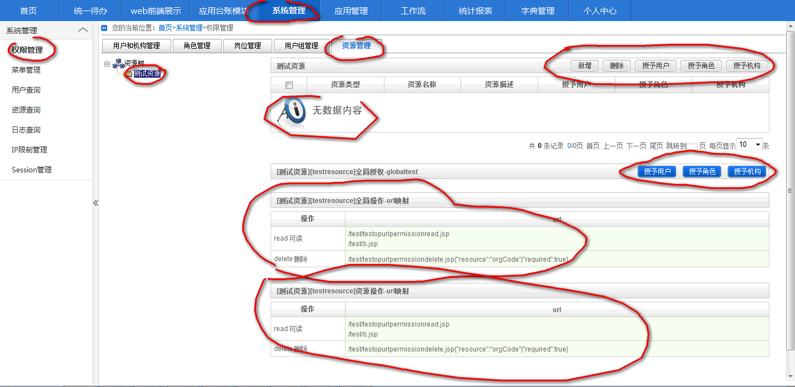

### 平台自定义资源权限控制使用方法

本文以一个简单的实例来介绍bboss平台自定义资源权限控制使用方法。先定义一个资源类型，关联一操作组，操作组中定义的操作都关联了一组url，这些url访问权限与操作的权限一致，用户拥有操作的权限也就拥有了关联的url的权限（这样可以有效防止低权限用户）；然后介绍如何通过安全组件在程序实现权限的检测功能。

1.定义资源类型和资源操作组并定义操作关联的url

在resources目录下新增一个resource-test.xml文件，在文件中添加资源类型和资源操作组：

Xml代码

```xml
<?xml version="1.0" encoding="UTF-8"?>  
<resources >  
    <!--  
        操作组定义：  
        定义系统资源的操作组，不同的资源类型涉及不同的操作组，操作组中定义同一类型的操作  
    -->     
     <group id="globaltestgroup" name="全局测试权限组" >  
        <operation id="read" priority="10" name="可读" >  
            <!--   
                操作对应的一系列url，如果用户没有操作的权限也就没有相应的url的访问权限，也就是说  
                没有操作的权限，在浏览器直接访问url，也无法访问  
                url可以有多个，同时可以为以下有效模式：  
                /test/testsss.jsp  
                /test/*.jsp  
                /test/**/*.jsp  
             -->  
            <authoration>           
                <url>/test/testopurlpermissionread.jsp</url>  
                <url>/test/b.jsp</url>  
            </authoration>  
        </operation>  
          
        <operation id="delete" priority="30" name="删除" >  
            <!--   
                url说明：                
                地址分两部分：  
                第一部分是url地址必选项/test/testopurlpermissiondelete.jsp                  
                第二部分是json格式的参数，其中资源操作参数resource，必选项参数，resource参数值对应一个request请求参数名称，  
                对应的request参数值匹配一个资源标识，匹配url的资源操作权限资源标识必须和其保持一致，  
                参数required标识resource是否必须false表示如果url /test/testopurlpermissiondelete.jsp可以带资源码参数，也可以不带，  
                如果带了则按照resource匹配规则来控制url访问权限，true标识必须带资源码，如果没带直接阻止url访问。  
             -->  
            <authoration>                
                <url><![CDATA[/test/testopurlpermissiondelete.jsp{"resource":"orgCode"|"required":true}]]></url>  
            </authoration>  
        </operation>  
          
     </group>  
     <!-- 资源类型定义   
     system指定了资源关联的子系统标识，只有与资源类型关联后，在相应的子系统的权限管理中才会出现对应的资源类型，才能对资源类型中的资源对应的操作进行授权（可以对用户、机构、和角色进行授权）  
     -->  
    <resource id="testresource" name="测试资源" auto="false" system="cms,module">  
    <!--关联资源操作组-->  
        <operationgroup groupid="globaltestgroup"/>  
    <!-- 定义一个全局资源，并声明其关联的操作组 -->  
        <globaloperationgroup globalresourceid="globaltest" groupid="globaltestgroup"/>  
    </resource>  
</resources>  
```

resource-test.xml文件写好后需要配置到/resources/config-manager.xml文件中，以便平台启动时加载resource-test.xml定义的资源类型和资源操作信息。可以在resource-test.xml文件中配置多个资源类型。/resources/config-manager.xml装载资源文件实例如下：

Xml代码

```xml
<resources module="console" languages="zh_CN,en_US">  
          <resourcefile src="resource.xml" desc="公用权限授予资源配置文件"/>  
          <resourcefile src="resources-sys.xml" desc="系统管理资源配置文件"/>         
          <resourcefile src="resources-content.xml" desc="内容管理资源配置文件"/>  
          <resourcefile src="resources-test.xml" desc="测试资源配置"/>  
            
        </resources>  
```

2.资源授权界面



3.权限控制

接下来介绍在程序中如何进行权限控制。

java代码中的权限检测

Java代码

```java
com.frameworkset.platform.security.AccessControl accesscontroler = com.frameworkset.platform.security.AccessControl.getAccessControl(); //获取平台当前用户会话对象  
    boolean hasdeletepermission = accesscontroler.checkPermission("globaltest",//资源id  
                                                                "delete",//资源操作  
                                                                "testresource"//资源类型  
                                                                );//返回boolean值，true标识有权限，false标识没有权限 
```

在jsp中结合true/false标签来控制界面元素是否显示或者按钮是否带处理事件：

Html代码

```html
<%  
    com.frameworkset.platform.security.AccessControl accesscontroler = com.frameworkset.platform.security.AccessControl.getAccessControl(); //获取平台当前用户会话对象  
    boolean hasdeletepermission = accesscontroler.checkPermission("globaltest",//资源id  
                                                                "delete",//资源操作  
                                                                "testresource"//资源类型  
                                                                );//返回boolean值，true标识有权限，false标识没有权限  
      
%>  
<pg:true actual="<%=hasdeletepermission %>">  
                            <a href="#"  onclick="delteUse();">删除用户</a>  
                        </pg:true>  
                        <pg:false actual="<%=hasdeletepermission %>">  
                            没有删除用户的权限  
                        </pg:false>  
```

