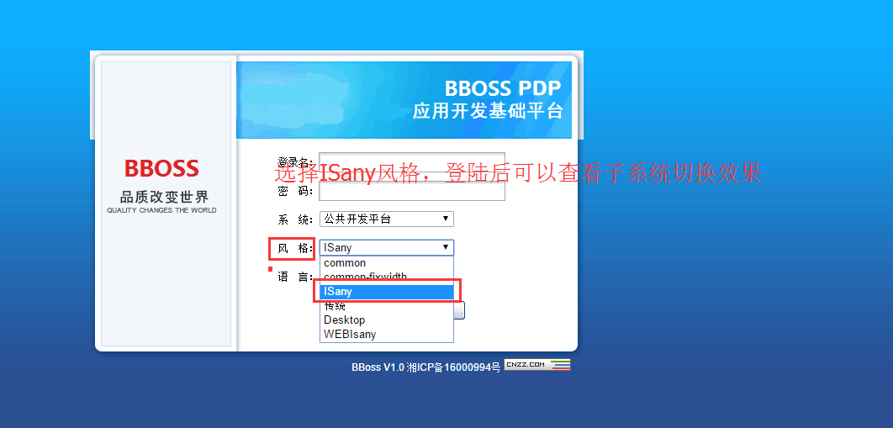
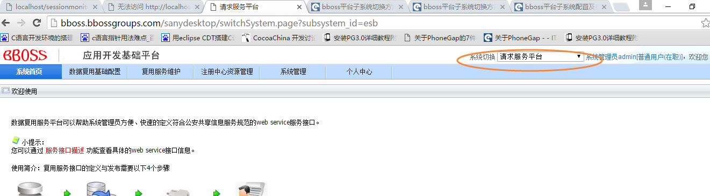

### bboss平台子系统切换方法

用户登录bboss平台后，可以在首页上切换子系统，切换子系统的请求地址和参数为：
旧版本平台：/sanydesktop/switchSystem.page?subsystem_id=esb
新版本平台：/sso/switchSystem.page?subsystem_id=esb

  通过subsystem_id参数指定要切换的子系统id，子系统id的配置和查看请参考文档：

[bboss平台子系统配置及系统登录以及其它常用配置介绍](http://yin-bp.iteye.com/blog/2246714)  

演示效果
http://bboss.bbossgroups.com
登录账户：admin
登录口令：123456
选择风格：ISany

