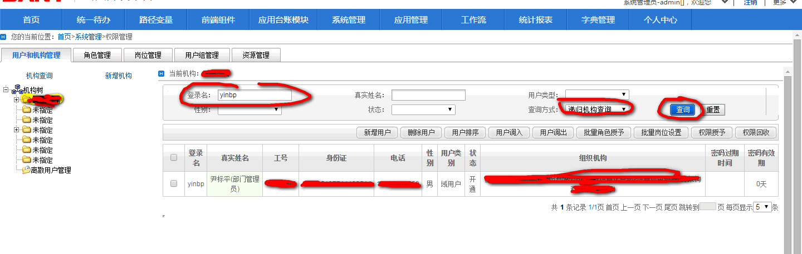
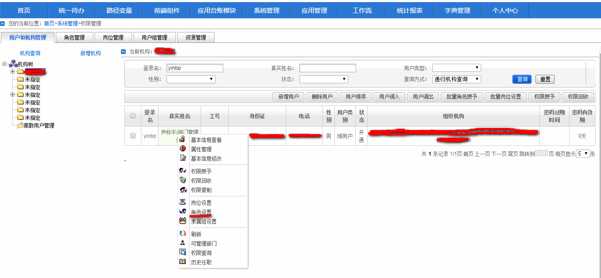
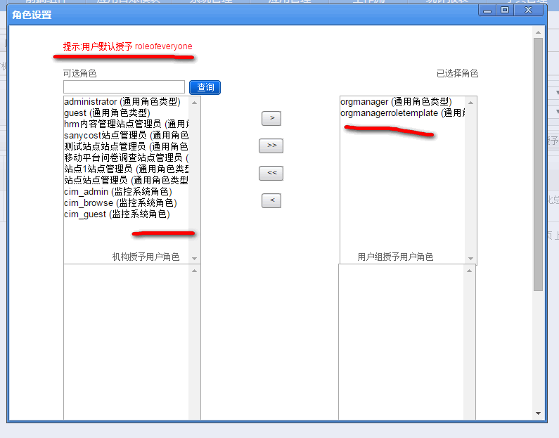
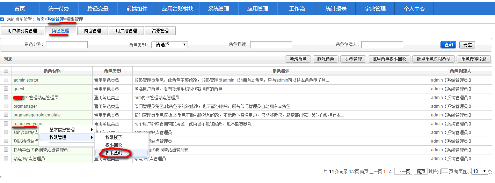
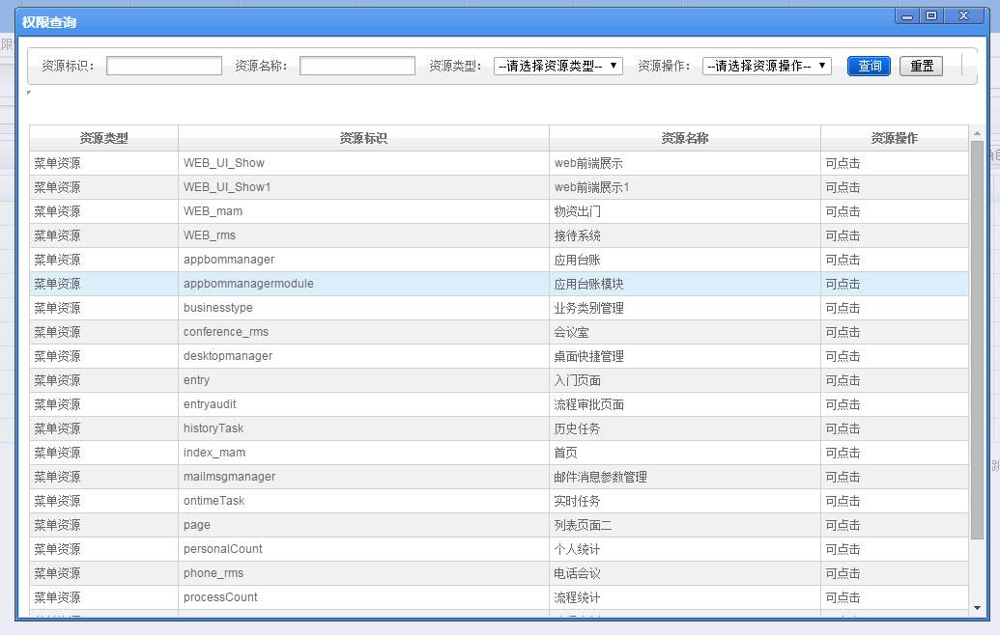
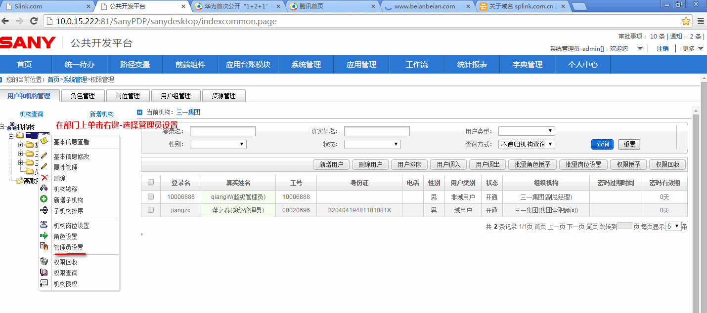
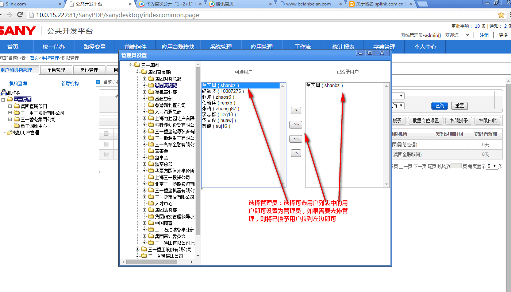

### 平台中用户查找、用户角色查询、用户权限查询、部门管理设置方法

  **1.平台中用户查找**

菜单导航路径

系统管理-权限管理-用户和机构管理

具体操作：

选择一个机构，输入登录名称，或者中文名称，选择是否递归查询，点击查询即可  



  **2.用户角色设置和角色查询**

菜单导航路径

系统管理-权限管理-用户和机构管理

具体操作：

按照第一条查询到需要操作的用户，在用户真实名称上点击右键-选择角色设置，示意图：
  



  **3.用户权限查询**

参考上面出现的右键菜单，选择其中的权限查询项即可查询用户权限以及用户权限的来源（用户直接授予的权限、用户角色权限、roleofeveryone角色权限）


新建的用户默认拥有roleofeveryone角色，所有就拥有了roleofeveryone角色拥有的权限，查看roleofeveryone角色权限的方法：

菜单导航路径

系统管理-权限管理-角色管理

具体操作在roleofeveryone点击右键，选择权限查询，示意图：  





权限配置文件（resources/resource-xxx.xml）中声明的unprotected资源权限，可以在【系统管理-资源查询-特殊资源查询】中查到，这些资源用户也会默认拥有，如果要去掉的话，参考下面的内容。权限配置文件（resources/resource-xxx.xml）中声明的unprotected资源权限查看和配置管理方法：
打开resources/resource-xxx.xml文件，找到资源定义，如下示意：

Xml代码

```xml
<resource id="column" name="菜单资源"  i18n:en_US="Menu Resource"   class="resColumnTree.jsp" auto="true" allowIfNoRequiredRole="false" struction="tree"  system="module,cms">  
        <unprotected resourceid="personuserinfomodify" />  
        <unprotected resourceid="personsecretpassword" />  
        <unprotected resourceid="appManager" />  
        <unprotected resourceid="appManageItem" />  
                      
        <!--<unprotected resourceid="contentManageItem" />-->  
        <!--<unprotected resourceid="templetmanager" />-->  
        <!--定义非未受保护的特殊资源-->  
        <!--<unprotected resourceid="indexpage" >-->  
        <!--<operation id="visible"/>-->  
        <!--</unprotected>-->  
  
        <!--unprotected resourceid="indexpage" ></unprotected>-->  
        <!--<unprotected resourceid="sitebuilder" >-->  
        <!--<operation id="unvisible"/>-->  
        <!--</unprotected>-->  
        <!-- 
        控制特定的资源除了超级管理员外，其他人都访问不了的资源 
        -->  
        <!--<exclude resourceid="sysuserpassword"/>-->  
        <!--<exclude resourceid="sitebuilder">-->  
        <!--<operation id="visible"/>-->  
        <!--</exclude>-->  
        <!--定义资源操作组-->  
        <operationgroup groupid="group23"/>  
    </resource>  
```

其中的unprotected元素属性resourceid指定了一个所有认证用户都可以访问的资源权限。

**4.用户可以从用户所属的机构继承权限，机构权限设置和管理方法：**

系统管理-权限管理-用户和机构管理

在机构树上右键点击机构，在出现的右键菜单上可以进行角色设置、机构授权、权限查询、权限回收操作

  **5.部门管理设置**

平台权限管理功能需要部门管理员用户和超级管理员才能访问，因此需要在权限管理中将相关的用户设置为部门管理员，设置方法如下：

菜单导航：

系统管理-权限管理-用户和机构管理

设置示意图：  



