### bboss 与ecipse gradle buildship插件结合使用方法

 本文介绍bboss 与ecipse gradle buildship插件结合使用方法，但是建议使用gradle sts插件来在eclipse中构建和开发使用bboss框架的项目：[点击浏览](http://yin-bp.iteye.com/blog/2313145)
gradle buildship和Gradle IDE Pack（bboss官方推荐，个人感觉Gradle IDE Pack的任务面板更加符合大众的操作习惯，基于此推荐Gradle IDE Pack）是目前比较流行的两个eclipse gradle插件
环境准备：
在命令行执行以下指令(先安装好[git工具](http://dlsw.baidu.com/sw-search-sp/soft/4e/30195/Git-2.7.2-32-bit_setup.1457942412.exe)并配置好环境变量)

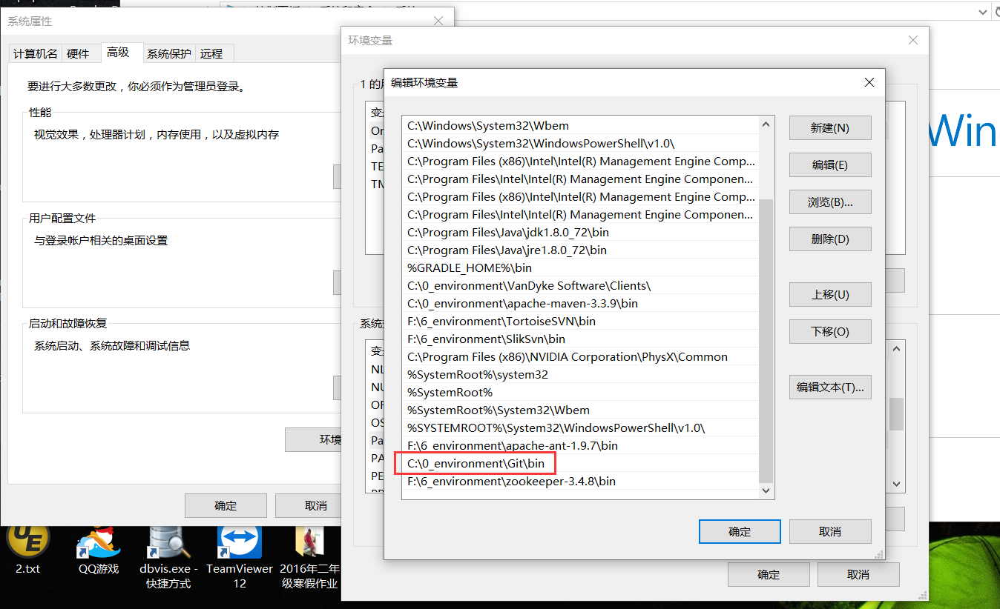

  **下载bboss bestpractice源码**
假定源码存放目录d:/workspace/

cd d:/workspace
git clone -b master --depth 1 https://github.com/bbossgroups/bestpractice.git

**1.eclipse中安装gradle buildship插件（gradle官方推荐,bboss不推荐）并导入bestpractice工程**
**1.1 安装gradle buildship插件**  

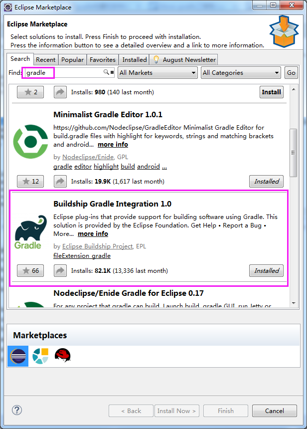

**1.2 通过gradle bs将bestpractice工程导入eclipse**

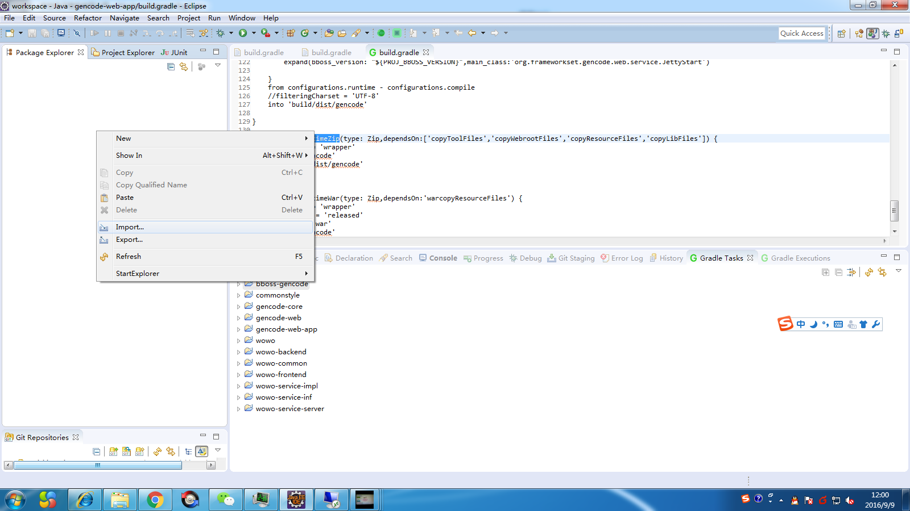

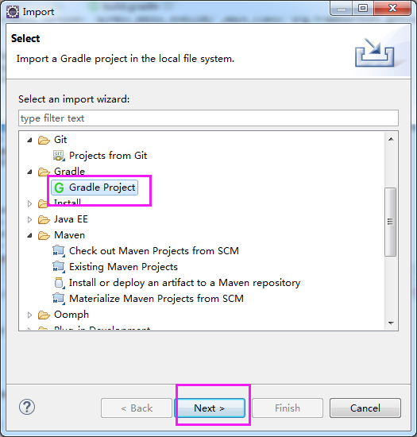

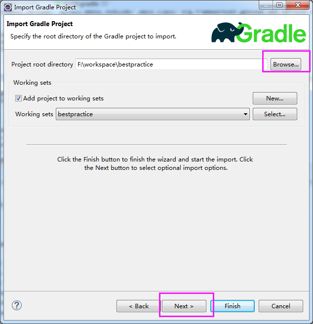

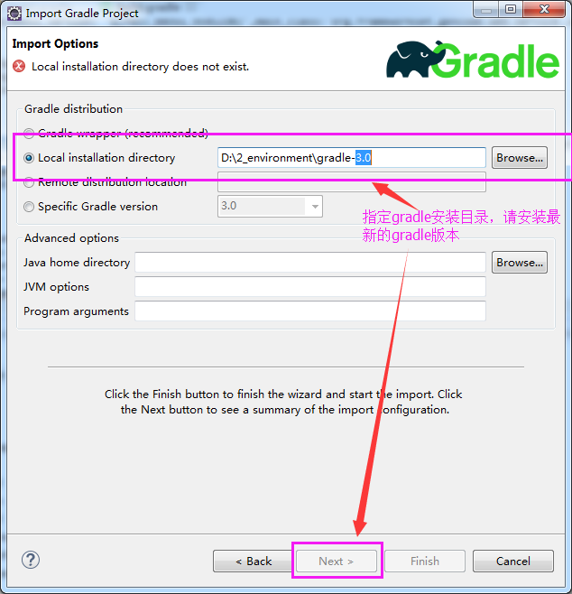

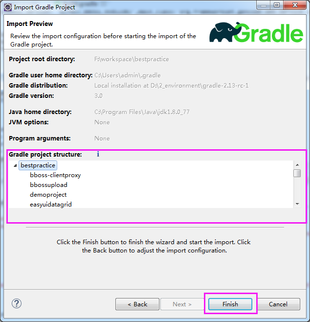

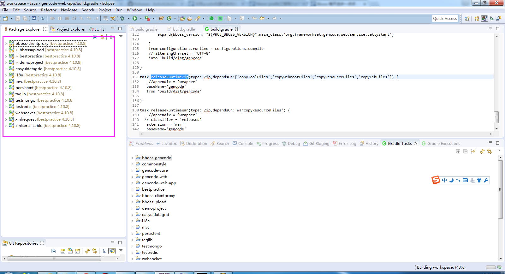

**1.3 运行bestpractice/mvc gradle任务：部署和启动mvc web应用**

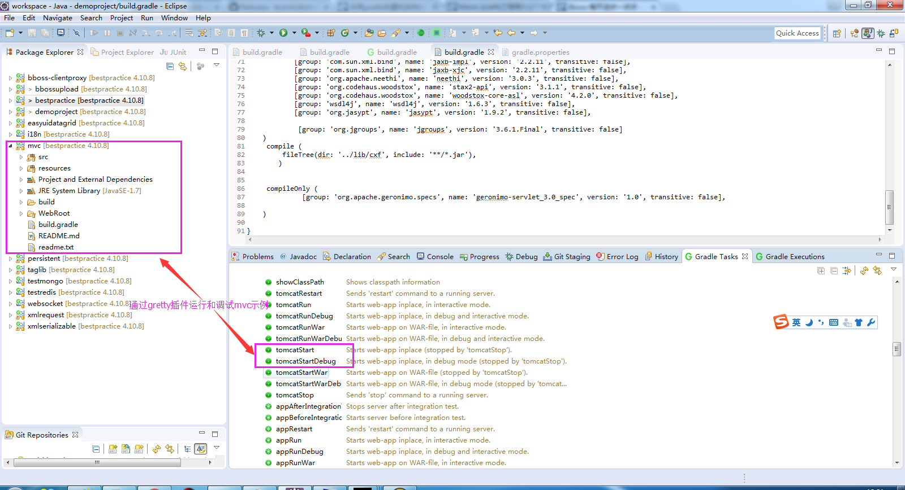

**1.4 通过gradle sts结合gretty插件调试web应用**

打开gradle tasks面板

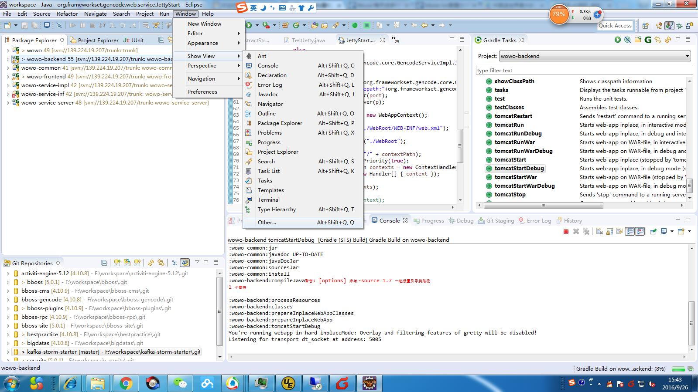

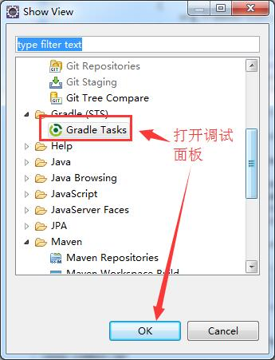

选择要调试的工程并启动调试端口：

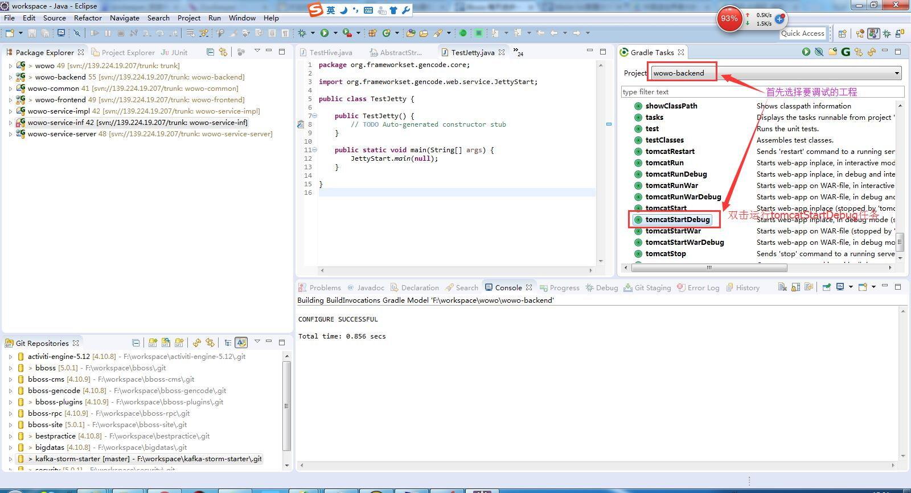

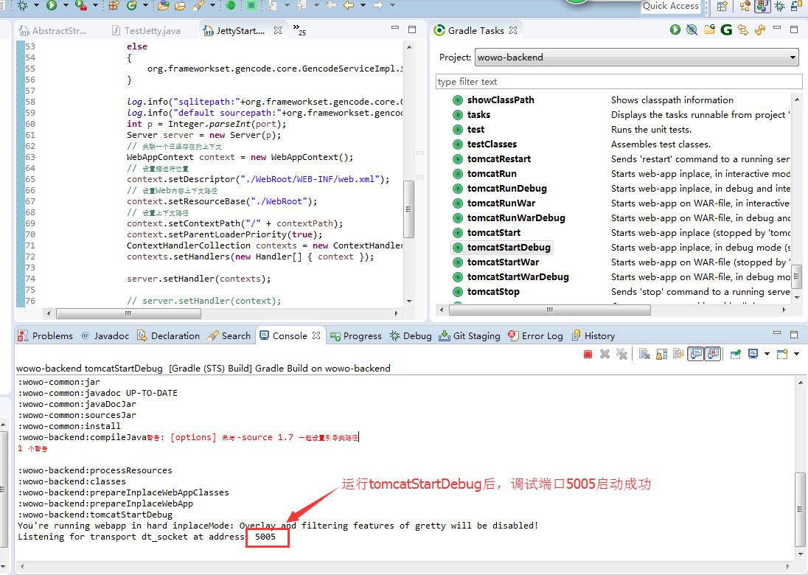

设置需要调试应用的端口：

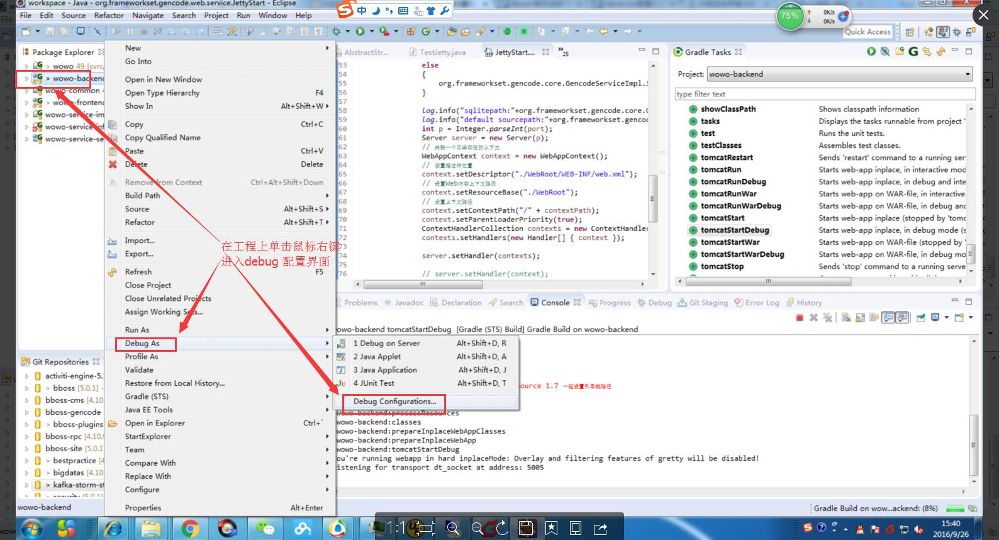

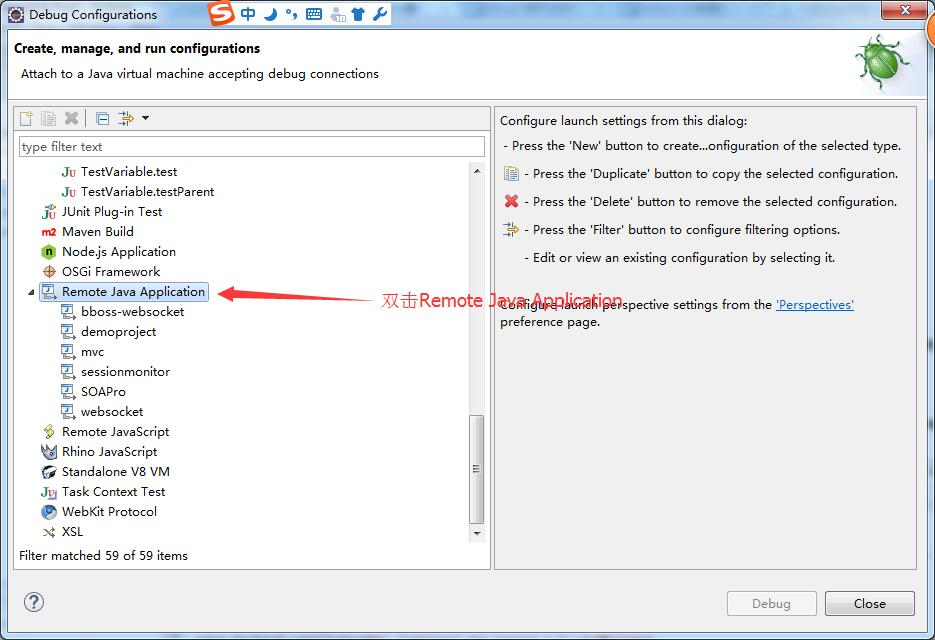

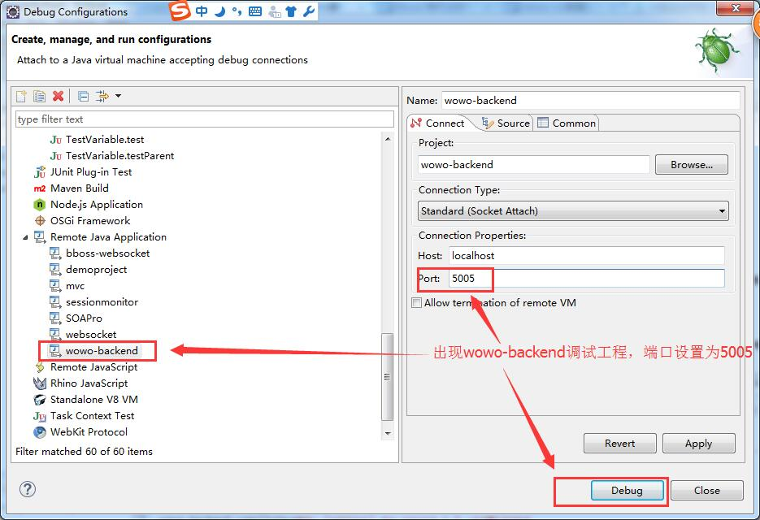

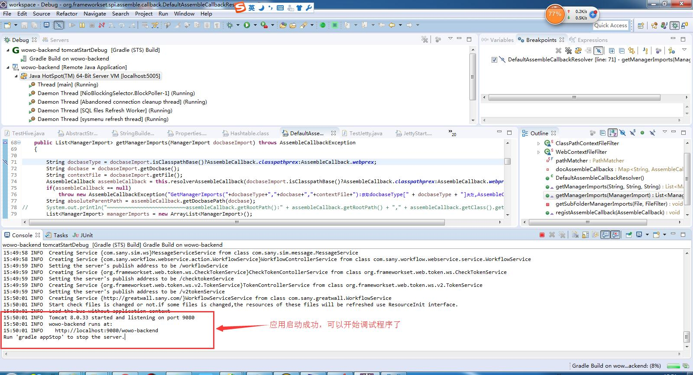

这样调试应用就启动起来了，可以在浏览器中访问应用并开始调试工作了，这种调试方法比较烦锁，运行jetty容器主程序来启动和调试应用的快捷和轻量级方法。