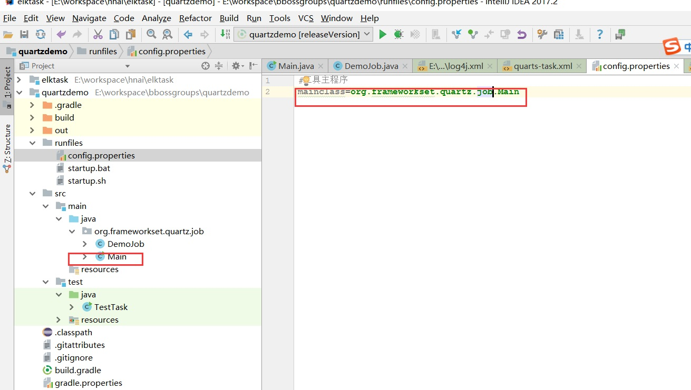
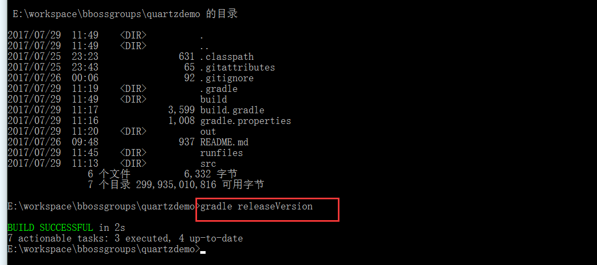
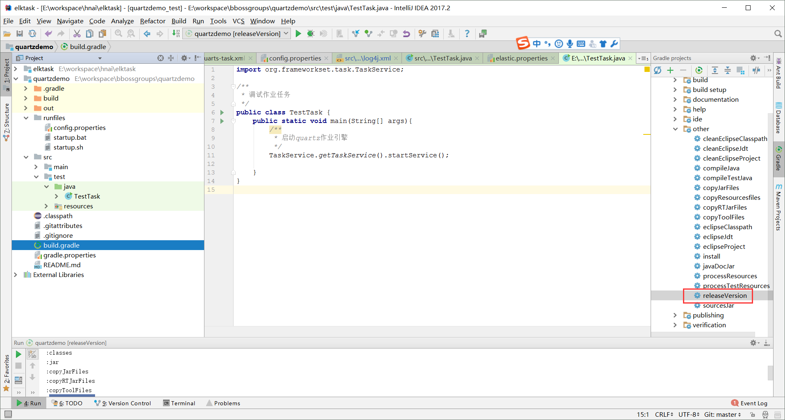
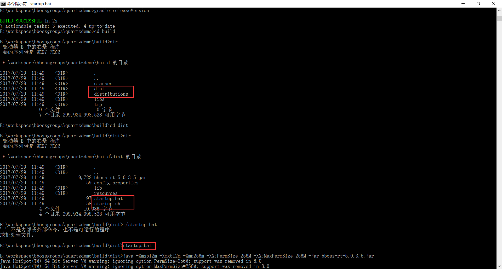

## bboss quartz定时任务使用案例介绍

本文demo gradle工程源码地址：
https://github.com/bbossgroups/quartzdemo

### **1.导入bboss quartz**

**maven坐标**

Xml代码

```xml
<dependency>  
    <groupId>com.bbossgroups</groupId>  
    <artifactId>bboss-schedule</artifactId>  
    <version>6.0.5</version>  
</dependency>  
```

  **gradle坐标**
compile 'com.bbossgroups:bboss-schedule:6.0.5'

bboss 整合quartz版本为**quartz 2.3.0**。 

###  **2.定义作业处理任务**

Java代码

```java
package org.frameworkset.quartz.job;  
  
  
/** 
 * 定时任务实现类 
 */  
public class DemoJob {  
    /** 
     * 定时任务需要依赖的参数 
     */  
    private String jobParam ;  
    private String jobParam1;  
    /** 
     * 定时任务方法 
     */  
    public void jobmethod(){  
        System.out.println("execute job method:jobParam="+jobParam+",jobParam1="+jobParam);  
  
    }  
}  
```

**定时任务配置**

在bboss quartz任务配置文件org/frameworkset/task/quarts-task.xml中添加定时任务：

Xml代码

```xml
<!--  
    任务调度 
-->  
<properties>  
    <!--<config file="elastic.properties"/>-->  
    <!--quartz引擎配置参数，参考quartz官方配置文档  
           
    http://www.quartz-scheduler.org/documentation/quartz-2.2.x/configuration/  
第一部分      
-->  
    <property name="quartz.config">  
        <map>  
            <property name="org.quartz.scheduler.instanceName" value="DefaultQuartzScheduler111" />  
            <property name="org.quartz.scheduler.rmi.export" value="false" />  
            <property name="org.quartz.scheduler.rmi.proxy" value="false" />  
            <property name="org.quartz.scheduler.wrapJobExecutionInUserTransaction" value="false" />  
            <property name="org.quartz.threadPool.class" value="org.quartz.simpl.SimpleThreadPool" />  
            <property name="org.quartz.threadPool.threadCount" value="10" />  
            <property name="org.quartz.threadPool.threadPriority" value="5" />  
            <property name="org.quartz.threadPool.threadsInheritContextClassLoaderOfInitializingThread" value="true" />  
            <property name="org.quartz.jobStore.misfireThreshold" value="6000" />  
            <property name="org.quartz.jobStore.class" value="org.quartz.simpl.RAMJobStore" />  
        </map>  
        <!-- for cluster -->  
          
    </property>  
<!--第二部分-->  
    <property name="taskconfig" enable="true">  
        <list>  
            <property name="定时任务执行器" taskid="default"  
                class="org.frameworkset.task.DefaultScheduleService" used="true">  
                <!--  
                    可执行的任务项  
                    属性说明：  
                    name：任务项名称  
                    id:任务项标识  
                    action:具体的任务执行处理程序,实现org.frameworkset.task.Execute接口  
                    cron_time：  cron格式的时间表达式，用来管理任务执行的生命周期，相关的规则请参照日期管理控件quartz的说明文档  
                    基本格式 : [参数间必须使用空格隔开]  
                    *　　*　　*　　*　　*　　command  
                    分　时　日　月　周　命令  
  
                    第1列表示分钟1～59 每分钟用*或者 */1表示  
                    第2列表示小时1～23（0表示0点）  
                    第3列表示日期1～31  
                    第4列表示月份1～12  
                    第5列标识号星期0～6（0表示星期天）  
                    第6列要运行的命令  
                    shouldRecover:集群环境下属性必须设置为 true，当Quartz服务被中止后，再次启动或集群中其他机器接手任务时会尝试恢复执行之前未完成的所有任务。  
                    used 是否使用  
                    true 加载，缺省值  
                    false 不加载       
                    子元素说明：  
                    parameter:设置任务执行的参数，name标识参数名称，value指定参数的值  
                -->  
                <list>  
                    <!--配置定时任务-->  
                    <property name="quartzjobdemo" jobid="quartzjobdemo"  
                              bean-name="quartzjobdemo"  
                              method="jobmethod"  
                        cronb_time="0/1 * * * * ?" used="true"  
                        shouldRecover="false"  
                        />  
                </list>  
            </property>  
        </list>  
    </property>  
  
    <property name="quartzjobdemo" class="org.frameworkset.quartz.job.DemoJob"  
              f:jobParam="asdff"  
              f:jobParam1="dddd"  
              />  
      
  
</properties>  
```

**配置说明**

配置文件中包含两部分：

第一部分 quartz引擎参数配置，这里不做具体介绍，可以参考文档：

http://yin-bp.iteye.com/category/333270

第二部分 作业配置，可以定义多个作业，这里配置了quartzjobdemo一个作业：

**<property name="quartzjobdemo" jobid="quartzjobdemo"**

**bean-name="quartzjobdemo"**  

**method="jobmethod"**

**cronb_time="0/1 \* \* \* \* ?" used="true"**

**shouldRecover="false"**

**/>**
name和jobid是作业标识，有含义和保证唯一性就行，bean-name指定了作业任务实现类的bboss ioc组件名称，methd指定了作业的方法名称，cronb_time指定了作业cron触发时间点，这里是每秒执行一次作业方法：**0/1 \* \* \* \* ?**
作业组件定义部分，bboss ioc配置参考文档：

http://yin-bp.iteye.com/blog/1434626
Xml代码

```xml
<property name="quartzjobdemo" class="org.frameworkset.quartz.job.DemoJob"  
              f:jobParam="asdff"  
              f:jobParam1="dddd"  
              />  
```

### **3.调试作业任务**

调试作业任务，在工程中新建一个带main方法的测试类，然后再idea或者eclipse中run和debug即可：

Java代码

```java
import org.frameworkset.task.TaskService;  
  
/** 
 * 调试作业任务 
 */  
public class TestTask {  
    public static void main(String[] args){  
        /** 
         * 启动quartz作业引擎 
         */  
        TaskService.getTaskService().startService();  
  
    }  
}  
```

### **4.发布独立运行的版本**

编写一个启动类：org.frameworkset.quartz.job.Main
Java代码

```java
package org.frameworkset.quartz.job;  
  
import org.frameworkset.task.TaskService;  
  
/** 
 * bboss微服务主程序 
 */  
public class Main {  
    public static void main(String[] args){  
        //启动定时任务quartz引擎  
        TaskService.getTaskService().startService();  
    }  
}  
```

配置入口类-runfiles/config.properties：
#工具主程序
mainclass=org.frameworkset.quartz.job.Main



基于gradle发布作业版本
在命令行运行指令：
gradle releaseVersion



也可以在idea中发布版本：



  版本发布成功后，在工程的build目录下会生成一个可运行的包，启动作业：
linux :执行startup.sh
windowd：执行startup.bat

以windows为例：  



运行结果：


一个更具体的bboss quartz应用项目：
elasticsearch历史数据清理作业
https://github.com/bbossgroups/elktask