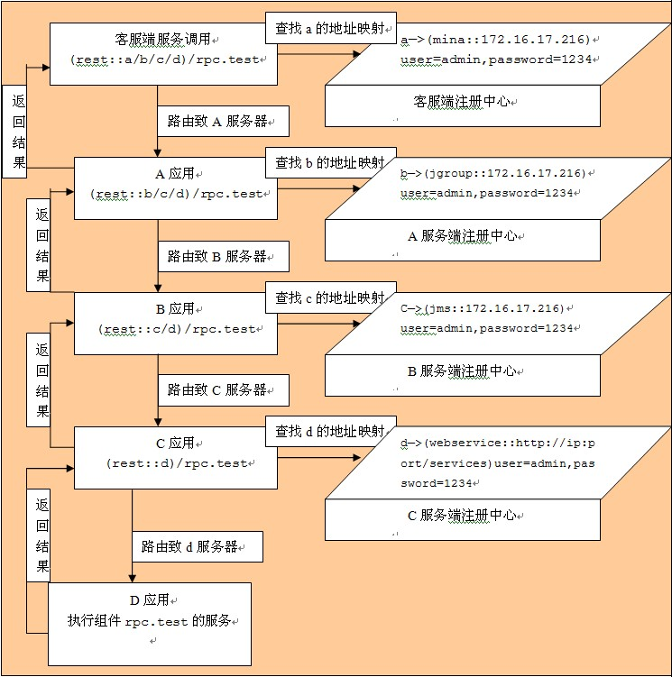

### Rest协议框架-bboss rpc

restful风格rpc服务协议rest,定义的语法如下：

(rest::a/b/c/d)/rpc.test

协议头：rest  

节点路由组：a/b/c/d，以/分割的服务器路由节点列表，执行顺序由左到右

服务id：rpc.test，配置在aop框架中的一般业务组件

Rest协议服务调用示意图如下：  



系统将逐步解析a/b/c这三个节点的地址：

a,b,c分别代表远程服务器地址

系统根据a,b,c的顺序来路由远程服务调用，首先将远程请求发送到a服务器，然后由a路由到b服务器，再由b路由到c服务器

当c处理完请求后再将结果返回给b，b再返回给a。这样就完成了一层restful风格的远程服务调用过程。

a，b，c分别代表服务器的标识符，这个标识符可以对应于一个真正的物理服务器地址，他们之间的映射关系可以在一个注册中心中维护

每个服务器都会有这样一个注册中心用来存放在本机注册的标识符和物理服务器地址的映射关系。

aop框架提供了一个接口来获取映射关系：

org.frameworkset.spi.remote.restful.RestfulServiceConvertor

接口方法为：

public String convert(String restfuluddi,String serviceid);   

其中参数restfuluddi对应于服务器标识符a,b,c，参数serviceid为请求的远程服务id

经过该方法转换的地址：可以为以下格式：

"(" + protocol + "::" +  uri + ")/" + serviceid + "?user=" + user + "&password=" + password;

其中的protocol，uri，user，password就是根据服务器标识符从注册中心中查询出的信息。 

以下是一个简单的接口实现：

Java代码

```java
public class RestfulServiceConvertorImplTest implements RestfulServiceConvertor  
  
{  
  
   
  
    public String convert(String restfuluddi, String serviceid)  
  
    {  
  
        if(restfuluddi.equals("a"))  
  
        {  
  
            String uri = "172.16.17.216:1187";  
  
            String user = "admin";  
  
            String password = "123456";  
  
            String protocol = "mina";  
  
            String returl = "(" + protocol + "::" +  uri + ")/" + serviceid + "?user=" + user + "&password=" + password;  
  
             
  
            return returl;  
  
        }  
  
        else if(restfuluddi.equals("b"))  
  
        {  
  
            String uri = "172.16.17.216:1187";  
  
            String user = "admin";  
  
            String password = "123456";  
  
            String protocol = "mina";  
  
            String returl = "(" + protocol + "::" +  uri + ")/" + serviceid + "?user=" + user + "&password=" + password;  
  
             
  
            return returl;  
  
        }  
  
        else if(restfuluddi.equals("c"))  
  
        {  
  
            String uri = "172.16.17.216:1187";  
  
            String user = "admin";  
  
            String password = "123456";  
  
            String protocol = "mina";  
  
            String returl = "(" + protocol + "::" +  uri + ")/" + serviceid + "?user=" + user + "&password=" + password;  
  
              
  
            return returl;  
  
        }  
  
         
  
        else if(restfuluddi.equals("d"))  
  
        {  
  
            String uri = "172.16.17.216:1187";  
  
            String user = "admin";  
  
            String password = "123456";  
  
            String protocol = "mina";  
  
            String returl = "(" + protocol + "::" +  uri + ")/" + serviceid + "?user=" + user + "&password=" + password;  
  
             
  
            return returl;  
  
        }  
  
        else  
  
        {  
  
            String uri = "172.16.17.216:1187";  
  
            String user = "admin";  
  
            String password = "123456";  
  
            String protocol = "jgroup";  
  
            String returl = "(" + protocol + "::" +  uri + ")/" + serviceid + "?user=" + user + "&password=" + password;  
  
             
  
            return returl;  
  
        }  
  
             
  
    }  
  
   
  
}  
```

RestfulServiceConvertor接口的实现类被配置在manager-rpc-service.xml文件中：

Xml代码

```xml
<!-- 
 
         restful风格地址转换器 
 
      -->  
  
     <property name="rpc.restful.convertor" singlable="true"  
  
                      class="org.frameworkset.spi.serviceid.RestfulServiceConvertorImplTest"/>  
```

开发人员可以实现自己的地址转换器，直接替换rpc.restful.convertor配置即可。

再看看一个简单restful风格的服务调用示例：

Java代码 

```java
RPCTestInf testInf = (RPCTestInf)BaseSPIManager.getBeanObject("(rest::a/b/c/d)/rpc.test");  
  
      //循环执行10次服务调用  
  
      for(int i = 0; i < 10; i ++)  
  
      {  
  
          try  
  
          {  
  
              System.out.println("testInf.getCount():" + i + " = "+testInf.getCount());  
  
          }  
  
          catch(Exception e)  
  
          {  
  
              e.printStackTrace();  
  
               
  
          }  
  
      }  
```

补充说明：

框架在解析rest风格的地址时，能够自动识别节点对应的地址是否是本地地址，假设存在以下地址：

​    (rest::a/b/c)/rpc.test  

  如果框架在解析地址时，发现a是本地地址，将继续解析下一个地址b，直到碰到一个远程地址时才执行远程服务调用，如果全部是本地地址，那么整个rest风格的远程服务调用就是一个本地调用。

rest风格地址中节点对应的物理地址的协议可以是aop框架目前提供的协议中的任何一种：jms，webservice，mina，jgroups  

rest风格地址后面带的认证参数将被忽略。

Rest协议只支持单播调用，不支持多播调用。  

​               

​    