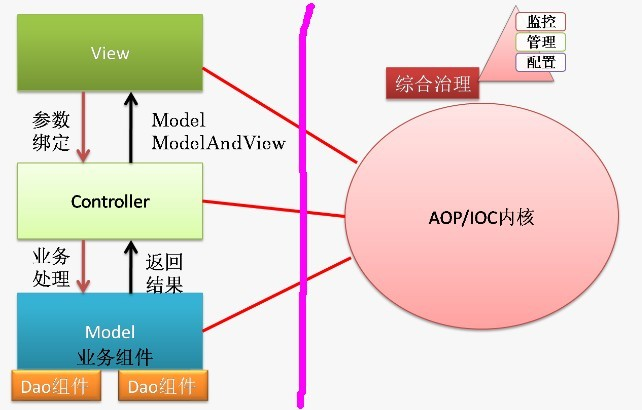

### Bboss mvc和struts的简单对比

很多朋友经常谈论下面的话题：

“我看了bboss mvc的架构图和部分代码，发现和struts1.x的架构几乎完全一样，请问bboss mvc有自己独有的特点吗？”

现在我们就这个话题做一个简单的探讨。

所有的mvc框架的原理基本上都是一样的，bboss mvc和struts都实现了mvc2模式，但是他们的区别还是非常大的：  

第一、struts和bboss mvc的view层得标签库完全不一样，bboss有自己的分页标签，struts就没有。

第二、bboss mvc的控制器是通过bboss ioc来管理的，struts没有自己的ioc容器，当然struts也可以借助于spring来达到这个目的。

第三、bboss mvc中的控制器依赖业务组件也是通过bboss ioc容注入的，当然struts也可以借助于spring来达到这个目的。

第四、采用bboss mvc来开发应用时，持久层可以采用bboss 持久层来开发，持久层提供了通用的dao，无需再编写自己的dao，同时这个通用dao也是直接通过bboss ioc直接注入业务组件的，这些特性都是struts没有的。  

第五点，也是最重要的一个区别，bboss mvc中的控制器都是单实例的，控制器方法的参数绑定机制比struts要灵活得多，每个参数都是方法参数，可以非常方便地实现list、map、array、日期等类型的数据绑定。而struts 2的控制器是多实例的并且控制器方法参数都要是以类全局参数的方式来绑定的。

第六个区别，struts 1.x好像还需要配置formbean，而bboss mvc是不需要的。

第七点，bboss mvc可以非常方便地支持json/jsonp、文件上传下载等功能，struts应该也可以，但是实现起来估计没有bboss那么方便。

另外可以从整体上看一下bboss mvc的结构图（见下图），图的左侧区域就是通用的mvc2结构，这个和struts之类的mvc框架都是一样的，不同的是图的右侧区域，bboss mvc中的view、controller、model（包括model层下面的dao层）都是通过bboss ioc来进行配置、管理和监控的，也就是通过bboss ioc来综合治理bboss mvc的各个层面，这些特性我想struts也是没有的。

    

当然，struts也有它特有的优势特点，本人对struts接触不多，所有上面仅代表我个人的看法，如有不妥可进一步探讨，希望通过与大家的深入交流发现bboss 的不足并加以改进，同时吸取其他框架的优势特点，把bboss做的更好。