### bboss自动代码生成工具使用指南

  **工具在线试用：**
[http://gencode.bbossgroups.com](http://gencode.bbossgroups.com/)

在介绍之前首先了解一下bboss自动代码生成工具能帮助我们做哪些事情。
通过自动代码生成框架，根据模板可以自动生成数据库表的增、删、改、分页查询、列表查询、国际化功能对应的java、jsp程序和配置文件，包括：
1.mvc控制器
2.业务组件
3.PO实体类
4.jsp文件 可以定制不同风格的界面模板，目前提供了一套bboss平台的基础ui风格和一套bboss普通ui风格模板
5.cxf webservice服务类文件
6.hessian服务类文件
7.sql配置文件
8.ioc/mvc组件装配部署和服务发布配置文件.
9.国际化属性文件和国际化配置
10.代码和配置文件集成配置部署readme说明文件  

  更多的介绍参考文档：

http://www.iteye.com/news/31078-bboss-gencode

下面介绍具体用法。  

**第一步 工具安装**
从bboss官网下载安装包：[下载](http://www.bbossgroups.com/tool/download.htm?fileName=gencode.zip)
下安装包后直接解压，解压后的目录结构为：

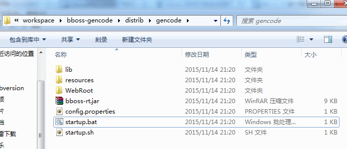

  运行解压目录下的startup.bat（linux下执行startup.sh）
然后在chrome或者火狐浏览器下访问地址：
http://localhost/gencode

如果需要定制一些配置，可以修改解压目录下的config.properties文件：
config.properties内容如下：  

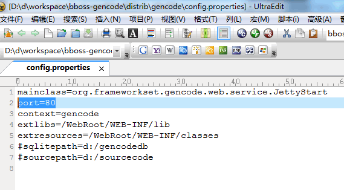

  修改启动的端口和应用上下文
port=80
context=gencode


如果需要修改代码的存放目录（默认为运行目录下的sourcecode目录），就打开配置属性sourcepath并修改：
\#sourcepath=d:/sourcecode

如果需要修改存放表单配置的sqlite数据库的路径（不设置的话默认为运行目录），就打开配置属性sqlitepath并修改：
\#sqlitepath=d:/gencodedb  

  **从github下载源码构建安装：**

https://github.com/bbossgroups/bboss-gencode
svn源码下载地址：
https://github.com/bbossgroups/bboss-gencode/trunk
源码下载完毕，解压到目录d:/bboss-gencode(指定自己的目录即可)，采用gradle进行构建：
1.安装[gradle](https://docs.gradle.org/current/userguide/userguide_single.html#installation) 并将gradle设置到环境变量
2.在命令行执行
cd d:/bboss-gencode

以war包方式发布版本（可以部署到tomcat等容器中运行工具），则执行指令：

gradle :gencode-web-app:releaseRuntimeWar

以zip包方式发布版本（内置jetty容器，解压zip包，linux/mac/unix等环节运行startup.sh,windows环境运行里面的startup.bat即可），则执行指令：

gradle :gencode-web-app:releaseRuntimeZip

3.构建成功后(gradle :gencode-web-app:releaseRuntimeZip)：
windows环境下运行d:/bboss-gencode/gencode-web-app/build/dist/gencode/startup.bat
linux/unix/mac os环境下运行startup.sh

同时在d:/bboss-gencode/gencode-web-app/build/distributions会发布出一个带jetty容器独立运行的zip包和可以部署到tomcat的war包：
gencode-4.10.8.zip
gencode-4.10.8.war

4.10.8是版本号，会根据版本变动。  

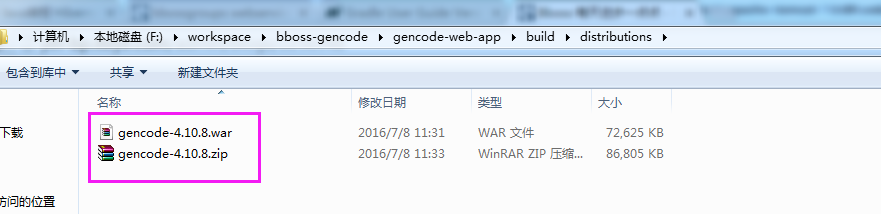

即可启动自动代码生成框架应用，在浏览器端（支持谷歌或者火狐浏览器）访问以下地址，可以在界面中配置数据源，配置表单，生成源代码并打包下载生成的源码文件，浏览源码部署集成说明：
http://localhost/gencode  
如果看到以下界面说明安装成功：

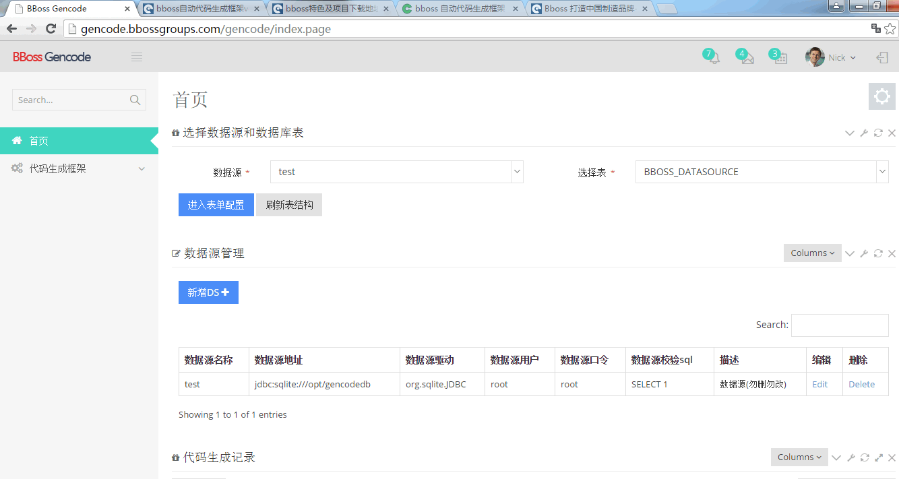

以上都是在内置的jetty容器中运行自动代码生成工具，如果需要在tomcat等容器中运行，则需要将构建生成的gencode.war包部署到tomcat中即可，但是需要修改war包中文件WEB-INF/web.xml的相关内容：
Xml代码

```xml
<init-param>  
            <param-name>iocLifeCycleEventListenerParams</param-name>  
            <!-- 指定sqlite数据库文件路径参数sqlitepath和源代码存放目录路径参数sourcepath  
            sourcepath：如果没有设置sourcepath参数，那么需要在代码配置界面上或者代码生成组件上指定源码存放路径  
             -->  
            <param-value>sqlitepath=d:/gencodedb|sourcepath=d:/sourcecode</param-value>  
        </init-param> 
```

  参数iocLifeCycleEventListenerParams中维护了sqlitepath（sqlite数据库文件路径）和sourcepath（代码存放路径）两个参数，根据自己本机的路径修改即可。

**第二步 添加数据源**
为了能够对数据库中的表生成代码，需要配置相应的数据源,参考下图：  

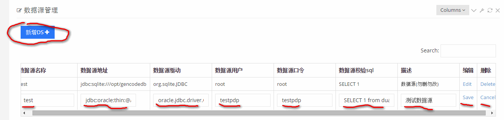

  点击新增DS即可，然修改相关属性（注意数据源名称不能重复，不能使用gencode这个内置数据源名称）。
典型的数据源配置参考：
oradle
数据源驱动: oracle.jdbc.driver.OracleDriver
数据源地址：jdbc:oracle:thin:@202.197.40.177:1521:ora177

mysql
数据源驱动: com.mysql.jdbc.Driver
数据源地址：jdbc:mysql://localhost:3306/myproject?useUnicode=true&characterEncoding=utf-8

同时也可以修改和删除已有数据源。  

**第三步 选择数据库表并生成代码**
选择数据源：


选择表

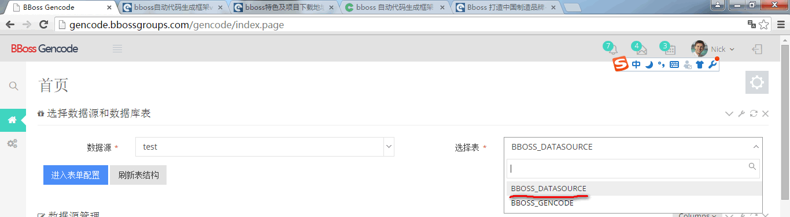

  然后点击进入表单配置，即可
如果需要重新加载数据源中的表结构，可以点击刷新表结构

**第四步 配置表单**
选择好表并进入表单界面：  

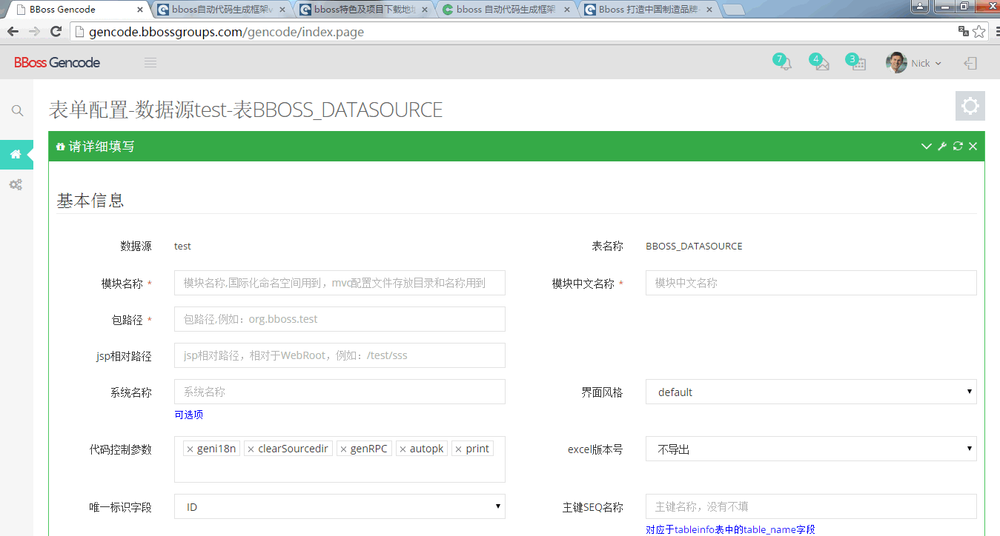

在表单配置界面可以配置三部分内容：

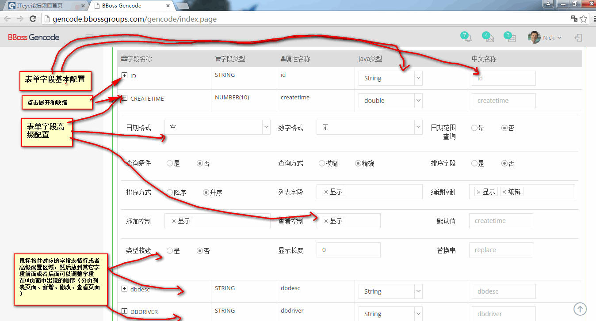

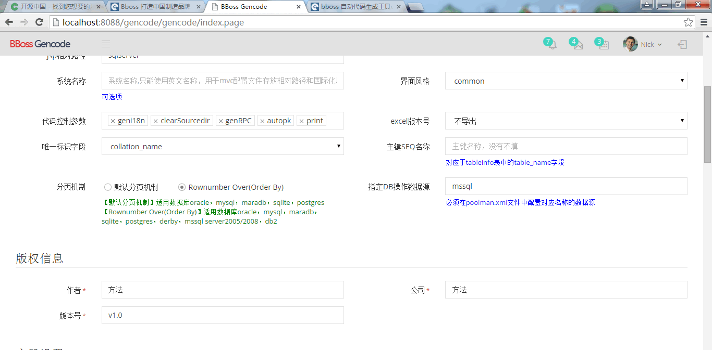

  **基本信息配置**

模块名称 指定模块英文名称
模块中文名称 指定模块中文名称
包路径 指定java程序存放的包路径
jsp相对路径 指定jsp文件存放的相对路径
系统名称  指定模块对应的系统名称，一般不需要指定
界面风格  default|common 指定ui风格模块，**default针对bboss平台**(参考文档：[基于bboss开发平台eclipse开发工程生成工具介绍](http://yin-bp.iteye.com/blog/2230399)搭建bboss平台开发环境)，**common针对bboss框架（可以将这种风格模块生成的代码集成到eclipse工程：bboss-gencode/commonstyle，然后按照自动生成部署说明文档部署运行代码即可**。
代码控制参数 控制生成的代码范围，取值范围（可以根据需要进行选择配置）：
geni18n 选中则生成国际化配置功能
clearSourcedir 生成代码时清除之前的文件
genRPC  生成webservice和hessian服务
autopk  自动生成主键 默认采用UUID生成主键，也可以结合tableinfo表中表主键生成
print  自定生成打印功能（暂未实现）
genwf  自动生成工作流功能（暂未实现）

excel版本号 设置excel导出功能，暂未实现
唯一标识字段  指定表的唯一标识字段
主键SEQ名称  tableinfo表中主键配置信息（针对bboss平台）

分页机制 提供两种分页机制选项：
【默认分页机制】适用数据库oracle，mysql，maradb，sqlite，postgres
【Rownumber Over(Order By)】适用数据库oracle，mysql，maradb，sqlite，postgres，derby，mssql server2005/2008，db2

指定DB操作数据源 可以设置服务组件中通用dao执行DB操作的数据源，不指定时在poolman中配置的第一个数据源上执行所有DB操作
**版权信息配置**
作者
公司
版本号
**字段信息配置**
字段信息配置可以指定每个字段的配置：
java类型
中文名称
日期格式
数字格式
查询条件
查询方式
日期范围查询
排序字段
默认排序字段:多个排序字段时，指定一个默认排序字段
排序方式
列表字段  控制字段在列表中显示、隐藏（作为隐藏域）、忽略（不在列表页面出现，也不隐藏）
编辑控制： 控制字段在编辑页面显示、隐藏、忽略、只读、可编辑、必填
添加控制： 控制字段在编辑页面显示、隐藏、忽略、只读、可编辑、必填
查看控制： 控制字段在编辑页面显示、隐藏、忽略
默认值
类型校验
显示长度 根据指定长度在列表页面对字段值进行截取
替换串 根据指定长度在列表页面对字段值进行截取，截取部分用替换串进行替换
字段注释：维护PO对象属性注释，默认采用表字段注释作为PO对象属性注释，如果不填写字段注释或者表字段没有注释，采用字段中文名称作为注释

字段列表中除了可以配置字段外，可以调整字段的顺序，只要鼠标拖拉字段到对应的位置就可以进行排序。

配置完毕后点击暂存和生成代码即可,代码生成好后立马可以查看部署说明、下载代码、在线浏览源码。  

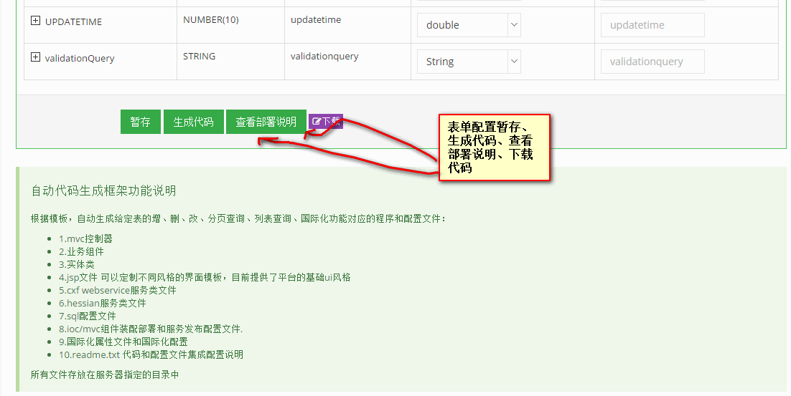

**代码配置历史记录管理**


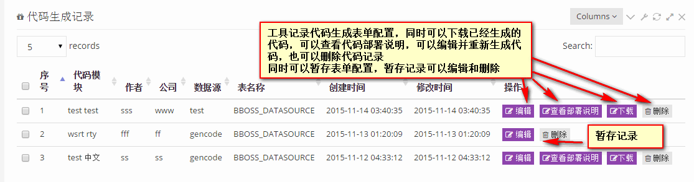

**在线浏览代码**

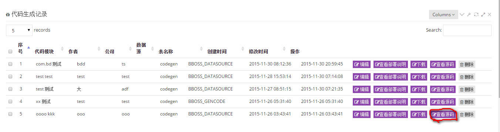

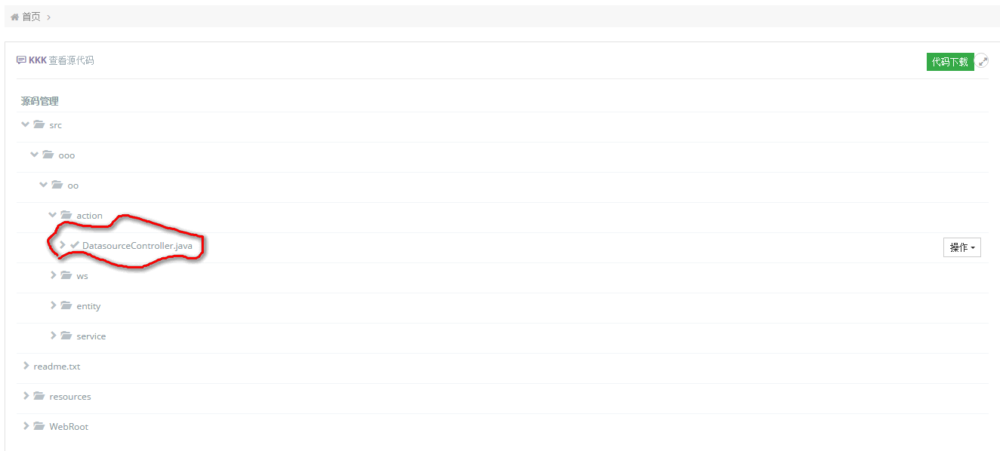

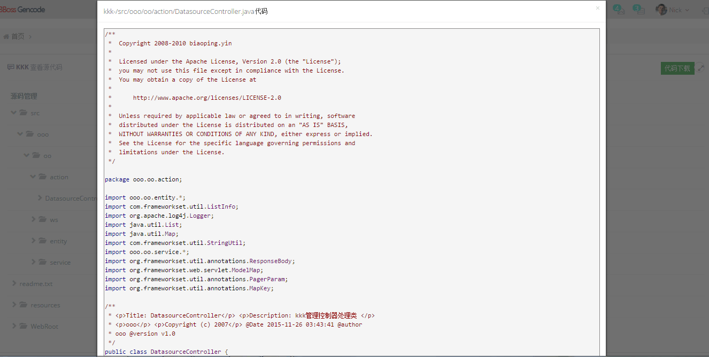

