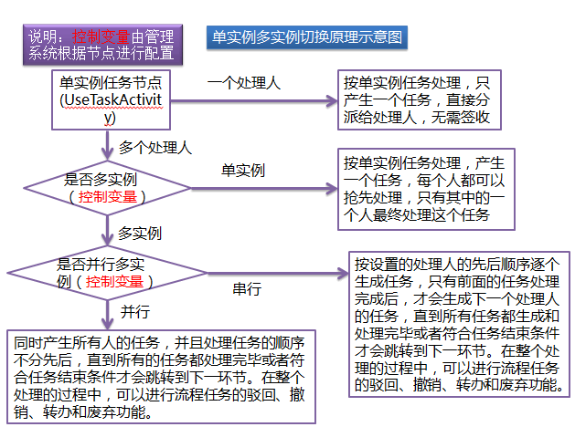

### bboss版activiti 5.12扩展动态

继扩展Activiti-5.12轻松实现流程节点间自由跳转和任意驳回/撤回功能之后，bboss最近对Activiti-5.12这个版本做了以下功能扩展：

**1.如果人工任务节点没有设置处理人**，则自动完成当前节点跳转到下一环节，如果对应人工任务节点（没有设置处理人的人工任务节点节点）设置了自动处理类（实现org.activiti.engine.delegate.JavaDelegate接口）参数，则会执行自动处理类的接口方法:

Java代码 

```java
void execute(DelegateExecution execution) throws Exception;  
```

例如：流程中有a,b，c,d四个人工任务节点，其中b节点没有设置处理人，那么当a节点任务完成后，如果b节点没有设置自动处理类，那么直接忽略掉b，直接运行到c节点；如果b节点设置了自动处理类，那么流程引擎执行该处理类后再运行到c节点。

**2.org.activiti.engine.impl.TaskServiceImpl组件增加**一组带完成原因的completeTask接口，完成原因会直接填写到工作流的act_hi_task表的完成原因字段中。

例如：

public void completeWithDestReason(String taskId,String destinationTaskKey,**String completeReason,String bussinessop,String bussinessRemark**)

详情参考组件：

https://github.com/yin-bp/activiti-engine-5.12/blob/master/src/main/java/org/activiti/engine/impl/TaskServiceImpl.java

三个任务完成原因相关字段：

completeReason:流程引擎自身会填充的说明字段，业务程序也可自己填写这个字段，一般流程引擎会在字段中记录任务处理任意跳转，驳回等系统信息

bussinessop：由业务程序记录完成任务时的填写的业务操作码，可以填写，也可以不填写，流程引擎不会修改这个字段

同样也提供了一组带三个原因字段的驳回接口。

**3.为了便于记录操作日志和提升系统性能，对流程活动历时表和任务历时表做了相应的扩展：**

工作流任务表ACT_HI_ACTINST表中增加任务处理原因，任务业务操作类型，任务业务操作日志，签收时间，任务owner5个子段，同时ACT_HI_ACTINST记录任务kpi数据以及任务的节假日策略。

工作流任务表ACT_HI_TASKINST表中增加任务业务操作类型，任务业务操作日志字段，同时ACT_HI_TASKINST记录任务kpi数据以及任务的节假日策略。

**4.增加一组驳回接口，**可以指定驳回的历史节点，驳回时可以指定驳回后，任务处理完毕可忽略后续节点直接跳转到驳回节点：

Java代码

```java
public boolean rejecttoTask(String taskId, Map<String, Object> variables,String desttaskkey )//处理完毕后，按照正常的流程流转到驳回点  
```

处理完毕后，按照正常的流程流转到驳回点,例如：流程中有a,b,c,d四个节点，由d节点驳回到a节点，当a处理完毕后，还要流转b，c两个节点再到达d。

Java代码

```java
public boolean rejecttoTask(String taskId, Map<String, Object> variables,  
        String desttaskkey, boolean returntoreject)//增加了处理任务后直接回到驳回点的控制变量  
```

处理完毕后，直接回到驳回点,例如：流程中有a,b,c,d四个节点，由d节点驳回到a节点，当a处理完毕后，直接流转到d节点，忽略b，c两个节点。

**5.改造单实例人工任务节点(非Multi Instance的UseTask节点，设置多个处理人时只产生一个任务，这个任务只能被其中的一个人处理)逻辑，**可以根据控制变量在流程实例开启和运行阶段改变单实例人工任务节点的处理节点为多实例任务节点（也就是说，如果单实例人工任务节点设置了多个处理人，会为每个人生成一个任务，此时，这个在建模时被定义为单实例人工任务的节点的行为已经和多实例人工任务节点的行为一致），这样不仅可以大大降低我们流程建模的复杂度（画多实例人工任务节点是比较复杂的），同时可以在流程实例运行过程中灵活控制单实例人工任务节点的行为（在设置了多个处理人时，可以根据控制变量改变其到底是按单实例任务跑，还是按多实例任务跑）。具体工作原理看下图：



**6.改变流程变量的校验规则。**在流程运行过程中，如果变量没有设置值时，不抛出Exception，只在log4j日志文件中输出相应的警告日志。

  **7.userTask 类型节点的activiti:assignee属性**也可以设置多个处理人，以逗号分隔，例如：

<

userTask id="usertask2" name="单实例" activiti:assignee="zhangsan,lisi,wangwu">

<

/userTask>

改造版的bboss中要求流程处理人变量必须是以下命名格式：

活动id+_+users

例如：

<

userTask id="usertask2" name="单实例" activiti:assignee="${usertask2_users}">

<

/userTask>  

**8.单实例人工任务节点，**当只设置了一个处理人时，不再需要签收任务，任务直接被assignee个指定的这个人

**9.在流程引擎级别记录驳回操作，撤销操作，驳回后回到驳回点操作，任意跳转操作日志，以便在处理任务时进行相应的处理操作**

常量：org.activiti.engine.TaskService定义了四个常量与上述四个操作对应

Java代码

```java
public static final int  op_rejected = 3;//驳回操作  
 public static final int  op_withdraw = 1;//撤销操作  
 public static final int  op_jump = 2;//任意跳转操作  
 public static final int  op_returntorejected = 0;//驳回后回到驳回点操作 
```

**10.定义了扩展归档机制**，当流程实例结束时，用户可以在归档接口方法中将需要归档的实例运行时数据进行归档，流程引擎默认对流程引擎级别驳回操作、撤销操作、驳回后回到驳回点操作、任意跳转操作日志进行归档。归档组件必须实现接口方法：

Java代码

```java
package org.activiti.engine  
/** 
 * 工作流 
 * @author yinbp 
 * 
 */  
public interface KPIService {  
    //计算任务超时时间和任务预警时间接口方法  
    public KPI buildKPI(DelegateExecution execution,Collection<String> candiates,Date taskCreateTime) throws ActivitiException;  
        //获取任务处理节点控制变量方法  
    public ControlParam getControlParam(DelegateExecution currentexecution,String taskKey) throws ActivitiException;  
       //获取任务处理节点控制变量方法  
    public ControlParam getControlParam(String processInstanceId,String activieKey) throws ActivitiException;  
    /** 
     * 流程实例结束后，对实例相关的外围扩展信息实时归档操作 
     * @param currentexecution 
     * @param processInstanceID 
     * @throws ActivitiException 
     */  
    public void archiveProcessRuntimedata(DelegateExecution currentexecution,String processInstanceID) throws ActivitiException;  
}  
```

在流程引擎配置文件中增加以下注入配置即可：

Xml代码

```xml
<property name="processEngineConfiguration" class="org.activiti.engine.impl.cfg.StandaloneProcessEngineConfiguration">  
....  
<property name="KPIService" class="com.bboss.workflow.service.impl.PlatformKPIServiceImpl"/>  
....  
  </property>  
```

**11.由于我们可以直接在任务历史表和活动历史表中记录任务和活动处理日志和业务处理日志和业务处理操作**，为了解决mysql下这些处理日志的排序问题，为ACT_HI_ACTINST 和ACT_HI_TASKINST 两个表分别增加了以下long形的排序时间字段：START_TIME_LONG，  END_TIME_LONG 。

**12.提供抄送/通知任务类型，支持抄送到人和部门**，抄送任务不影响流程的正常流转，比如最后一个任务节点被设置为抄送任务节点后，抄送任务产生后流程立即结束，但是抄送任务仍然存在，知道相关人员阅读完抄送任务后结束。

**13.可自动跳过相同处理人的节点**，为了便于业务逻辑的处理，可以在自动过的时候指定自动业务处理回调类。

**14.最新的bboss版activiti 5.12对流程引擎数据库做了相应的调整**，如果要升级需要执行的sql脚本如下：

mysql:

Java代码

```java
-- Create table  
create table td_wf_rejectlog  
(  
  newtaskid    varchar(64) not null,  
  rejecttaskid varchar(64) not null,  
  rejectnode   varchar(100) not null,  
   primary key (newtaskid)  
) ENGINE=InnoDB DEFAULT CHARSET=utf8 COLLATE utf8_bin;  
  
ALTER TABLE ACT_RU_TASK  
ADD COLUMN DURATION_NODE decimal(19)   NULL DEFAULT 0;  
  
ALTER TABLE ACT_RU_TASK  
ADD COLUMN  ADVANCESEND decimal(1)  NULL DEFAULT 0;  
  
ALTER TABLE ACT_RU_TASK  
ADD COLUMN OVERTIMESEND decimal(1) NULL DEFAULT 0;  
  
ALTER TABLE ACT_RU_TASK  
ADD COLUMN (ALERTTIME TIMESTAMP   NULL DEFAULT NULL);  
  
ALTER TABLE ACT_RU_TASK  
ADD COLUMN (OVERTIME TIMESTAMP   NULL DEFAULT NULL);  
  
ALTER TABLE ACT_HI_ACTINST  
ADD COLUMN DURATION_NODE decimal(19) NULL DEFAULT 0;  
  
ALTER TABLE ACT_HI_ACTINST  
ADD COLUMN ADVANCESEND decimal(1) NULL DEFAULT 0;  
  
ALTER TABLE ACT_HI_ACTINST  
ADD COLUMN OVERTIMESEND decimal(1) NULL DEFAULT 0;  
  
   
  
ALTER TABLE ACT_HI_ACTINST  
ADD COLUMN (ALERTTIME TIMESTAMP   NULL DEFAULT NULL);  
  
ALTER TABLE ACT_HI_ACTINST  
ADD COLUMN (OVERTIME TIMESTAMP   NULL DEFAULT NULL);  
  
   
  
ALTER TABLE ACT_HI_TASKINST  
ADD COLUMN DURATION_NODE decimal(19) NULL DEFAULT 0;  
  
ALTER TABLE ACT_HI_TASKINST  
ADD COLUMN ADVANCESEND decimal(1) NULL DEFAULT 0;  
  
ALTER TABLE ACT_HI_TASKINST  
ADD COLUMN OVERTIMESEND decimal(1) NULL DEFAULT 0;  
  
ALTER TABLE ACT_HI_TASKINST  
ADD COLUMN (ALERTTIME TIMESTAMP   NULL DEFAULT NULL);  
ALTER TABLE ACT_HI_TASKINST  
ADD COLUMN (OVERTIME TIMESTAMP   NULL DEFAULT NULL);  
  
ALTER TABLE ACT_HI_ACTINST  
ADD COLUMN (NOTICERATE decimal(8));  
  
ALTER TABLE ACT_HI_TASKINST  
ADD COLUMN (NOTICERATE decimal(8));  
  
ALTER TABLE ACT_RU_TASK  
ADD COLUMN (NOTICERATE decimal(8));   
  
ALTER TABLE ACT_HI_ACTINST  
ADD COLUMN (IS_CONTAIN_HOLIDAY decimal(1));  
ALTER TABLE ACT_HI_TASKINST  
ADD COLUMN (IS_CONTAIN_HOLIDAY decimal(1));  
ALTER TABLE ACT_RU_TASK  
ADD COLUMN (IS_CONTAIN_HOLIDAY decimal(1) );  
  
ALTER TABLE ACT_HI_ACTINST  
ADD COLUMN IS_AUTO_COMPLETE decimal(1)  NULL DEFAULT 0;  
  
ALTER TABLE ACT_HI_ACTINST  
ADD COLUMN (AUTO_HANDLER  varchar(255));  
  
ALTER TABLE ACT_HI_TASKINST  
 ADD COLUMN (BUSSINESS_OP  varchar(255));  
ALTER TABLE ACT_HI_TASKINST  
 ADD COLUMN (BUSSINESS_REMARK  varchar(2000));  
   
ALTER TABLE ACT_HI_ACTINST  
 ADD COLUMN (BUSSINESS_OP  VARCHAR(255));  
ALTER TABLE ACT_HI_ACTINST  
 ADD COLUMN (BUSSINESS_REMARK  VARCHAR(2000));   
ALTER TABLE ACT_HI_ACTINST  
 ADD COLUMN (DELETE_REASON_  VARCHAR(2000));   
ALTER TABLE ACT_HI_ACTINST  
 ADD COLUMN (OWNER_  VARCHAR(255));   
   ALTER TABLE ACT_HI_ACTINST  
 ADD COLUMN (CLAIM_TIME_  TIMESTAMP   NULL DEFAULT NULL);   
  
     
    ALTER TABLE td_wf_rejectlog  
 ADD COLUMN (optype  decimal(1)  NULL DEFAULT 0);   
 ALTER TABLE TD_WF_REJECTLOG  
 ADD (PROCESS_ID  VARCHAR(100));  
create table td_wf_hi_rejectlog  
(  
  newtaskid    varchar(64) not null,  
  rejecttaskid varchar(64) not null,  
  rejectnode   varchar(100) not null,  
  BACKUPTIME   TIMESTAMP  NULL DEFAULT NULL,   
  optype  decimal(1)  NULL DEFAULT 0,  
  PROCESS_ID  VARCHAR(100),   
   primary key (newtaskid)  
) ENGINE=InnoDB DEFAULT CHARSET=utf8 COLLATE utf8_bin;  
 ALTER TABLE ACT_HI_ACTINST ADD COLUMN (START_TIME_LONG  bigint );   
 ALTER TABLE ACT_HI_ACTINST ADD COLUMN (END_TIME_LONG  bigint );   
   
 ALTER TABLE ACT_HI_TASKINST ADD COLUMN (START_TIME_LONG  bigint );   
 ALTER TABLE ACT_HI_TASKINST ADD COLUMN (END_TIME_LONG  bigint );  
```

oracle:

Java代码

```java
-- Create table  
create table td_wf_rejectlog  
(  
  newtaskid    nvarchar2(64),  
  rejecttaskid nvarchar2(64),  
  rejectnode   nvarchar2(100)  
)  
;  
-- Create/Recreate primary, unique and foreign key constraints   
alter table td_wf_rejectlog  
  add constraint rejectlog_pk primary key (NEWTASKID);  
--流程引擎扩展表字段  
ALTER TABLE ACT_RU_TASK  
ADD (DURATION_NODE NUMBER(19));  
  
  
  
ALTER TABLE ACT_RU_TASK  
ADD (ADVANCESEND NUMBER(1) DEFAULT 0);  
  
  
  
ALTER TABLE ACT_RU_TASK  
ADD (OVERTIMESEND NUMBER(1));  
  
  
  
ALTER TABLE ACT_RU_TASK  
MODIFY(DURATION_NODE  DEFAULT 0);  
  
ALTER TABLE ACT_RU_TASK  
MODIFY(OVERTIMESEND  DEFAULT 0);  
  
ALTER TABLE ACT_RU_TASK  
ADD (ALERTTIME TIMESTAMP(7));  
  
  
  
ALTER TABLE ACT_RU_TASK  
ADD (OVERTIME TIMESTAMP(7));  
  
  
  
  
ALTER TABLE ACT_HI_ACTINST  
ADD (DURATION_NODE NUMBER(19));  
  
  
  
ALTER TABLE ACT_HI_ACTINST  
ADD (ADVANCESEND NUMBER(1) DEFAULT 0);  
  
  
  
  
ALTER TABLE ACT_HI_ACTINST  
ADD (OVERTIMESEND NUMBER(1));  
  
  
ALTER TABLE ACT_HI_ACTINST  
MODIFY(DURATION_NODE  DEFAULT 0);  
  
ALTER TABLE ACT_HI_ACTINST  
MODIFY(OVERTIMESEND  DEFAULT 0);  
  
ALTER TABLE ACT_HI_ACTINST  
ADD (ALERTTIME TIMESTAMP(7));  
  
  
  
ALTER TABLE ACT_HI_ACTINST  
ADD (OVERTIME TIMESTAMP(7));  
  
  
  
----------------------------------------------------  
ALTER TABLE ACT_HI_TASKINST  
ADD (DURATION_NODE NUMBER(19));  
  
  
ALTER TABLE ACT_HI_TASKINST  
ADD (ADVANCESEND NUMBER(1) DEFAULT 0);  
  
  
  
  
ALTER TABLE ACT_HI_TASKINST  
ADD (OVERTIMESEND NUMBER(1));  
  
  
ALTER TABLE ACT_HI_TASKINST  
MODIFY(DURATION_NODE  DEFAULT 0);  
  
ALTER TABLE ACT_HI_TASKINST  
MODIFY(OVERTIMESEND  DEFAULT 0);  
  
ALTER TABLE ACT_HI_TASKINST  
ADD (ALERTTIME TIMESTAMP(7));  
  
  
  
ALTER TABLE ACT_HI_TASKINST  
ADD (OVERTIME TIMESTAMP(7));  
  
  
---------------------  
ALTER TABLE ACT_HI_ACTINST  
ADD (NOTICERATE NUMBER(8));  
  
  
  
ALTER TABLE ACT_HI_TASKINST  
ADD (NOTICERATE NUMBER(8));  
  
  
  
ALTER TABLE ACT_RU_TASK  
ADD (NOTICERATE NUMBER(8));  
  
  
-------------------------  
  
ALTER TABLE ACT_HI_ACTINST  
ADD (IS_CONTAIN_HOLIDAY NUMBER(1));  
  
  
  
ALTER TABLE ACT_HI_TASKINST  
ADD (IS_CONTAIN_HOLIDAY NUMBER(1));  
  
  
  
ALTER TABLE ACT_RU_TASK  
ADD (IS_CONTAIN_HOLIDAY NUMBER(1) );  
  
ALTER TABLE ACT_HI_ACTINST  
 ADD (IS_AUTO_COMPLETE  NUMBER(1)                   DEFAULT 0);  
  
ALTER TABLE ACT_HI_ACTINST  
 ADD (AUTO_HANDLER  NVARCHAR2(255));  
  
ALTER TABLE ACT_HI_TASKINST  
 ADD (BUSSINESS_OP  NVARCHAR2(255));  
ALTER TABLE ACT_HI_TASKINST  
 ADD (BUSSINESS_REMARK  NVARCHAR2(2000));  
   
 ALTER TABLE ACT_HI_ACTINST  
 ADD (BUSSINESS_OP  NVARCHAR2(255));  
ALTER TABLE ACT_HI_ACTINST  
 ADD (BUSSINESS_REMARK  NVARCHAR2(2000));  
 ALTER TABLE ACT_HI_ACTINST  
 ADD (DELETE_REASON_  NVARCHAR2(2000));   
   
 ALTER TABLE ACT_HI_ACTINST  
 ADD (OWNER_  NVARCHAR2(255));   
   
  ALTER TABLE ACT_HI_ACTINST  
 ADD (CLAIM_TIME_  TIMESTAMP(6));  
ALTER TABLE td_wf_rejectlog  
 ADD   (optype  NUMBER(1)   DEFAULT 0);   
ALTER TABLE TD_WF_REJECTLOG  
 ADD (PROCESS_ID  NVARCHAR2(100));  
 -- Create table  
create table td_wf_hi_rejectlog  
(  
  newtaskid    nvarchar2(64),  
  rejecttaskid nvarchar2(64),  
  rejectnode   nvarchar2(100),  
   BACKUPTIME  TIMESTAMP(6),   
  optype  NUMBER(1)  DEFAULT 0,  
  PROCESS_ID  NVARCHAR2(100)  
)  
;  
  
-- Create/Recreate primary, unique and foreign key constraints   
alter table td_wf_hi_rejectlog  
  add constraint hi_rejectlog_pk primary key (NEWTASKID);  
 ALTER TABLE ACT_HI_ACTINST ADD (START_TIME_LONG  NUMBER(19) );   
 ALTER TABLE ACT_HI_ACTINST ADD (END_TIME_LONG  NUMBER(19) );   
   
 ALTER TABLE ACT_HI_TASKINST ADD (START_TIME_LONG  NUMBER(19) );   
 ALTER TABLE ACT_HI_TASKINST ADD (END_TIME_LONG  NUMBER(19) );   

```

**15.最新的bboss版activiti 5.12下载地址：**

https://github.com/yin-bp/activiti-engine-5.12